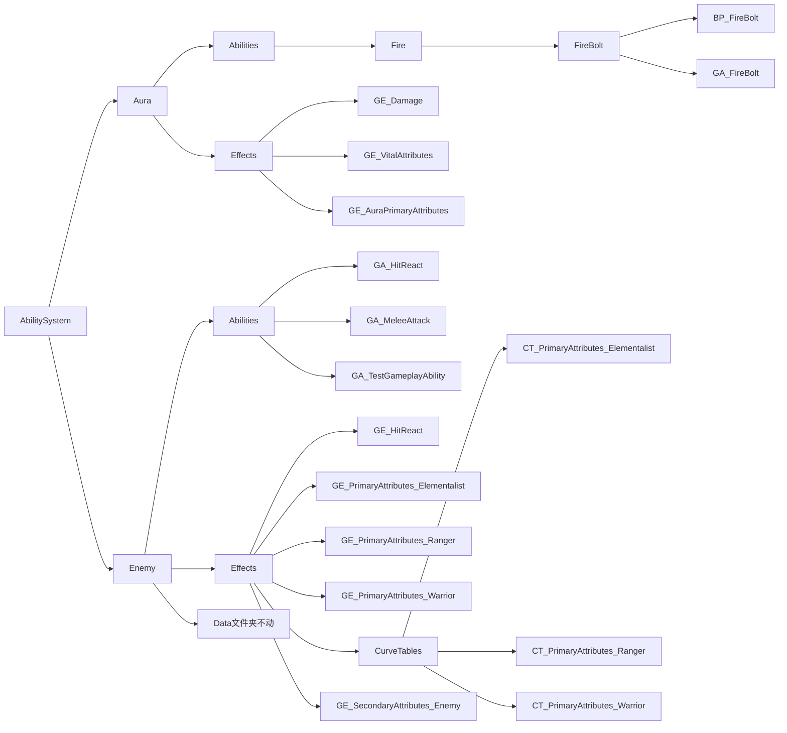

___________________________________________________________________________________________
###### [Go主菜单](../MainMenu.md)
___________________________________________________________________________________________

# GAS 093 梳理文件夹，为远程攻击创建GA

___________________________________________________________________________________________

# 目录

- [GAS 093 梳理文件夹，为远程攻击创建GA](#gas-093-梳理文件夹为远程攻击创建ga)
- [目录](#目录)
    - [现在需要梳理文件夹AbilitySystem下的文件](#现在需要梳理文件夹abilitysystem下的文件)
    - [为敌人创建远程攻击的GA](#为敌人创建远程攻击的ga)
      - [现在如果需要使GA生效需要配置：](#现在如果需要使ga生效需要配置)

___________________________________________________________________________________________

视频链接

[1. Ranged Attack_哔哩哔哩_bilibili](https://www.bilibili.com/video/BV1JD421E7yC/?p=188&vd_source=9e1e64122d802b4f7ab37bd325a89e6c)

------

___________________________________________________________________________________________

### 现在需要梳理文件夹AbilitySystem下的文件

> #### 需要按 类型 分为 `敌人` 和 `角色` ，通用的放在角色中

梳理成下面的结构：

------

我们看一下远程攻击法术的代码，敌人也是可以使用的

### 为敌人创建远程攻击的GA

> - #### 在 `Content/BP/AbilitySystem/Enemy/Effects/` 文件夹下创建GA
>
> - #### 继承自 `AuraProjectileSpell`
>
> - #### 命名为 `GA_RangedAttack`
>

------

#### 现在如果需要使GA生效需要配置：

- GE类型
- 需要生成一个远程攻击用的石头
- 伤害曲线
- 伤害类型
- 技能激活用的 `GameplayTag`，为了能在行为树的攻击任务中激活GA用

> ------
>
> ### 请看下集

___________________________________________________________________________________________

[返回最上面](#Go主菜单)

___________________________________________________________________________________________