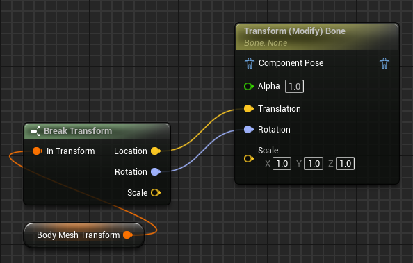

___________________________________________________________________________________________
###### [Go主菜单](../MainMenu.md)
___________________________________________________________________________________________

# GAS 094 远程攻击技能配置；边缘发光材质；创建弹弓的ABP创建动画效果

___________________________________________________________________________________________

## 处理关键点

1. 边缘发光材质

2. 使用弹弓的ABP创建动画效果，使用节点 `TransformBone` 和 `Blend Poses by bool`


___________________________________________________________________________________________

# 目录


- [GAS 094](#gas-094)
  - [处理关键点](#处理关键点)
- [目录](#目录)
    - [Mermaid整体思路梳理](#mermaid整体思路梳理)
    - [先创建一个发射物](#先创建一个发射物)
      - [需要添加 `StaticMesh`](#需要添加-staticmesh)
      - [设置 `Projectile Movement`](#设置-projectile-movement)
      - [GA中配置 抛射物类](#ga中配置-抛射物类)
      - [伤害类设置为GE\_Damage](#伤害类设置为ge_damage)
    - [忘了就回去看看源码，下面是下一节](#忘了就回去看看源码下面是下一节)
    - [修改一下CT\_Damage的伤害曲线命名](#修改一下ct_damage的伤害曲线命名)
    - [小测试](#小测试)
    - [创建曲线](#创建曲线)
    - [GA中配置](#ga中配置)
    - [接下来需要让远程敌人也学习GA，才能释放技能](#接下来需要让远程敌人也学习ga才能释放技能)
    - [GA中别忘了加上技能的Tag](#ga中别忘了加上技能的tag)
    - [在GA中Debug测试](#在ga中debug测试)
    - [此时效果gif](#此时效果gif)
    - [下一节](#下一节)
    - [创建攻击蒙太奇，配置MotionWarping，Tag通知；在蓝图中配置](#创建攻击蒙太奇配置motionwarpingtag通知在蓝图中配置)
    - [下一节](#下一节-1)
    - [小测试1](#小测试1)
    - [自己尝试下](#自己尝试下)
    - [小测试2](#小测试2)
    - [自己尝试下](#自己尝试下-1)
    - [现在有个问题，石头比较小，想让石头变得更大或者发光，让它更明显](#现在有个问题石头比较小想让石头变得更大或者发光让它更明显)
  - [调整石头材质，让石头边缘发光，使用节点 `Fresnel`](#调整石头材质让石头边缘发光使用节点-fresnel)
    - [随机旋转效果](#随机旋转效果)
    - [现在处理一个bug，当敌人攻击时，敌我不分，需要判断是否同一阵营](#现在处理一个bug当敌人攻击时敌我不分需要判断是否同一阵营)
    - [在抛射物Overlap的回调中判断是否同一阵营](#在抛射物overlap的回调中判断是否同一阵营)
    - [下一节](#下一节-2)
    - [接下来我们将处理，发射石头时，弹弓并不是静态的，而是要真的弯曲，然后松开](#接下来我们将处理发射石头时弹弓并不是静态的而是要真的弯曲然后松开)
    - [给弹弓创建一个角色动画蓝图ABP](#给弹弓创建一个角色动画蓝图abp)
    - [首先需要角色手部的插槽](#首先需要角色手部的插槽)
    - [弹弓ABP中，获取owner，拿到mesh，拿到手部的插槽，存为变量](#弹弓abp中获取owner拿到mesh拿到手部的插槽存为变量)
  - [在弹弓ABP上，绑定骨骼到上面获取的变量的世界位置，使用节点 `TransformBone`](#在弹弓abp上绑定骨骼到上面获取的变量的世界位置使用节点-transformbone)
    - [使用节点 `TransformBone`](#使用节点-transformbone)
    - [远程敌人BP中，选择使用动画蓝图，可以查看效果](#远程敌人bp中选择使用动画蓝图可以查看效果)
    - [运行时F8查看效果](#运行时f8查看效果)
    - [现在的问题是，一直被绑在手上，需要处理什么时候松手](#现在的问题是一直被绑在手上需要处理什么时候松手)
    - [下一节](#下一节-3)
    - [弹弓ABP中创建 bool 变量，如果为 true 就改变，false 不改变。打算在蒙太奇中发送动画通知，然后在敌人的ABP中 设置弹弓的 ABP 等于 true 或 false](#弹弓abp中创建-bool-变量如果为-true-就改变false-不改变打算在蒙太奇中发送动画通知然后在敌人的abp中-设置弹弓的-abp-等于-true-或-false)
      - [弹弓ABP中使用 `Blend Poses by bool`](#弹弓abp中使用-blend-poses-by-bool)
    - [可以用之前的EQS测试地图，视野调近，f8，测试gif](#可以用之前的eqs测试地图视野调近f8测试gif)
    - [别忘了ABP函数要初始化时调用父版本Tick，因为在里面写了逻辑](#别忘了abp函数要初始化时调用父版本tick因为在里面写了逻辑)
    - [石头的 `StaticMesh` 记得关闭碰撞，仔细看上面的动图有个bug就是因为这个](#石头的-staticmesh-记得关闭碰撞仔细看上面的动图有个bug就是因为这个)


___________________________________________________________________________________________

<details>
<summary>视频链接</summary>

[视频链接](ZHELISHISHIPINLIANJIE)

------

</details>

___________________________________________________________________________________________

### Mermaid整体思路梳理

Mermaid


___________________________________________________________________________________________

> ### 接下来将一步步配置敌人远程攻击的GA

------

### 先创建一个发射物

- #### 在`Content/Blueprints/AbilitySystem/Enemy/Abilities/` 文件夹下
- #### 需要继承自 `AuraProjectile`
- #### 命名为 ***BP_slingshotRock***

#### 需要添加 `StaticMesh`

> - #### 路径如下
>
> - #### 修改名字为 `RockMesh`
>
>   #### 

#### 设置 `Projectile Movement`

> - #### 速度 1000
>
> - #### 开启重力
>
>   

#### GA中配置 抛射物类

>

#### 伤害类设置为GE_Damage

> 

------

### 忘了就回去看看源码，下面是下一节

------

### 修改一下CT_Damage的伤害曲线命名

> - 原来的：
>
>   
>
> - 修改后
>
>   
>
> ## **修改后记得重新配置曲线**

------

### 小测试

> - 为远程伤害创建一条伤害曲线并配置
>
> 

------

### 创建曲线

| 等级 | 伤害 |
| ---- | ---- |
| 1    | 7.5  |
| 40   | 35   |

------

### GA中配置

>

------

### 接下来需要让远程敌人也学习GA，才能释放技能

>

------

### GA中别忘了加上技能的Tag


------

### 在GA中Debug测试

>

------

### 此时效果gif

>

------

### 下一节

------

### 创建攻击蒙太奇，配置MotionWarping，Tag通知；在蓝图中配置

> 

------

### 下一节

------

### 小测试1

> - GA触发攻击的蒙太奇
>
> - 蒙太奇中发送的Tag，在GA中接收
>
> - 并在弹弓袋处画一个调试球体
>
> 

------

### 自己尝试下

> 别忘了给角色配置武器插槽名字

------

### 小测试2

> - 攻击生成抛射物石头
>
> - 为石头添加随即旋转
>
> 

------

### 自己尝试下


------

### 现在有个问题，石头比较小，想让石头变得更大或者发光，让它更明显

------

## 调整石头材质，让石头边缘发光，使用节点 `Fresnel`

> - 使用节点 `Fresnel`
>
>   - 直接连到自发光上用就行
>
>     
>
> 
>
> ## 效果
>
> 

------

### 随机旋转效果

> - 开始时生成随机旋转速率

------

### 现在处理一个bug，当敌人攻击时，敌我不分，需要判断是否同一阵营

------

### 在抛射物Overlap的回调中判断是否同一阵营

>#### **判断Content下的 `EffectCauser` 是否和监测到的 `Actor` 为同一阵营**
>
>
>
>```cpp
>if (!UAuraAbilitySystemLibrary::IsNotFriend(DamageEffectSpecHandle.Data->GetContext().GetEffectCauser(),OtherActor))
>{
>    return;
>}
>```

------

### 下一节

------

### 接下来我们将处理，发射石头时，弹弓并不是静态的，而是要真的弯曲，然后松开

- #### 弹弓是个 `SkeletalMesh`

- #### 需要给弹弓创建一个角色动画蓝图
  
  - 可以获取骨骼位置

------

### 给弹弓创建一个角色动画蓝图ABP
>

------

### 首先需要角色手部的插槽
>- #### **插槽名字需要修改成与之前一致**
>
>

------

### 弹弓ABP中，获取owner，拿到mesh，拿到手部的插槽，存为变量
>- #### **Mesh如果拿不到记得设为蓝图可以读取**
>
>

------

## 在弹弓ABP上，绑定骨骼到上面获取的变量的世界位置，使用节点 `TransformBone`


### 使用节点 `TransformBone`
>
>   
>
> 
>
> ### 选择要绑定到的骨骼
>
> ### 使用 `Translation` ，使用世界空间WorldSpace
>
> ### 使用 `Rotation` ，使用世界空间WorldSpace
>
> - ### 不需要缩放可以取消暴露缩放Scale引脚
>
>   
>
>   - #### 节点就会变成这样
>
>     
>
> #### 从本地空间转换为组件空间，再从组件空间变回本地空间

------

### 远程敌人BP中，选择使用动画蓝图，可以查看效果
>

------

### 运行时F8查看效果
>

------

### 现在的问题是，一直被绑在手上，需要处理什么时候松手

------

### 下一节

------

### 弹弓ABP中创建 bool 变量，如果为 true 就改变，false 不改变。打算在蒙太奇中发送动画通知，然后在敌人的ABP中 设置弹弓的 ABP 等于 true 或 false


#### 弹弓ABP中使用 `Blend Poses by bool`
> - #### 弹弓ABP中使用 `Blend Poses by bool`
>
> - #### 敌人ABP 中 创建两个动画通知
>
> - #### ABP中获取武器Weapon
>
> - #### 为弹弓创建攻击蒙太奇
>

------

### 可以用之前的EQS测试地图，视野调近，f8，测试gif
>- 地图记得配置GM
>
>

------

### 别忘了ABP函数要初始化时调用父版本Tick，因为在里面写了逻辑

------

### 石头的 `StaticMesh` 记得关闭碰撞，仔细看上面的动图有个bug就是因为这个


___________________________________________________________________________________________

[返回最上面](#Go主菜单)

___________________________________________________________________________________________