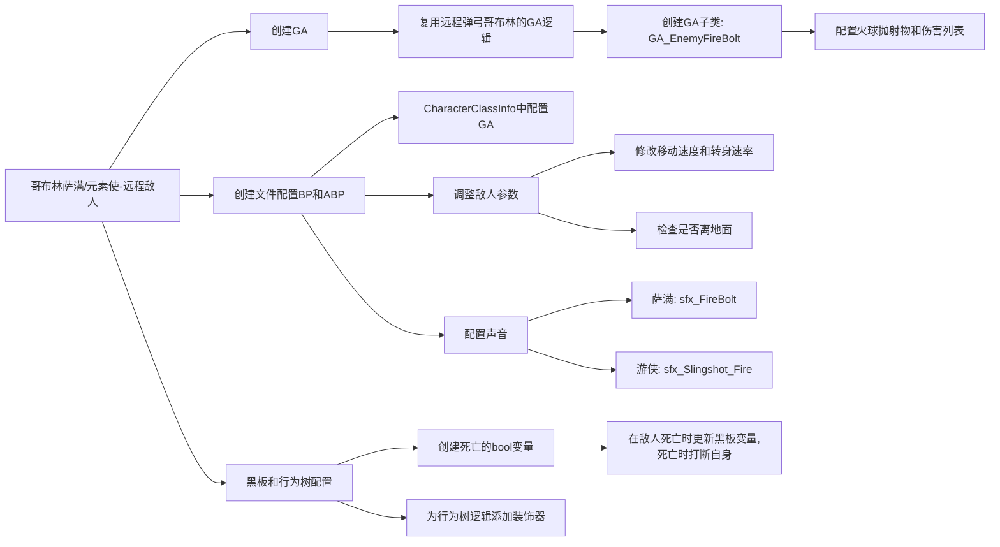

___________________________________________________________________________________________
###### [Go主菜单](../MainMenu.md)
___________________________________________________________________________________________

# GAS 095 添加新敌人萨满；为攻击蒙太奇添加声音，黑板中添加死亡变量，并在C++中设置

___________________________________________________________________________________________

## 处理关键点

1. **创建文件和配置BP**：为新角色创建文件夹和蓝图文件，设置动画和武器插槽。

2. **创建GA逻辑**：复用已有GA逻辑，创建新子类配置火球攻击。

3. **配置敌人属性和黑板逻辑**：设置移动速度，检查碰撞高度，并在行为树中添加死亡逻辑。

4. **声音配置**：为新角色和已有角色设置音效。

5. **测试和优化**：将角色拖入场景中测试，并调整行为树的死亡逻辑以防止执行错误。


___________________________________________________________________________________________

# 目录


- [GAS\_095 添加新敌人萨满；为攻击蒙太奇添加声音，黑板中添加死亡变量，并在C++中设置](#gas_095-添加新敌人萨满为攻击蒙太奇添加声音黑板中添加死亡变量并在c中设置)
  - [处理关键点](#处理关键点)
- [目录](#目录)
    - [Mermaid整体思路梳理](#mermaid整体思路梳理)
    - [下面希望在项目中加入 哥布林萨满，远程敌人元素使](#下面希望在项目中加入-哥布林萨满远程敌人元素使)
      - [创建相关文件](#创建相关文件)
    - [需要为萨满创建GA](#需要为萨满创建ga)
      - [看看我们为远程弹弓的哥布林创建的GA发现逻辑其实可以复用，唯一需要变化的是生成的不是石头而是火球](#看看我们为远程弹弓的哥布林创建的ga发现逻辑其实可以复用唯一需要变化的是生成的不是石头而是火球)
      - [创建子类，继承自 GA\_RangedAttack](#创建子类继承自-ga_rangedattack)
    - [同时我们也需要在 CharacterClassInfo 中配置 敌人要学习的GA](#同时我们也需要在-characterclassinfo-中配置-敌人要学习的ga)
      - [BP中修改敌人移动速度和转身速率](#bp中修改敌人移动速度和转身速率)
    - [拖入场景](#拖入场景)
    - [测试gif](#测试gif)
    - [现在敌人的攻击没有声音，需要配置上声音](#现在敌人的攻击没有声音需要配置上声音)
    - [检查一下敌人是否离开地面，也就是 Capsule 是不是太高了](#检查一下敌人是否离开地面也就是-capsule-是不是太高了)
    - [之前我们没有处理完黑板中敌人的死亡，需要加一个装饰器，打断自身的逻辑，否则死亡后还在执行一段时间](#之前我们没有处理完黑板中敌人的死亡需要加一个装饰器打断自身的逻辑否则死亡后还在执行一段时间)
      - [黑板中创建死亡的bool变量](#黑板中创建死亡的bool变量)
      - [在行为树上，为最上层的逻辑添加装饰器，使用黑板中的 bool 变量 Dead ，给装饰器改个名字，更加容易理解](#在行为树上为最上层的逻辑添加装饰器使用黑板中的-bool-变量-dead-给装饰器改个名字更加容易理解)
      - [当敌人死亡时，需要在服务器，C++中 设置黑板中的死亡变量](#当敌人死亡时需要在服务器设置黑板中的死亡变量)
    - [死亡时打断自身gif](#死亡时打断自身gif)


___________________________________________________________________________________________

<details>
<summary>视频链接</summary>

[视频链接](ZHELISHISHIPINLIANJIE)

------

</details>

___________________________________________________________________________________________

### Mermaid整体思路梳理

Mermaid




___________________________________________________________________________________________


### 下面希望在项目中加入 哥布林萨满，远程敌人元素使

> 

------

### 创建相关文件

> - #### 在 `Conten/BP/Character/` 文件夹下创建新文件夹 `Shaman`
>
> - 创建BP
>
> - 创建ABP
>
>   - 创建混合空间
>
>   - BP中配置
>
> - 检查SK文件中的武器插槽名，在BP中配置
>
> - BP中 修改角色类型枚举为 元素使
>
> - 创建攻击和受击蒙太奇，并配置，然后在BP中指定
>
> - 因为根据武器插槽攻击，所以武器插槽需要检查攻击时的插槽名字是否在BP中配置

------

### 需要为萨满创建GA

------

### 看看我们为远程弹弓的哥布林创建的GA发现逻辑其实可以复用，唯一需要变化的是生成的不是石头而是火球

> #### 所以需要用这个GA创建子类，继承的同时，重新配置即可

------

### 创建子类，继承自 GA_RangedAttack

> - #### 命名为 ***GA_EnemyFireBolt***
>
> - #### 修改抛射物为火球，修改伤害列表
>
> 

------

### 同时我们也需要在 CharacterClassInfo 中配置 敌人要学习的GA
>

------

### BP中修改敌人移动速度和转身速率
>

------

### 拖入场景

------

### 测试gif
>

------

### 现在敌人的攻击没有声音，需要配置上声音

> | 蒙太奇   | 声音资产名字         | 路径                           |
> | -------- | -------------------- | ------------------------------ |
> | **萨满** | `sfx_FireBolt`       |  |
> | **游侠** | `sfx_Slingshot_Fire` |  |

------

### 检查一下敌人是否离开地面，也就是 Capsule 是不是太高了
>

------

### 之前我们没有处理完黑板中敌人的死亡，需要加一个装饰器，打断自身的逻辑，否则死亡后还在执行一段时间

------

### 黑板中创建死亡的bool变量
>

------

### 在行为树上，为最上层的逻辑添加装饰器，使用黑板中的 bool 变量 Dead ，给装饰器改个名字，更加容易理解

> - #### 别忘了打断自身
>
>   

------

### 当敌人死亡时，需要在服务器，设置黑板中的死亡变量

>
>
>```cpp
>void AAuraEnemy::Die()
>{
>    SetLifeSpan(LifeSpan);
>    if (AIController)
>    {
>       AIController->GetBlackboardComponent()->SetValueAsBool(FName("Dead"),true);
>    }
>    Super::Die();
>}
>```

------

### 死亡时打断自身gif


___________________________________________________________________________________________

[返回最上面](#Go主菜单)

___________________________________________________________________________________________