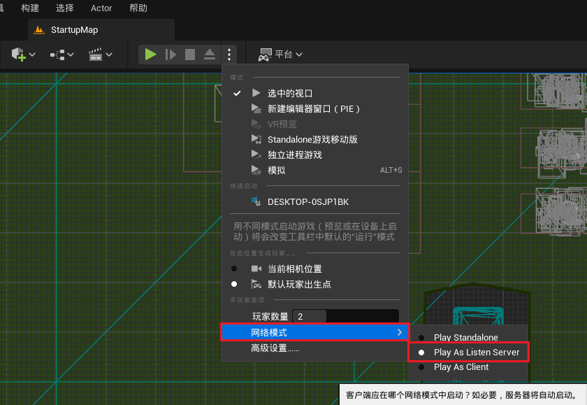
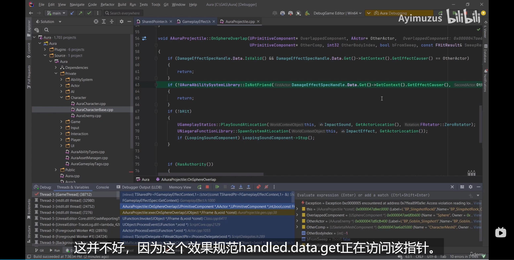
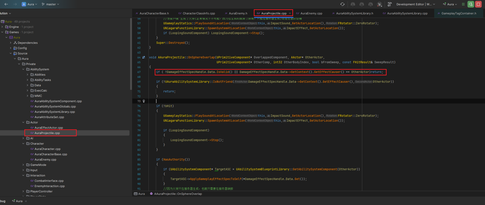

___________________________________________________________________________________________
###### [Go主菜单](../MainMenu.md)
___________________________________________________________________________________________

# GAS 096 多人模式bug修复

___________________________________________________________________________________________

# 目录


[TOC]


___________________________________________________________________________________________

<details>
<summary>视频链接</summary>

[5. Enemies Multiplayer Testing_哔哩哔哩_bilibili](https://www.bilibili.com/video/BV1TH4y1L7NP/?p=1&vd_source=9e1e64122d802b4f7ab37bd325a89e6c)

------

</details>


___________________________________________________________________________________________

### 先测试2人LS
>

------

### 客户端上普通攻击，发生崩溃

- #### 因为在火球Overlap回调中判断可能拿不到Context的Data

- 这里我应该在之前发现了问题，已经改完了

>
>
>

------

### 修复bug

>```cpp
>if ( !DamageEffectSpecHandle.Data.IsValid() || DamageEffectSpecHandle.Data->GetContext().GetEffectCauser() == OtherActor)return;
>```


___________________________________________________________________________________________

[返回最上面](#Go主菜单)

___________________________________________________________________________________________