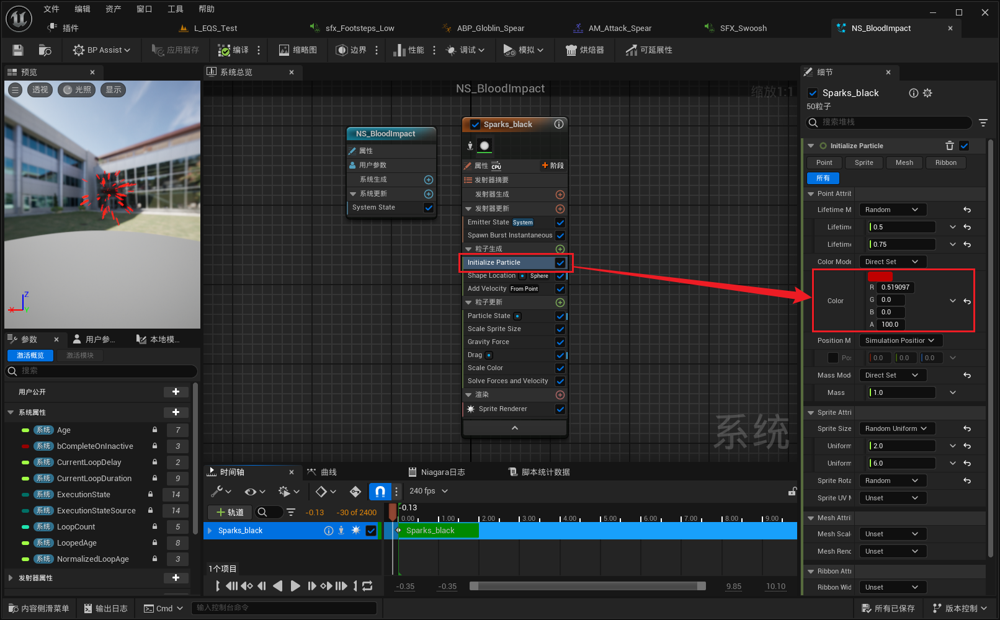

___________________________________________________________________________________________
###### [Go主菜单](../MainMenu.md)
___________________________________________________________________________________________

# GAS 097 制作单人模式下的音效和溅血FX

___________________________________________________________________________________________

## 处理关键点

1. MetaSound有机会研究下

2. GA究竟在客户端还是服务器执行？


___________________________________________________________________________________________

# 目录


[TOC]


___________________________________________________________________________________________

<details>
<summary>视频链接</summary>

[1. Goblin Spear - Sound Notifies_哔哩哔哩_bilibili](https://www.bilibili.com/video/BV1TH4y1L7NP?p=2&vd_source=9e1e64122d802b4f7ab37bd325a89e6c)

[2. Impact Effects_哔哩哔哩_bilibili](https://www.bilibili.com/video/BV1TH4y1L7NP?p=3&vd_source=9e1e64122d802b4f7ab37bd325a89e6c)

------

</details>

___________________________________________________________________________________________

### Mermaid整体思路梳理

Mermaid


___________________________________________________________________________________________

### 蒙太奇中为近战敌人添加跑步声

- 路径

  > 

- #### 脚步声想使用低一点的声音音效

  - 创建一个新的

  - 修改参数

  > 

- #### 动画资产中添加音效

  > 

------

### 蒙太奇中为近战敌人的长矛攻击添加音效

- 路径

  > 

- 将制作好的模板复制到 Swoosh 文件夹

  > 

- #### 打开模板，将音效拖入音效阵列

  > 

- #### 调节整体音效大小，试听

  > 

- 修改模板文件名字为 SFX_Swoosh

  > 

- #### 在Attack蒙太奇中 使用音频资产 SFX_Swoosh

------

### 下一节

------

### 现在有一个问题，上面我们制作了，近战敌人攻击蒙太奇发出音效，但是有的时候我们攻击了却没有打到敌人，所以不能在蒙太奇中添加音效

- 所以需要在判定确认攻击到目标时，才会发出音效和NS特效

------

### 要使用的溅血效果NS路径


- #### 可以在NS这里调整血液的颜色

  > 

------

### 创建溅血效果FX

- #### 在角色基类上创建NS

  > 
  >
  > ```CPP
  > protected:
  >     
  >     UPROPERTY(EditAnywhere,BlueprintReadOnly)  
  >     TObjectPtr<UNiagaraSystem> BloodEffect;/*溅血效果NS*/
  > ```

- #### 接口中创建获取NS的函数

  > 
  >
  > ```cpp
  > public:
  >     
  >     UFUNCTION(BlueprintNativeEvent, BlueprintCallable)
  >     UNiagaraSystem* GetBloodEffect();
  > 
  > ```

- #### 角色基类中重写接口函数

  > 
  >
  > ```cpp
  > public:
  >     
  >     //~ Begin ICombatInteraction
  >     virtual UNiagaraSystem* GetBloodEffect_Implementation() override;
  >     //~ End ICombatInteraction
  > ```
  >
  > ```cpp
  > UNiagaraSystem* AAuraCharacterBase::GetBloodEffect_Implementation()
  > {
  >     return BloodEffect;
  > }
  > ```

------

### 接下来在创建音效之前，先确定，音效应该和蒙太奇相关，也就是说，当敌人用武器或者左右手攻击时，音效应该会不同

- #### 所以音效应该和蒙太奇绑定

- 就像之前的Tag/攻击插槽/蒙太奇绑定一样

- 音效也应该在这个结构体里面

------

### 添加音效

- #### 需要在结构体中添加音效

  > 

- #### 接下来因为要攻击Player，所以需要在Player上配置掉血音效

  > 

- #### 接下来掉血效果是配置在敌人基类上的，我觉得这个应该Player和敌人基类都配置

  > 

- #### 此时打开哥布林子类，需要配置结构体中的音效数据

  > 

- #### 把模板粘贴过来，改名为SFX_Swipe，使用这三个音效

  > 

- #### 配置音效

  > 

------

### 应用音效和NS

- 逻辑是需要先判断是否命中，如果命中播放音效，不能循环播放，因为如果循环播放，一个音效会被执行多次，而特效可以循环，因为这几个对象可能在检测框内但位置不同，所以

  - #### 音效限制，若击中，音效只播放一次

  - NS不限制，可在循环内

- #### 创建bool变量记录是否命中的状态

  - 需要GA实例化策略设置为为每个Actor创建实例化

    > 

- #### 应用音效和NS

  > 

------

### 此时单机效果gif

> 

------

### 这个时候进入LS或DS模式，发现除了客户端，看不到NS且听不到音效

> - 因为我们正在GA中调用产生NS特效
>
> - 这是我们在服务器上执行的事情，我们从 行为树 任务BTTask中执行它
>
> - 我们知道游戏能力是自动复制的，但是仅复制到拥有的客户端，没有真正的玩家拥有这个敌方人工智能控制的角色。所以只有服务器上拥有
>
> - 这只会发生在服务器上。它不会复制给任何人
>
> - 所以这种时候需要用到 GAS 的特效类 GameplayCue
>
> - 请看下集


___________________________________________________________________________________________

[返回最上面](#Go主菜单)

___________________________________________________________________________________________