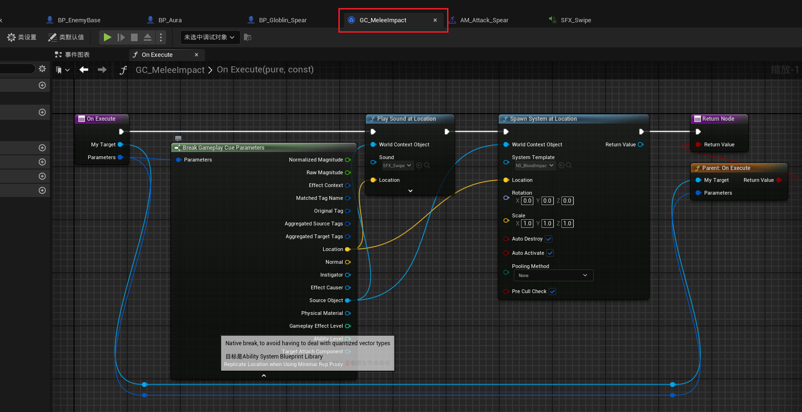
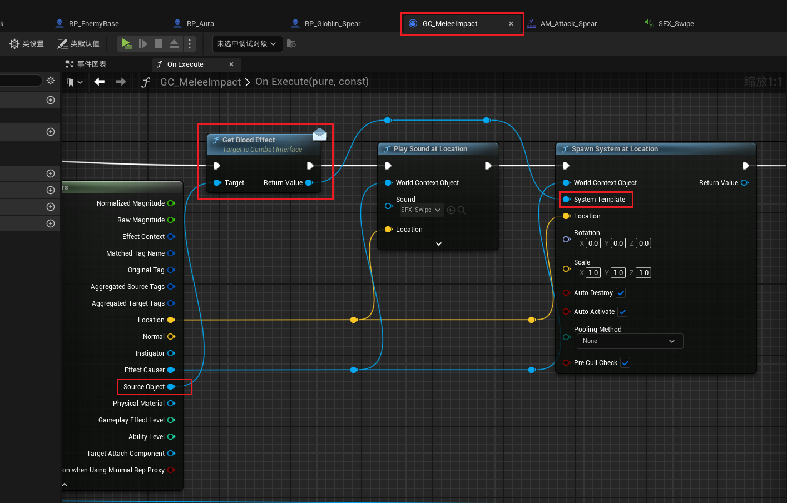
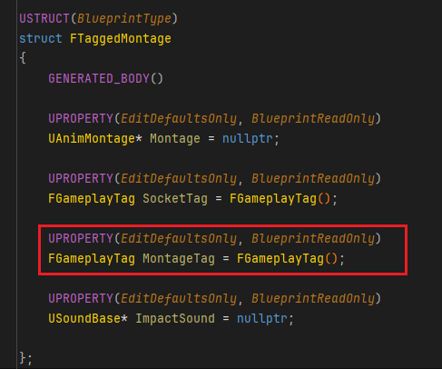
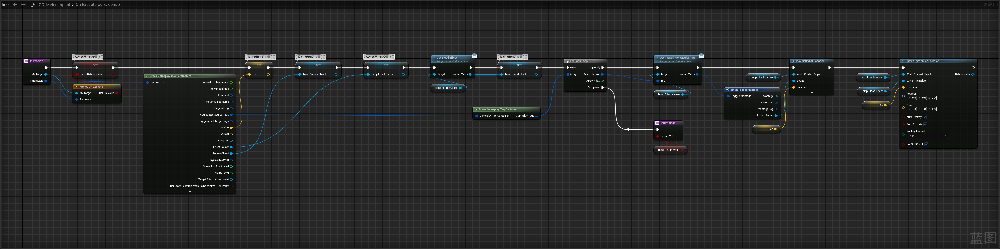

___________________________________________________________________________________________
###### [Go主菜单](../MainMenu.md)
___________________________________________________________________________________________

# GAS 098 使用 GameplayCue 制作LS模式下的音效特效同步

___________________________________________________________________________________________

## 处理关键点

1. 111111111111111111111111111111

2. 222222222222222222222222222

3. 33333333333333333333333333

4. 4444444444444444444444444444

5. 555555555555555555555555555555

6. 666666666666666666666666666

7. 77777777777777777777777777777777

___________________________________________________________________________________________

# 目录


- [GAS 098 使用 GameplayCue 制作LS模式下的音效特效同步](#gas-098-使用-gameplaycue-制作ls模式下的音效特效同步)
  - [处理关键点](#处理关键点)
- [目录](#目录)
    - [Mermaid整体思路梳理](#mermaid整体思路梳理)
    - [创建 GameplayCue](#创建-gameplaycue)
      - [什么是 `GameplayCueNotify_Static` ？](#什么是-gameplaycuenotify_static-)
      - [如果要使用，需要重写 `OnExecute` 函数](#如果要使用需要重写-onexecute-函数)
    - [如果要激活 `GameplayCue` 就需要通过 `Gameplay Cue Tag` ！！！通过标签识别](#如果要激活-gameplaycue-就需要通过-gameplay-cue-tag-通过标签识别)
    - [添加一个 `GameplayCue` 用的 `Gameplay Cue Tag`](#添加一个-gameplaycue-用的-gameplay-cue-tag)
      - [为 `GameplayCue` 配置激活用的 `Gameplay Cue Tag`](#为-gameplaycue-配置激活用的-gameplay-cue-tag)
    - [使用时通过API配置触发 `Gameplay Cue` 的 `Gameplay Cue Tag` 和 `Parameters` 参数](#使用时通过api配置触发-gameplay-cue-的-gameplay-cue-tag-和-parameters-参数)
      - [在参数中设置 Location，同时删除旧的逻辑](#在参数中设置-location同时删除旧的逻辑)
    - [测试结果gif](#测试结果gif)
      - [这个时候我运行客户端发现LS下正常DS下武器插槽位置有点问题](#这个时候我运行客户端发现ls下正常ds下武器插槽位置有点问题)
    - [往 `Gameplay Cue` 中传递参数](#往-gameplay-cue-中传递参数)
      - [GA中移除不用的音效和NS](#ga中移除不用的音效和ns)
    - [接下来需要将 `音效` 和 `蒙太奇` 绑定，结构体中添加音效，但是蒙太奇中的 `Tag` 在 `GameplayEvent` 中已经用过了，所以我们需要重构一下结构体中的 `Tag` 名字，再加一个 `Gameplay Cue Tag`](#接下来需要将-音效-和-蒙太奇-绑定结构体中添加音效但是蒙太奇中的-tag-在-gameplayevent-中已经用过了所以我们需要重构一下结构体中的-tag-名字再加一个-gameplay-cue-tag)
    - [下一节](#下一节)
    - [之前我们创建了这三个蒙太奇用的Tag和蒙太奇还有插槽进行绑定，但是现在我们想要创建新的 `Gameplay Cue Tag`，所以想把原来的tag和插槽绑定，名字也修改一下，](#之前我们创建了这三个蒙太奇用的tag和蒙太奇还有插槽进行绑定但是现在我们想要创建新的-gameplay-cue-tag所以想把原来的tag和插槽绑定名字也修改一下)
      - [创建四个 Gameplay Cue Tag](#创建四个-gameplay-cue-tag)
      - [结构体中添加触发Event事件的GameplayTag](#结构体中添加触发event事件的gameplaytag)
      - [GameplayTag 比如Attack1、Attack2，在使用时，Attack1会Call配置Attack1的Event，Attack2会Call配置Attack2的Event](#gameplaytag-比如attack1attack2在使用时attack1会call配置attack1的eventattack2会call配置attack2的event)
      - [蓝图中修改原来的 `Tag` 逻辑](#蓝图中修改原来的-tag-逻辑)
      - [接口中创建函数，传入 `GameplayTag` ，在结构体数组中查找，如果找到就返回该结构体，角色基类中重写](#接口中创建函数传入-gameplaytag-在结构体数组中查找如果找到就返回该结构体角色基类中重写)
    - [测试结果](#测试结果)


___________________________________________________________________________________________

<details>
<summary>视频链接</summary>
[3. Melee Impact Gameplay Cue_哔哩哔哩_bilibili](https://www.bilibili.com/video/BV1TH4y1L7NP?p=4&vd_source=9e1e64122d802b4f7ab37bd325a89e6c)
[4. Montage and Socket Tags_哔哩哔哩_bilibili](https://www.bilibili.com/video/BV1TH4y1L7NP?p=5&vd_source=9e1e64122d802b4f7ab37bd325a89e6c)

------

</details>

___________________________________________________________________________________________

### Mermaid整体思路梳理

Mermaid


___________________________________________________________________________________________

### 创建 GameplayCue

- 在 `Content/BP/AbilitySystem/Enemy/` 文件夹下创建文件夹 `Cue`

  

- #### 创建蓝图类
  
  - ##### 创建 `GameplayCueNotify_Static` 类，命名为 ***GC_MeleeImpact***
  
  > 

___________________________________________________________________________________________

### 什么是 `GameplayCueNotify_Static` ？

- #### 我们实际上不会实例化 `GameplayCueStatic` 类的对象

- #### 它是 `GameplayCue` 的静态版本

___________________________________________________________________________________________

### 如果要使用，需要重写 `OnExecute` 函数

- 这样处理，有点像调用 `Super`

  > 

- #### 这个参数 `Parameters` 里面可以传递好多参数。如果自动执行，这些参数可以不用自己填写，但是手动执行就需要填写这些参数！！！

  > 

- #### 生成特效和音效的方式参考

  > 

___________________________________________________________________________________________

### 如果要激活 `GameplayCue` 就需要通过 `Gameplay Cue Tag` ！！！通过标签识别

- #### 游戏中有一个 `GameplayCueManager` 它负责按 `Gameplay Cue Tag` 执行查找。

>

___________________________________________________________________________________________

### 添加一个 `GameplayCue` 用的 `Gameplay Cue Tag`

- `Meleelmpact`

>

___________________________________________________________________________________________

### 为 `GameplayCue` 配置激活用的 `Gameplay Cue Tag`
>

___________________________________________________________________________________________

### 使用时通过API配置触发 `Gameplay Cue` 的 `Gameplay Cue Tag` 和 `Parameters` 参数
>

___________________________________________________________________________________________

### 在参数中设置 Location，同时删除旧的逻辑

___________________________________________________________________________________________

### 测试结果gif
>- 红色的和绿色的球是我生成的debug调试用的
>
>

___________________________________________________________________________________________

### 这个时候我运行客户端发现LS下正常DS下武器插槽位置有点问题

------

### 往 `Gameplay Cue` 中传递参数

- #### 传递 `SourceObject`

  > 

- 使用 `Source` 设置NS

  > 

- #### 传递 `EffectCauser`

  > 

- #### 蒙太奇中的 `Tag` 也可以传进来

  - 这样可以在接收时，遍历角色身上的结构体，找到对应的结构体返回

___________________________________________________________________________________________

### GA中移除不用的音效和NS
>

___________________________________________________________________________________________

### 接下来需要将 `音效` 和 `蒙太奇` 绑定，结构体中添加音效，但是蒙太奇中的 `Tag` 在 `GameplayEvent` 中已经用过了，所以我们需要重构一下结构体中的 `Tag` 名字，再加一个 `Gameplay Cue Tag`

___________________________________________________________________________________________

### 下一节

___________________________________________________________________________________________

### 之前我们创建了这三个蒙太奇用的Tag和蒙太奇还有插槽进行绑定，但是现在我们想要创建新的 `Gameplay Cue Tag`，所以想把原来的tag和插槽绑定，名字也修改一下，

>

- 分别修改成：
  
  | FGameplayTag变量名 修改前 | 修改后                 |
  | ------------------------- | ---------------------- |
  | Montage_Attack_Weapon     | CombatSocket_Weapon    |
  | Montage_Attack_RightHand  | CombatSocket_RightHand |
  | Montage_Attack_LeftHand   | CombatSocket_LeftHand  |
  
- 相关的引用也需要修改

  - 蓝图

  - C++

___________________________________________________________________________________________

### 创建四个 Gameplay Cue Tag
>

___________________________________________________________________________________________

### 结构体中添加触发Event事件的GameplayTag



- `SocketTag` 是给以前的用的

- `MontageTag` 用于触发 `Event`


```cpp
/*
 * 敌人攻击用到的插槽
 */
GameplayTags.CombatSocket_Weapon = UGameplayTagsManager::Get().AddNativeGameplayTag(
    FName("CombatSocket.Weapon"),
    FString("CombatSocket Weapon"));

GameplayTags.CombatSocket_RightHand = UGameplayTagsManager::Get().AddNativeGameplayTag(
    FName("CombatSocket.RightHand"),
    FString("CombatSocket RightHand"));

GameplayTags.CombatSocket_LeftHand = UGameplayTagsManager::Get().AddNativeGameplayTag(
    FName("CombatSocket.LeftHand"),
    FString("CombatSocket LeftHand"));

/*
 * 敌人攻击蒙太奇
 */
GameplayTags.Montage_Attack_1 = UGameplayTagsManager::Get().AddNativeGameplayTag(
    FName("Montage.Attack1"),
    FString("Montage.Attack.1"));

GameplayTags.Montage_Attack_2 = UGameplayTagsManager::Get().AddNativeGameplayTag(
    FName("Montage.Attack2"),
    FString("Montage.Attack.2"));

GameplayTags.Montage_Attack_3 = UGameplayTagsManager::Get().AddNativeGameplayTag(
    FName("Montage.Attack3"),
    FString("Montage.Attack.3"));

GameplayTags.Montage_Attack_4 = UGameplayTagsManager::Get().AddNativeGameplayTag(
    FName("Montage.Attack4"),
    FString("Montage.Attack.4"));
```

___________________________________________________________________________________________

### GameplayTag 比如Attack1、Attack2，在使用时，Attack1会Call配置Attack1的Event，Attack2会Call配置Attack2的Event
>

<details>
<summary>还不理解的话可以看下这个蒙太奇中发送的Tag截图</summary>

>

------

</details>

___________________________________________________________________________________________

### 蓝图中修改原来的 `Tag` 逻辑

- 修改旧的

  > 

- 子类中也需要修改

  > 

___________________________________________________________________________________________

### 接口中创建函数，传入 `GameplayTag` ，在结构体数组中查找，如果找到就返回该结构体，角色基类中重写

- 接口中创建函数

```cpp
public:
    
    UFUNCTION(BlueprintNativeEvent, BlueprintCallable)
    FTaggedMontage GetTaggedMontageByTag(const FGameplayTag& Tag);

```

- 角色基类中重写

```cpp
public:

	//~ Begin ICombatInteraction
	virtual FTaggedMontage GetTaggedMontageByTag_Implementation(const FGameplayTag& Tag) override;
	//~ End ICombatInteraction

```

```cpp
FTaggedMontage AAuraCharacterBase::GetTaggedMontageByTag_Implementation(const FGameplayTag& Tag)
{
    for (const FTaggedMontage& Item:AttackMontages)
    {
       if (Item.MontageTag.MatchesTagExact(Tag))
       {
          return Item;
       }
    }
    return FTaggedMontage();
}
```

- 蓝图中调用并设置

  > 

___________________________________________________________________________________________

### 测试结果
>


___________________________________________________________________________________________

[返回最上面](#Go主菜单)

___________________________________________________________________________________________