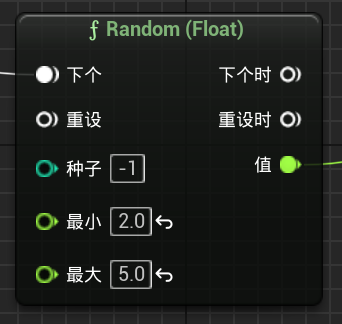

___________________________________________________________________________________________
###### [Go主菜单](../MainMenu.md)
___________________________________________________________________________________________

# GAS 099 为敌人添加死亡音效；为近战敌人添加受击音效

___________________________________________________________________________________________

## 处理关键点

1. 有时间后面需要研究一下MetaSound

___________________________________________________________________________________________

# 目录


- [GAS 099 为敌人添加死亡音效；为近战敌人添加受击音效](#gas-099-为敌人添加死亡音效为近战敌人添加受击音效)
  - [处理关键点](#处理关键点)
  - [目录](#目录)
    - [Mermaid整体思路梳理](#mermaid整体思路梳理)
    - [为哥布林添加命中音效](#为哥布林添加命中音效)
      - [音效路径](#音效路径)
      - [受击蒙太奇中配置](#受击蒙太奇中配置)
      - [设置——扩大音调随机范围](#设置扩大音调随机范围)
    - [接下来添加死亡声音](#接下来添加死亡声音)
      - [角色基类中添加死亡时播放的音效，要在蓝图中配置](#角色基类中添加死亡时播放的音效要在蓝图中配置)
      - [死亡时调用播放音效](#死亡时调用播放音效)
      - [死亡音效路径，需要在蓝图中配置](#死亡音效路径需要在蓝图中配置)
    - [下一节](#下一节)
    - [为远程敌人添加脚步声](#为远程敌人添加脚步声)
    - [为远程敌人添加受击音效](#为远程敌人添加受击音效)
    - [设置死亡音效](#设置死亡音效)
    - [下一节，添加石头打击的音效](#下一节添加石头打击的音效)
    - [添加石头打击的音效](#添加石头打击的音效)
    - [现在，当岩石撞击地面时，我们听不到任何声音](#现在当岩石撞击地面时我们听不到任何声音)
  - [调整地面的碰撞检测通道，别忘了勾选 开启 重叠事件！！！](#调整地面的碰撞检测通道别忘了勾选-开启-重叠事件)
    - [现在有了声音，想加一些视觉效果FX，也就是 `NS特效`](#现在有了声音想加一些视觉效果fx也就是-ns特效)
    - [添加石头打击特效](#添加石头打击特效)
      - [石头打击特效路径如下](#石头打击特效路径如下)
      - [蓝图中配置](#蓝图中配置)
    - [好像听到了多次触发声音，需要限制一下](#好像听到了多次触发声音需要限制一下)
    - [下一节](#下一节-1)
    - [多人模式LS测试gif](#多人模式ls测试gif)
    - [接下来处理 萨满](#接下来处理-萨满)
    - [下一节](#下一节-2)
    - [接下来处理食尸鬼](#接下来处理食尸鬼)
      - [食尸鬼的脚步声应该更沉重一些，所以创建一个新的 `MetaSound` ，调整一下音调，命名为 `SFX_Footsteps_Deep`](#食尸鬼的脚步声应该更沉重一些所以创建一个新的-metasound-调整一下音调命名为-sfx_footsteps_deep)
    - [添加脚步声](#添加脚步声)
    - [添加攻击的音效，下面是路径，需要自己调整音效的音调，并配置](#添加攻击的音效下面是路径需要自己调整音效的音调并配置)
    - [参考近战哥布林，配置攻击到目标的音效](#参考近战哥布林配置攻击到目标的音效)
    - [创建食尸鬼受击音效，并配置](#创建食尸鬼受击音效并配置)
    - [创建食尸鬼丝死亡音效，并配置](#创建食尸鬼丝死亡音效并配置)
    - [死亡声音](#死亡声音)
  - [我这里遇到一个bug，就是食尸鬼的左右手插槽在代码中获取的位置失效](#我这里遇到一个bug就是食尸鬼的左右手插槽在代码中获取的位置失效)
    - [下一节将为食尸鬼添加攻击时的拖尾NS特效](#下一节将为食尸鬼添加攻击时的拖尾ns特效)


___________________________________________________________________________________________

<details>
<summary>视频链接</summary>

[5. Goblin Spear - Hurt and Death Sounds_哔哩哔哩_bilibili](https://www.bilibili.com/video/BV1TH4y1L7NP/?p=6&vd_source=9e1e64122d802b4f7ab37bd325a89e6c)

[6. Goblin Slingshot - Sound Notifies_哔哩哔哩_bilibili](https://www.bilibili.com/video/BV1TH4y1L7NP/?p=7&vd_source=9e1e64122d802b4f7ab37bd325a89e6c)

[7. Rock lmpact Effects_哔哩哔哩_bilibili](https://www.bilibili.com/video/BV1TH4y1L7NP/?p=8&spm_id_from=pageDriver&vd_source=9e1e64122d802b4f7ab37bd325a89e6c)

[8. Goblin Shaman - Sound Notifies_哔哩哔哩_bilibili](https://www.bilibili.com/video/BV1TH4y1L7NP/?p=9&spm_id_from=pageDriver&vd_source=9e1e64122d802b4f7ab37bd325a89e6c)

[9. Ghoul - Sound Notifies_哔哩哔哩_bilibili](https://www.bilibili.com/video/BV1TH4y1L7NP/?p=10&spm_id_from=pageDriver&vd_source=9e1e64122d802b4f7ab37bd325a89e6c)

------

</details>

___________________________________________________________________________________________

### Mermaid整体思路梳理

Mermaid

___________________________________________________________________________________________

### 为哥布林添加命中音效

___________________________________________________________________________________________

#### 音效路径


>


___________________________________________________________________________________________

#### 受击蒙太奇中配置

>


___________________________________________________________________________________________

#### 设置——扩大音调随机范围

>
>

------

### 接下来添加死亡声音

------

#### 角色基类中添加死亡时播放的音效，要在蓝图中配置

>#### 命名为 `DeathSound`
>
>```cpp
>protected:
>	
>	UPROPERTY(EditAnywhere,BlueprintReadOnly, Category = "Combat")  
>	TObjectPtr<USoundBase> DeathSound;
>    
>```
>
#### 死亡时调用播放音效
>
>```CPP
>UGameplayStatics::PlaySoundAtLocation(this,DeathSound,GetActorLocation(),GetActorRotation());
>```
>
>

------

#### 死亡音效路径，需要在蓝图中配置

>
>
>

------

### 下一节

------

### 为远程敌人添加脚步声

>
>
>

------

### 为远程敌人添加受击音效

>

------

### 设置死亡音效

>

------

### 下一节，添加石头打击的音效

------

### 添加石头打击的音效

>

------

### 现在，当岩石撞击地面时，我们听不到任何声音

>- #### **需要调整地面的碰撞检测通道**

------

## 调整地面的碰撞检测通道，别忘了勾选 开启 重叠事件！！！

>

------

### 现在有了声音，想加一些视觉效果FX，也就是 `NS特效`

------

### 添加石头打击特效

#### 石头打击特效路径如下
>


------

#### 蓝图中配置
>


------

### 好像听到了多次触发声音，需要限制一下
>

------

### 下一节

------


### 多人模式LS测试gif


>


------

### 接下来处理 萨满

<details>
<summary>这里步骤我就折叠起来了</summary>

>### 添加脚步声
>
>
>
>### 添加受击音效，看看蓝图是否配置受击蒙太奇
>
>
>
>### 死亡声音
>

------

</details>

------

### 下一节

------

### 接下来处理食尸鬼


------

#### 食尸鬼的脚步声应该更沉重一些，所以创建一个新的 `MetaSound` ，调整一下音调，命名为 `SFX_Footsteps_Deep`
>


------

### 添加脚步声
>


------

### 添加攻击的音效，下面是路径，需要自己调整音效的音调，并配置
>
>
>


------

### 参考近战哥布林，配置攻击到目标的音效

------

### 创建食尸鬼受击音效，并配置
>
>


------

### 创建食尸鬼丝死亡音效，并配置

- 这个是恶魔的音效，需要稍微变更音调


------

### 死亡声音
>

------

## 我这里遇到一个bug，就是食尸鬼的左右手插槽在代码中获取的位置失效

> #### **我的解决办法是，把左右手的插槽挪到Root上就好了，看来是运动时，Socket位置不能实时更新，这个后面有机会再研**究
>
> 

------

### 下一节将为食尸鬼添加攻击时的拖尾NS特效


___________________________________________________________________________________________

[返回最上面](#Go主菜单)

___________________________________________________________________________________________