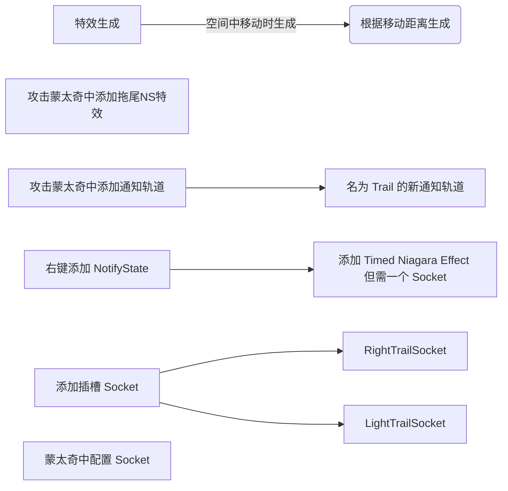
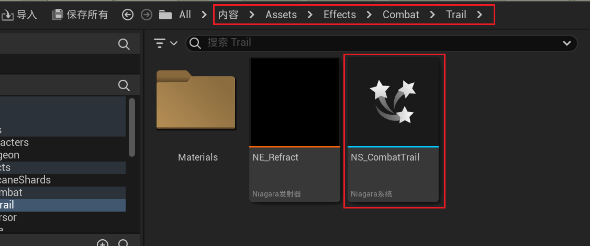
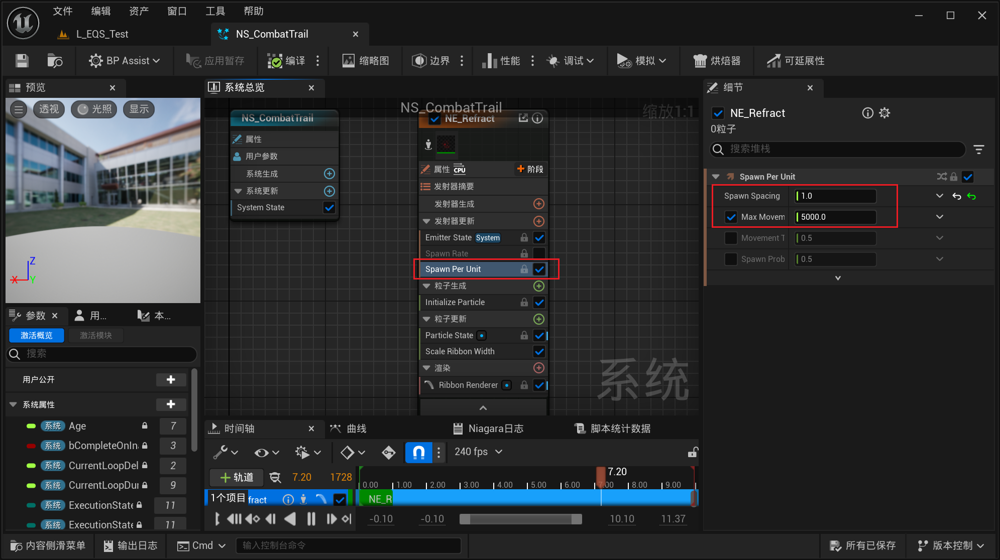
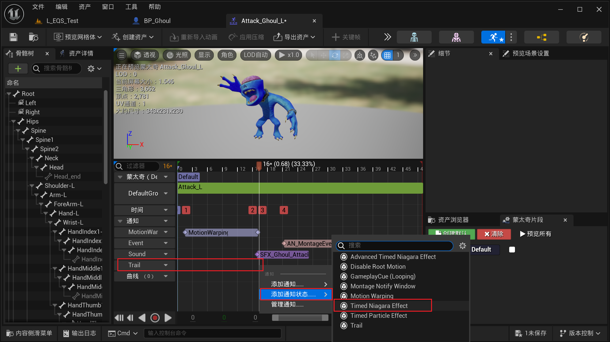
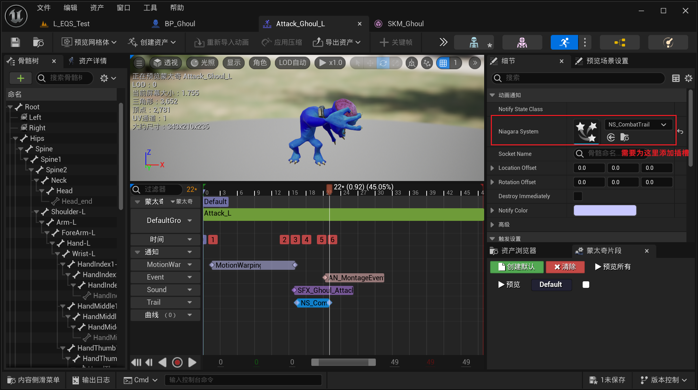
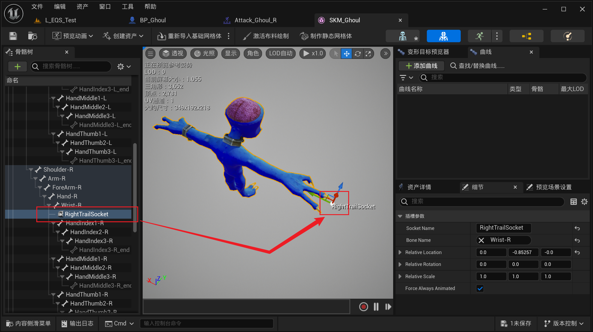
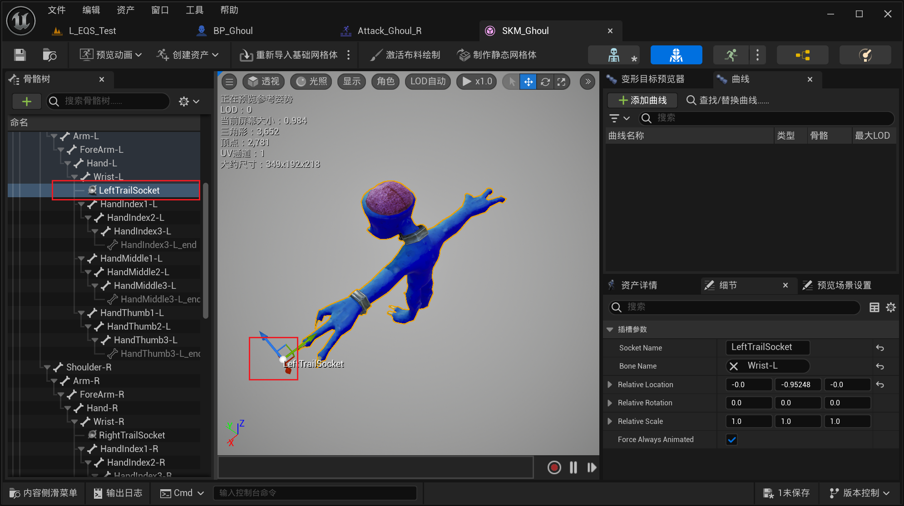
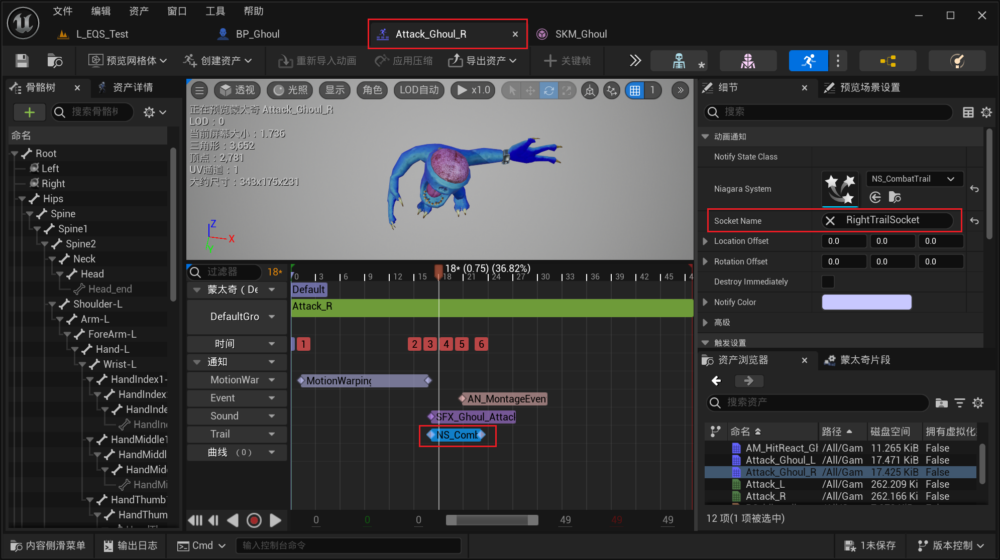
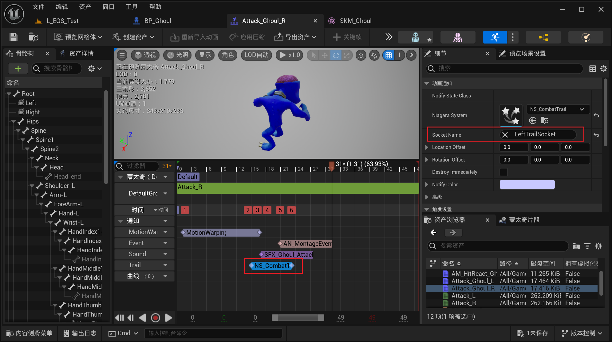
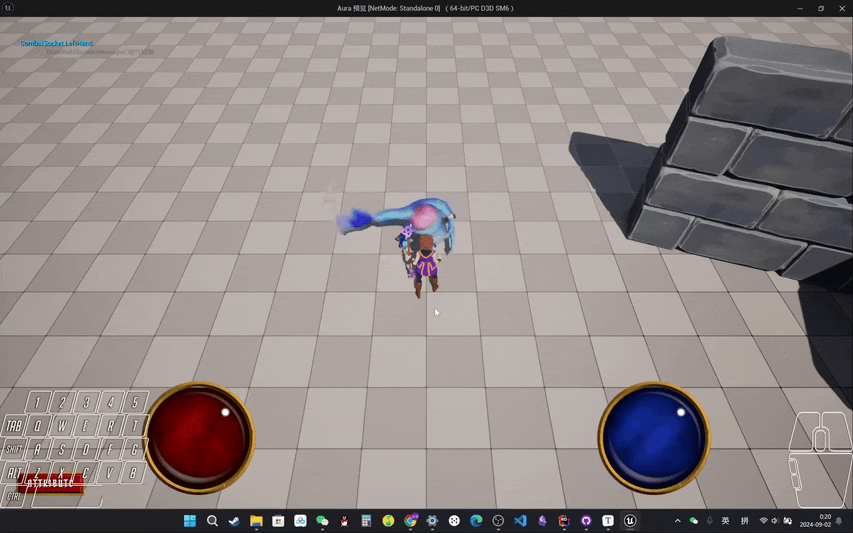

___________________________________________________________________________________________
###### [Go主菜单](../MainMenu.md)
___________________________________________________________________________________________

# GAS 100 为食尸鬼添加攻击时的拖尾NS特效

___________________________________________________________________________________________

## 处理关键点

1. 蒙太奇中 配置 `拖尾NS特效`

___________________________________________________________________________________________

# 目录

- [GAS 100 为食尸鬼添加攻击时的拖尾NS特效](#gas-100-为食尸鬼添加攻击时的拖尾ns特效)
  - [处理关键点](#处理关键点)
- [目录](#目录)
    - [Mermaid整体思路梳理](#mermaid整体思路梳理)
      - [特效路径](#特效路径)
    - [特效会在空间中移动时生成，根据移动距离生成](#特效会在空间中移动时生成根据移动距离生成)
    - [攻击蒙太奇中添加拖尾NS特效](#攻击蒙太奇中添加拖尾ns特效)
      - [攻击蒙太奇中添加一个名为 `Trail` 的新通知轨道](#攻击蒙太奇中添加一个名为-trail-的新通知轨道)
      - [右键添加 `NotifyState`，添加 `Timed Niagara Effect`，但是还需要一个 `Socket`](#右键添加-notifystate添加-timed-niagara-effect但是还需要一个-socket)
      - [添加插槽 `Socket`](#添加插槽-socket)
      - [蒙太奇中 配置 `Socket`](#蒙太奇中-配置-socket)
    - [测试效果gif](#测试效果gif)

___________________________________________________________________________________________

视频链接

[10. Ghoul - Swipe Trail_哔哩哔哩_bilibili](https://www.bilibili.com/video/BV1TH4y1L7NP/?p=11&spm_id_from=pageDriver&vd_source=9e1e64122d802b4f7ab37bd325a89e6c)

------

___________________________________________________________________________________________

### Mermaid整体思路梳理

Mermaid

------

#### 特效路径
>

------

### 特效会在空间中移动时生成，根据移动距离生成
>

------

### 攻击蒙太奇中添加拖尾NS特效

------

#### 攻击蒙太奇中添加一个名为 `Trail` 的新通知轨道

------

#### 右键添加 `NotifyState`，添加 `Timed Niagara Effect`，但是还需要一个 `Socket`
>
>

------

#### 添加插槽 `Socket`

>#### 分别命名为：
>
>- #### `RightTrailSocket`
>
>- #### `LightTrailSocket`
>
>
>

------

#### 蒙太奇中 配置 `Socket`
>

------

### 测试效果gif
>

___________________________________________________________________________________________

[返回最上面](#Go主菜单)

___________________________________________________________________________________________