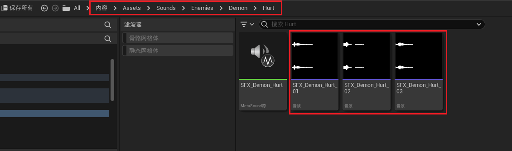
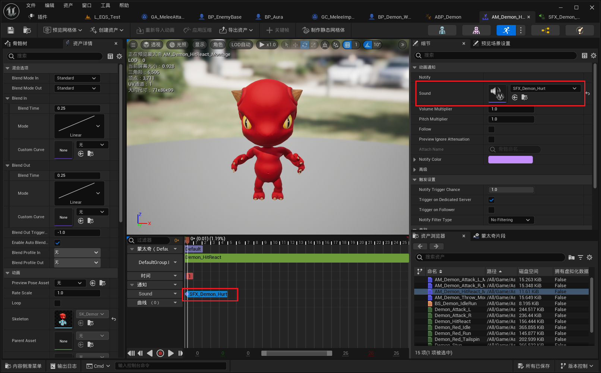
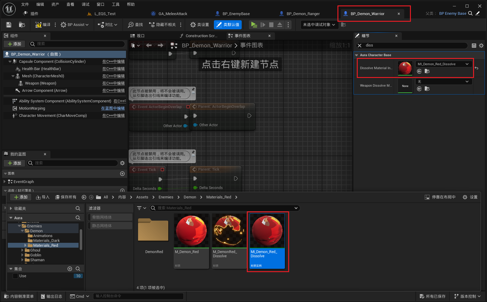

___________________________________________________________________________________________
###### [Go主菜单](../MainMenu.md)
___________________________________________________________________________________________

# GAS 102 为萨满制作召唤技能(2)为恶魔添加 行走音效 受击动画 死亡音效

___________________________________________________________________________________________

# 目录

- [GAS 102 为萨满制作召唤技能(2)为恶魔添加 行走音效 受击动画 死亡音效](#gas-102-为萨满制作召唤技能2为恶魔添加-行走音效-受击动画-死亡音效)
  - [目录](#目录)
    - [Mermaid整体思路梳理](#mermaid整体思路梳理)
    - [为恶魔行走动画添加音效](#为恶魔行走动画添加音效)
    - [添加受击动画；添加音效，记得调整音调](#添加受击动画添加音效记得调整音调)
    - [测试gif](#测试gif)
  - [结论：有时在内容浏览器中直接复制蓝图即，使用重复项可能会导致问题。](#结论有时在内容浏览器中直接复制蓝图即使用重复项可能会导致问题)
    - [为恶魔配置死亡声音，创建新的 `MetaSound`，然后改变音调，配置](#为恶魔配置死亡声音创建新的-metasound然后改变音调配置)
    - [下一节](#下一节)
    - [为恶魔创建死亡溶解材质](#为恶魔创建死亡溶解材质)
    - [此时效果gif](#此时效果gif)

___________________________________________________________________________________________

视频链接

[14. Demon - Sound Notifies_哔哩哔哩_bilibili](https://www.bilibili.com/video/BV1TH4y1L7NP?p=15&spm_id_from=pageDriver&vd_source=9e1e64122d802b4f7ab37bd325a89e6c)

[15. Demon - Dissolve Effect_哔哩哔哩_bilibili](https://www.bilibili.com/video/BV1TH4y1L7NP?p=16&spm_id_from=pageDriver&vd_source=9e1e64122d802b4f7ab37bd325a89e6c)

------

------

### 为恶魔行走动画添加音效
>

------

### 添加受击动画；添加音效，记得调整音调
>
>
>
>
>
>此时，攻击远程的恶魔时，受击动画不生效
>
>- 原因是我们有时在复制蓝图时，会有问题，所以需要再手动创建一个

------

### 测试gif

>
>
>- 修改后生效了

------

## 结论：有时在内容浏览器中直接复制蓝图即，使用重复项可能会导致问题。

------

### 为恶魔配置死亡声音，创建新的 `MetaSound`，然后改变音调，配置
>
>
>

------

### 下一节

------

### 为恶魔创建死亡溶解材质

这个之前做过类似的，这里就折叠起来了

>

------

------

### 此时效果gif

___________________________________________________________________________________________

[返回最上面](#Go主菜单)

___________________________________________________________________________________________