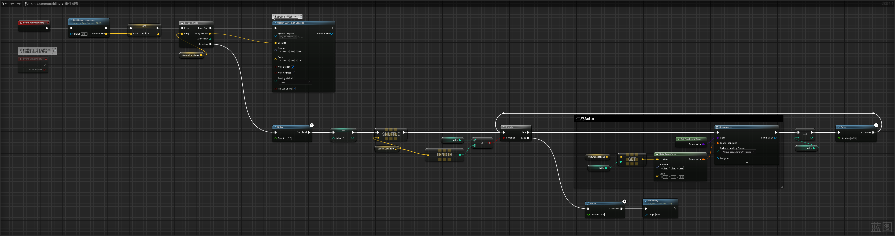

___________________________________________________________________________________________
###### [Go主菜单](../MainMenu.md)
___________________________________________________________________________________________

# GAS 104 为萨满制作召唤技能(4)射线检测修正生成点位置，使用SpawnActor生成AI注意事项

___________________________________________________________________________________________

## 处理关键点

1. **异步生成小兵** - 通过循环并延迟生成，使用 `Shuffle` 节点打乱生成顺序。
2. **生成位置修正** - 在生成位置进行垂直向下射线检测，必要时修正位置以适应地形坡度。
   - 调用API：`GetWorld()->LineTraceSingleByChannel`
3. 使用 `SpawnActorFromClass` 后需要手动生成默认控制器，调用API：`SpawnDefaultController`

___________________________________________________________________________________________

# 目录


- [GAS 104 为萨满制作召唤技能(4)射线检测修正生成点位置，使用SpawnActor生成AI注意事项](#gas-104-为萨满制作召唤技能4射线检测修正生成点位置使用spawnactor生成ai注意事项)
  - [处理关键点](#处理关键点)
  - [目录](#目录)
    - [Mermaid整体思路梳理](#mermaid整体思路梳理)
    - [希望可以异步生成小兵，不要一起生成，且随机](#希望可以异步生成小兵不要一起生成且随机)
    - [自己写一个循环，加入delay生成DebugSphere](#自己写一个循环加入delay生成debugsphere)
    - [使用节点Shuffle节点打乱数组顺序](#使用节点shuffle节点打乱数组顺序)
    - [测试效果gif](#测试效果gif)
    - [移除代码中的生成 DebugSphere 的代码](#移除代码中的生成-debugsphere-的代码)
    - [如果在战斗中可能会不是水平的，可能是有坡度的](#如果在战斗中可能会不是水平的可能是有坡度的)
    - [代码中射线检测修正生成位置](#代码中射线检测修正生成位置)
    - [测试效果](#测试效果)
    - [选中几个需要的Actor右键打组](#选中几个需要的actor右键打组)
    - [测试gif](#测试gif)
    - [下一节](#下一节)
    - [在即将生成的位置，生成 `NS特效`](#在即将生成的位置生成-ns特效)
    - [可以在NS中调整最大最小时间](#可以在ns中调整最大最小时间)
    - [技能中配置需要生成的恶魔的Class](#技能中配置需要生成的恶魔的class)
    - [接下来需要创建一个函数，根据上面的数组返回随机类](#接下来需要创建一个函数根据上面的数组返回随机类)
    - [蓝图中使用 `SpawnActorFromClass` 替代 `DebugSphere` 节点](#蓝图中使用-spawnactorfromclass-替代-debugsphere-节点)
    - [生成后卡脖子了，需要加点Z轴上的偏移](#生成后卡脖子了需要加点z轴上的偏移)
    - [加Z轴上的偏移后](#加z轴上的偏移后)
    - [为什么敌人没有运行行为树呢？](#为什么敌人没有运行行为树呢)
  - [在使用SpawnActor后，为AI分配默认控制器](#在使用spawnactor后为ai分配默认控制器)
    - [此时效果gif](#此时效果gif)
    - [生成的敌人朝向还是有些问题，下一节处理](#生成的敌人朝向还是有些问题下一节处理)


___________________________________________________________________________________________

<details>
<summary>视频链接</summary>

[17. Async Spawn Times_哔哩哔哩_bilibili](https://www.bilibili.com/video/BV1TH4y1L7NP?p=18&spm_id_from=pageDriver&vd_source=9e1e64122d802b4f7ab37bd325a89e6c)

[18. Summoning Particle Effect_哔哩哔哩_bilibili](https://www.bilibili.com/video/BV1TH4y1L7NP?p=19&spm_id_from=pageDriver&vd_source=9e1e64122d802b4f7ab37bd325a89e6c)

------

</details>

___________________________________________________________________________________________

### Mermaid整体思路梳理

Mermaid


------

### 希望可以异步生成小兵，不要一起生成，且随机


------

### 自己写一个循环，加入delay生成DebugSphere

>
>
>- 先for循环在所有的生成位置生成小一点的DebugSphere


------

### 使用节点Shuffle节点打乱数组顺序


------

### 测试效果gif
>


------

### 移除代码中的生成 DebugSphere 的代码


------

### 如果在战斗中可能会不是水平的，可能是有坡度的

>
>
>- 所以需要，在生成的位置垂直向下射线检测，如果检测到就在该检测点生成


------

### 代码中射线检测修正生成位置
>
>
>```cpp
>TArray<FVector> UAuraSummonAbility::GetSpawnLocations()
>{
>    const FVector Forward = GetAvatarActorFromActorInfo()->GetActorForwardVector();
>    const FVector Loc = GetAvatarActorFromActorInfo()->GetActorLocation();
>
>    const float Spread = SpawnSpread / NumMinions;/* 计算一下每一个需要偏移的角度 */
>    const FVector LeftOfSpread = Forward.RotateAngleAxis( - SpawnSpread / 2.f, FVector::UpVector);
>
>    TArray<FVector> SpawnLocations;
>    for (int32 i = 0; i < NumMinions; i++)
>    {
>       FVector Dir = LeftOfSpread.RotateAngleAxis(i * Spread, FVector::UpVector);
>       UKismetSystemLibrary::DrawDebugArrow(GetAvatarActorFromActorInfo(), Loc, Loc + Dir * MaxSpawnDistance, 4.f, FLinearColor::Gray, 1.f, 4.f);
>       FVector RandomLoc = Loc + Dir * FMath::RandRange(MinSpawnDistance,MaxSpawnDistance);
>        
>       FHitResult HitResult;
>       //在该点 Z轴 + 400.f 向下射线检测 到 -400.f 若击中则 覆盖原来的位置
>       if (GetWorld()->LineTraceSingleByChannel(HitResult,RandomLoc + FVector(0,0,400.f),RandomLoc + FVector(0,0,-400.f),ECollisionChannel::ECC_Visibility))
>       {
>          RandomLoc = HitResult.ImpactPoint;
>       }
>       SpawnLocations.Add(RandomLoc);
>        
>    }
>    return SpawnLocations;
>}
>```


------

### 测试效果
>
>
>因为有透视所以看起来歪了一点


------

### 选中几个需要的Actor右键打组
>
>
>## 当然我是直接摆了一个立方体上去
>
>


------

### 测试gif
>
>
>### 当然可能生成在 `NaviMesh` 导航之外,这个后面再处理

------

### 下一节

------


### 在即将生成的位置，生成 `NS特效` 
>
>


------

### 可以在NS中调整最大最小时间
>


------

### 技能中配置需要生成的恶魔的Class
>


------

### 接下来需要创建一个函数，根据上面的数组返回随机类
>```cpp
>public:
>
>    UFUNCTION(BlueprintPure)
>	TSubclassOf<APawn> GetRandomAIClass();/* 随机获取AI Class */
>```
>
>```cpp
>TSubclassOf<APawn> UAuraSummonAbility::GetRandomAIClass()
>{
>    check(MinionClasses.Num() > 0)
>    if (MinionClasses.Num() > 0)
>    {
>       const int32 Random = FMath::RandRange(0,MinionClasses.Num() - 1);
>       return MinionClasses[Random];
>    }
>    return APawn::StaticClass();
>}
>```
>
>


------

### 蓝图中使用 `SpawnActorFromClass` 替代 `DebugSphere` 节点
>- 选择忽视碰撞生成
>
>  
>
>


------

### 生成后卡脖子了，需要加点Z轴上的偏移
>


------

### 加Z轴上的偏移后
>

------

### 为什么敌人没有运行行为树呢？

>- ## 因为当角色在运行时在世界中手动生成时，它不会自动为其配置 `AIController`！！！！！
>
>- ## 我们必须分配一个默认控制器。！！！！！

------

## 在使用SpawnActor后，为AI分配默认控制器
>
>
>

------

### 此时效果gif
>

------

### 生成的敌人朝向还是有些问题，下一节处理

> 生成时没有朝着玩家，而是萨满
>
> 但是我觉得还挺合理的，哈哈哈

___________________________________________________________________________________________

[返回最上面](#Go主菜单)

___________________________________________________________________________________________