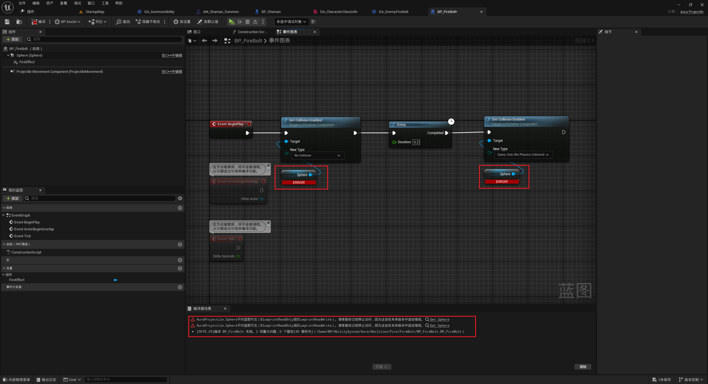

___________________________________________________________________________________________
###### [Go主菜单](../MainMenu.md)
___________________________________________________________________________________________

# GAS 105 为萨满制作召唤技能(5)创建召唤技能蒙太奇；为萨满创建新的行为树；修复火球提前爆炸的bug，火球Delay后再打开碰撞

___________________________________________________________________________________________

# 目录


- [GAS 105 为萨满制作召唤技能(5)创建召唤技能蒙太奇；为萨满创建新的行为树；修复火球提前爆炸的bug，火球Delay后再打开碰撞](#gas-105-为萨满制作召唤技能5创建召唤技能蒙太奇为萨满创建新的行为树修复火球提前爆炸的bug火球delay后再打开碰撞)
- [目录](#目录)
    - [Mermaid整体思路梳理](#mermaid整体思路梳理)
    - [在召唤恶魔时使用FindLookatRotation设置生成方向](#在召唤恶魔时使用findlookatrotation设置生成方向)
    - [先为萨满 创建和使用 召唤技能蒙太奇](#先为萨满-创建和使用-召唤技能蒙太奇)
    - [激活蒙太奇，等待EventTag](#激活蒙太奇等待eventtag)
      - [稍微提前一些生成时间，萨满一抬手就召唤](#稍微提前一些生成时间萨满一抬手就召唤)
    - [在播放蒙太奇后萨满会脚滑](#在播放蒙太奇后萨满会脚滑)
    - [此时效果gif](#此时效果gif)
    - [下一节](#下一节)
    - [现在萨满会一直召唤恶魔，没有上限，需要加一个上限](#现在萨满会一直召唤恶魔没有上限需要加一个上限)
    - [而且萨满一直使用攻击的Tag，需要加一个萨满召唤技能的Tag](#而且萨满一直使用攻击的tag需要加一个萨满召唤技能的tag)
    - [增加一个萨满召唤技能的Tag](#增加一个萨满召唤技能的tag)
    - [现在有一个问题，就是这个召唤的生物数量，按照框架来说，应该在角色基类上，因为每个角色都应该有自己的奴才，像Player可能会有宠物，或者召唤生物。所以召唤生物数量的变量，应该和角色基类绑定，然后通过接口，拿到](#现在有一个问题就是这个召唤的生物数量按照框架来说应该在角色基类上因为每个角色都应该有自己的奴才像player可能会有宠物或者召唤生物所以召唤生物数量的变量应该和角色基类绑定然后通过接口拿到)
      - [角色基类中创建 召唤生物数量的变量，命名为，`MinionCount`](#角色基类中创建-召唤生物数量的变量命名为minioncount)
      - [接口创建拿召唤物数量的函数，命名为，GetMinionCount](#接口创建拿召唤物数量的函数命名为getminioncount)
      - [角色基类中重写](#角色基类中重写)
    - [为召唤技能GA配置新的召唤技能Tag](#为召唤技能ga配置新的召唤技能tag)
    - [下一节](#下一节-1)
    - [下面我们将为萨满创建一个新的行为树](#下面我们将为萨满创建一个新的行为树)
    - [复制出一个行为树，命名为 ***BT\_EnemyBehaviorTree\_Elementalist***](#复制出一个行为树命名为-bt_enemybehaviortree_elementalist)
      - [萨满中配置](#萨满中配置)
    - [CharacterInfo中需要为萨满配置上火球(因为之前删了)](#characterinfo中需要为萨满配置上火球因为之前删了)
    - [此时运行游戏，萨满应该发射火球](#此时运行游戏萨满应该发射火球)
      - [断点调试，发现是火球SphereCollision太大了，调小可以解决](#断点调试发现是火球spherecollision太大了调小可以解决)
    - [想要在发射火球时关闭碰撞，然后delay后再打开碰撞](#想要在发射火球时关闭碰撞然后delay后再打开碰撞)
    - [测试一下，会报错](#测试一下会报错)
    - [现在可以把半径调整回大一点了](#现在可以把半径调整回大一点了)
    - [下面我们希望既可以发射火球，又可以召唤，所以需要修改行为树，下一节](#下面我们希望既可以发射火球又可以召唤所以需要修改行为树下一节)


___________________________________________________________________________________________

<details>
<summary>视频链接</summary>

[20. Minion Summon Montage_哔哩哔哩_bilibili](https://www.bilibili.com/video/BV1TH4y1L7NP?p=21&spm_id_from=pageDriver&vd_source=9e1e64122d802b4f7ab37bd325a89e6c)

[21. Minion Count_哔哩哔哩_bilibili](https://www.bilibili.com/video/BV1TH4y1L7NP?p=22&spm_id_from=pageDriver&vd_source=9e1e64122d802b4f7ab37bd325a89e6c)

[22. Elementalist Behavior Tree_哔哩哔哩_bilibili](https://www.bilibili.com/video/BV1TH4y1L7NP?p=23&spm_id_from=pageDriver&vd_source=9e1e64122d802b4f7ab37bd325a89e6c)

------

</details>

___________________________________________________________________________________________

### Mermaid整体思路梳理

Mermaid:

1. # 恶魔召唤

   ```mermaid
   
   graph TB
       A1[FindLookatRotation设置生成方向]
       A2[为萨满创建召唤技能蒙太奇]
       A2 --> |命名| A2_1[AM_Shaman_Summon]
       A2 --> |使用| A2_2[Event1]
       A3[激活蒙太奇，等待EventTag]
       A4[调整生成时间]
       A5[播放蒙太奇后萨满脚滑问题]
       A5 --> |解决| A5_1[开启根运动]
   
   ```

2. # 技能标签和数量限制

   ```mermaid
   graph TB
       B1[萨满无上限召唤恶魔]
       B1 --> |添加| B1_1[召唤技能上限]
       B2[萨满持续使用攻击Tag]
       B2 --> |添加| B2_1[召唤技能Tag]
       B3[召唤技能Tag代码实现]
       B3 --> |GameplayTag| B3_1[Abilities_Summon]
   
   ```

   

3. # 角色基类

   ```mermaid
   graph TB
       C1[角色基类中应有召唤生物数量变量]
       C1 --> |创建| C1_1[MinionCount]
       C2[接口获取召唤物数量]
       C2 --> |实现| C2_1[GetMinionCount]
       C3[角色基类中重写接口]
   
   ```
   
4. # 行为树

   ```mermaid
   graph TB
       D1[配置召唤技能Tag]
       D1 --> |注意| D1_1[召唤技能未激活]
       D1 --> |新建| D1_2[萨满专用行为树]
       D2[复制行为树]
       D2 --> |命名| D2_1[BT_EnemyBehaviorTree_Elementalist]
       D3[萨满中配置]
       D4[CharacterInfo中配置火球技能]
       D5[萨满发射火球测试]
       D5 --> |bug| D5_1[火球提前爆炸]
       D5_1 --> |调试| D5_2[调小SphereCollision]
   
   ```

5. # 火球碰撞

   ```mermaid
   graph TB
       E1[调整火球碰撞逻辑]
       E1 --> |关闭碰撞| E1_1[延迟后再打开]
       E1_1 --> |问题| E1_2[Sphere未暴露蓝图]
       E1_2 --> |解决| E1_3[暴露为protected]
       E2[测试报错]
       E2 --> |原因| E2_1[火球立即销毁]
       E2_1 --> |解决| E2_2[IsValid判断]
       E3[调整火球碰撞半径]
   
   ```

------

### 在召唤恶魔时使用FindLookatRotation设置生成方向
>


------

### 先为萨满 创建和使用 召唤技能蒙太奇

>- 命名为，***AM_Shaman_Summon***
>
>使用Event1
>


>


------

### 激活蒙太奇，等待EventTag
>


------

#### 稍微提前一些生成时间，萨满一抬手就召唤


------

### 在播放蒙太奇后萨满会脚滑

>- 就是边播放蒙太奇边移动
>
>- 需要将召唤技能动画开启根运动


------

### 此时效果gif
>

------

### 下一节

------


### 现在萨满会一直召唤恶魔，没有上限，需要加一个上限


------

### 而且萨满一直使用攻击的Tag，需要加一个萨满召唤技能的Tag


------

### 增加一个萨满召唤技能的Tag
>
>
>```cpp
>FGameplayTag Abilities_Summon;
>```
>
>```cpp
>GameplayTags.Abilities_Summon = UGameplayTagsManager::Get().AddNativeGameplayTag(
>    FName("Abilities.Summon"),
>    FString("Abilities Summon"));
>```


------

### 现在有一个问题，就是这个召唤的生物数量，按照框架来说，应该在角色基类上，因为每个角色都应该有自己的奴才，像Player可能会有宠物，或者召唤生物。所以召唤生物数量的变量，应该和角色基类绑定，然后通过接口，拿到


------

#### 角色基类中创建 召唤生物数量的变量，命名为，`MinionCount`
>```cpp
>protected:
>    
>    /* Minions */
>    
>    int32 MinionCount = 0;/* 随从数量 */
>```


------

#### 接口创建拿召唤物数量的函数，命名为，GetMinionCount
>```cpp
>public:
>    
>    UFUNCTION(BlueprintNativeEvent, BlueprintCallable)
>    int32 GetMinionCount();
>```


------

#### 角色基类中重写
>
>
>```cpp
>public:
>    
>    //~ Begin ICombatInteraction
>    virtual int32 GetMinionCount_Implementation() override;
>    //~ End ICombatInteraction
>```
>
>```cpp
>int32 AAuraCharacterBase::GetMinionCount_Implementation()
>{
>    return MinionCount;
>}
>```


------

### 为召唤技能GA配置新的召唤技能Tag

>
>
>- 需要注意的是，现在并没有激活召唤技能，因为在行为树中激活的是带有Attack技能标签的GA，如果萨满有特殊的技能，可以为萨满创建一个新的行为树

------

### 下一节

------


### 下面我们将为萨满创建一个新的行为树


------

### 复制出一个行为树，命名为 ***BT_EnemyBehaviorTree_Elementalist***


------

#### 萨满中配置
>


------

### CharacterInfo中需要为萨满配置上火球(因为之前删了)
>


------

### 此时运行游戏，萨满应该发射火球

>
>
>- 有一个bug，火球提前爆炸了


------

#### 断点调试，发现是火球SphereCollision太大了，调小可以解决
>
>


------

### 想要在发射火球时关闭碰撞，然后delay后再打开碰撞

>
>
>- 爆红原因是Sphere组件没有暴露给蓝图，需要暴露给蓝图，protected
>
>- ```cpp
>  protected:
>                  
>      UPROPERTY(VisibleAnywhere, BlueprintReadOnly)
>      TObjectPtr<USphereComponent> Sphere;
>  
>  ```


------

### 测试一下，会报错

>
>
>- 原因是，可能火球一出来就销毁了，所以需要判断IsVaild，或者转为有效获取
>


------

### 现在可以把半径调整回大一点了
>


------

### 下面我们希望既可以发射火球，又可以召唤，所以需要修改行为树，下一节

___________________________________________________________________________________________

[返回最上面](#Go主菜单)

___________________________________________________________________________________________