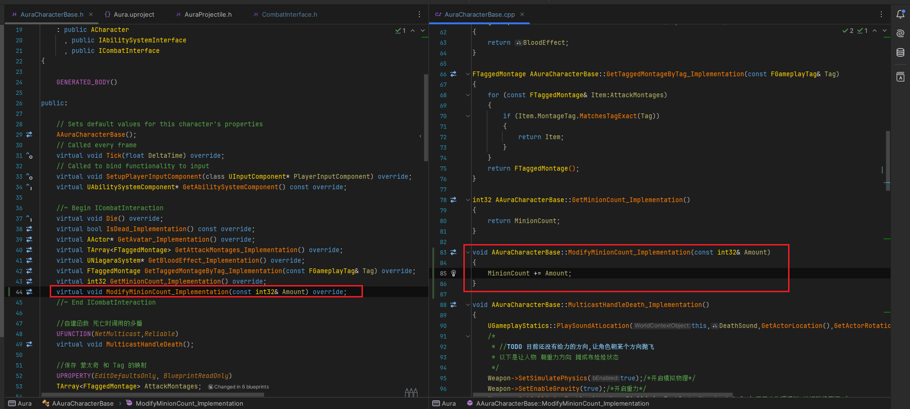
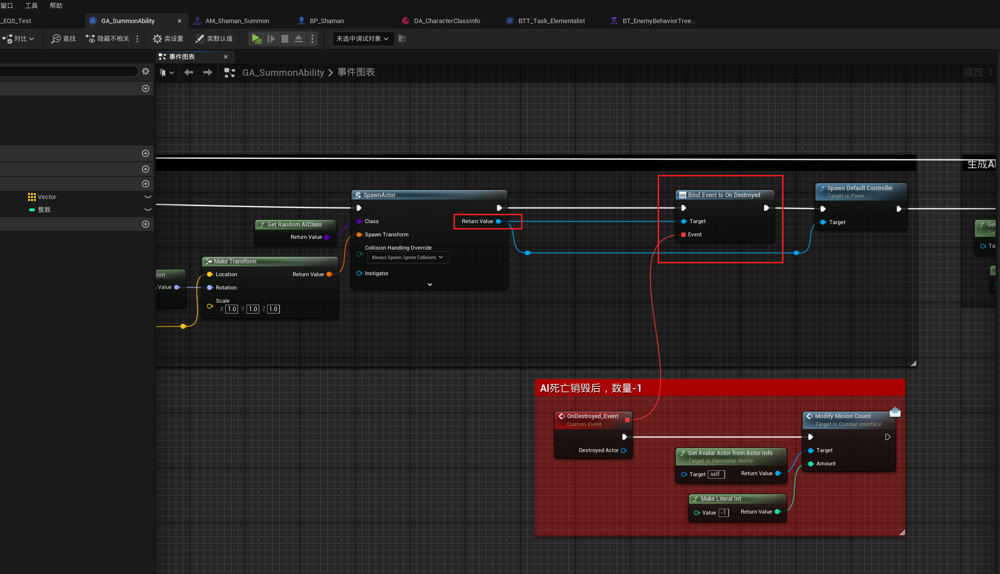

___________________________________________________________________________________________
###### [Go主菜单](../MainMenu.md)
___________________________________________________________________________________________

# GAS 106 为萨满制作召唤技能(6)创建萨满的行为树攻击任务；处理召唤数量阈值；为抛射物增加偏移角

___________________________________________________________________________________________

## 处理关键点

1. 可在对象的实例上绑定 `OnDestroyed` 回调


___________________________________________________________________________________________

# 目录


- [GAS 106 为萨满制作召唤技能(6)创建萨满的行为树攻击任务；处理召唤数量阈值；为抛射物增加偏移角](#gas-106-为萨满制作召唤技能6创建萨满的行为树攻击任务处理召唤数量阈值为抛射物增加偏移角)
  - [处理关键点](#处理关键点)
  - [目录](#目录)
    - [Mermaid整体思路梳理](#mermaid整体思路梳理)
    - [下面我们需要创建 萨满的行为树攻击任务](#下面我们需要创建-萨满的行为树攻击任务)
      - [复制一份 `BTT_Attack` ，命名为***BTT\_Task\_Elementalist***](#复制一份-btt_attack-命名为btt_task_elementalist)
        - [创建萨满技能Tag，并配置，扣开眼睛，命名为，`SummonTag`](#创建萨满技能tag并配置扣开眼睛命名为summontag)
        - [创建用于表示当前需要使用技能的 Tag 标签，命名为，`AbilityTag`](#创建用于表示当前需要使用技能的-tag-标签命名为abilitytag)
        - [创建 int32 变量用于——低于这个数量就会使用召唤技能，命名为 `MinionSpawnThreshold` ，默认值是 2](#创建-int32-变量用于低于这个数量就会使用召唤技能命名为-minionspawnthreshold-默认值是-2)
        - [如果满足召唤条件设置 `AbilityTag = SummonTag`，否则 `AbilityTag = AttackTag`，别忘了修改最后 `激活技能的 Tag`](#如果满足召唤条件设置-abilitytag--summontag否则-abilitytag--attacktag别忘了修改最后-激活技能的-tag)
    - [注意上面处理的是检查生成数量生成的逻辑，但是并没有地方设置角色中的 `MinionCount`](#注意上面处理的是检查生成数量生成的逻辑但是并没有地方设置角色中的-minioncount)
    - [接口中创建函数设置 MinionCount](#接口中创建函数设置-minioncount)
    - [角色基类中重写](#角色基类中重写)
    - [蓝图中生成角色后调用上面创建的函数，数量+1](#蓝图中生成角色后调用上面创建的函数数量1)
    - [行为树中修改，不使用BTT\_Attack了，改成使用上面创建的这个新的](#行为树中修改不使用btt_attack了改成使用上面创建的这个新的)
    - [在这里打印测试](#在这里打印测试)
    - [运行测试](#运行测试)
    - [测试gif](#测试gif)
    - [有一个问题就是，我们没有处理减 `MinionCount` 的逻辑，也就是说，即使打死恶魔，也不会使 `MinionCount` 减1，下一节处理](#有一个问题就是我们没有处理减-minioncount-的逻辑也就是说即使打死恶魔也不会使-minioncount-减1下一节处理)
    - [我们可以在释放技能后，绑定 `OnDestoryed` 委托](#我们可以在释放技能后绑定-ondestoryed-委托)
    - [测试gif，当只剩一名恶魔时，释放召唤技能](#测试gif当只剩一名恶魔时释放召唤技能)
    - [远程恶魔扔石头之前好像说要处理碰撞](#远程恶魔扔石头之前好像说要处理碰撞)
    - [因为抛射物——石头，是有重力的，所以想在生成的时候稍微往上加一些偏移角](#因为抛射物石头是有重力的所以想在生成的时候稍微往上加一些偏移角)
      - [这里我的想法是，直接加上这个偏移角度不就行了 `Pitch += 偏移角度`](#这里我的想法是直接加上这个偏移角度不就行了-pitch--偏移角度)
    - [测试gif](#测试gif-1)
    - [下一节我们将处理，为召唤恶魔出场增加一些简单小效果](#下一节我们将处理为召唤恶魔出场增加一些简单小效果)


___________________________________________________________________________________________

<details>
<summary>视频链接</summary>

[23. Elementalist Attack Task_哔哩哔哩_bilibili](https://www.bilibili.com/video/BV1TH4y1L7NP?p=24&spm_id_from=pageDriver&vd_source=9e1e64122d802b4f7ab37bd325a89e6c)

------

</details>

___________________________________________________________________________________________

### Mermaid整体思路梳理

Mermaid

------

### 下面我们需要创建 萨满的行为树攻击任务


------

#### 复制一份 `BTT_Attack` ，命名为***BTT_Task_Elementalist***


------

##### 创建萨满技能Tag，并配置，扣开眼睛，命名为，`SummonTag`
>


------

##### 创建用于表示当前需要使用技能的 Tag 标签，命名为，`AbilityTag`
>


------

##### 创建 int32 变量用于——低于这个数量就会使用召唤技能，命名为 `MinionSpawnThreshold` ，默认值是 2
>
>


------

##### 如果满足召唤条件设置 `AbilityTag = SummonTag`，否则 `AbilityTag = AttackTag`，别忘了修改最后 `激活技能的 Tag`
>


------

### 注意上面处理的是检查生成数量生成的逻辑，但是并没有地方设置角色中的 `MinionCount`


------

### 接口中创建函数设置 MinionCount

>- 因为是修改数量，增加和减少都会调用这个函数，所以命名为，ModifyMinionCount
>
> - 如果传入1就是增加1
>
> - 如果想减少，传入-1即可
>
>   ```cpp
>   public:
>           
>       UFUNCTION(BlueprintNativeEvent, BlueprintCallable)
>       void ModifyMinionCount(const int32& Amount);
>   ```
>
>


------

### 角色基类中重写
>
>
>```cpp
>public:
>    
>    //~ Begin ICombatInteraction   
>    virtual void ModifyMinionCount_Implementation(const int32& Amount) override;
>    //~ End ICombatInteraction
>
>```
>
>```cpp
>void AAuraCharacterBase::ModifyMinionCount_Implementation(const int32& Amount)
>{
>    MinionCount += Amount;
>}
>```


------

### 蓝图中生成角色后调用上面创建的函数，数量+1
>


------

### 行为树中修改，不使用BTT_Attack了，改成使用上面创建的这个新的

>
>
>- 修改近战的原因是，怕当萨满在Player的影响下万一进入到中间的分支


------

### 在这里打印测试
>
>


------

### 运行测试

>- 有个bug，虽然生成了恶魔，但是位置不对，在(0,0,0)点
>
>  
>
>  ### 这里忘给位置了


------

### 测试gif
>#### 使用一次召唤技能后，就不会召唤了
>
>- #### 因为生成AI后增加了 `MinionCount`
>
>- #### 在使用就会判定失败而走发射火球的逻辑
>
>


------

### 有一个问题就是，我们没有处理减 `MinionCount` 的逻辑，也就是说，即使打死恶魔，也不会使 `MinionCount` 减1，下一节处理


------

### 我们可以在释放技能后，绑定 `OnDestoryed` 委托
>


------

### 测试gif，当只剩一名恶魔时，释放召唤技能
>


------

### 远程恶魔扔石头之前好像说要处理碰撞

>- 参考火球，上来关闭碰撞，`Delay` 后打开
>
>- 将石头的 `SphereCollision` 调小一点，别太大


------

### 因为抛射物——石头，是有重力的，所以想在生成的时候稍微往上加一些偏移角


------

#### 这里我的想法是，直接加上这个偏移角度不就行了 `Pitch += 偏移角度`
>
>
>- #### 当然也可以计算，就涉及到物理和数学了，这里暂时就这样吧
>
>
>
>


------

### 测试gif
>#### 我切换成 `前视图` 看得更明显点
>
>


------

### 下一节我们将处理，为召唤恶魔出场增加一些简单小效果


___________________________________________________________________________________________

[返回最上面](#Go主菜单)

___________________________________________________________________________________________