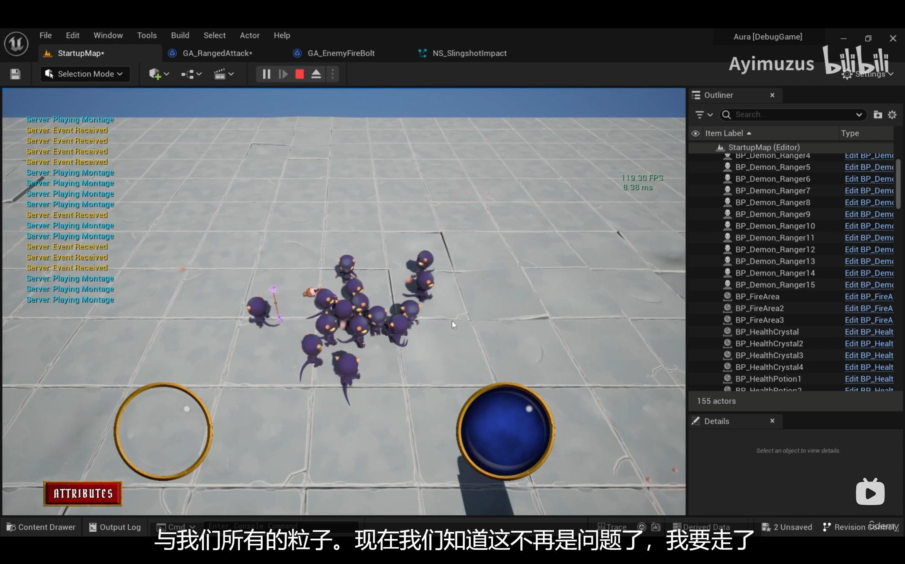

___________________________________________________________________________________________
###### [Go主菜单](../MainMenu.md)
___________________________________________________________________________________________

# GAS 107 为萨满制作召唤技能(7)恶魔出现的过渡效果；修复爆红GetSetByCallerMagnitude参数处理；内存泄漏：1.WaitGameplayEvent多次触发2.NS粒子没有自动销毁

___________________________________________________________________________________________

## 处理关键点

1. NS粒子 开启关闭 自动销毁 选项

2. GetSetByCallerMagnitude 参数 报错 处理

3. 制作廉价的缩放过渡效果

4. `WaitGameplayEvent` 设置只触发一次


___________________________________________________________________________________________

# 目录


- [GAS 107 为萨满制作召唤技能(7)恶魔出现的过渡效果；修复爆红GetSetByCallerMagnitude参数处理；内存泄漏：1.WaitGameplayEvent多次触发2.NS粒子没有自动销毁](#gas-107-为萨满制作召唤技能7恶魔出现的过渡效果修复爆红getsetbycallermagnitude参数处理内存泄漏1waitgameplayevent多次触发2ns粒子没有自动销毁)
  - [处理关键点](#处理关键点)
- [目录](#目录)
    - [Mermaid整体思路梳理](#mermaid整体思路梳理)
    - [现在召唤恶魔，恶魔就会突然出现，有点突兀，希望加一些过渡效果，如果有从地里爬出来的动画就好了，但是没有的话，这里打算用缩放制作一些小效果](#现在召唤恶魔恶魔就会突然出现有点突兀希望加一些过渡效果如果有从地里爬出来的动画就好了但是没有的话这里打算用缩放制作一些小效果)
    - [在恶魔的 `BeginPlay` 时添加 `TimeLine`](#在恶魔的-beginplay-时添加-timeline)
    - [下一节](#下一节)
    - [下面有一些关于开销问题](#下面有一些关于开销问题)
    - [场景中放入8个远程恶魔，开启FPS](#场景中放入8个远程恶魔开启fps)
    - [1.先检查是否产生了过多的发射物](#1先检查是否产生了过多的发射物)
      - [会有报错信息](#会有报错信息)
      - [先不管红色的，删除掉场景中多余的远程恶魔，只留一只](#先不管红色的删除掉场景中多余的远程恶魔只留一只)
      - [运行测试gif](#运行测试gif)
      - [在播放蒙太奇后和收到EventTag后分别打印调试](#在播放蒙太奇后和收到eventtag后分别打印调试)
      - [运行测试gif](#运行测试gif-1)
  - [需要将 WaitGameplayEvent 设置为只触发一次](#需要将-waitgameplayevent-设置为只触发一次)
      - [运行测试gif](#运行测试gif-2)
    - [继续测试 场景中放入8个远程恶魔，开启FPS](#继续测试-场景中放入8个远程恶魔开启fps)
  - [因为NS粒子没有设置自动销毁，而是永远存在](#因为ns粒子没有设置自动销毁而是永远存在)
    - [场景中放入多一些远程恶魔测试](#场景中放入多一些远程恶魔测试)
    - [运行30s，FPS没有变化，说明优化成功](#运行30sfps没有变化说明优化成功)
    - [下面修复另一个问题，文件爆红](#下面修复另一个问题文件爆红)
  - [我们之前在计算伤害时，在for循环内使用了API `GetSetByCallerMagnitude` 但是这个函数底层源码有一个检查是否报错的 bool ，需要关闭，因为如果传入没有的 Tag ，希望返回 0 是我们设计的逻辑的一环](#我们之前在计算伤害时在for循环内使用了api-getsetbycallermagnitude-但是这个函数底层源码有一个检查是否报错的-bool-需要关闭因为如果传入没有的-tag-希望返回-0-是我们设计的逻辑的一环)
      - [`GetSetByCallerMagnitude` 源码](#getsetbycallermagnitude-源码)
      - [修改一下](#修改一下)
    - [移除不用的打印节点](#移除不用的打印节点)
    - [此时运行测试 gif 正常了](#此时运行测试-gif-正常了)
    - [场景中放入三个萨满测试检查FPS gif](#场景中放入三个萨满测试检查fps-gif)
    - [检查所有的NS看是否自动销毁](#检查所有的ns看是否自动销毁)
    - [接下来我们将制作升级系统，升级以后会有技能点，火球技能也能够升级，请看下集](#接下来我们将制作升级系统升级以后会有技能点火球技能也能够升级请看下集)


___________________________________________________________________________________________

<details>
<summary>视频链接</summary>
[25. Adding Juice with Tweening_哔哩哔哩_bilibili](https://www.bilibili.com/video/BV1TH4y1L7NP/?p=26&spm_id_from=pageDriver&vd_source=9e1e64122d802b4f7ab37bd325a89e6c)

[26. Enemies Final Polish_哔哩哔哩_bilibili](https://www.bilibili.com/video/BV1TH4y1L7NP?p=27&vd_source=9e1e64122d802b4f7ab37bd325a89e6c)

------

</details>

___________________________________________________________________________________________

### Mermaid整体思路梳理

Mermaid


------

### 现在召唤恶魔，恶魔就会突然出现，有点突兀，希望加一些过渡效果，如果有从地里爬出来的动画就好了，但是没有的话，这里打算用缩放制作一些小效果


------

### 在恶魔的 `BeginPlay` 时添加 `TimeLine`
>
>

------

### 下一节

------

### 下面有一些关于开销问题


------

### 场景中放入8个远程恶魔，开启FPS
>
>
>- 会发现场景中的FPS随着释放技能一直在下降
>
>
>
>- ## 可以判断这是内存泄漏


------

### 1.先检查是否产生了过多的发射物

>- 代码中加入调试命令，检查一下
>


------

#### 会有报错信息
>
>
>### 这个是我的(可能5.3修复了？)


------

#### 先不管红色的，删除掉场景中多余的远程恶魔，只留一只


------

#### 运行测试gif
>
>
>- 发现叠加似的，越来越多


------

#### 在播放蒙太奇后和收到EventTag后分别打印调试
>
>


------

#### 运行测试gif
>
>
>- 看到多个EventTag


------

## 需要将 WaitGameplayEvent 设置为只触发一次
>


------

#### 运行测试gif
>


------

### 继续测试 场景中放入8个远程恶魔，开启FPS
>
>
>- 还在下降，但是慢一些了
>
>


------

## 因为NS粒子没有设置自动销毁，而是永远存在
>
>
>- 需要修改为在生命周期结束时自动销毁


------

### 场景中放入多一些远程恶魔测试
>


------

### 运行30s，FPS没有变化，说明优化成功

>

------

### 下面修复另一个问题，文件爆红

>- 翻译一下报错的内容：
>
>  ```CPP
>  能力系统日志: 错误: 在 `Default__GE_Damage_C` 上调用了 `FGameplayEffectSpec::GetMagnitude`，用于数据 `Damage.Fire`，但调用者尚未设置幅度。
>  能力系统日志: 错误: 在 `Default__GE_Damage_C` 上调用了 `FGameplayEffectSpec::GetMagnitude`，用于数据 `Damage.Lightning`，但调用者尚未设置幅度。
>  能力系统日志: 错误: 在 `Default__GE_Damage_C` 上调用了 `FGameplayEffectSpec::GetMagnitude`，用于数据 `Damage.Arcane`，但调用者尚未设置幅度。
>  ```
>
>  
>
>


------

## 我们之前在计算伤害时，在for循环内使用了API `GetSetByCallerMagnitude` 但是这个函数底层源码有一个检查是否报错的 bool ，需要关闭，因为如果传入没有的 Tag ，希望返回 0 是我们设计的逻辑的一环
>


------

#### `GetSetByCallerMagnitude` 源码
>


------

#### 修改一下
>


------

### 移除不用的打印节点


------

### 此时运行测试 gif 正常了
>不报错了


------

### 场景中放入三个萨满测试检查FPS gif
>


------

### 检查所有的NS看是否自动销毁
>


------

### 接下来我们将制作升级系统，升级以后会有技能点，火球技能也能够升级，请看下集

___________________________________________________________________________________________

[返回最上面](#Go主菜单)

___________________________________________________________________________________________