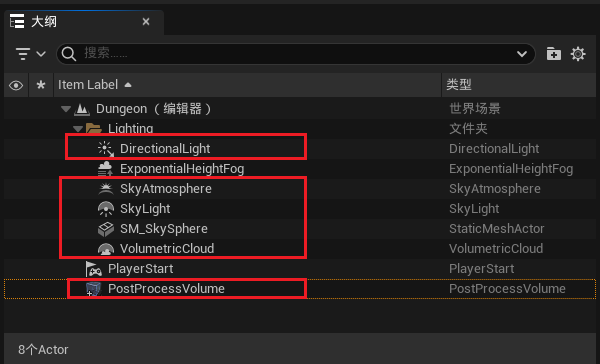
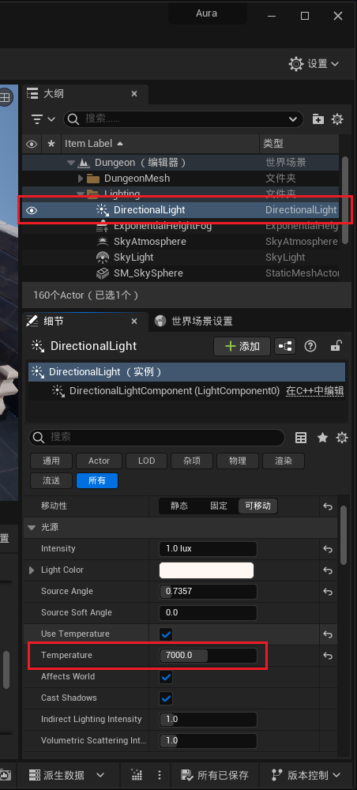
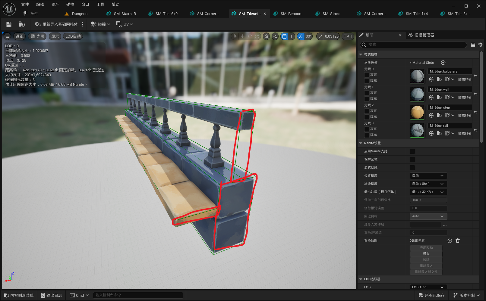

___________________________________________________________________________________________
###### [Go主菜单](../MainMenu.md)
___________________________________________________________________________________________

# GAS 108 搭建新的暗色调关卡，调整PostProcessVolume和场景中照明参数，手动处理简单碰撞

___________________________________________________________________________________________

## 处理关键点

1. `PostProcessVolume` 参数配置
   - 比如想要周围环境很暗，但是场景正常的照明效果
2. 手动处理 `简单碰撞` 

___________________________________________________________________________________________

# 目录

- [GAS 108 搭建新的暗色调关卡，调整PostProcessVolume和场景中照明参数，手动处理简单碰撞](#gas-108-搭建新的暗色调关卡调整postprocessvolume和场景中照明参数手动处理简单碰撞)
  - [处理关键点](#处理关键点)
- [目录](#目录)
    - [Mermaid整体思路梳理](#mermaid整体思路梳理)
    - [因为现有的关卡太亮了，不适合观察一些微弱的粒子效果，比如攻击的光效之类](#因为现有的关卡太亮了不适合观察一些微弱的粒子效果比如攻击的光效之类)
    - [创建一个新的关卡](#创建一个新的关卡)
    - [移除旧格子地板，场景中的格子也希望移除](#移除旧格子地板场景中的格子也希望移除)
    - [场景中添加 `PostProcessVolume`](#场景中添加-postprocessvolume)
    - [场景中的这些，还有 `PostProcessVolume`，都不受到位置的影响，先挪到上面一点的位置，尽可能地离初始位置远一些(因为图标看着比较乱)](#场景中的这些还有-postprocessvolume都不受到位置的影响先挪到上面一点的位置尽可能地离初始位置远一些因为图标看着比较乱)
    - [下面是场景摆放，自己摆放一个自己心仪的场景吧](#下面是场景摆放自己摆放一个自己心仪的场景吧)
      - [可以将一些 `SM` 放到 新的文件夹](#可以将一些-sm-放到-新的文件夹)
  - [下面是介绍](#下面是介绍)
    - [场景中物体重要参数介绍](#场景中物体重要参数介绍)
      - [`DirectionalLight` (定向光源)](#directionallight-定向光源)
        - [`Intensity` 调整整体光源亮度](#intensity-调整整体光源亮度)
        - [`LightColor` 调整整体光颜色](#lightcolor-调整整体光颜色)
        - [`Temperature` 色温](#temperature-色温)
      - [`ExponentialHeightFog` (指数高度雾)](#exponentialheightfog-指数高度雾)
        - [两个参数分别调节，雾的密度和高度](#两个参数分别调节雾的密度和高度)
      - [`SkyLight`](#skylight)
        - [`LightColor`](#lightcolor)
        - [`IntensityScale` 强度等级](#intensityscale-强度等级)
      - [`PostProcessVolume` (后处理体积)](#postprocessvolume-后处理体积)
        - [`EV` 控制曝光的自动调整范围](#ev-控制曝光的自动调整范围)
        - [`Temperature` 色温](#temperature-色温-1)
        - [`Global`](#global)
        - [`FilmGrainIntensity` (胶片颗粒)](#filmgrainintensity-胶片颗粒)
  - [下面是针对项目的参数调整](#下面是针对项目的参数调整)
    - [如果想要将场景整个调暗，然后主体的颜色变亮比如SM](#如果想要将场景整个调暗然后主体的颜色变亮比如sm)
      - [先将 `PostProcessVolume` 中的 `EV` 控制曝光的自动调整范围都改为 0](#先将-postprocessvolume-中的-ev-控制曝光的自动调整范围都改为-0)
      - [再将 `SkyLight` 中的 `IntensityScale` 强度等级调整为 50](#再将-skylight-中的-intensityscale-强度等级调整为-50)
    - [如果角色掉下 `SM` 地面，说明地面没有简单碰撞](#如果角色掉下-sm-地面说明地面没有简单碰撞)
      - [打开地面 `SM` 资产的简单碰撞](#打开地面-sm-资产的简单碰撞)
      - [可以手动为地面 `添加盒体碰撞` ，这里的Add `可以叠加` ，而不是添加一个就会覆盖掉之前的，比如添加三个挨个调整缩放摆放位置](#可以手动为地面-添加盒体碰撞-这里的add-可以叠加-而不是添加一个就会覆盖掉之前的比如添加三个挨个调整缩放摆放位置)
      - [手动添加碰撞之前需要先 `移除旧的碰撞`](#手动添加碰撞之前需要先-移除旧的碰撞)
      - [比如像这种地形，不能简单使用凸包，需要手动多次加入一个简单盒体碰撞，再逐个调整位置](#比如像这种地形不能简单使用凸包需要手动多次加入一个简单盒体碰撞再逐个调整位置)
      - [当然也可以使用复杂碰撞，但是不建议！因为会增大很多很多的开销。](#当然也可以使用复杂碰撞但是不建议因为会增大很多很多的开销)
    - [`PostProcessVolume` 中将 `Temperature` 色温 调整为7500](#postprocessvolume-中将-temperature-色温-调整为7500)
    - [可以调整项目的整体质量效果，如果遇到性能问题可以调整这个](#可以调整项目的整体质量效果如果遇到性能问题可以调整这个)

___________________________________________________________________________________________

视频链接

[1. Level Lighting and Post Process_哔哩哔哩_bilibili](https://www.bilibili.com/video/BV1TH4y1L7NP/?p=28&spm_id_from=pageDriver&vd_source=9e1e64122d802b4f7ab37bd325a89e6c)

------

___________________________________________________________________________________________

### Mermaid整体思路梳理

Mermaid

___________________________________________________________________________________________

### 因为现有的关卡太亮了，不适合观察一些微弱的粒子效果，比如攻击的光效之类

------

### 创建一个新的关卡

>- #### 命名为 `Dungeon`
>
> 

------

### 移除旧格子地板，场景中的格子也希望移除

> 

------

### 场景中添加 `PostProcessVolume`

> 
>
>- #### 范围调整为无限
>
> 
>
>- #### 别忘了给上后处理的材质
>
> 

------

### 场景中的这些，还有 `PostProcessVolume`，都不受到位置的影响，先挪到上面一点的位置，尽可能地离初始位置远一些(因为图标看着比较乱)

> 

------

### 下面是场景摆放，自己摆放一个自己心仪的场景吧

> #### **要求尽可能的摆放一个两层的场景和楼梯**
>
> #### **场景中需要铺上`NavMeshBoundsVolume`**
>
> #### 
>
> ## 修改场景中的碰撞 要求：
>
> - #### 阻挡抛射物通道
>
> - #### 不要影响相机，也就是 `Visibility` 通道
>
> - #### 因为想要火球打上去会有反应，所以需要 开启重叠检测事件
>
> 

------

#### 可以将一些 `SM` 放到 新的文件夹

> 

------

## 下面是介绍

------

### 场景中物体重要参数介绍

------

#### `DirectionalLight` (定向光源)

> 

##### `Intensity` 调整整体光源亮度

> 

------

##### `LightColor` 调整整体光颜色

> 

------

#### `Temperature` 色温

> 

------

#### `ExponentialHeightFog` (指数高度雾)

> 

------

##### 两个参数分别调节，雾的密度和高度

>- #### `Fog Density` 调节雾的密度；
>- #### `Fog Height Falloff` 调节雾的高度
> 

------

#### `SkyLight`

> 

------

##### `LightColor`

> 

------

##### `IntensityScale` 强度等级

>- #### 增大 `Intensity Scale` 会使 `SkyLight` 更亮，增加全局光照的亮度，从而使场景的阴影区域更亮、对比度更低。
>- #### 减小 `Intensity Scale` 则会降低 `SkyLight` 的亮度，使场景的阴影区域更暗，整体对比度增加。
>- #### `Intensity Scale` 的调整不影响天空的颜色，只影响光照的强度。
> 

------

####  `PostProcessVolume` (后处理体积)

------

##### `EV` 控制曝光的自动调整范围

>- `Exposure`  `Min EV100` (最低曝光值 EV100):  
>  - 这个参数定义了自动曝光的最低限制值（EV100）   
>  - EV（曝光值）表示相机曝光的光敏度程度。较低的 EV100 值表示场景会变得更亮，因为相机会尝试在更暗的环境中增加曝光。    
>  - 设置较低的值会导致场景在黑暗中更亮。  
>- `Exposure`  `Max EV100` (最高曝光值 EV100):    
>  - 这个参数定义了自动曝光的最高限制值（EV100）。    
>  - 较高的 EV100 值表示相机会在亮度较高的场景中降低曝光，从而避免过度曝光。    
>  - 设置较高的值会导致场景在非常明亮的情况下更暗。
>
>
>
>- 如果都调整为0，可以限制场景中的自动曝光，变为恒定不变化的照明

------

#####  `Temperature` 色温

>- #### `Temperature` (色温):
>
>  - 颜色温度以开尔文（Kelvin）为单位，从 1700K（非常暖）到 20000K（非常冷）。
>  - 较低的温度值（如 2000K）会使场景呈现暖黄色调，类似于蜡烛光。
>  - 较高的温度值（如 10000K）会使场景呈现冷蓝色调，类似于阴天的日光。
>- #### `Tint` (色调):
>
>  - 微调温度设置
>  - 可以使图像略微偏向绿色或品红色，以获得更精确的颜色控制。
------

#####  `Global`

>- 全局颜色调整

------

##### `FilmGrainIntensity` (胶片颗粒)

> - #### **根据需要酌情调整**
>
> 
>
> 

------

## 下面是针对项目的参数调整

------

### 如果想要将场景整个调暗，然后主体的颜色变亮比如SM

------

#### 先将 `PostProcessVolume` 中的 `EV` 控制曝光的自动调整范围都改为 0

> 

------

#### 再将 `SkyLight` 中的 `IntensityScale` 强度等级调整为 50

> 

------

### 如果角色掉下 `SM` 地面，说明地面没有简单碰撞

> 

------

#### 打开地面 `SM` 资产的简单碰撞

> 

------

#### 可以手动为地面 `添加盒体碰撞` ，这里的Add `可以叠加` ，而不是添加一个就会覆盖掉之前的，比如添加三个挨个调整缩放摆放位置

> 

------

#### 手动添加碰撞之前需要先 `移除旧的碰撞`

> 

------

#### 比如像这种地形，不能简单使用凸包，需要手动多次加入一个简单盒体碰撞，再逐个调整位置

> 

------

#### 当然也可以使用复杂碰撞，但是不建议！因为会增大很多很多的开销。

>- #### 当然在大公司的项目中有美术专门制作比如 `Trigger` 的资产的话也可以使用这个复杂碰撞，视情况而定。自己的项目或者独立游戏的话，建议不要用复杂碰撞，而是使用上面的方法自己手动摆
>
>- #### `Trigger` 只是个名，叫啥都行，反正是 `SM`
>
>- ### **左上角显示这个模型有两千多顶点。。。知道为啥不用了吧**

------

### `PostProcessVolume` 中将 `Temperature` 色温 调整为7500

> 

------

### 可以调整项目的整体质量效果，如果遇到性能问题可以调整这个

> 

___________________________________________________________________________________________

[返回最上面](#Go主菜单)

___________________________________________________________________________________________