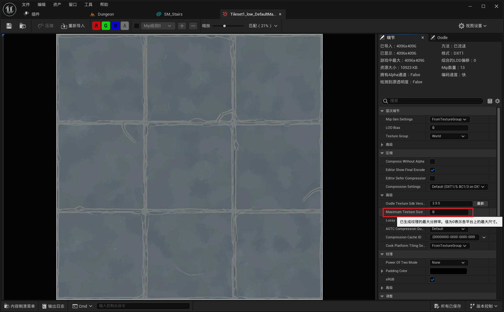
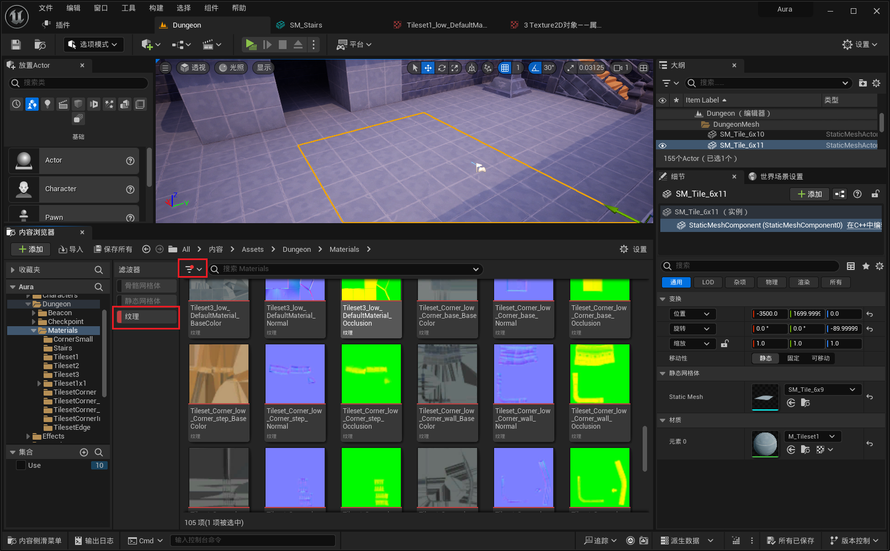

___________________________________________________________________________________________
###### [Go主菜单](../MainMenu.md)
___________________________________________________________________________________________

# GAS 109 处理楼梯碰撞 解决纹理流送池超出的警告

___________________________________________________________________________________________

## 处理关键点

1. 解决纹理流送池超出的警告，两种方法：
   + 缩小贴图尺寸
   + 在 `DefaultEngine.ini` 文件中，修改 `纹理流送池` 大小

___________________________________________________________________________________________

# 目录


- [GAS 109 处理楼梯碰撞 解决纹理流送池超出的警告](#gas-109-处理楼梯碰撞-解决纹理流送池超出的警告)
  - [处理关键点](#处理关键点)
- [目录](#目录)
    - [Mermaid整体思路梳理](#mermaid整体思路梳理)
    - [因为楼梯需要走上去，需要设置 `Visibility` 为 block，为了防止人和楼梯下面穿模，需要在楼梯下面添加简单碰撞的Box](#因为楼梯需要走上去需要设置-visibility-为-block为了防止人和楼梯下面穿模需要在楼梯下面添加简单碰撞的box)
    - [接下来解决纹理流送池超出的警告](#接下来解决纹理流送池超出的警告)
      - [检查纹理资产](#检查纹理资产)
      - [方法一：可以设置贴图纹理资产中的 `MaximumTextureSize`](#方法一可以设置贴图纹理资产中的-maximumtexturesize)
    - [设置启动项目时的Map](#设置启动项目时的map)
      - [方法二：提高纹理池流送大小(需要更高的PC配置)](#方法二提高纹理池流送大小需要更高的pc配置)
        - [在 `DefaultEngine.ini` 文件中配置](#在-defaultengineini-文件中配置)
        - [需要搜索 `rendersetings`有可能找到或者没找到](#需要搜索-rendersetings有可能找到或者没找到)
        - [在源码中搜索 `r.Streaming.PoolSize` 可以了解项目的配置](#在源码中搜索-rstreamingpoolsize-可以了解项目的配置)


___________________________________________________________________________________________

<details>
<summary>视频链接</summary>

[2. Texture Streaming Pool Over Budget_哔哩哔哩_bilibili](https://www.bilibili.com/video/BV1TH4y1L7NP?p=29&vd_source=9e1e64122d802b4f7ab37bd325a89e6c)

------

</details>

___________________________________________________________________________________________

### Mermaid整体思路梳理

Mermaid


___________________________________________________________________________________________

### 因为楼梯需要走上去，需要设置 `Visibility` 为 block，为了防止人和楼梯下面穿模，需要在楼梯下面添加简单碰撞的Box
>


------

### 接下来解决纹理流送池超出的警告
>
>- #### **因为项目中的纹理都非常的大，基本上都是 4k 的**


------

#### 检查纹理资产
>
>- #### **对于俯视角游戏，纹理太大了**


------

#### 方法一：可以设置贴图纹理资产中的 `MaximumTextureSize`

>- #### 如果是1k设置为 `1024`
>- #### 2k设置为 `2048`
>- #### 也可以设置为 `512`
>
>#### 设置之后就会变为
>
>#### 可以批量操作
>
>#### 可以多选材质批量操作
>
>#### 刚设置完如果变糊，不是材质问题的话需要重启引擎
>


------

### 设置启动项目时的Map
>


------

#### 方法二：提高纹理池流送大小(需要更高的PC配置)


------

##### 在 `DefaultEngine.ini` 文件中配置
>


------

##### 需要搜索 `rendersetings`有可能找到或者没找到

>- #### **找到的话** 就在下面添加
>- #### **没找到的话** 就在整个**最下面**添加这几行

```ini
[/Script/Engine.RenderSettings]
r.TextureStreaming=True
r.Streaming.PoolSize=1000
```

>


------

##### 在源码中搜索 `r.Streaming.PoolSize` 可以了解项目的配置

>
___________________________________________________________________________________________

[返回最上面](#Go主菜单)

___________________________________________________________________________________________