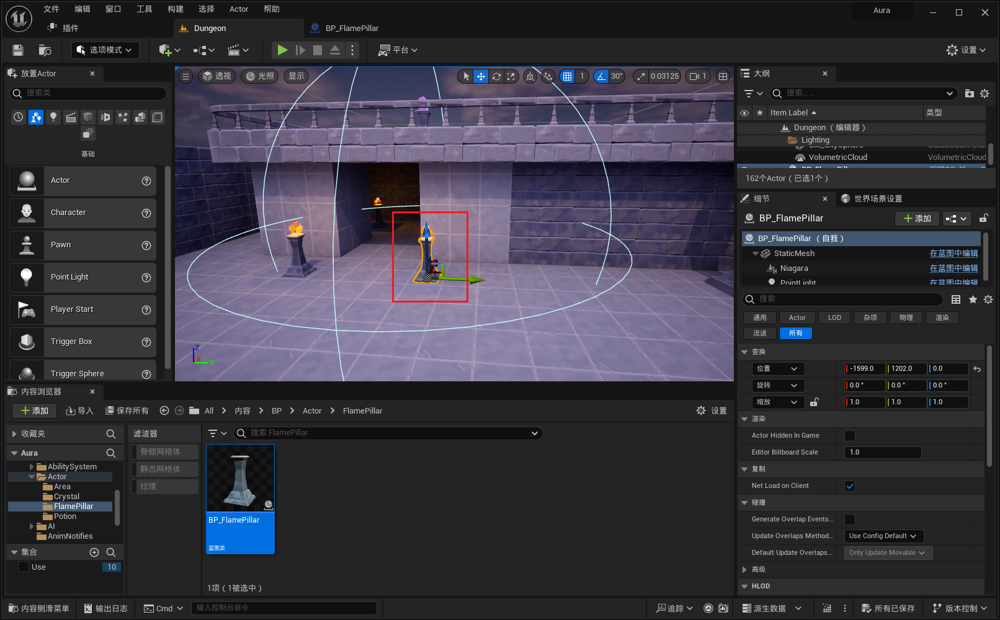

___________________________________________________________________________________________
###### [Go主菜单](../MainMenu.md)
___________________________________________________________________________________________

# GAS 110 将火炬制作成BP，制作忽明忽暗效果

___________________________________________________________________________________________

## 处理关键点

1. 使用TimeLine制作火焰忽明忽暗效果

___________________________________________________________________________________________

# 目录

[TOC]

___________________________________________________________________________________________

视频链接

[3. Flame Pillar Actor_哔哩哔哩_bilibili](https://www.bilibili.com/video/BV1TH4y1L7NP/?p=30&spm_id_from=pageDriver&vd_source=9e1e64122d802b4f7ab37bd325a89e6c)

------

___________________________________________________________________________________________

### Mermaid整体思路梳理

Mermaid

___________________________________________________________________________________________

### 接下来希望把火炬制作成BP

>  - #### 添加一些循环、随机的光线强弱变化
>
>  - #### 因为是地编相关的，所以完全没有必要做成 C++ 的，蓝图即可

------

#### 在路径下，创建 `FlamePillar` 文件夹
>

------

#### 新建Actor，命名为***BP_FlamePillar***，并拖入场景

>- #### 新建 `StaticMesh` 设置为 `Root`，配置 `SM`
>- #### 添加 `NS组件` ，配置火焰
>- #### 添加 `Light组件`，调整色温
>
>   - #### 为了节约开销使用 `固定光源` 即可
>
>
>
>
>

------

#### ***BP_FlamePillar*** 取消勾选 `Start with Tick Enabled` 相当于关闭 `Tick`
>

------

#### 我们将在 `BeginPlay` 时使用 `TimeLine` 来制作火焰的忽明忽暗效果
>

------

##### 在光源组件上使用API：`Set Intensity` 调节光源强弱变化
>- 创建变量记录基础灯光值
>- TimeLine 的 Alpha*基础值
>
>
>
>- 但这样只能变化一次

------

##### 所以将整个逻辑改为事件，在 `TimeLine` `Finish` 时调用事件，即可循环

------

#### 但是现在有个问题是如果场景中有多个火柱，那他们的变化频率是一样的，所以要加入随机

>- #### 解决办法是创建两个 `TimeLine` 和随机的变量，根据随机值执行不同的 `TimeLine`

------

##### 蓝图实现逻辑
>

------

### 此时效果gif
>

------

### 最后设置一下碰撞

>- #### 阻挡抛射物通道
>- #### 不要影响相机和点击，也就是Visibility通道和Camera通道
>- #### 因为想要火球打上去会有反应，所以需要 开启重叠检测事件
>

------

### 可以打到，说明配置成功
>

------

### 下面我遇到一个问题就是当这些设置为block的时候，会有下图这种现象

>
>

>
这里是我的状态和截图

>
>>## 我的地面和柱子的类型都是 `Block` 下图这样
>>
>>
>>
>>## 但是如果我调成 `Overlap` 就正常了
>>
>>
>
>------
>
>

___________________________________________________________________________________________

[返回最上面](#Go主菜单)

___________________________________________________________________________________________