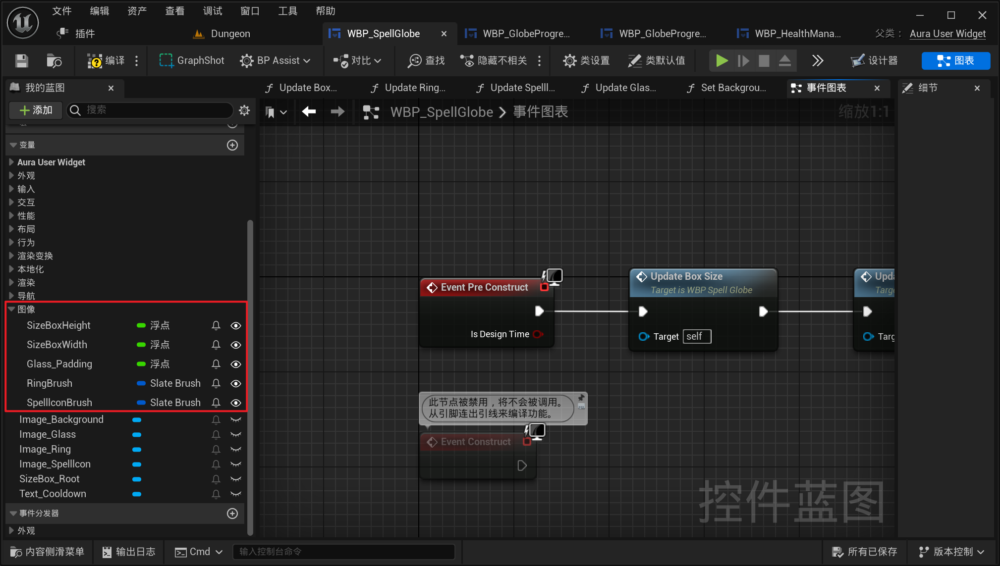

___________________________________________________________________________________________
###### [Go主菜单](../MainMenu.md)
___________________________________________________________________________________________

# GAS 112 制作主界面技能UI

___________________________________________________________________________________________

# 目录

- [GAS 112 制作主界面技能UI](#gas-112-制作主界面技能ui)
- [目录](#目录)
    - [Mermaid整体思路梳理](#mermaid整体思路梳理)
  - [自己制作UI可以跳过](#自己制作ui可以跳过)
    - [接下来我们将逐步制作一个这样的UI](#接下来我们将逐步制作一个这样的ui)
    - [下面是创建这个UI的步骤](#下面是创建这个ui的步骤)
      - [创建 `UI` 继承自 `AuraUserWidget` ，命名为，***WBP\_HealthManaSpells***](#创建-ui-继承自-aurauserwidget-命名为wbp_healthmanaspells)
      - [创建 `SizeBox` 最上层，大小为 `1140` \* `216`](#创建-sizebox-最上层大小为-1140--216)
      - [`HealthBox` `ManaBox` 中放入血条和蓝条，调整为填充](#healthbox-manabox-中放入血条和蓝条调整为填充)
    - [下一节](#下一节)
    - [接下来我们将创建，技能图标的基类](#接下来我们将创建技能图标的基类)
      - [创建文件夹，`SpellGlobes`](#创建文件夹spellglobes)
      - [创建 `UI` 继承自 `AuraUserWidget` ，命名为，***WBP\_SpellGlobe***](#创建-ui-继承自-aurauserwidget-命名为wbp_spellglobe)
      - [创建 `SizeBox` 最上层，大小为 `100` \* `100`，命名为，`SizeBox_Root`](#创建-sizebox-最上层大小为-100--100命名为sizebox_root)
    - [下面需要创建一个技能冷却时的设置函数](#下面需要创建一个技能冷却时的设置函数)
      - [技能CD时，需要显示数字，且技能图标背景变暗，要做成单独函数](#技能cd时需要显示数字且技能图标背景变暗要做成单独函数)
      - [公开属性，可以在上一层配置](#公开属性可以在上一层配置)
      - [创建清空技能图标的函数](#创建清空技能图标的函数)
      - [创建设置技能图标的函数](#创建设置技能图标的函数)
    - [下一节](#下一节-1)
    - [在 ***WBP\_HealthManaSpells*** 中摆上技能图标](#在-wbp_healthmanaspells-中摆上技能图标)
    - [下面想在游戏中使用这个新的面板，而不是只有两个球](#下面想在游戏中使用这个新的面板而不是只有两个球)
    - [在 ***BP\_Overlay*** 中修改逻辑，然后替换新的UI](#在-bp_overlay-中修改逻辑然后替换新的ui)
    - [场景中摆入掉血的火焰，测试掉血效果](#场景中摆入掉血的火焰测试掉血效果)
    - [掉血测试一下gif](#掉血测试一下gif)
    - [下一节，制作经验XP条](#下一节制作经验xp条)
    - [制作经验XP条](#制作经验xp条)
      - [创建 `UI` 继承自 `AuraUserWidget` ，命名为，***WBP\_XPBar***](#创建-ui-继承自-aurauserwidget-命名为wbp_xpbar)
      - [创建 `SizeBox` 最上层，大小为 `880` \* `50`，命名为，`SizeBox_Root`](#创建-sizebox-最上层大小为-880--50命名为sizebox_root)
      - [完成后直接将经验条拖入 ***BP\_Overlay***](#完成后直接将经验条拖入-bp_overlay)
    - [接下来是场景处理，留了一块地方，没有 `NavMesh` 导航，这样AI摆上去也不会动，纯活靶子，方便测试](#接下来是场景处理留了一块地方没有-navmesh-导航这样ai摆上去也不会动纯活靶子方便测试)

___________________________________________________________________________________________

视频链接

[1. Health Mana Spells Widget_哔哩哔哩_bilibili](https://www.bilibili.com/video/BV1TH4y1L7NP?p=33&spm_id_from=pageDriver&vd_source=9e1e64122d802b4f7ab37bd325a89e6c)

[2. Spell Globe_哔哩哔哩_bilibili](https://www.bilibili.com/video/BV1TH4y1L7NP?p=34&spm_id_from=pageDriver&vd_source=9e1e64122d802b4f7ab37bd325a89e6c)

[3. Adding Spell Globes_哔哩哔哩_bilibili](https://www.bilibili.com/video/BV1TH4y1L7NP?p=35&spm_id_from=pageDriver&vd_source=9e1e64122d802b4f7ab37bd325a89e6c)

[4. XP Bar_哔哩哔哩_bilibili](https://www.bilibili.com/video/BV1TH4y1L7NP?p=36&spm_id_from=pageDriver&vd_source=9e1e64122d802b4f7ab37bd325a89e6c)

------

___________________________________________________________________________________________

### Mermaid整体思路梳理

Mermaid

```mermaid
graph TD
    A[创建WBP_HealthManaSpells] --> B[添加SizeBox, 大小1140x216]
    B --> C[HealthBox和ManaBox放入血条和蓝条]

    A1[创建SpellGlobes文件夹] --> B1[创建WBP_SpellGlobe]
    B1 --> C1[添加SizeBox_Root, 大小100x100]
    C1 --> D1[创建UpdateBoxSize函数]
    C1 --> E1[创建UpdateGlassPadding函数]
    C1 --> F1[创建UpdateRingBrush函数]
    C1 --> G1[创建UpdateSpellIconBrush函数]

    D1 --> H1[技能CD设置函数, 数字显示, 图标变暗]
    H1 --> I1[公开属性, 可配置]
    I1 --> J1[创建ClearGlobe函数, BeginPlay时调用]
    J1 --> K1[创建SetIconAndBackground函数]

    L[在WBP_HealthManaSpells中摆放技能图标]
    L --> M[修改BP_Overlay逻辑, 替换新的UI]
    M --> N[场景中测试掉血效果]

    O[创建经验XP条] --> P[创建WBP_XPBar]
    P --> Q[添加SizeBox_Root, 大小880x50]
    Q --> R[添加XPBarBackground和XPBar]
    R --> S[将经验条拖入BP_Overlay]

```

------

## 自己制作UI可以跳过

------

### 接下来我们将逐步制作一个这样的UI
>

------

### 下面是创建这个UI的步骤

------

#### 创建 `UI` 继承自 `AuraUserWidget` ，命名为，***WBP_HealthManaSpells***
>

------

#### 创建 `SizeBox` 最上层，大小为 `1140` * `216`

> #### **文件结构**
>
> #### 
>
> 

------

#### `HealthBox` `ManaBox` 中放入血条和蓝条，调整为填充
>

------

### 下一节

------

### 接下来我们将创建，技能图标的基类

------

#### 创建文件夹，`SpellGlobes`
>

------

#### 创建 `UI` 继承自 `AuraUserWidget` ，命名为，***WBP_SpellGlobe***

------

#### 创建 `SizeBox` 最上层，大小为 `100` * `100`，命名为，`SizeBox_Root`

> 文件结构：
>
> 
>
> - 创建设置SizeBox的函数，命名为 `UpdateBoxSize`
>
>   
>
> - 创建设置Padding函数，命名为 `UpdateGlassPadding`
>
>   
>
> - 创建设置Brush函数，命名为 `UpdateRingBrush`
>
>   
>
> - 创建设置Brush函数，命名为 `UpdateSpelllconBrush`
>
>   
>
> 

------

### 下面需要创建一个技能冷却时的设置函数

------

#### 技能CD时，需要显示数字，且技能图标背景变暗，要做成单独函数
>- 先不用，等后面调用
>
>

------

#### 公开属性，可以在上一层配置
>

------

#### 创建清空技能图标的函数

>   - #### `BeginPlay` 时调用，命名为，`ClearGlobe`
>
>   - #### 清空时的Brush命名为，`TransparentBrush`
>
>     

------

#### 创建设置技能图标的函数
>- #### 函数命名为 `SetlconAndBackground`
>
>

------

### 下一节

------

### 在 ***WBP_HealthManaSpells*** 中摆上技能图标
>

------

### 下面想在游戏中使用这个新的面板，而不是只有两个球

------

### 在 ***BP_Overlay*** 中修改逻辑，然后替换新的UI
>

------

### 场景中摆入掉血的火焰，测试掉血效果

------

### 掉血测试一下gif
>

------

### 下一节，制作经验XP条

------

### 制作经验XP条

------

#### 创建 `UI` 继承自 `AuraUserWidget` ，命名为，***WBP_XPBar***
>

------

#### 创建 `SizeBox` 最上层，大小为 `880` * `50`，命名为，`SizeBox_Root`

> - 拖入 `Image` ，命名为，`XPBarBackground` 放经验条背景
>
> - 拖入 `ProgressBar` ，命名为，`XPBar` 放经验条
>
> - 填充后，通过调整 Padding 来适配大小

------

#### 完成后直接将经验条拖入 ***BP_Overlay*** 
>

------

### 接下来是场景处理，留了一块地方，没有 `NavMesh` 导航，这样AI摆上去也不会动，纯活靶子，方便测试
>
______________________________________________________________________________________

[返回最上面](#Go主菜单)

___________________________________________________________________________________________