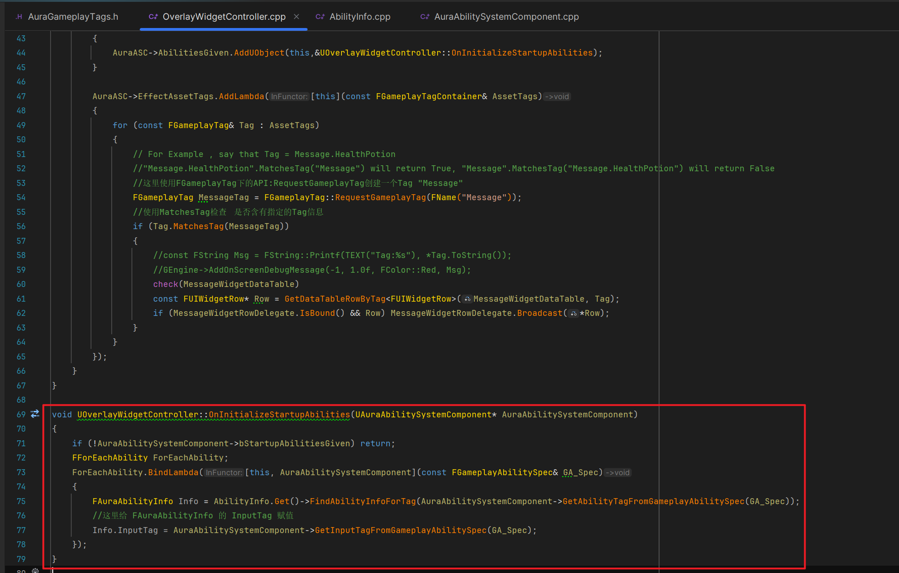
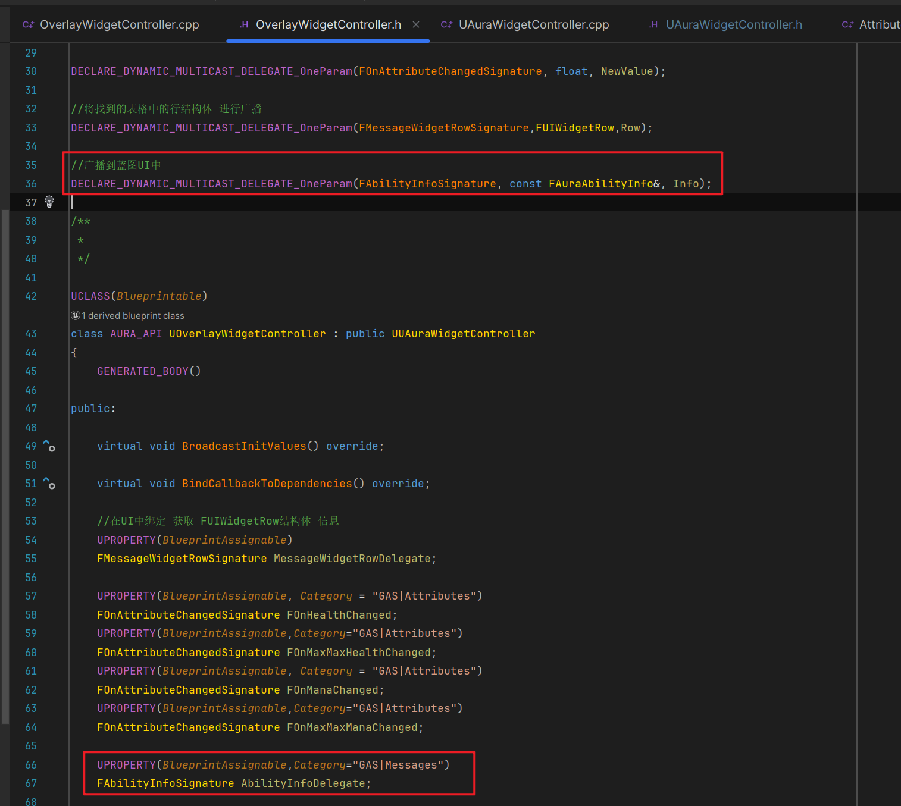

___________________________________________________________________________________________
###### [Go主菜单](../MainMenu.md)
___________________________________________________________________________________________

# GAS 113 创建技能图标MVC的逻辑；函数中创建代理实例绑定lambda回调，另一个类中循环广播代理多次触发lambda回调

___________________________________________________________________________________________

## 处理关键点

1. 我们循环的技能列表中的每个技能，可能随时被停掉或者激活，所以需要先锁定 `技能列表`，等函数执行完毕后再解锁 `技能列表`，需要使用 **`作用域技能列表锁`** `FScopedAbilityListLock` 类型，这是一种安全处理 `技能列表` 中技能的方式

2. `GA` 怎么拿 `技能标签`

3. `GA` 怎么拿 **动态技能标签**  `DynamicAbilityTags` 

4. 架构梳理


___________________________________________________________________________________________

# 目录


- [GAS 113 创建技能图标MVC的逻辑；函数中创建代理实例绑定lambda回调，另一个类中循环广播代理多次触发lambda回调](#gas-113-创建技能图标mvc的逻辑函数中创建代理实例绑定lambda回调另一个类中循环广播代理多次触发lambda回调)
  - [处理关键点](#处理关键点)
- [目录](#目录)
    - [Mermaid整体思路梳理](#mermaid整体思路梳理)
    - [关于技能的面板我们可以参考之前做过的属性面板的信息收发方式，也创建一个 `DataAsset` 用来配置结构体信息](#关于技能的面板我们可以参考之前做过的属性面板的信息收发方式也创建一个-dataasset-用来配置结构体信息)
    - [可以创建一个自定义的类，来管理创建自己的 `UELOG` 类，可以在多个类中使用 `一个类名的UELOG`](#可以创建一个自定义的类来管理创建自己的-uelog-类可以在多个类中使用-一个类名的uelog)
      - [新建文件，命名为，`AuraLogChannels.h`](#新建文件命名为auralogchannelsh)
      - [新建文件，命名为，`AuraLogChannels.cpp`](#新建文件命名为auralogchannelscpp)
    - [创建 `DataAsset` 的C++类](#创建-dataasset-的c类)
    - [先梳理一下，我们需要这个结构体中包含的信息](#先梳理一下我们需要这个结构体中包含的信息)
    - [创建结构体，命名为，`FAuraAbilityInfo`，输入Tag因为实在C++中指定的，所以也想在C++中处理，所以不暴露给蓝图](#创建结构体命名为fauraabilityinfo输入tag因为实在c中指定的所以也想在c中处理所以不暴露给蓝图)
    - [接下来需要创建一个结构体数组用来包含上面的信息](#接下来需要创建一个结构体数组用来包含上面的信息)
    - [需要创建一个根据传入的技能Tag查找结构体并返回的函数，当然，如果没有找到，我希望能输出一条警告](#需要创建一个根据传入的技能tag查找结构体并返回的函数当然如果没有找到我希望能输出一条警告)
    - [接下来需要在 `OverlayWidgetController` 中使用，所以，需要持有这个 `DataAsset` 指针](#接下来需要在-overlaywidgetcontroller-中使用所以需要持有这个-dataasset-指针)
    - [创建技能Tag，需要带有属性攻击的前缀，比如`Abilities.Fire.FireBolt`](#创建技能tag需要带有属性攻击的前缀比如abilitiesfirefirebolt)
    - [蓝图中创建这个数据资产的蓝图类，命名为，`DA_AbilityInfo`，配置参数，并在 `OverlayWidgetController` 蓝图类中配置](#蓝图中创建这个数据资产的蓝图类命名为da_abilityinfo配置参数并在-overlaywidgetcontroller-蓝图类中配置)
    - [这样我们就可以广播该结构体](#这样我们就可以广播该结构体)
    - [下一节](#下一节)
    - [想使用MVC，需要，让 `ASC` 和 `OverlayWidgetController` 之间建立通信，这样每当我们给予  `ASC`  `GA` 时，所给予的能力就可以被广播。](#想使用mvc需要让-asc-和-overlaywidgetcontroller-之间建立通信这样每当我们给予--asc--ga-时所给予的能力就可以被广播)
      - [现在这可以是一个常规的普通委托，因为只在C++中使用](#现在这可以是一个常规的普通委托因为只在c中使用)
        - [在ASC中创建一个多播](#在asc中创建一个多播)
      - [我们之前在 `ASC` 的 `AddCharacterAbilities` 函数中，给予目标 `ASC` 技能，可以在这里广播](#我们之前在-asc-的-addcharacterabilities-函数中给予目标-asc-技能可以在这里广播)
      - [我们之前在 `OverlayWidgetController` 的 `BindCallbacksToDependencies` 函数中，处理了绑定委托，因为有强依赖顺序，所以也需要在这里写绑定委托](#我们之前在-overlaywidgetcontroller-的-bindcallbackstodependencies-函数中处理了绑定委托因为有强依赖顺序所以也需要在这里写绑定委托)
        - [创建回调用的函数，一旦我们知道能力系统已完成所有启动，我们就会调用它](#创建回调用的函数一旦我们知道能力系统已完成所有启动我们就会调用它)
        - [`BindCallbacksToDependencies` 函数中原来的逻辑是这样的，需要修改](#bindcallbackstodependencies-函数中原来的逻辑是这样的需要修改)
    - [现在我们一旦给予GA就会触发回调，但是需要考虑执行的先后顺序，我们假定，先绑定，然后给予技能 `GA` ，然后进行广播。根据服务器与客户端上发生的情况等，它可能会有所不同。可能有两种情况：](#现在我们一旦给予ga就会触发回调但是需要考虑执行的先后顺序我们假定先绑定然后给予技能-ga-然后进行广播根据服务器与客户端上发生的情况等它可能会有所不同可能有两种情况)
      - [所以需要在 `ASC` 上创建 bool 变量标识我们在ASC上广播与否。这样在绑定回调时，判定这个变量就可以处理两种情况了](#所以需要在-asc-上创建-bool-变量标识我们在asc上广播与否这样在绑定回调时判定这个变量就可以处理两种情况了)
    - [另一方面，我们在回调中，需要通过目标的 `ASC` 获取目标的技能信息，所以最好的办法是，修改逻辑，在广播时，传递一个参数](#另一方面我们在回调中需要通过目标的-asc-获取目标的技能信息所以最好的办法是修改逻辑在广播时传递一个参数)
    - [我们目前已经实现了，`MVC` 的 `M` 和 `C` 的通信，还缺和 `V` 的通信方式](#我们目前已经实现了mvc-的-m-和-c-的通信还缺和-v-的通信方式)
    - [回调中需要先处理数据](#回调中需要先处理数据)
      - [如果 ASC 没有广播，我们是直接调用的回调函数，此时的数据肯定不是我们想要的，所以这种情况需要判定返回](#如果-asc-没有广播我们是直接调用的回调函数此时的数据肯定不是我们想要的所以这种情况需要判定返回)
    - [下一节](#下一节-1)
    - [有一个问题现在我们需要在 `MVC` 的 `C` 中，遍历所有的可激活的 `GA` 并发送广播，理论上是可以的，但是有点违反 `封装` 的特性，下面将使用一种模式，并不是说以后的逻辑都要搞得这样复杂，当开拓思路吧。](#有一个问题现在我们需要在-mvc-的-c-中遍历所有的可激活的-ga-并发送广播理论上是可以的但是有点违反-封装-的特性下面将使用一种模式并不是说以后的逻辑都要搞得这样复杂当开拓思路吧)
      - [我们将在 `ASC` 中创建一个广播，传递一个参数 `const FGameplayAbilitySpec&`，命名为 `FForEachAbility`](#我们将在-asc-中创建一个广播传递一个参数-const-fgameplayabilityspec命名为-fforeachability)
      - [在 `ASC` 中创建一个函数，形参需要传递一个委托的 const引用](#在-asc-中创建一个函数形参需要传递一个委托的-const引用)
        - [使用到了API：`ExecuteIfBound`](#使用到了apiexecuteifbound)
      - [还有一个需要注意的问题，就是我们循环的技能列表中的每个技能，可能随时被停掉或者激活，所以需要先锁定 `技能列表`，等函数执行完毕后再解锁 `技能列表`，需要使用 **`作用域技能列表锁`** `FScopedAbilityListLock` 类型，这是一种安全处理 `技能列表` 中技能的方式](#还有一个需要注意的问题就是我们循环的技能列表中的每个技能可能随时被停掉或者激活所以需要先锁定-技能列表等函数执行完毕后再解锁-技能列表需要使用-作用域技能列表锁-fscopedabilitylistlock-类型这是一种安全处理-技能列表-中技能的方式)
      - [回调函数 `OnInitializeStartupAbilities` 中，创建 `FForEachAbility` 代理实例，并为该代理实例绑定 lambda回调](#回调函数-oninitializestartupabilities-中创建-fforeachability-代理实例并为该代理实例绑定-lambda回调)
      - [回调中需要使用数据资产，调用我们之前创建的查找指定技能Tag，返回包含该Tag的结构体函数](#回调中需要使用数据资产调用我们之前创建的查找指定技能tag返回包含该tag的结构体函数)
      - [在 `ASC` 上创建，根据 `FGameplayAbilitySpec` 查找并返回技能Tag的函数](#在-asc-上创建根据-fgameplayabilityspec-查找并返回技能tag的函数)
        - [使用API：`AbilitySpec.Ability.Get()` 拿到 GA ，然后 `GA>AbilityTags` 拿到技能标签 `Contaner`](#使用apiabilityspecabilityget-拿到-ga-然后-gaabilitytags-拿到技能标签-contaner)
        - [使用 `MatchesTag` 检查标签是否匹配](#使用-matchestag-检查标签是否匹配)
        - [这个函数获取参数，返回参数，可以改为 `static` 函数](#这个函数获取参数返回参数可以改为-static-函数)
      - [现在就可以给获取结构体的函数传参了](#现在就可以给获取结构体的函数传参了)
      - [接下来需要获取，GA的输入标签，而输入标签是我们在 `动态能力标签` 中配置的](#接下来需要获取ga的输入标签而输入标签是我们在-动态能力标签-中配置的)
      - [创建一个获取 `单个` 动态能力标签 `DynamicAbilityTags` 的函数](#创建一个获取-单个-动态能力标签-dynamicabilitytags-的函数)
        - [从能力标签规范中可以拿到动态能力标签 `Contaner`](#从能力标签规范中可以拿到动态能力标签-contaner)
        - [然后遍历检查， 使用 `MatchesTag` 检查标签是否匹配](#然后遍历检查-使用-matchestag-检查标签是否匹配)
      - [然后就可以拿到 `InputTag` 了](#然后就可以拿到-inputtag-了)
    - [下面需要处理 `MVC`  `V` 和 `C` 通信的逻辑了](#下面需要处理-mvc--v-和-c-通信的逻辑了)
      - [`OverlayWidgetController` 中创建通信用的动态多播，创建多播对象，蓝图实现](#overlaywidgetcontroller-中创建通信用的动态多播创建多播对象蓝图实现)
      - [回调函数 `OnInitializeStartupAbilities` 中，向蓝图广播 `Info结构体`](#回调函数-oninitializestartupabilities-中向蓝图广播-info结构体)
      - [梳理一下逻辑会发现，所有的逻辑都指向了在ASC中创建的委托 `FForEachAbility` ，在ASC中又创建了循环遍历的函数 `ForEachAbility` ，所以，现在只需要调用 `ForEachAbility` 函数，便可以 多次触发 lambda回调 中的逻辑，从而广播结构体 `Info`](#梳理一下逻辑会发现所有的逻辑都指向了在asc中创建的委托-fforeachability-在asc中又创建了循环遍历的函数-foreachability-所以现在只需要调用-foreachability-函数便可以-多次触发-lambda回调-中的逻辑从而广播结构体-info)


___________________________________________________________________________________________

<details>
<summary>视频链接</summary>

[5. Ability Info Data Asset_哔哩哔哩_bilibili](https://www.bilibili.com/video/BV1TH4y1L7NP?p=37&vd_source=9e1e64122d802b4f7ab37bd325a89e6c)

[6. Initialize Overlay Startup Abilities_哔哩哔哩_bilibili](https://www.bilibili.com/video/BV1TH4y1L7NP?p=38&spm_id_from=pageDriver&vd_source=9e1e64122d802b4f7ab37bd325a89e6c)

[7. For Each Ability Delegate_哔哩哔哩_bilibili](https://www.bilibili.com/video/BV1TH4y1L7NP?p=39&spm_id_from=pageDriver&vd_source=9e1e64122d802b4f7ab37bd325a89e6c)

------

</details>

___________________________________________________________________________________________

### Mermaid整体思路梳理

Mermaid


___________________________________________________________________________________________

### 关于技能的面板我们可以参考之前做过的属性面板的信息收发方式，也创建一个 `DataAsset` 用来配置结构体信息


------

### 可以创建一个自定义的类，来管理创建自己的 `UELOG` 类，可以在多个类中使用 `一个类名的UELOG`


------

#### 新建文件，命名为，`AuraLogChannels.h`

> 必须要加的
>
> -  `#pragma once`
>
> -  `#include"CoreMinimal.h"`
>
> 使用宏 `DECLARE_LOG_CATEGORY_EXTERN(LogAura, Log, All);` 创建自定义Log名
>
> ```cpp
> DECLARE_LOG_CATEGORY_EXTERN(LogAura/*自己的Log名*/, Log, ALL);
> ```
>
> 
>
> 


------

#### 新建文件，命名为，`AuraLogChannels.cpp`

> 需要引用头文件
>
> 使用宏 `DEFINE_LOG_CATEGORY(LogAura)`
>
> ```cpp
> DEFINE_LOG_CATEGORY(LogAura)
> ```
>
> 


------

### 创建 `DataAsset` 的C++类
>- #### 命名为，`AbilityInfo`
>
>


------

### 先梳理一下，我们需要这个结构体中包含的信息

>   - #### 命名为 `FAuraAbilityInfo`
>
>     - #### 一个技能的 `FGameplayTag`
>
>     - #### 一个输入的 `FGameplayTag`
>
>     - #### 一张技能对应的贴图 `UTexture2D`
>
>     - #### 一个对应的材质，技能属性的背景(比如火属性、奥数属性技能背景不同) `UMaterialInterface`
>


------

### 创建结构体，命名为，`FAuraAbilityInfo`，输入Tag因为实在C++中指定的，所以也想在C++中处理，所以不暴露给蓝图
>
>
>```cpp
>USTRUCT(BlueprintType)
>struct FAuraAbilityInfo
>{
>	GENERATED_BODY()
>	
>	FAuraAbilityInfo(): AbilityTag(FGameplayTag()), InputTag(FGameplayTag()), Icon(nullptr), BackgroundMaterial(nullptr)
>	{
>	};
>
>	UPROPERTY(EditDefaultsOnly, BlueprintReadOnly)
>	FGameplayTag AbilityTag;
>	
>	UPROPERTY(BlueprintReadOnly)
>	FGameplayTag InputTag;
>	
>	UPROPERTY(EditDefaultsOnly, BlueprintReadOnly)
>	TObjectPtr<UTexture2D> Icon;
>	
>	UPROPERTY(EditDefaultsOnly, BlueprintReadOnly)
>	TObjectPtr<UMaterialInterface> BackgroundMaterial;
>};
>```


------

### 接下来需要创建一个结构体数组用来包含上面的信息
>```cpp
>public:
>
>    UPROPERTY(EditDefaultsOnly, BlueprintReadOnly, Category = "AbilityInformation")
>    TArray<FAuraAbilityInfo> AbilityInformation;
>
>```
>
>


------

### 需要创建一个根据传入的技能Tag查找结构体并返回的函数，当然，如果没有找到，我希望能输出一条警告

> #### 函数命名参考 `FindAbilityInfoForTag`
>
> ```cpp
> public:
> 
>     FAuraAbilityInfo FindAbilityInfoForTag(const FGameplayTag& AbilityTag, bool bLogNotFound = false);
> 
> ```
>
> ```cpp
> DECLARE_LOG_CATEGORY_EXTERN(LogAura/*自己的Log名*/, Log, All);
> 
> FAuraAbilityInfo UAbilityInfo::FindAbilityInfoForTag(const FGameplayTag& AbilityTag, bool bLogNotFound)
> {
>     if (AbilityTag.IsValid())
>     {
>        for (const FAuraAbilityInfo& Info : AbilityInformation)
>        {
>           if (Info.AbilityTag.MatchesTagExact(AbilityTag))
>           {
>              return Info;
>           }
>        }
>     }
>     if (bLogNotFound)
>     {
>        UE_LOG(LogAura, Error, TEXT("无法找到 AbilityTag [%s] on AttributeInfo [%s]"), *AbilityTag.ToString(), *GetNameSafe(this));
>     }
>     return FAuraAbilityInfo();
> }
> ```
>
> 
>
> 


------

### 接下来需要在 `OverlayWidgetController` 中使用，所以，需要持有这个 `DataAsset` 指针
>```cpp
>protected:
>
>    UPROPERTY(EditDefaultsOnly,BlueprintReadOnly,Category="Widget Data")
>    TObjectPtr<UAbilityInfo> AbilityInfo;
>
>```
>
>


------

### 创建技能Tag，需要带有属性攻击的前缀，比如`Abilities.Fire.FireBolt`
>```cpp
>/*
> * 技能 属性 攻击
> */
>FGameplayTag Abilities_Fire_FireBolt;
>```
>
>```cpp
>GameplayTags.Abilities_Fire_FireBolt = UGameplayTagsManager::Get().AddNativeGameplayTag(
>    FName("Abilities.Fire.FireBolt"),
>    FString("Abilities Fire FireBolt"));
>```
>
>


------

### 蓝图中创建这个数据资产的蓝图类，命名为，`DA_AbilityInfo`，配置参数，并在 `OverlayWidgetController` 蓝图类中配置
>- 


------

### 这样我们就可以广播该结构体


------

### 下一节


------

### 想使用MVC，需要，让 `ASC` 和 `OverlayWidgetController` 之间建立通信，这样每当我们给予  `ASC`  `GA` 时，所给予的能力就可以被广播。


------

#### 现在这可以是一个常规的普通委托，因为只在C++中使用


------

##### 在ASC中创建一个多播
>```cpp
>DECLARE_MULTICAST_DELEGATE(FAbilitiesGiven);/*与OverlayWidgetController建立通信*/
>```
>
>


------

#### 我们之前在 `ASC` 的 `AddCharacterAbilities` 函数中，给予目标 `ASC` 技能，可以在这里广播
>


------

#### 我们之前在 `OverlayWidgetController` 的 `BindCallbacksToDependencies` 函数中，处理了绑定委托，因为有强依赖顺序，所以也需要在这里写绑定委托


------

##### 创建回调用的函数，一旦我们知道能力系统已完成所有启动，我们就会调用它
>- #### 函数命名为，`OnInitializeStartupAbilities`
>
>```CPP
>protected:
>
>    void OnInitializeStartupAbilities();
>```
>
>


------

##### `BindCallbacksToDependencies` 函数中原来的逻辑是这样的，需要修改
>


------

### 现在我们一旦给予GA就会触发回调，但是需要考虑执行的先后顺序，我们假定，先绑定，然后给予技能 `GA` ，然后进行广播。根据服务器与客户端上发生的情况等，它可能会有所不同。可能有两种情况：

> 正常我们设想的情况是：先绑定，然后给予技能 `GA` ，然后进行广播
>
> 第二种情况是：假如上来就给与了技能GA，然后广播，但此时还没有绑定回调，那这一条消息就漏掉了
>
>   - 过程逻辑


------

#### 所以需要在 `ASC` 上创建 bool 变量标识我们在ASC上广播与否。这样在绑定回调时，判定这个变量就可以处理两种情况了
>- #### bool变量命名为，`bStartupAbilitiesGiven`
>
>


------

### 另一方面，我们在回调中，需要通过目标的 `ASC` 获取目标的技能信息，所以最好的办法是，修改逻辑，在广播时，传递一个参数
>```cpp
>DECLARE_MULTICAST_DELEGATE_OneParam(FAbilitiesGiven, UAuraAbilitySystemComponent*);/*与OverlayWidgetController建立通信*/
>```
>
>


------

### 我们目前已经实现了，`MVC` 的 `M` 和 `C` 的通信，还缺和 `V` 的通信方式

> #### **现在我们可以在回调中拿到目标的 `ASC` ，需要拿到技能相关的信息，然后广播到 `UI` 中**


------

### 回调中需要先处理数据


------

#### 如果 ASC 没有广播，我们是直接调用的回调函数，此时的数据肯定不是我们想要的，所以这种情况需要判定返回

>   - 之前设计的逻辑
>
>
>   判定返回
>
>   ```cpp
>   void UOverlayWidgetController::OnInitializeStartupAbilities(UAuraAbilitySystemComponent* AuraAbilitySystemComponent)
>   {
>       if (!AuraAbilitySystemComponent->bStartupAbilitiesGiven) return;
>       
>   }
>   ```
>
>   


------

### 下一节


------

### 有一个问题现在我们需要在 `MVC` 的 `C` 中，遍历所有的可激活的 `GA` 并发送广播，理论上是可以的，但是有点违反 `封装` 的特性，下面将使用一种模式，并不是说以后的逻辑都要搞得这样复杂，当开拓思路吧。

> #### **想在ASC上运行，每一个能力都有一个与之绑定的函数。然后遍历所有能力，并调用绑定到该委托的函数**


------

#### 我们将在 `ASC` 中创建一个广播，传递一个参数 `const FGameplayAbilitySpec&`，命名为 `FForEachAbility` 
>```cpp
>DECLARE_DELEGATE_OneParam(FForEachAbility, const FGameplayAbilitySpec&);/*遍历用广播*/
>```
>
>


------

#### 在 `ASC` 中创建一个函数，形参需要传递一个委托的 const引用
>```cpp
>public:
>
>    void ForEachAbility(const FForEachAbility& Delegate);
>    
>```
>
>


------

##### 使用到了API：`ExecuteIfBound`

> #### **作用是：如果目标身上有绑定的回调，就激活，如果没有就会返回一个 `false`**
>
> ```CPP
> void UAuraAbilitySystemComponent::ForEachAbility(const FForEachAbility& Delegate)
> {
>     for (const FGameplayAbilitySpec& Ability : GetActivatableAbilities())
>     {
>        if (!Delegate.ExecuteIfBound(Ability))
>        {
>           UE_LOG(LogAura,Error,TEXT("没有广播,在函数 [%hs]中"),__FUNCTION__)
>        }
>     }
> }
> ```
>
> 


------

#### 还有一个需要注意的问题，就是我们循环的技能列表中的每个技能，可能随时被停掉或者激活，所以需要先锁定 `技能列表`，等函数执行完毕后再解锁 `技能列表`，需要使用 **`作用域技能列表锁`** `FScopedAbilityListLock` 类型，这是一种安全处理 `技能列表` 中技能的方式

> #### **需要注意：需要传入的不是指针，而是一个引用**
>
> ```cpp
> FScopedAbilityListLock ScopedAbilityListLock(*this);
> ```
>
> #### 


------

#### 回调函数 `OnInitializeStartupAbilities` 中，创建 `FForEachAbility` 代理实例，并为该代理实例绑定 lambda回调

>   - 这样每个技能都会单独的广播，触发多次lambda回调
>
>   - 注意回调的参数


------

#### 回调中需要使用数据资产，调用我们之前创建的查找指定技能Tag，返回包含该Tag的结构体函数

>   - 现在我们需要传入一个**技能标签**，好，现在**技能标签怎么拿？**
>


------

#### 在 `ASC` 上创建，根据 `FGameplayAbilitySpec` 查找并返回技能Tag的函数


------

##### 使用API：`AbilitySpec.Ability.Get()` 拿到 GA ，然后 `GA>AbilityTags` 拿到技能标签 `Contaner`

> #### **因为这里使用的是指针，记得判断空指针**


------

##### 使用 `MatchesTag` 检查标签是否匹配

> [忘了可以看这里](./_GameplayTag_.md)
>
> ```CPP
> public:
> 
>     static FGameplayTag GetAbilityTagFromGameplayAbilitySpec(const FGameplayAbilitySpec& InGA_Spec);
> ```
>
> ```CPP
> FGameplayTag UAuraAbilitySystemComponent::GetAbilityTagFromGameplayAbilitySpec(const FGameplayAbilitySpec& InGA_Spec)
> {
> 	if (InGA_Spec.Ability)
> 	{
> 		for (auto Tag : InGA_Spec.Ability->AbilityTags)
> 		{
> 			if (Tag.MatchesTag(FGameplayTag::RequestGameplayTag(FName("Abilities"))))
> 			{
> 				return Tag;
> 			}
> 		}
> 	}
> 	return FGameplayTag();
> }
> ```
>
> 


------

##### 这个函数获取参数，返回参数，可以改为 `static` 函数


------

#### 现在就可以给获取结构体的函数传参了
>```cpp
>void UOverlayWidgetController::OnInitializeStartupAbilities(UAuraAbilitySystemComponent* AuraAbilitySystemComponent)
>{
>	if (!AuraAbilitySystemComponent->bStartupAbilitiesGiven) return;
>	FForEachAbility ForEachAbility;
>	ForEachAbility.BindLambda([this, AuraAbilitySystemComponent](const FGameplayAbilitySpec& GA_Spec)
>	{
>		AbilityInfo.Get()->FindAbilityInfoForTag(AuraAbilitySystemComponent->GetAbilityTagFromGameplayAbilitySpec(GA_Spec));
>	});
>}
>```
>
>


------

#### 接下来需要获取，GA的输入标签，而输入标签是我们在 `动态能力标签` 中配置的

> 如图所示：我们在 `给予GA` 时，往 `GA` 的 `DynamicAbilityTags` 添加了元素
>
>   - ### **所以我们需要创建一个获取 `单个` 动态能力标签 `DynamicAbilityTags` 的函数**


------

#### 创建一个获取 `单个` 动态能力标签 `DynamicAbilityTags` 的函数
>


------

##### 从能力标签规范中可以拿到动态能力标签 `Contaner`

> ```CPP
> const FGameplayAbilitySpec& AbilitySpec;
> AbilitySpec.DynamicAbilityTags;
> ```


------

##### 然后遍历检查， 使用 `MatchesTag` 检查标签是否匹配

> 之前在这里添加了输入标签
>
> 
>
> ```cpp
> FGameplayTag UAuraAbilitySystemComponent::GetInputTagFromGameplayAbilitySpec(const FGameplayAbilitySpec& InGA_Spec)
> {
>     for (auto Tag : InGA_Spec.DynamicAbilityTags)
>     {
>        if (Tag.MatchesTag(FGameplayTag::RequestGameplayTag(FName("InputTag"))))
>        {
>           return Tag;
>        }
>     }
>     return FGameplayTag();
> }
> ```
>
> 


------

#### 然后就可以拿到 `InputTag` 了
>```cpp
>void UOverlayWidgetController::OnInitializeStartupAbilities(UAuraAbilitySystemComponent* AuraAbilitySystemComponent)
>{
>	if (!AuraAbilitySystemComponent->bStartupAbilitiesGiven) return;
>	FForEachAbility ForEachAbility;
>	ForEachAbility.BindLambda([this, AuraAbilitySystemComponent](const FGameplayAbilitySpec& GA_Spec)
>	{
>		FAuraAbilityInfo Info = AbilityInfo.Get()->FindAbilityInfoForTag(AuraAbilitySystemComponent->GetAbilityTagFromGameplayAbilitySpec(GA_Spec));
>		//这里给 FAuraAbilityInfo 的 InputTag 赋值
>		Info.InputTag = AuraAbilitySystemComponent->GetInputTagFromGameplayAbilitySpec(GA_Spec);
>	});
>}
>```
>
>


------

### 下面需要处理 `MVC`  `V` 和 `C` 通信的逻辑了


------

#### `OverlayWidgetController` 中创建通信用的动态多播，创建多播对象，蓝图实现
>- #### 命名为，`FAbilityInfoSignature`
>
>```cpp
>//广播到蓝图UI中
>DECLARE_DYNAMIC_MULTICAST_DELEGATE_OneParam(FAbilityInfoSignature, const FAuraAbilityInfo&, Info);
>```
>
>


------

#### 回调函数 `OnInitializeStartupAbilities` 中，向蓝图广播 `Info结构体` 
>


------

#### 梳理一下逻辑会发现，所有的逻辑都指向了在ASC中创建的委托 `FForEachAbility` ，在ASC中又创建了循环遍历的函数 `ForEachAbility` ，所以，现在只需要调用 `ForEachAbility` 函数，便可以 多次触发 lambda回调 中的逻辑，从而广播结构体 `Info`
>

------


<details>
<summary>最后放一下源码</summary>

>- #### `OverlayWidgetController.h`
>
>```CPP
>// Copyright belongs to Li Yunlong.
>
>#pragma once
>
>#include "CoreMinimal.h"
>#include "GameplayTagContainer.h"
>#include "UI/Widget/AuraUserWidget.h"
>#include "UI/WidgetController/UAuraWidgetController.h"
>#include "OverlayWidgetController.generated.h"
>
>class UAuraAbilitySystemComponent;
>class UAbilityInfo;
>struct FOnAttributeChangeData;
>
>//创建一个结构体，收到Tag，发送Tag，UI中根据表格中的结构体查找相应信息，读取并调用UI
>USTRUCT(BlueprintType)
>struct FUIWidgetRow :public FTableRowBase
>{
>    GENERATED_BODY()
>
>    UPROPERTY(EditAnywhere,BlueprintReadOnly)
>    FGameplayTag MessageTag = FGameplayTag();
>    UPROPERTY(EditAnywhere,BlueprintReadOnly)
>    FText Message = FText();
>    UPROPERTY(EditAnywhere,BlueprintReadOnly)
>    TSubclassOf<UAuraUserWidget> MessageWidget;
>    UPROPERTY(EditAnywhere,BlueprintReadOnly)
>    UTexture2D* Image = nullptr;
>};
>
>DECLARE_DYNAMIC_MULTICAST_DELEGATE_OneParam(FOnAttributeChangedSignature, float, NewValue);
>
>//将找到的表格中的行结构体 进行广播
>DECLARE_DYNAMIC_MULTICAST_DELEGATE_OneParam(FMessageWidgetRowSignature,FUIWidgetRow,Row);
>
>//广播到蓝图UI中
>DECLARE_DYNAMIC_MULTICAST_DELEGATE_OneParam(FAbilityInfoSignature, const FAuraAbilityInfo&, Info);
>
>/**
> * 
> */
>
>UCLASS(Blueprintable)
>class AURA_API UOverlayWidgetController : public UUAuraWidgetController
>{
>    GENERATED_BODY()
>
>public:
>    
>    virtual void BroadcastInitValues() override;
>
>    virtual void BindCallbackToDependencies() override;
>
>    //在UI中绑定 获取 FUIWidgetRow结构体 信息
>    UPROPERTY(BlueprintAssignable)
>    FMessageWidgetRowSignature MessageWidgetRowDelegate;
>    
>    UPROPERTY(BlueprintAssignable, Category = "GAS|Attributes")
>    FOnAttributeChangedSignature FOnHealthChanged;
>    UPROPERTY(BlueprintAssignable,Category="GAS|Attributes")
>    FOnAttributeChangedSignature FOnMaxMaxHealthChanged;
>    UPROPERTY(BlueprintAssignable, Category = "GAS|Attributes")
>    FOnAttributeChangedSignature FOnManaChanged;
>    UPROPERTY(BlueprintAssignable,Category="GAS|Attributes")
>    FOnAttributeChangedSignature FOnMaxMaxManaChanged;
>    
>    UPROPERTY(BlueprintAssignable,Category="GAS|Messages")
>    FAbilityInfoSignature AbilityInfoDelegate;
>
>protected:
>
>    //模板类 根据传入的表格查找指定行内容并返回
>    template <typename T>
>    T* GetDataTableRowByTag(UDataTable* DataTable,const FGameplayTag& Tag);
>    
>    UPROPERTY(EditDefaultsOnly,BlueprintReadOnly,Category="Widget Data")
>    TObjectPtr<UDataTable> MessageWidgetDataTable;
>    
>    UPROPERTY(EditDefaultsOnly,BlueprintReadOnly,Category="Widget Data")
>    TObjectPtr<UAbilityInfo> AbilityInfo;
>
>    void OnInitializeStartupAbilities(UAuraAbilitySystemComponent* AuraAbilitySystemComponent);
>};
>
>template <typename T>
>T* UOverlayWidgetController::GetDataTableRowByTag(UDataTable* DataTable, const FGameplayTag& Tag)
>{
>    return DataTable->FindRow<T>(Tag.GetTagName(),TEXT(""));
>}
>```
>
>- #### `OverlayWidgetController.CPP`
>
>```CPP
>// Copyright belongs to Li Yunlong.
>
>
>#include "UI/WidgetController/OverlayWidgetController.h"
>
>#include "AbilitySystem/AuraAbilitySystemComponent.h"
>#include "AbilitySystem/AuraAttributeSet.h"
>#include "AbilitySystem/Data/AbilityInfo.h"
>
>void UOverlayWidgetController::BroadcastInitValues()
>{
>    //Super::BroadcastInitValues();
>    
>    //检查是否绑定广播,然后广播
>    if (!FOnHealthChanged.IsBound()) return;
>    if (!FOnMaxMaxHealthChanged.IsBound()) return;
>    if (!FOnManaChanged.IsBound()) return;
>    if (!FOnMaxMaxManaChanged.IsBound()) return;
>    
>    const UAuraAttributeSet* AuraAttributeSet = CastChecked<UAuraAttributeSet>(AttributeSet);
>    FOnHealthChanged.Broadcast(AuraAttributeSet->GetHealth());
>    FOnMaxMaxHealthChanged.Broadcast(AuraAttributeSet->GetMaxHealth());
>    FOnManaChanged.Broadcast(AuraAttributeSet->GetMana());
>    FOnMaxMaxManaChanged.Broadcast(AuraAttributeSet->GetMaxMana());
>}
>
>void UOverlayWidgetController::BindCallbackToDependencies()
>{
>    const UAuraAttributeSet* AuraAttributeSet = CastChecked<UAuraAttributeSet>(AttributeSet);
>    AbilitySystemComponent->GetGameplayAttributeValueChangeDelegate(AuraAttributeSet->GetHealthAttribute()).AddLambda([this](const FOnAttributeChangeData& Data){FOnHealthChanged.Broadcast(Data.NewValue);});
>    AbilitySystemComponent->GetGameplayAttributeValueChangeDelegate(AuraAttributeSet->GetMaxHealthAttribute()).AddLambda([this](const FOnAttributeChangeData& Data){FOnMaxMaxHealthChanged.Broadcast(Data.NewValue);});
>    AbilitySystemComponent->GetGameplayAttributeValueChangeDelegate(AuraAttributeSet->GetManaAttribute()).AddLambda([this](const FOnAttributeChangeData& Data){FOnManaChanged.Broadcast(Data.NewValue);});
>    AbilitySystemComponent->GetGameplayAttributeValueChangeDelegate(AuraAttributeSet->GetMaxManaAttribute()).AddLambda([this](const FOnAttributeChangeData& Data){FOnMaxMaxManaChanged.Broadcast(Data.NewValue);});
>
>    if (UAuraAbilitySystemComponent* AuraASC = Cast<UAuraAbilitySystemComponent>(AbilitySystemComponent))
>    {
>       if (AuraASC->bStartupAbilitiesGiven)
>       {
>          //因为是初始化用的函数,如果已经广播过且没有绑定,那就不用绑定了,直接调用
>          OnInitializeStartupAbilities(AuraASC);
>       }
>       else
>       {
>          AuraASC->AbilitiesGiven.AddUObject(this,&UOverlayWidgetController::OnInitializeStartupAbilities);
>       }
>       
>       AuraASC->EffectAssetTags.AddLambda([this](const FGameplayTagContainer& AssetTags)
>       {
>          for (const FGameplayTag& Tag : AssetTags)
>          {
>             // For Example , say that Tag = Message.HealthPotion
>             //"Message.HealthPotion".MatchesTag("Message") will return True, "Message".MatchesTag("Message.HealthPotion") will return False
>             //这里使用FGameplayTag下的API:RequestGameplayTag创建一个Tag "Message"
>             FGameplayTag MessageTag = FGameplayTag::RequestGameplayTag(FName("Message"));
>             //使用MatchesTag检查   是否含有指定的Tag信息
>             if (Tag.MatchesTag(MessageTag))
>             {
>                //const FString Msg = FString::Printf(TEXT("Tag:%s"), *Tag.ToString());
>                //GEngine->AddOnScreenDebugMessage(-1, 1.0f, FColor::Red, Msg);
>                check(MessageWidgetDataTable)
>                const FUIWidgetRow* Row = GetDataTableRowByTag<FUIWidgetRow>(MessageWidgetDataTable, Tag);
>                if (MessageWidgetRowDelegate.IsBound() && Row) MessageWidgetRowDelegate.Broadcast(*Row);
>             }
>          }
>       });
>    }
>}
>
>void UOverlayWidgetController::OnInitializeStartupAbilities(UAuraAbilitySystemComponent* AuraAbilitySystemComponent)
>{
>    if (!AuraAbilitySystemComponent->bStartupAbilitiesGiven) return;
>    FForEachAbility BroadcastDelegate;
>    BroadcastDelegate.BindLambda([this, AuraAbilitySystemComponent](const FGameplayAbilitySpec& GA_Spec)
>    {
>       FAuraAbilityInfo Info = AbilityInfo.Get()->FindAbilityInfoForTag(AuraAbilitySystemComponent->GetAbilityTagFromGameplayAbilitySpec(GA_Spec));
>       //这里给 FAuraAbilityInfo 的 InputTag 赋值
>       Info.InputTag = AuraAbilitySystemComponent->GetInputTagFromGameplayAbilitySpec(GA_Spec);
>       AbilityInfoDelegate.Broadcast(Info);
>    });
>}
>```
>
>- #### `AuraAbilitySystemComponent.h`
>
>```CPP
>// Copyright belongs to Li Yunlong.
>
>#pragma once
>
>#include "CoreMinimal.h"
>#include "AbilitySystemComponent.h"
>#include "AuraAbilitySystemComponent.generated.h"
>
>class UAuraAbilitySystemComponent;
>
>//在触发GE的回调时,广播收到的FGameplayTagContainer类型数据
>DECLARE_MULTICAST_DELEGATE_OneParam(FEffectAssetTags,const FGameplayTagContainer& /*AssetTags*/);
>DECLARE_MULTICAST_DELEGATE_OneParam(FAbilitiesGiven, UAuraAbilitySystemComponent*);/*与OverlayWidgetController建立通信*/
>DECLARE_DELEGATE_OneParam(FForEachAbility, const FGameplayAbilitySpec&);/*遍历用广播*/
>
>/**
> * 
> */
>UCLASS()
>class AURA_API UAuraAbilitySystemComponent : public UAbilitySystemComponent
>{
>    GENERATED_BODY()
>
>public:
>
>    //当调用这个函数时 说明Info已经被设置好了   所以当外部的ASC需要绑定多播时 调用这个函数
>    void AbilityActorInfoSet();
>    //自建函数 学习传入的 GA类 数组的技能 并激活一次
>    void AddCharacterAbilities(const TArray<TSubclassOf<UGameplayAbility>>& Abilities);
>    //自建函数 按下/松开 时 触发的回调函数
>    void AbilityInputTagHeld(const FGameplayTag& InputTag);
>    void AbilityInputTagReleased(const FGameplayTag& InputTag);
>    
>    FEffectAssetTags EffectAssetTags;
>
>    bool bStartupAbilitiesGiven = false;/*标识 下面的委托 是否广播过*/
>    FAbilitiesGiven AbilitiesGiven;/*与OverlayWidgetController建立通信*/
>
>    void ForEachAbility(const FForEachAbility& Delegate);
>    static FGameplayTag GetAbilityTagFromGameplayAbilitySpec(const FGameplayAbilitySpec& InGA_Spec);
>    static FGameplayTag GetInputTagFromGameplayAbilitySpec(const FGameplayAbilitySpec& InGA_Spec);
>    
>protected:
>
>    //创建 绑定多播0nGameplayEffectAppliedDelegateToSelf 的回调函数
>    //OnGameplayEffectAppliedDelegateToSelf委托只能在Server上调用。 将回调改成RPC Client事件，这样自动在服务器调用，在客户端执行
>    UFUNCTION(Client,Reliable)
>    void Client_EffectApplied(UAbilitySystemComponent* AbilitySystemComponent,const FGameplayEffectSpec& EffectSpec, FActiveGameplayEffectHandle ActiveGameplayEffectHandle);
>};
>```
>
>- #### `AuraAbilitySystemComponent.CPP`
>
>```CPP
>// Copyright belongs to Li Yunlong.
>
>
>#include "AbilitySystem/AuraAbilitySystemComponent.h"
>
>#include "AuraGameplayTags.h"
>#include "AbilitySystem/Abilities/AuraGameplayAbility.h"
>
>DECLARE_LOG_CATEGORY_CLASS(LogAura/*自己的Log名*/, Log, All);
>
>void UAuraAbilitySystemComponent::AbilityActorInfoSet()
>{
>    //此多播在ASC组件基类上 当Self被应用GE时触发 下面的回调
>    //OnGameplayEffectAppliedDelegateToSelf委托只能在Server上调用。 将回调改成RPC Client事件，这样自动在服务器调用，在客户端执行
>    OnGameplayEffectAppliedDelegateToSelf.AddUObject(this,&UAuraAbilitySystemComponent::Client_EffectApplied);
>    
>}
>
>void UAuraAbilitySystemComponent::AddCharacterAbilities(const TArray<TSubclassOf<UGameplayAbility>>& Abilities)
>{
>    for (const TSubclassOf<UGameplayAbility> AbilityClass:Abilities)
>    {
>       //使用配置好的GA Class 构造一个FGameplayAbilitySpec 技能规范
>       FGameplayAbilitySpec GA_Spec = FGameplayAbilitySpec(AbilityClass,1.0f);
>       // 通过技能规范FGameplayAbilitySpec 拿到 GA, Cast成<自建的类型>
>       if (const UAuraGameplayAbility* GA = Cast<UAuraGameplayAbility>(GA_Spec.Ability))
>       {
>          //为技能规范 FGameplayAbilitySpec 添加Tag (自建的GA类型->配置好的Tag)
>          GA_Spec.DynamicAbilityTags.AddTag(GA->StartupInputTag);
>          GiveAbility(GA_Spec);
>       }
>    }
>    bStartupAbilitiesGiven = true;
>    AbilitiesGiven.Broadcast(this);
>}
>
>void UAuraAbilitySystemComponent::AbilityInputTagHeld(const FGameplayTag& InputTag)
>{
>    if (!InputTag.IsValid())return;
>    //调用 ASC组件中的API: GetActivatableAbilities()可以拿到所以可以激活的GA的Spec
>    //GA的Spec 中 有一个动态技能标签 DynamicAbilityTags 若技能激活时 会拥有该 Tag
>    //调用 ASC组件中的API: AbilitySpecInputPressed(AbilitySpec);会 标记技能的输入状态为已按下
>    //使用 ASC组件中的API: TryActivateAbility(AbilitySpec.Handle);尝试激活该技能 若激活技能 会把 AbilitySpec 标记为已激活 IsActive
>    for (FGameplayAbilitySpec AbilitySpec:GetActivatableAbilities())
>    {
>       if (AbilitySpec.DynamicAbilityTags.HasTagExact(InputTag))
>       {
>          //调用AbilitySpecInputPressed(AbilitySpec);会 标记技能的输入状态为已按下
>          AbilitySpecInputPressed(AbilitySpec);
>
>          //若该技能没有被激活
>          if (!AbilitySpec.IsActive())
>          {
>             //使用AbilitySpec.Handle 激活该技能
>             TryActivateAbility(AbilitySpec.Handle);
>          }
>       }
>    }
>}
>
>void UAuraAbilitySystemComponent::AbilityInputTagReleased(const FGameplayTag& InputTag)
>{
>    if (!InputTag.IsValid())return;
>    
>    for (FGameplayAbilitySpec AbilitySpec:GetActivatableAbilities())
>    {
>       if (AbilitySpec.DynamicAbilityTags.HasTagExact(InputTag))
>       {
>          //调用 ASC组件中的API: AbilitySpecInputReleased(AbilitySpec);会 标记技能的输入状态为已松开
>          AbilitySpecInputReleased(AbilitySpec);
>       }
>    }
>}
>
>void UAuraAbilitySystemComponent::ForEachAbility(const FForEachAbility& Delegate)
>{
>    FScopedAbilityListLock ScopedAbilityListLock(*this);
>    for (const FGameplayAbilitySpec& Ability : GetActivatableAbilities())
>    {
>       if (!Delegate.ExecuteIfBound(Ability))
>       {
>          UE_LOG(LogAura,Error,TEXT("没有广播,在函数 [%hs]中"),__FUNCTION__)
>       }
>    }
>}
>
>FGameplayTag UAuraAbilitySystemComponent::GetAbilityTagFromGameplayAbilitySpec(const FGameplayAbilitySpec& InGA_Spec)
>{
>    if (InGA_Spec.Ability)
>    {
>       for (auto Tag : InGA_Spec.Ability->AbilityTags)
>       {
>          if (Tag.MatchesTag(FGameplayTag::RequestGameplayTag(FName("Abilities"))))
>          {
>             return Tag;
>          }
>       }
>    }
>    return FGameplayTag();
>}
>
>FGameplayTag UAuraAbilitySystemComponent::GetInputTagFromGameplayAbilitySpec(const FGameplayAbilitySpec& InGA_Spec)
>{
>    for (auto Tag : InGA_Spec.DynamicAbilityTags)
>    {
>       if (Tag.MatchesTag(FGameplayTag::RequestGameplayTag(FName("InputTag"))))
>       {
>          return Tag;
>       }
>    }
>    return FGameplayTag();
>}
>
>
>//当Self被应用GE时触发
>//OnGameplayEffectAppliedDelegateToSelf委托只能在Server上调用。 将回调改成RPC Client事件，这样自动在服务器调用，在客户端执行
>void UAuraAbilitySystemComponent::Client_EffectApplied_Implementation(UAbilitySystemComponent* AbilitySystemComponent,
>    const FGameplayEffectSpec& EffectSpec, FActiveGameplayEffectHandle ActiveGameplayEffectHandle)
>{
>    FGameplayTagContainer TagContainer;
>    EffectSpec.GetAllAssetTags(TagContainer);
>    
>    //在触发GE的回调时，广播收到的FGameplayTagContainer类型数据
>    if (EffectAssetTags.IsBound())
>    {
>       EffectAssetTags.Broadcast(TagContainer);
>    }
>}
>```

------

</details>

___________________________________________________________________________________________

[返回最上面](#Go主菜单)

___________________________________________________________________________________________