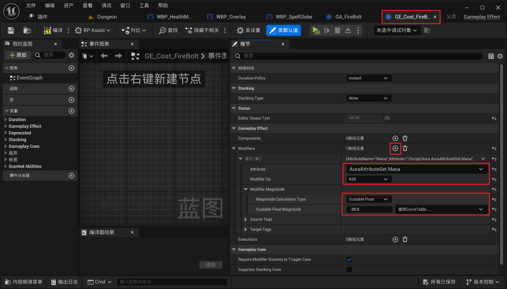
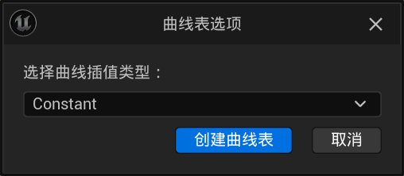

___________________________________________________________________________________________
###### [Go主菜单](../MainMenu.md)
___________________________________________________________________________________________

# GAS 115 使用GameplayAbilityCost制作技能消耗

___________________________________________________________________________________________

## 处理关键点

1. 可以配表


___________________________________________________________________________________________

# 目录


- [GAS 115 使用GameplayAbilityCost制作技能消耗](#gas-115-使用gameplayabilitycost制作技能消耗)
  - [处理关键点](#处理关键点)
- [目录](#目录)
    - [Mermaid整体思路梳理](#mermaid整体思路梳理)
    - [需要在 GA 这里配置技能消耗](#需要在-ga-这里配置技能消耗)
    - [创建GE，命名为，`GE_Cost_FireBolt`](#创建ge命名为ge_cost_firebolt)
    - [可以直接在这使用硬编码，也可以配表](#可以直接在这使用硬编码也可以配表)
    - [我们先使用硬编码，在火球的GE中配置](#我们先使用硬编码在火球的ge中配置)
    - [在GA中需要调用提交技能函数 `CommitAbility` ，才能检查和消耗资源](#在ga中需要调用提交技能函数-commitability-才能检查和消耗资源)
  - [`CommitAbility`属于同时提交了消耗和CD也可以单独调用 `提交消耗` 或 `提交CD`](#commitability属于同时提交了消耗和cd也可以单独调用-提交消耗-或-提交cd)
    - [`提交技能` 的底层源码，其实是使用的GA的 `AbilityLevel`](#提交技能-的底层源码其实是使用的ga的-abilitylevel)
    - [这个节点的效果是，若检查可以释放技能，执行后面的逻辑，返回true，若不成功，这个能力就会被撤销](#这个节点的效果是若检查可以释放技能执行后面的逻辑返回true若不成功这个能力就会被撤销)
    - [技能消耗gif](#技能消耗gif)
    - [接下来创建一个曲线表，配置并使用，命名为，`CT_Cost`，曲线可以命名为，`Fire.FireBolt`](#接下来创建一个曲线表配置并使用命名为ct_cost曲线可以命名为firefirebolt)
    - [我们之前在这里学习技能的时候设置了等级，暂时修改这个为 `5`](#我们之前在这里学习技能的时候设置了等级暂时修改这个为-5)
      - [测试 对比图 gif](#测试-对比图-gif)


___________________________________________________________________________________________

<details>
<summary>视频链接</summary>

[9. Gameplay Ability Cost_哔哩哔哩_bilibili](https://www.bilibili.com/video/BV1TH4y1L7NP?p=41&spm_id_from=pageDriver&vd_source=9e1e64122d802b4f7ab37bd325a89e6c)

------

</details>

___________________________________________________________________________________________

### Mermaid整体思路梳理

Mermaid


___________________________________________________________________________________________

### 需要在 GA 这里配置技能消耗
>

------

### 创建GE，命名为，`GE_Cost_FireBolt`
>

------

### 可以直接在这使用硬编码，也可以配表
>

------

### 我们先使用硬编码，在火球的GE中配置
>

------

### 在GA中需要调用提交技能函数 `CommitAbility` ，才能检查和消耗资源
>

------

## `CommitAbility`属于同时提交了消耗和CD也可以单独调用 `提交消耗` 或 `提交CD`

------

###  `提交技能` 的底层源码，其实是使用的GA的 `AbilityLevel`
>

------

### 这个节点的效果是，若检查可以释放技能，执行后面的逻辑，返回true，若不成功，这个能力就会被撤销
> #### **比如如果无法释放技能，甚至这两个节点都不会被打印，也就是不执行**

------

### 技能消耗gif
>

------

### 接下来创建一个曲线表，配置并使用，命名为，`CT_Cost`，曲线可以命名为，`Fire.FireBolt`
>
>
>我用了别的类型
>
>- #### **记得要配置成 `-1` ，否则就变成增加属性值了**
------

### 我们之前在这里学习技能的时候设置了等级，暂时修改这个为 `5`
>```cpp
>FGameplayAbilitySpec GA_Spec = FGameplayAbilitySpec(AbilityClass,5.0f/*将这里暂时修改为5*/);
>```
>
>

------

#### 测试 对比图 gif
>- ## **1级**
>
>  > 
>
>- ## **5级**
>
>  > 
___________________________________________________________________________________________

[返回最上面](#Go主菜单)

___________________________________________________________________________________________