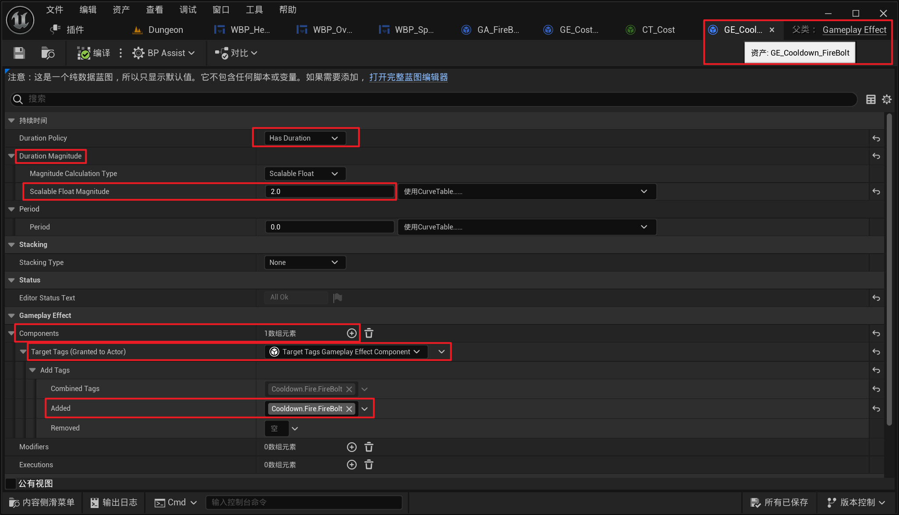

___________________________________________________________________________________________
###### [Go主菜单](../MainMenu.md)
___________________________________________________________________________________________

# GAS 116 使用GameplayAbilityCooldown制作技能CD

___________________________________________________________________________________________

## 处理关键点

1. `PlayMontageAndWait` 异步节点，需要注意一下 `形参` `StopWhenAbilityEnds` 
   - 会在 `EndAbility` 调用时打断蒙太奇

___________________________________________________________________________________________

# 目录


- [GAS 116 使用GameplayAbilityCooldown制作技能CD](#gas-116-使用gameplayabilitycooldown制作技能cd)
  - [处理关键点](#处理关键点)
- [目录](#目录)
    - [Mermaid整体思路梳理](#mermaid整体思路梳理)
    - [当技能CD时需要配置一个技能冷却的Tag标签，需要创建](#当技能cd时需要配置一个技能冷却的tag标签需要创建)
      - [创建技能冷却的Tag标签](#创建技能冷却的tag标签)
    - [创建GE，继承自 `GameplayEffect` 命名为，`GE_Cooldown_FireBolt`](#创建ge继承自-gameplayeffect-命名为ge_cooldown_firebolt)
    - [冷却时间生效需要配置的内容](#冷却时间生效需要配置的内容)
    - [看一下提交冷却的函数 `CommitAbilityCost` 源码](#看一下提交冷却的函数-commitabilitycost-源码)
    - [接下来在 `触发GA后` 直接提交技能，在 GA释放技能应用效果后\` 直接结束技能](#接下来在-触发ga后-直接提交技能在-ga释放技能应用效果后-直接结束技能)
    - [测试gif，此时CD效果已经生效，可以设得长一些，测试明显点](#测试gif此时cd效果已经生效可以设得长一些测试明显点)
    - [但是现在有个问题就是我们释放技能逻辑走到 `EndAbility`后，会立刻结束蒙太奇](#但是现在有个问题就是我们释放技能逻辑走到-endability后会立刻结束蒙太奇)
    - [LS下运行游戏测试gif，发现 `客户端` 无法生成火球，但是会有消耗](#ls下运行游戏测试gif发现-客户端-无法生成火球但是会有消耗)
    - [改为在蒙太奇异步执行完毕后触发](#改为在蒙太奇异步执行完毕后触发)
    - [我们这样就完成了技能CD的逻辑控制，接下来需要制作的是，UI的视觉表现，也就是说，技能CD时，技能需要变灰，需要显示剩余冷却时间，请看下集](#我们这样就完成了技能cd的逻辑控制接下来需要制作的是ui的视觉表现也就是说技能cd时技能需要变灰需要显示剩余冷却时间请看下集)


___________________________________________________________________________________________

<details>
<summary>视频链接</summary>

[10. Gameplay Ability Cooldown_哔哩哔哩_bilibili](https://www.bilibili.com/video/BV1TH4y1L7NP?p=42&spm_id_from=pageDriver&vd_source=9e1e64122d802b4f7ab37bd325a89e6c)

------

</details>

___________________________________________________________________________________________

### Mermaid整体思路梳理

Mermaid

___________________________________________________________________________________________

### 当技能CD时需要配置一个技能冷却的Tag标签，需要创建


------

#### 创建技能冷却的Tag标签
>```CPP
>/*
> * 技能冷却标签
> */
>FGameplayTag Cooldown_Fire_FireBolt;
>```
>
>```CPP
>/*
> * 技能冷却标签
> */
>GameplayTags.Cooldown_Fire_FireBolt = UGameplayTagsManager::Get().AddNativeGameplayTag(
>    FName("Cooldown.Fire.FireBolt"),
>    FString("Cooldown Fire FireBolt"));
>```
>
>


------

### 创建GE，继承自 `GameplayEffect` 命名为，`GE_Cooldown_FireBolt`

> 


------

### 冷却时间生效需要配置的内容

>1. 添加 `冷却用Tag标签`
>   - `技能CD的GE` 需要我们添加一个Tag标签，并且该 `Tag标签` 必须是 `冷却用Tag标签`
>
>
>2. 设为 `Has Duration`
>
>3. 设置 `CD`
>   - 冷却时间也可以使用曲线表格
>4. GA中配置
>
------

### 看一下提交冷却的函数 `CommitAbilityCost` 源码

> ### 
>
>   - 这意味着我们在提交技能时，会把 `GE` 应用在此 `GA` 的 `Owner` 上，因为这个 `GA` 有冷却的 `GE` ，且持续时间内 应用了 `冷却用Tag标签`
>
>   - 所以持续时间内，此 `GA` 的 `Owner` 身上会持有这个技能的 `冷却用Tag标签`，届时我们将无法激活该能力，直到该 `冷却用Tag标签` 被移除
>
> - 配置过程截图
>
>   


------

### 接下来在 `触发GA后` 直接提交技能，在 GA释放技能应用效果后` 直接结束技能
>


------

### 测试gif，此时CD效果已经生效，可以设得长一些，测试明显点
>


------

### 但是现在有个问题就是我们释放技能逻辑走到 `EndAbility`后，会立刻结束蒙太奇

> 可以在这里配置
>
> - 取消勾选这个
>
>   


------

### LS下运行游戏测试gif，发现 `客户端` 无法生成火球，但是会有消耗
>
>
>#### **原因是，我们在 `蒙太奇` 没有播放完成时，结束了技能(也就是说技能结束得太快了，客户端产生火球前就结束了)**
>
>#### 


------

### 改为在蒙太奇异步执行完毕后触发
>


------

### 我们这样就完成了技能CD的逻辑控制，接下来需要制作的是，UI的视觉表现，也就是说，技能CD时，技能需要变灰，需要显示剩余冷却时间，请看下集
___________________________________________________________________________________________

[返回最上面](#Go主菜单)

___________________________________________________________________________________________