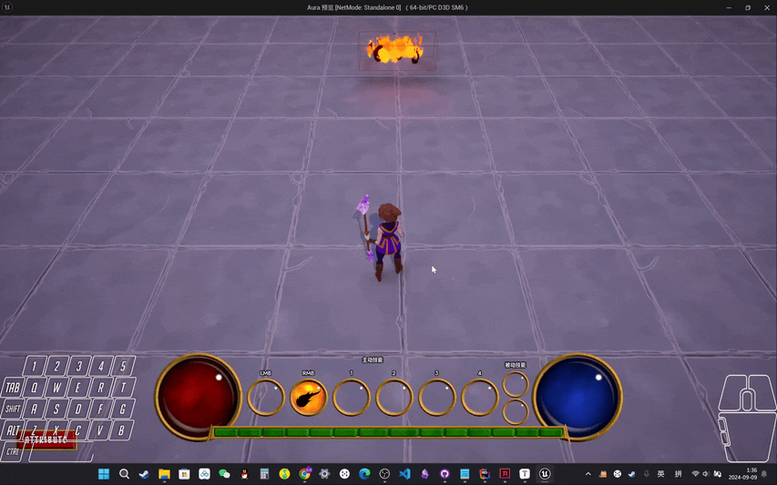

___________________________________________________________________________________________
###### [Go主菜单](../MainMenu.md)
___________________________________________________________________________________________

# GAS 117 使用异步任务 `BlueprintAsyncActionBase` 制作蓝图节点

___________________________________________________________________________________________

## 处理关键点

1. 创建 `异步任务节点` 的步骤
   - [使用异步任务的步骤](#使用异步任务的步骤整理)
2. `监听Tag计数的委托` 
   - `RegisterGameplayTagEvent`
3. `监听添加持续GE的委托`
   - `OnActiveGameplayEffectAddedDelegateToSelf`
4. 使用 `Timer` 处理 `技能CD的逻辑`

___________________________________________________________________________________________

# 目录

- [GAS 117 使用异步任务 `BlueprintAsyncActionBase` 制作蓝图节点](#gas-117-使用异步任务-blueprintasyncactionbase-制作蓝图节点)
  - [处理关键点](#处理关键点)
- [目录](#目录)
    - [Mermaid整体思路梳理](#mermaid整体思路梳理)
    - [现在希望在技能开始时，`触发回调` 的同时还要传递一个 `冷却时间的float值` ；技能结束时，仅 `触发回调`](#现在希望在技能开始时触发回调-的同时还要传递一个-冷却时间的float值-技能结束时仅-触发回调)
  - [使用异步任务的步骤整理：](#使用异步任务的步骤整理)
    - [创建 `BlueprintAsyncActionBase` C++类](#创建-blueprintasyncactionbase-c类)
    - [创建蓝图动态多播，需要广播 `冷却时间` 的 `float`](#创建蓝图动态多播需要广播-冷却时间-的-float)
      - [声明两个动态多播实例](#声明两个动态多播实例)
      - [创建一个 静态 成员函数，返回自身指针，命名为 `WaitForCooldownChange`](#创建一个-静态-成员函数返回自身指针命名为-waitforcooldownchange)
      - [创建一个结束时，销毁异步任务自身的函数](#创建一个结束时销毁异步任务自身的函数)
      - [这个异步任务节点本身也是类，也可以存储一些变量](#这个异步任务节点本身也是类也可以存储一些变量)
      - [在返回自身的静态成员函数 `WaitForCooldownChange` 中，写主要逻辑](#在返回自身的静态成员函数-waitforcooldownchange-中写主要逻辑)
        - [第一步：启动。需要使用 `NewObject<类>();` 构建一个新的局部变量](#第一步启动需要使用-newobject类-构建一个新的局部变量)
        - [使用实参为成员变量赋值](#使用实参为成员变量赋值)
        - [如果 `关键变量` 为空，则调用 创建的销毁函数 `EndTask` 销毁自身并返回 `nullptr`](#如果-关键变量-为空则调用-创建的销毁函数-endtask-销毁自身并返回-nullptr)
        - [监听 `GameplayTag` 变化](#监听-gameplaytag-变化)
        - [绑定监听回调后，返回自身](#绑定监听回调后返回自身)
      - [静态函数中写完绑定回调之后，根据回调的 `新Tag计数` 不同触发不同的蓝图动态广播](#静态函数中写完绑定回调之后根据回调的-新tag计数-不同触发不同的蓝图动态广播)
  - [接下来，有一个注意点，虽然我们监听Tag变化的回调可以帮助我们知道何时开始技能冷却，但是，可能并没有那么准确，可能会有滞后性，但是GE的添加不会有滞后，所以为了监听的准确，在技能开始时需要监听GE的添加，结束时，监听Tag新计数即可](#接下来有一个注意点虽然我们监听tag变化的回调可以帮助我们知道何时开始技能冷却但是可能并没有那么准确可能会有滞后性但是ge的添加不会有滞后所以为了监听的准确在技能开始时需要监听ge的添加结束时监听tag新计数即可)
      - [所以需要在静态函数中也绑定 `添加GE的回调`  `OnActiveGameplayEffectAddedDelegateToSelf`](#所以需要在静态函数中也绑定-添加ge的回调--onactivegameplayeffectaddeddelegatetoself)
        - [创建监听GE的回调函数](#创建监听ge的回调函数)
      - [现在需要在回调函数中拿 `技能冷却的Tag`](#现在需要在回调函数中拿-技能冷却的tag)
        - [检查是否包含冷却标签](#检查是否包含冷却标签)
      - [现在需要拿GE中的冷却时间](#现在需要拿ge中的冷却时间)
        - [要使用需要传入一个 `FGameplayEffectQuery` 类型变量，创建一个局部变量，需要调用静态函数赋值](#要使用需要传入一个-fgameplayeffectquery-类型变量创建一个局部变量需要调用静态函数赋值)
        - [最后将找到的 float 值进行广播](#最后将找到的-float-值进行广播)
      - [当 `EndTask` 被触发时，需要处理的逻辑](#当-endtask-被触发时需要处理的逻辑)
        - [1.若有绑定委托，需要清空并从其委托列表中删除该回调](#1若有绑定委托需要清空并从其委托列表中删除该回调)
        - [2.结束时，需要调用的API](#2结束时需要调用的api)
    - [此时运行即可在蓝图中找到该异步任务节点](#此时运行即可在蓝图中找到该异步任务节点)
    - [现在希望添加一个返回值，就是对异步任务类这个任务的实例的引用，这样就可以处理手动 `EndTask` ，所以需要增加输出引脚返回自身](#现在希望添加一个返回值就是对异步任务类这个任务的实例的引用这样就可以处理手动-endtask-所以需要增加输出引脚返回自身)
    - [如果绑定该异步任务前，变量有效需要执行 `EndTask` 清空数据](#如果绑定该异步任务前变量有效需要执行-endtask-清空数据)
    - [我们之前的结构体中，还需要传递一个 `CooldownTag`](#我们之前的结构体中还需要传递一个-cooldowntag)
    - [我们显示用硬编码，暂时手动给一个](#我们显示用硬编码暂时手动给一个)
      - [先把CD调长一些，再测试](#先把cd调长一些再测试)
    - [此时测试gif](#此时测试gif)
    - [下一节](#下一节)
    - [所以现在所有的技能UI都能触发冷却时间开始和结束的回调，需要在 `结构体` 上传递数据设置UI自身，并判断 `冷却Tag` 匹配](#所以现在所有的技能ui都能触发冷却时间开始和结束的回调需要在-结构体-上传递数据设置ui自身并判断-冷却tag-匹配)
      - [添加一个冷却标签，蓝图中配置](#添加一个冷却标签蓝图中配置)
      - [之前已经判断过标签是否匹配了，现在需要传值](#之前已经判断过标签是否匹配了现在需要传值)
    - [现在因为有依赖关系，所以需要保证在设置好 `冷却标签` 后才执行异步任务节点](#现在因为有依赖关系所以需要保证在设置好-冷却标签-后才执行异步任务节点)
    - [此时打印测试gif](#此时打印测试gif)
    - [下一节](#下一节-1)
    - [接下来我们需要处理，在开始技能CD的时候，内部处理更新显示UI，剩余冷却时间的Text](#接下来我们需要处理在开始技能cd的时候内部处理更新显示ui剩余冷却时间的text)
      - [测试一下gif](#测试一下gif)
    - [接下来使用计时器处理内部逻辑](#接下来使用计时器处理内部逻辑)
    - [此时效果gif](#此时效果gif)


___________________________________________________________________________________________

<details>
<summary>视频链接</summary>

[11. Cooldown Async Task_哔哩哔哩_bilibili](https://www.bilibili.com/video/BV1TH4y1L7NP?p=43&spm_id_from=pageDriver&vd_source=9e1e64122d802b4f7ab37bd325a89e6c)

[12. Cooldown Tags in Ability Info_哔哩哔哩_bilibili](https://www.bilibili.com/video/BV1TH4y1L7NP/?p=44&spm_id_from=pageDriver&vd_source=9e1e64122d802b4f7ab37bd325a89e6c)

[13. Showing Cooldown Time in the HUD_哔哩哔哩_bilibili](https://www.bilibili.com/video/BV1TH4y1L7NP/?p=45&spm_id_from=pageDriver&vd_source=9e1e64122d802b4f7ab37bd325a89e6c)

------

</details>

___________________________________________________________________________________________

### Mermaid整体思路梳理

Mermaid

>- 创建异步任务节点的步骤：
>
>```mermaid
>graph LR
>    A[创建 BlueprintAsyncActionBase C++类] --> B[创建静态函数返回自身的指针]
>    B --> B1[启动: 使用 NewObject]
>    B --> B2[逻辑失败时，调用销毁自身函数]
>    B --> B3[执行完逻辑，返回自身指针]
>    B --> B4[增加输出引脚: 返回实例引用]
>    B4 --> B5[UCLASS中添加宏]
>    
>    A --> C[创建结束时销毁异步任务自身的函数]
>    C --> C1[调用 SetReadyToDestroy]
>    C1 --> C2[完全完成操作后可自由删除, 游戏实例中取消注册]
>    C --> C3[调用 MarkAsGarbage]
>    C3 --> C4[GC中标记为垃圾, 可回收]
>
>    A --> D[创建需要的蓝图动态多播]
>    D --> D1[根据输出引脚数量声明相应的动态多播]
>
>```


___________________________________________________________________________________________

### 现在希望在技能开始时，`触发回调` 的同时还要传递一个 `冷却时间的float值` ；技能结束时，仅 `触发回调`

>   - 之需要传递冷却时间的 float 给UI就行，然后UI内部维护和处理变量，并不用 每Tick 都和 异步节点同步数据
>   - UI中可以使用计时器来制作
>
> 我们之前也制作过**异步任务**，在代码中，输出引脚意味着广播之后的回调
>
> 
>
> #### **比如这个就是个 `异步任务`**
>
> 


------

## 使用异步任务的步骤整理：

> 1. ### **创建 `BlueprintAsyncActionBase` C++类**
>
> 2. #### **需要创建一个静态函数返回自身的指针**
>
>    - 填写需要的形参
>
>    - **第一步**：启动。需要使用 `NewObject<自建的异步类>();` 构建一个新的局部变量
>
>    - **第二步**：当逻辑失败时，需要调用下面的销毁自身的函数
>
>    - **第三步**：当执行完逻辑，记得返回第一步创建的局部变量，也就是自身指针！
>
>    - 如果希望添加一个**返回**值，是 **对异步任务类这个任务的实例 的引用**，也就是 `增加输出引脚`  `返回实例的引用`
>      - 需要在类的宏 `UClass` 中添加宏
>      
>        ```cpp
>        UCLASS(BlueprintType, meta = (ExposedAsyncProxy = AsyncTask))
>        ```
>
> 3. #### **创建一个结束时，销毁异步任务自身的函数**
>
>    - 结束时，需要调用的 **API**
>
>      - #### `SetReadyToDestroy();`
>
>        - 源码备注为 “当操作完全完成时调用，这使得该动作可以自由**删除**，我们将在游戏实例中**取消注册**它”
>
>      - #### `MarkAsGarbage();`
>
>        - 在**GC中标记为垃圾，可以回收**
>
> 4. #### **创建需要的蓝图动态多播**
>
>    - 有几个**输出引脚**就声明几个**动态多播**
>
> 


------

### 创建 `BlueprintAsyncActionBase` C++类
>- #### 命名为，`WaitCooldownChange`
>
>


------

### 创建蓝图动态多播，需要广播 `冷却时间` 的 `float`
>- #### 命名为，`FCooldownChangeSignature`
>
>```cpp
>DECLARE_DYNAMIC_MULTICAST_DELEGATE_OneParam(FCooldownChangeSignature, float, TimeRemaining);
>```
>
>


------

#### 声明两个动态多播实例

>   - #### `CooldownStart`
>
>   - #### `CooldownEnd`
>
>   ```cpp
>   public:
>   
>       UPROPERTY(BlueprintAssignable)
>       FCooldownChangeSignature CooldownStart;
>       
>       UPROPERTY(BlueprintAssignable)
>       FCooldownChangeSignature CooldownEnd;
>   
>   ```
>
>   
>
>   - #### **现在一旦我们广播，输出引脚将会被执行**


------

#### 创建一个 静态 成员函数，返回自身指针，命名为 `WaitForCooldownChange`

> 需要两个参数，用来监听该Tag的变化
>
> - ASC组件
>
> - 技能冷却触发的 `GameplayTag`
>
> 需要使用反射宏 
>
> ```cpp
> UFUNCTION(BlueprintCallable, meta =(BlueprintInternalUseOnly = "true"))
> ```
>
> ```cpp
> public:
> 
>     UFUNCTION(BlueprintCallable, meta = (BlueprintInternalUseOnly = true))
>     static UWaitCooldownChange* WaitForCooldownChange(UAuraAbilitySystemComponent* AuraAbilitySystemComponent, const FGameplayTag& CooldownTag);
>     
> ```
>
> 


------

#### 创建一个结束时，销毁异步任务自身的函数
>```cpp
>public:
>
>    UFUNCTION(BlueprintCallable)
>    void EndTask();
>    
>```
>
>


------

#### 这个异步任务节点本身也是类，也可以存储一些变量

>   - 创建两个Protected变量，内部保存 `ASC组件` 和 `GameplayTag`
>
>     ```cpp
>     protected:
>                           
>         UPROPERTY()
>         TObjectPtr<UAuraAbilitySystemComponent> AuraAbilitySystemComponent;
>                           
>         FGameplayTag CooldownTag;
>                               
>     ```
>     
>     


------

#### 在返回自身的静态成员函数 `WaitForCooldownChange` 中，写主要逻辑


------

##### 第一步：启动。需要使用 `NewObject<类>();` 构建一个新的局部变量
>```cpp
>UWaitCooldownChange* WaitCooldownChange = NewObject<UWaitCooldownChange>();
>```
>
>


------

##### 使用实参为成员变量赋值
>```cpp
>WaitCooldownChange->AuraAbilitySystemComponent = InAuraAbilitySystemComponent;
>WaitCooldownChange->CooldownTag = InCooldownTag;
>```
>
>


------

##### 如果 `关键变量` 为空，则调用 创建的销毁函数 `EndTask` 销毁自身并返回 `nullptr`
>```cpp
>UWaitCooldownChange* UWaitCooldownChange::WaitForCooldownChange(UAuraAbilitySystemComponent* InAuraAbilitySystemComponent,
>                                                                const FGameplayTag& InCooldownTag)
>{
>    UWaitCooldownChange* WaitCooldownChange = NewObject<UWaitCooldownChange>();
>    
>    WaitCooldownChange->AuraAbilitySystemComponent = InAuraAbilitySystemComponent;
>    WaitCooldownChange->CooldownTag = InCooldownTag;
>    if (!IsValid(WaitCooldownChange->AuraAbilitySystemComponent) || !WaitCooldownChange->CooldownTag.IsValid() )
>    {
>       WaitCooldownChange->EndTask();
>       return nullptr;
>    }
>
>    return WaitCooldownChange;
>}
>```
>
>


------

##### 监听 `GameplayTag` 变化

>   - #### 使用API：
>
>     ```cpp
>     AbilitySystemComponent->RegisterGameplayTagEvent
>     ```
>
>   - #### 创建回调函数，命名为，`CooldownTagChanged`
>
>   - #### 需要注意的是，在绑定回调时，不可以在静态函数内使用 `this` ！！！
>
>   ```cpp
>   protected:
>       void CooldownTagChanged(FGameplayTag CooldownTag, int32 NewCount);
>   ```
>
>   
>
>   ```cpp
>   UWaitCooldownChange* UWaitCooldownChange::WaitForCooldownChange(UAuraAbilitySystemComponent* InAuraAbilitySystemComponent,
>                                                                   const FGameplayTag& InCooldownTag)
>   {
>       UWaitCooldownChange* WaitCooldownChange = NewObject<UWaitCooldownChange>();
>       
>       WaitCooldownChange->AuraAbilitySystemComponent = InAuraAbilitySystemComponent;
>       WaitCooldownChange->CooldownTag = InCooldownTag;
>       if (!IsValid(WaitCooldownChange->AuraAbilitySystemComponent) || !WaitCooldownChange->CooldownTag.IsValid() )
>       {
>          WaitCooldownChange->EndTask();
>          return nullptr;
>       }
>       //在这里绑定监听GameplayTag变化回调
>       InAuraAbilitySystemComponent->RegisterGameplayTagEvent(InCooldownTag,EGameplayTagEventType::NewOrRemoved).AddUObject(WaitCooldownChange,&UWaitCooldownChange::CooldownTagChanged);
>       return WaitCooldownChange;
>   }
>   
>   void UWaitCooldownChange::EndTask()
>   {
>   }
>   
>   void UWaitCooldownChange::CooldownTagChanged(FGameplayTag CooldownTag, int32 NewCount)
>   {
>       
>   }
>   ```


------

##### 绑定监听回调后，返回自身
>
>
>```cpp
>UWaitCooldownChange* UWaitCooldownChange::WaitForCooldownChange(UAuraAbilitySystemComponent* InAuraAbilitySystemComponent,
>                                                                const FGameplayTag& InCooldownTag)
>{
>    UWaitCooldownChange* WaitCooldownChange = NewObject<UWaitCooldownChange>();
>    
>    WaitCooldownChange->AuraAbilitySystemComponent = InAuraAbilitySystemComponent;
>    WaitCooldownChange->CooldownTag = InCooldownTag;
>    if (!IsValid(WaitCooldownChange->AuraAbilitySystemComponent) || !WaitCooldownChange->CooldownTag.IsValid() )
>    {
>       WaitCooldownChange->EndTask();
>       return nullptr;
>    }
>    //在这里绑定监听GameplayTag变化回调
>    InAuraAbilitySystemComponent->RegisterGameplayTagEvent(InCooldownTag,EGameplayTagEventType::NewOrRemoved).AddUObject(WaitCooldownChange,&UWaitCooldownChange::CooldownTagChanged);
>    //绑定监听后返回自身
>    return WaitCooldownChange;
>}
>```


------

#### 静态函数中写完绑定回调之后，根据回调的 `新Tag计数` 不同触发不同的蓝图动态广播

> ```cpp
> void UWaitCooldownChange::CooldownTagChanged(FGameplayTag InCooldownTag, int32 NewCount)
> {
>     if (NewCount == 0)
>     {
>        CooldownEnd.Broadcast(0.f);
>     }
> }
> ```
>
> 


------

## 接下来，有一个注意点，虽然我们监听Tag变化的回调可以帮助我们知道何时开始技能冷却，但是，可能并没有那么准确，可能会有滞后性，但是GE的添加不会有滞后，所以为了监听的准确，在技能开始时需要监听GE的添加，结束时，监听Tag新计数即可

> 因为 `OnActiveGameplayEffectAddedDelegateToSelf` 直接监听到 `Gameplay Effect (GE)` 的 `添加事件` ，比通过标签变化回调的触发更及时和直接。
>
>   - 为什么需要绑定 `OnActiveGameplayEffectAddedDelegateToSelf`
>
>     - GE 添加的及时性:
>       - 通过 OnActiveGameplayEffectAddedDelegateToSelf，你可以立即知道冷却 GE 何时被应用到 AbilitySystemComponent 上。这是最直接的方式来捕捉冷却开始的事件。
>
>     - 冷却标签的延迟:
>
>       - 虽然冷却 GE 会在应用时添加冷却标签，但标签的变化事件有时会稍有延迟，或者在标签的变化逻辑上受到其他条件的影响。
>
>       - 通过监听 GE 的添加，可以确保回调在冷却开始时立即响应，而不仅仅依赖于标签的增加。
>
>
> 查看 `ASC源码` ，源码备注为：`每当添加基于持续时间的 GE 时都会调用客户端和服务器`


------

#### 所以需要在静态函数中也绑定 `添加GE的回调`  `OnActiveGameplayEffectAddedDelegateToSelf`


------

##### 创建监听GE的回调函数

>   - #### 命名为 `OnActiveEffectAdded`
>   - #### 需要三个参数
>
>   创建回调
>
>   ```cpp
>   protected:
>   
>       void OnActiveEffectAdded(UAbilitySystemComponent* AbilitySystemComponent, const FGameplayEffectSpec& GameplayEffectSpec, FActiveGameplayEffectHandle ActiveGameplayEffectHandle);
>       
>   ```
>
>   绑定回调
>
>   ```cpp
>   InAuraAbilitySystemComponent->OnActiveGameplayEffectAddedDelegateToSelf.AddUObject(WaitCooldownChange, &UWaitCooldownChange::OnActiveEffectAdded);
>   ```


------

#### 现在需要在回调函数中拿 `技能冷却的Tag`

> #### 使用API：拿到GE身上的Tag
>
> 
>
> ```CPP
> SpecApplied/*FGameplayEffectSpec*/.GetAllAssetTags(AssetTags/*FGameplayTagContainer*/);
> SpecApplied/*FGameplayEffectSpec*/.GetAllGrantedTags(GrantedTags/*另一个FGameplayTagContainer*/);
> ```


------

##### 检查是否包含冷却标签

> #### **使用API：`HasTagExact` ，检查 `FGameplayTagContainer` 中是否含有指定标签**
>
> ```cpp
> void UWaitCooldownChange::OnActiveEffectAdded(UAbilitySystemComponent* AbilitySystemComponent,
>     const FGameplayEffectSpec& GameplayEffectSpec, FActiveGameplayEffectHandle ActiveGameplayEffectHandle)
> {
>     FGameplayTagContainer AssetContainer;
>     GameplayEffectSpec.GetAllAssetTags(AssetContainer);
>     FGameplayTagContainer GrantedContainer;
>     GameplayEffectSpec.GetAllGrantedTags(GrantedContainer);
>     if (AssetContainer.HasTagExact(CooldownTag) || GrantedContainer.HasTagExact(CooldownTag))
>     {
>        
>     }
> }
> ```
>
> #### 


------

#### 现在需要拿GE中的冷却时间

> #### 使用API：
>
> ```cpp
> ASC->GetActiveEffectsTimeRemaining
> ```


------

##### 要使用需要传入一个 `FGameplayEffectQuery` 类型变量，创建一个局部变量，需要调用静态函数赋值

> 
>
> #### **使用API：**
>
> ```cpp 
> FGameplayEffectQuery::MakeQuery_MatchAnyOwningTags
> ```
>
> 需要传入一个 `FGameplayTagContainer`
>
> 
>
> - 使用API：
>
>   ```cpp
>   单个Tag.GetSingleTagContainer();
>   ```
>
>   
>
> **获取与此特定冷却标签匹配的任何效果**
>
> | FGameplayEffectQuery 构造用静态函数 | 作用                                           |
> | ----------------------------------- | ---------------------------------------------- |
> | MakeQuery_MatchAnyOwningTags        | 匹配包含任意一个指定拥有标签的效果实例。       |
> | MakeQuery_MatchAllOwningTags        | 匹配包含所有指定拥有标签的效果实例。           |
> | MakeQuery_MatchNoOwningTags         | 匹配不包含任何指定拥有标签的效果实例。         |
> | MakeQuery_MatchAnyEffectTags        | 匹配包含任意一个指定效果标签的效果实例。       |
> | MakeQuery_MatchAllEffectTags        | 匹配包含所有指定效果标签的效果实例。           |
> | MakeQuery_MatchNoEffectTags         | 匹配不包含任何指定效果标签的效果实例。         |
> | MakeQuery_MatchAnySourceSpecTags    | 匹配来源说明中包含任意一个指定标签的效果实例。 |
> | MakeQuery_MatchAllSourceSpecTags    | 匹配来源说明中包含所有指定标签的效果实例。     |
> | MakeQuery_MatchNoSourceSpecTags     | 匹配来源说明中不包含任何指定标签的效果实例。   |
>
>
> 
>
> - 这个函数会返回一个 `TArray<float>` 包含所有含有 该Tag 的冷却时间
>
>   
>   
>   - 按道理说第一个就是
>   
>     ```cpp
>     const FGameplayEffectQuery GameplayEffectQuery = FGameplayEffectQuery::MakeQuery_MatchAnyOwningTags(CooldownTag.GetSingleTagContainer());
>     const TArray<float> TimesRemaining = AbilitySystemComponent->GetActiveEffectsTimeRemaining(GameplayEffectQuery);
>     float InTimeRemaining = 0.f;
>     if (TimesRemaining.Num() > 0)
>     {
>         InTimeRemaining = TimesRemaining[0];
>     }
>     ```
>   
>     
>   
>   - 但如果觉得不保准，可以遍历一下，找到最大的float，这个float就是
>   
>     ```cpp
>     const FGameplayEffectQuery GameplayEffectQuery = FGameplayEffectQuery::MakeQuery_MatchAnyOwningTags(CooldownTag.GetSingleTagContainer());
>     const TArray<float> TimesRemaining = AbilitySystemComponent->GetActiveEffectsTimeRemaining(GameplayEffectQuery);
>     float InTimeRemaining = 0.f;
>     for (int i = 0; i < TimesRemaining.Num(); ++i)
>     {
>         if (TimesRemaining[i] > InTimeRemaining)
>         {
>            InTimeRemaining = TimesRemaining[i];
>         }
>     }
>     ```
>   
>     


------

##### 最后将找到的 float 值进行广播
>```cpp
>CooldownStart.Broadcast(InTimeRemaining);
>```
>
>


------

#### 当 `EndTask` 被触发时，需要处理的逻辑

> 1. 若有绑定委托，需要清空并从其委托列表中删除该回调
>
> 2. 结束时，需要调用的API


------

##### 1.若有绑定委托，需要清空并从其委托列表中删除该回调
>```cpp
>void UWaitCooldownChange::EndTask()
>{
>    if (!IsValid(AuraAbilitySystemComponent)) return;
>    //如果有绑定 监听GameplayTag变化回调 移除全部
>    AuraAbilitySystemComponent->RegisterGameplayTagEvent(CooldownTag, EGameplayTagEventType::NewOrRemoved).RemoveAll(this);
>}
>```
>
>


------

##### 2.结束时，需要调用的API

>   - #### `SetReadyToDestroy();`
>
>     - **源码备注**为 “当操作完全完成时调用，这使得该动作可以自由删除，我们将在游戏实例中取消注册它”
>
>   - #### `MarkAsGarbage();`
>
>     - **在GC中标记为垃圾，可以回收**
>     
>       
>
>   ```cpp
>   void UWaitCooldownChange::EndTask()
>   {
>   	if (!IsValid(AuraAbilitySystemComponent)) return;
>   	//如果有绑定 监听GameplayTag变化回调 移除全部
>   	AuraAbilitySystemComponent->RegisterGameplayTagEvent(CooldownTag, EGameplayTagEventType::NewOrRemoved).RemoveAll(this);
>   	//父类中 Destroy用的逻辑
>   	SetReadyToDestroy();
>   	//在GC中标记为垃圾，可以回收
>   	MarkAsGarbage();
>   }
>   ```


------

### 此时运行即可在蓝图中找到该异步任务节点
>


------

### 现在希望添加一个返回值，就是对异步任务类这个任务的实例的引用，这样就可以处理手动 `EndTask` ，所以需要增加输出引脚返回自身

> 
>
> ## 需要在类的宏 `UClass` 中添加宏
>
> ```cpp
> UCLASS(BlueprintType, meta = (ExposedAsyncProxy = AsyncTask))
> ```
>
> ## 
>
> ## `UAbilityAsync` 的源码截图参考
>
> 
>
> **`meta = (ExposedAsyncProxy = "AsyncTask")`**: 这个 meta 参数是用来向 Unreal 引擎元数据系统提供额外信息的。在这个例子中，`ExposedAsyncProxy = "AsyncTask"` 用于指定该类是一个异步任务代理类。引擎中的一些系统可能会利用这个元数据来处理异步操作或任务。
>
> ### 解释 `ExposedAsyncProxy`
>
> - **`ExposedAsyncProxy`** 元数据标签通常用于异步任务代理（例如异步加载、下载或其他异步行为）。
> - 指定 `ExposedAsyncProxy = "AsyncTask"` 意味着这个类将作为一个异步任务的代理。该类可以管理异步操作的状态和回调函数，在操作完成时通知蓝图系统。


------

### 如果绑定该异步任务前，变量有效需要执行 `EndTask` 清空数据
>


------

### 我们之前的结构体中，还需要传递一个 `CooldownTag` 
>


------

### 我们显示用硬编码，暂时手动给一个
>


------

#### 先把CD调长一些，再测试
>


------

### 此时测试gif
>


------

### 下一节


------

### 所以现在所有的技能UI都能触发冷却时间开始和结束的回调，需要在 `结构体` 上传递数据设置UI自身，并判断 `冷却Tag` 匹配


------

#### 添加一个冷却标签，蓝图中配置
>


------

#### 之前已经判断过标签是否匹配了，现在需要传值
>


------

### 现在因为有依赖关系，所以需要保证在设置好 `冷却标签` 后才执行异步任务节点
>


------

### 此时打印测试gif
>


------

### 下一节


------

### 接下来我们需要处理，在开始技能CD的时候，内部处理更新显示UI，剩余冷却时间的Text


------

#### 测试一下gif
>


------

### 接下来使用计时器处理内部逻辑

> 


------

### 此时效果gif
>
___________________________________________________________________________________________

[返回最上面](#Go主菜单)

___________________________________________________________________________________________