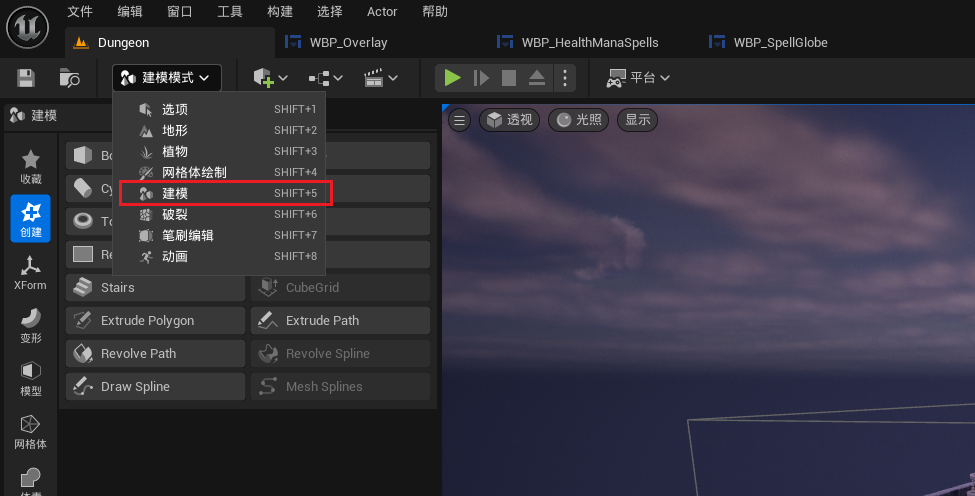
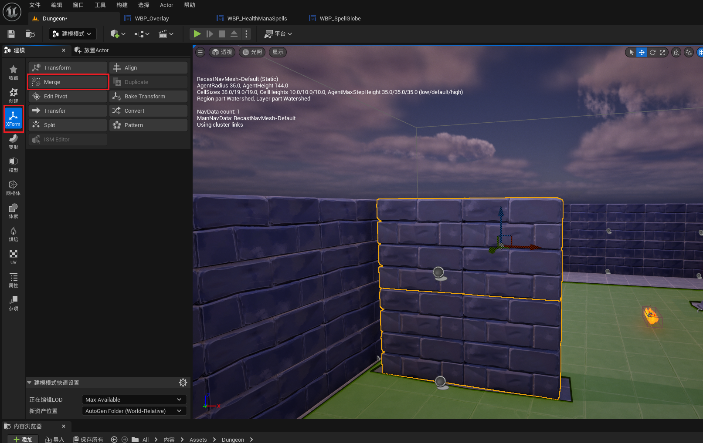
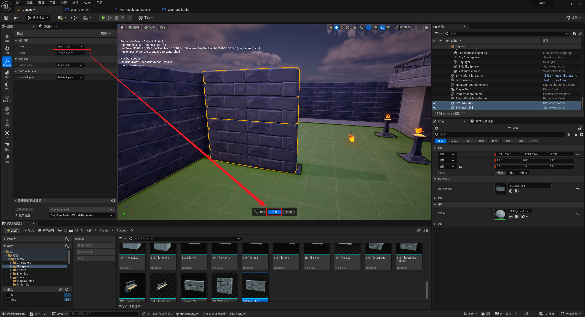
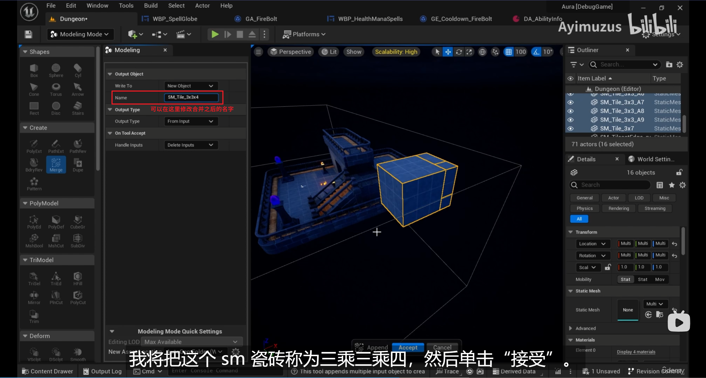
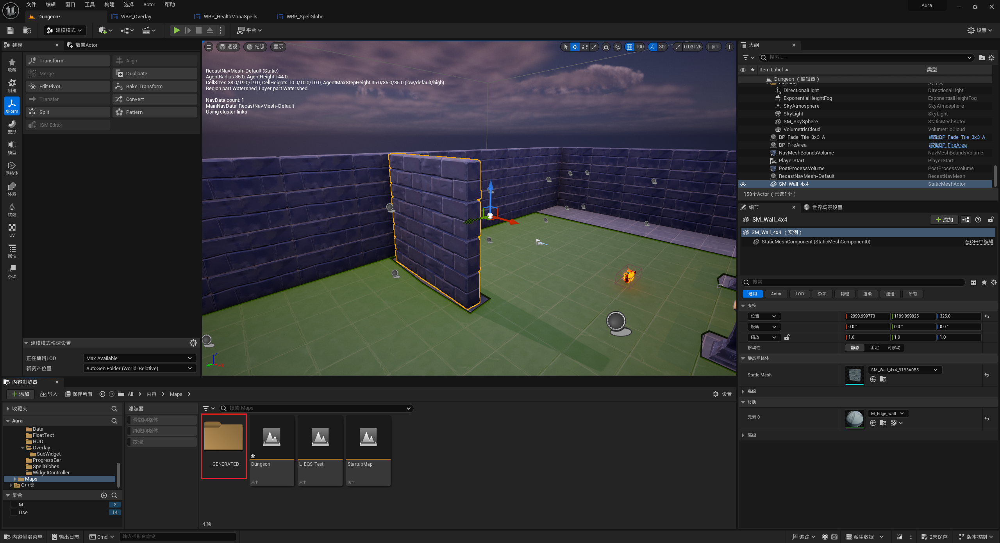
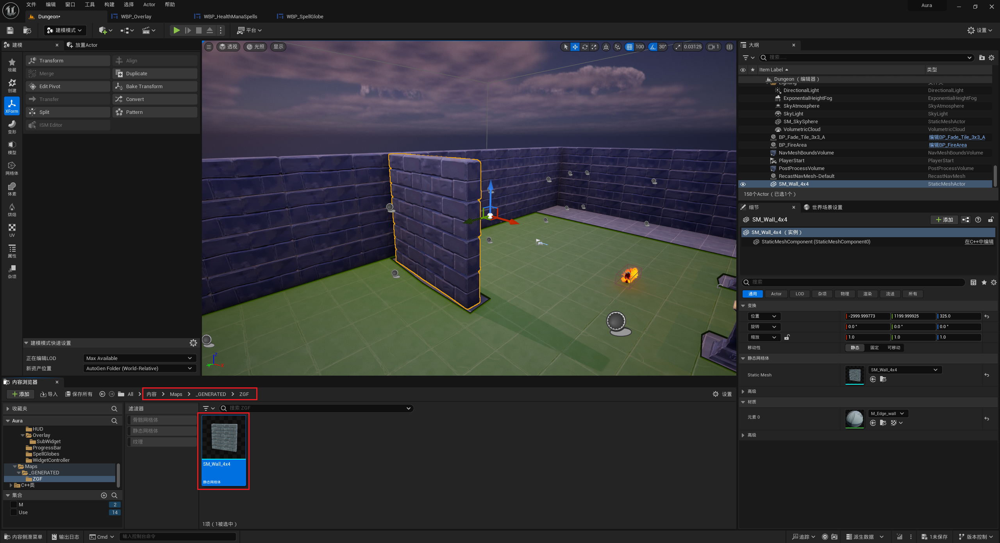
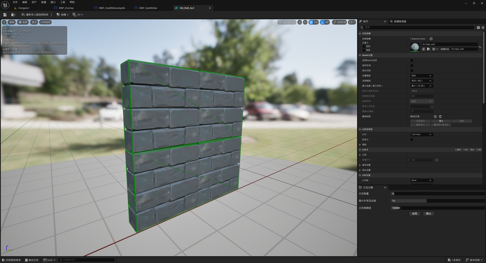

___________________________________________________________________________________________
###### [Go主菜单](../MainMenu.md)
___________________________________________________________________________________________

# GAS 118 使用引擎工具 合并多个SM 并 导入到引擎

___________________________________________________________________________________________

# 目录

- [GAS 118 使用引擎工具 合并多个SM 并 导入到引擎](#gas-118-使用引擎工具-合并多个sm-并-导入到引擎)
  - [目录](#目录)
    - [需要全选想要合并的SM，选择模式](#需要全选想要合并的sm选择模式)
    - [修改合并之后的名字](#修改合并之后的名字)
    - [合并之后的路径为，会放到生成地图的路径下](#合并之后的路径为会放到生成地图的路径下)

___________________________________________________________________________________________

视频链接

[14. Modeling Mode_哔哩哔哩_bilibili](https://www.bilibili.com/video/BV1TH4y1L7NP/?p=46&spm_id_from=333.880.my_history.page.click&vd_source=9e1e64122d802b4f7ab37bd325a89e6c)

------

___________________________________________________________________________________________

### 需要全选想要合并的SM，选择模式
>

------

### 修改合并之后的名字
>
>
>

------

### 合并之后的路径为，会放到生成地图的路径下
>

------

### 大功告成
___________________________________________________________________________________________

[返回最上面](#Go主菜单)

___________________________________________________________________________________________