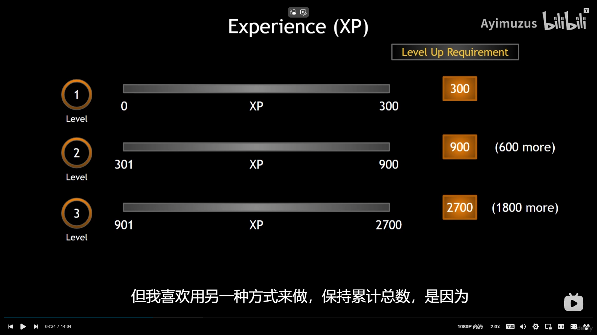
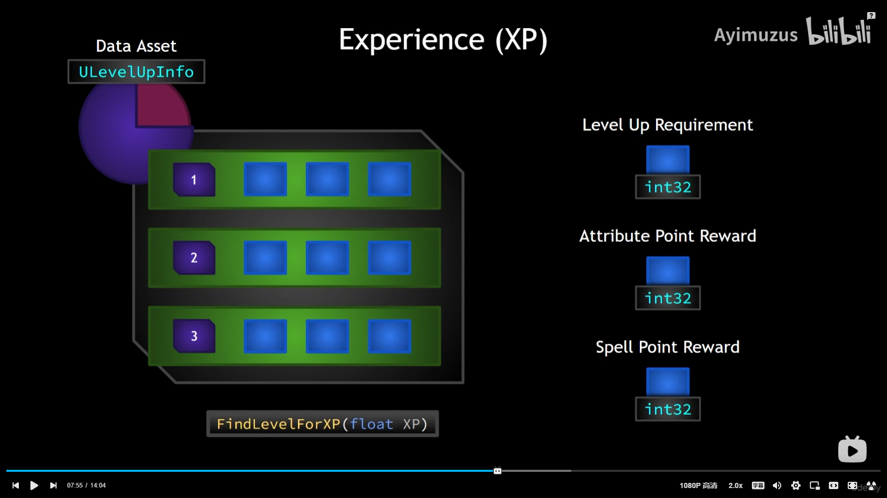
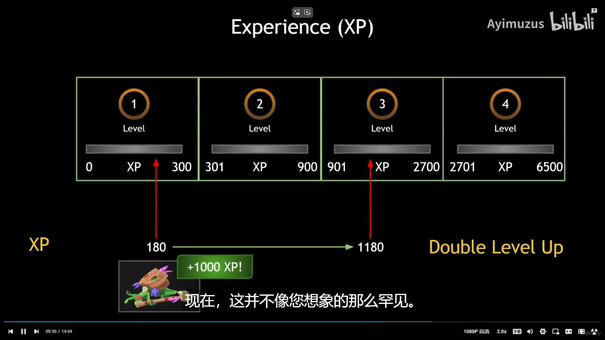

___________________________________________________________________________________________
###### [Go主菜单](../MainMenu.md)
___________________________________________________________________________________________

# GAS 119 升级的经验值整体框架设计

___________________________________________________________________________________________

# 目录

- [GAS 119 升级的经验值整体框架设计](#gas-119-升级的经验值整体框架设计)
- [目录](#目录)
    - [Mermaid整体思路梳理](#mermaid整体思路梳理)
    - [接下来我们将处理升级的逻辑，首先，每个等级需要拥有一个结构体，需要包含一个到达下一级需要的经验](#接下来我们将处理升级的逻辑首先每个等级需要拥有一个结构体需要包含一个到达下一级需要的经验)
    - [在真正的应用时，会遇到一些问题，比如升级所需的经验，并不是标准的数学公式，所以就需要自定义每一级所需的结构体，结构体包含了：](#在真正的应用时会遇到一些问题比如升级所需的经验并不是标准的数学公式所以就需要自定义每一级所需的结构体结构体包含了)
    - [想使用数据资产来保存这些需要配置的信息，在其中创建结构体，结构体中需要包含上述的信息，比如：](#想使用数据资产来保存这些需要配置的信息在其中创建结构体结构体中需要包含上述的信息比如)
    - [数据资产命名为 `ULevelUpInfo` ，其中需要包含](#数据资产命名为-ulevelupinfo-其中需要包含)
    - [因为需要考虑到一次升好多级的情况](#因为需要考虑到一次升好多级的情况)
  - [根据情况应该指在服务器上设置，且只有服务器可以修改 `经验值`，根据框架，这个 `经验值`，应该写在PS上，需要写 `Set` `Add` `Get` 函数，并且当数值发生变化时，需要发送委托，并使用属性复制，同步给客户端](#根据情况应该指在服务器上设置且只有服务器可以修改-经验值根据框架这个-经验值应该写在ps上需要写-set-add-get-函数并且当数值发生变化时需要发送委托并使用属性复制同步给客户端)

___________________________________________________________________________________________

视频链接

[1. Experience and Leveling Up_哔哩哔哩_bilibili](https://www.bilibili.com/video/BV1TH4y1L7NP?p=47&spm_id_from=pageDriver&vd_source=9e1e64122d802b4f7ab37bd325a89e6c)

------

___________________________________________________________________________________________

### 接下来我们将处理升级的逻辑，首先，每个等级需要拥有一个结构体，需要包含一个到达下一级需要的经验
>

- 解释一下图中的含义！：当1级时需要300经验升到下一级，当2级时，需要900经验升到3级(包含了1级升到2级的经验，也就是300)。后面以此类推，当3级时，需要2700经验升到4级(包含了1级升到3级的经验，也就是900)。

------

### 在真正的应用时，会遇到一些问题，比如升级所需的经验，并不是标准的数学公式，所以就需要自定义每一级所需的结构体，结构体包含了：

  - 升到下一级所需的经验

  - 每升1级给与多少个属性点

  - 每升1级给与多少个技能点

>

------

### 想使用数据资产来保存这些需要配置的信息，在其中创建结构体，结构体中需要包含上述的信息，比如：

>   - #### **升到下一级所需的经验**
>
>   - #### **每升1级给与多少个属性点**
>
>   - #### **每升1级给与多少个技能点**

------

### 数据资产命名为 `ULevelUpInfo` ，其中需要包含

>   - **结构体，保存每一级所需的数据**
>     - **升到下一级所需的经验**
>
>     - **每升1级给与多少个属性点**
>
>     - **每升1级给与多少个技能点**
>
>   - **结构体数组 `TArray`，用来映射等级和结构体，这里的等级将使用下标来替代**
>
>   - **根据传入的经验，计算应该到达什么等级的函数，`FindLevelForXP(float XP)`**

------

### 因为需要考虑到一次升好多级的情况
>

------

## 根据情况应该指在服务器上设置，且只有服务器可以修改 `经验值`，根据框架，这个 `经验值`，应该写在PS上，需要写 `Set` `Add` `Get` 函数，并且当数值发生变化时，需要发送委托，并使用属性复制，同步给客户端

___________________________________________________________________________________________

[返回最上面](#Go主菜单)

___________________________________________________________________________________________