___________________________________________________________________________________________
###### [Go主菜单](../MainMenu.md)
___________________________________________________________________________________________

# GAS 120 使用 `DataAsset` 保存升级的信息结构体，存在 `PS` 中；处理同步； `OverlayWidgetController` 中创建并绑定回调；回调中计算广播到蓝图

___________________________________________________________________________________________

## 处理关键点

1. 制作需求：将一个类中成员变量，开启复制，并在变化时广播到服务器和客户端

2. 部分MVC的架构梳理


___________________________________________________________________________________________

# 目录


- [GAS 120 使用 `DataAsset` 保存升级的信息结构体，存在 `PS` 中；处理同步； `OverlayWidgetController` 中创建并绑定回调；回调中计算广播到蓝图](#gas-120-使用-dataasset-保存升级的信息结构体存在-ps-中处理同步-overlaywidgetcontroller-中创建并绑定回调回调中计算广播到蓝图)
  - [处理关键点](#处理关键点)
- [目录](#目录)
    - [Mermaid整体思路梳理](#mermaid整体思路梳理)
  - [这里有个知识点：只有const函数，返回值才能使用const 变量 接](#这里有个知识点只有const函数返回值才能使用const-变量-接)
    - [创建 `DataAsset`，命名为，`LevelUpInfo`](#创建-dataasset命名为levelupinfo)
    - [创建结构体，命名为，`FAuraLevelUpInfo`，需要包含：](#创建结构体命名为fauralevelupinfo需要包含)
    - [创建结构体数组 `TArray`，用来映射等级和结构体，这里的等级将使用下标来替代，命名为，`LevelUpInformation`](#创建结构体数组-tarray用来映射等级和结构体这里的等级将使用下标来替代命名为levelupinformation)
    - [创建函数，根据传入的经验，计算应该到达什么等级的函数，`FindLevelForXP(float XP)`](#创建函数根据传入的经验计算应该到达什么等级的函数findlevelforxpfloat-xp)
      - [使用 `While` 写的，但是我认为，没必要用 `While` ，可能是个人习惯，我决定用 `fori` 循环写](#使用-while-写的但是我认为没必要用-while-可能是个人习惯我决定用-fori-循环写)
    - [创建数据资产的蓝图子类](#创建数据资产的蓝图子类)
    - [配置结构体信息](#配置结构体信息)
      - [`Index 0` 是占位用的](#index-0-是占位用的)
    - [下一节](#下一节)
    - [小测试1](#小测试1)
    - [自己尝试一下](#自己尝试一下)
      - [需要将XP添加到PS中，成员变量；XP需要开启 `属性复制`](#需要将xp添加到ps中成员变量xp需要开启-属性复制)
      - [添加 `SetXP` 和 `AddToXP` 函数](#添加-setxp-和-addtoxp-函数)
      - [需要监听，XP的变化，可以向客户端广播](#需要监听xp的变化可以向客户端广播)
        - [不用在蓝图中实现，所以不用动态多播，多播即可](#不用在蓝图中实现所以不用动态多播多播即可)
        - [需要在 `C` 中绑定所以需要公开委托](#需要在-c-中绑定所以需要公开委托)
        - [接下来在客户端和服务器进行广播](#接下来在客户端和服务器进行广播)
    - [接下来等级Level也需要添加 `Set` 和 `Add` 函数](#接下来等级level也需要添加-set-和-add-函数)
    - [需要 `监听Level变化`](#需要-监听level变化)
      - [可以用刚才创建的广播](#可以用刚才创建的广播)
      - [变化时，广播 Level](#变化时广播-level)
    - [下一节](#下一节-1)
    - [小测试1](#小测试1-1)
    - [自己尝试一下](#自己尝试一下-1)
      - [在 `OverlayWidgetController` 中创建回调，并在  `BindCallbacksToDependencies` 函数中绑定回调](#在-overlaywidgetcontroller-中创建回调并在--bindcallbackstodependencies-函数中绑定回调)
      - [关于之前说的问题：`LevelUplnfo` 数据资产应该放在哪里？](#关于之前说的问题leveluplnfo-数据资产应该放在哪里)
        - [在PS中创建智能指针，持有`LevelUplnfo` DataAsset指针](#在ps中创建智能指针持有leveluplnfo-dataasset指针)
      - [我们之前用这个动态多播，广播了float，现在也可以继续用这个，声明一个委托，保存在 `OverlayWidgetController` 中](#我们之前用这个动态多播广播了float现在也可以继续用这个声明一个委托保存在-overlaywidgetcontroller-中)
      - [下面需要在回调中向蓝图中广播，但是需要计算百分比之后再广播](#下面需要在回调中向蓝图中广播但是需要计算百分比之后再广播)
        - [先拿到PS这样就拿到了数据资产，然后存为局部变量，计算百分比](#先拿到ps这样就拿到了数据资产然后存为局部变量计算百分比)
        - [计算百分比](#计算百分比)


___________________________________________________________________________________________

<details>
<summary>视频链接</summary>

[2. Level Up Info Data Asset_哔哩哔哩_bilibili](https://www.bilibili.com/video/BV1TH4y1L7NP?p=48&vd_source=9e1e64122d802b4f7ab37bd325a89e6c)

[3. Adding XP to the Player State_哔哩哔哩_bilibili](https://www.bilibili.com/video/BV1TH4y1L7NP?p=49&spm_id_from=pageDriver&vd_source=9e1e64122d802b4f7ab37bd325a89e6c)

[4. Listening for XP Changes_哔哩哔哩_bilibili](https://www.bilibili.com/video/BV1TH4y1L7NP?p=50&spm_id_from=pageDriver&vd_source=9e1e64122d802b4f7ab37bd325a89e6c)

------

</details>

___________________________________________________________________________________________

### Mermaid整体思路梳理

Mermaid

___________________________________________________________________________________________

## 这里有个知识点：只有const函数，返回值才能使用const 变量 接

------

### 创建 `DataAsset`，命名为，`LevelUpInfo`
>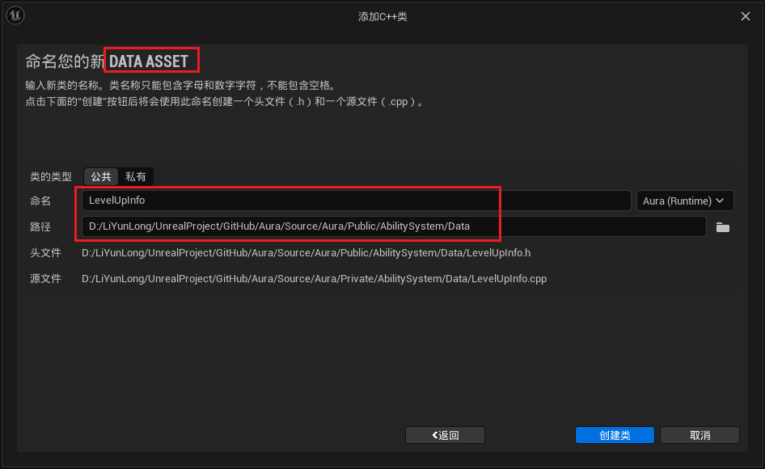

------

### 创建结构体，命名为，`FAuraLevelUpInfo`，需要包含：

>   - 升到下一级所需的经验 `LevelUpRequirement`
>
>   - 每升1级给与多少个属性点 `AttributePointAward`
>
>   - 每升1级给与多少个技能点 `SpellPointAward`
>
>   - 蓝图配置即可，不需要在蓝图中读取
>
>
>   ```cpp
>   USTRUCT()
>   struct FAuraLevelUpInfo
>   {
>   	GENERATED_BODY()
>   	
>   	/*升到下一级所需的经验*/
>   	UPROPERTY(EditDefaultsOnly)
>   	int32 LevelUpRequirement = 0;
>   	
>   	/*每升1级给与多少个属性点*/
>   	UPROPERTY(EditDefaultsOnly)
>   	int32 AttributePointAward = 1;
>   	
>   	/*每升1级给与多少个技能点*/
>   	UPROPERTY(EditDefaultsOnly)
>   	int32 SpellPointAward = 1;
>   	
>   };
>   ```
>
>   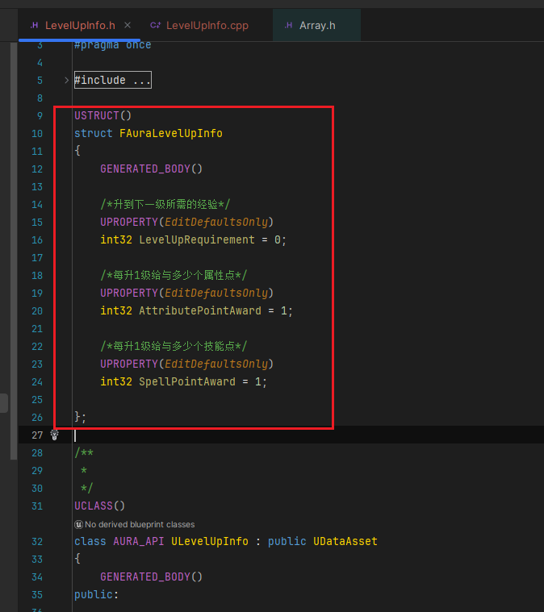

------

### 创建结构体数组 `TArray`，用来映射等级和结构体，这里的等级将使用下标来替代，命名为，`LevelUpInformation`
>```cpp
>public:
>
>    UPROPERTY(EditDefaultsOnly)
>    TArray<FAuraLevelUpInfo> LevelUpInformation;
>```
>
>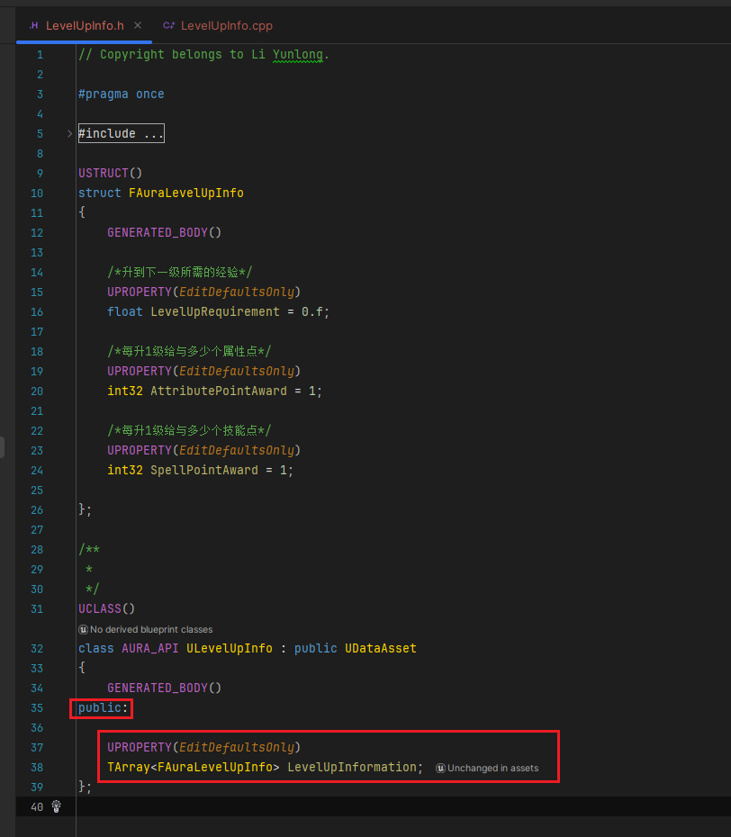

------

### 创建函数，根据传入的经验，计算应该到达什么等级的函数，`FindLevelForXP(float XP)`
>```CPP
>public:
>
>    int32 FindLevelForXP(int32 InXP);
>```

------

#### 使用 `While` 写的，但是我认为，没必要用 `While` ，可能是个人习惯，我决定用 `fori` 循环写
>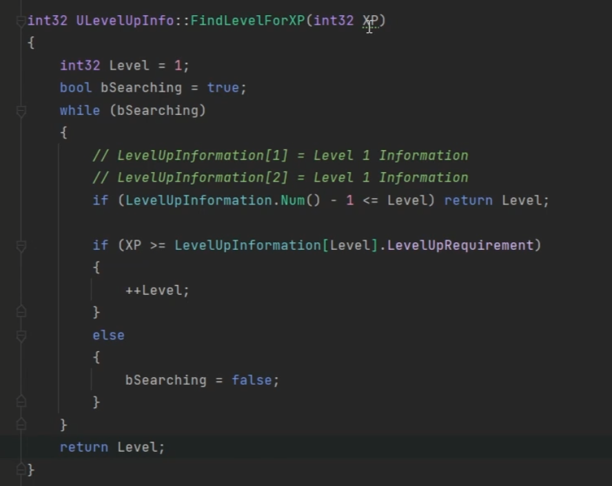
>
>### 下面是我的写法
>
>```cpp
>int32 ULevelUpInfo::FindLevelForXP(int32 InXP)
>{
>    /*
>     * 假设  0级 0
>     * 假设  1级 300
>     * 假设  2级 600
>     * 假设  3级 900
>     */
>    if (LevelUpInformation.Num() == 0)
>    {
>       return 0; // 返回的默认等级 0
>    }
>    for (int i = 0; i < LevelUpInformation.Num(); ++i)
>    {
>       if (InXP < LevelUpInformation[i].LevelUpRequirement)
>       {
>          return i;
>       }
>    }
>    // 如果 XP 超过最后一个等级的要求，返回最大等级
>    return LevelUpInformation.Num() - 1;
>}
>```
>
>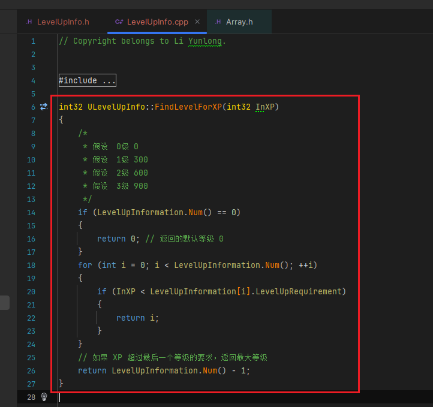

------

### 创建数据资产的蓝图子类
>- #### **命名为，`DA_LevelUpInfo`**
>
>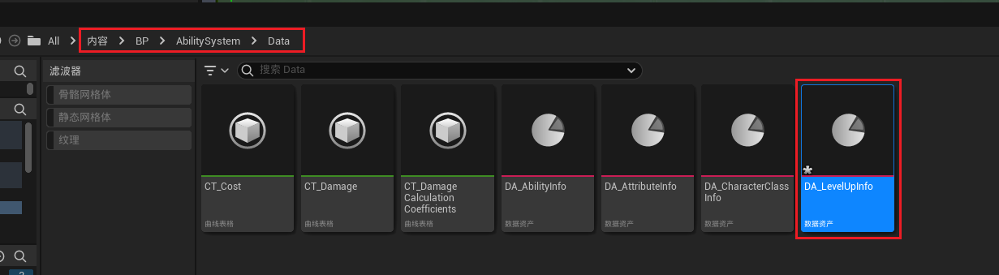

------

### 配置结构体信息

------

#### `Index 0` 是占位用的
>| 等级 | 等级经验奖励 | 奖励技能点 | 奖励属性点 |
>| ---- | ------------ | ---------- | ---------- |
>| 0    | 0            | 1          | 1          |
>| 1    | 300          | 1          | 1          |
>| 2    | 900          | 1          | 1          |
>| 3    | 2700         | 1          | 1          |
>| 4    | 6400         | 1          | 1          |
>| 5    | 14500        | 2          | 2          |
>| 6    | 20000        | 1          | 1          |
>| 7    | 35000        | 1          | 1          |
>| 8    | 50000        | 1          | 1          |
>| 9    | 65000        | 1          | 1          |
>| 10   | 85000        | 1          | 1          |


------

### 下一节

------

### 小测试1

>   - #### **需要将XP添加到PS中，成员变量**
>
>   - #### **XP需要开启 `属性复制`**
>
>   - #### **添加 `SetXP` 和 `AddToXP` 函数**
>
>   - #### **需要监听，XP的变化**
>
>     - #### **可以向客户端广播**
>
>
> 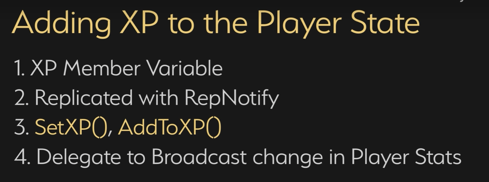

------

### 自己尝试一下

------

#### 需要将XP添加到PS中，成员变量；XP需要开启 `属性复制`

>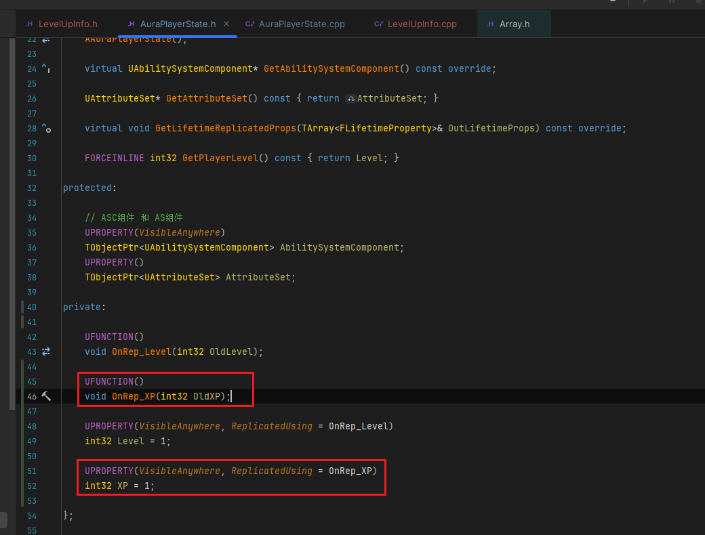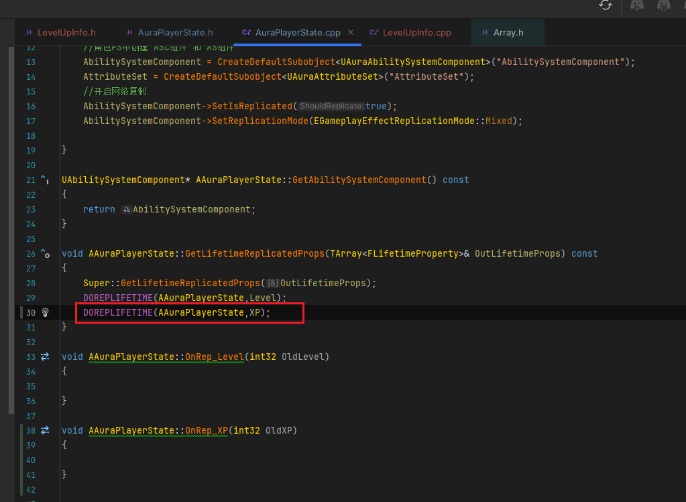
>
>```CPP
>private:
>    
>    UFUNCTION()
>    void OnRep_XP(int32 OldXP);
>
>    UPROPERTY(VisibleAnywhere, ReplicatedUsing = OnRep_XP)
>    int32 XP = 1;
>```
>
>```CPP
>void AAuraPlayerState::GetLifetimeReplicatedProps(TArray<FLifetimeProperty>& OutLifetimeProps) const
>{
>    Super::GetLifetimeReplicatedProps(OutLifetimeProps);
>    DOREPLIFETIME(AAuraPlayerState,Level);
>    DOREPLIFETIME(AAuraPlayerState,XP);/*这里设置复制XP*/
>}
>
>void AAuraPlayerState::OnRep_XP(int32 OldXP)
>{
>    
>}
>```

------

#### 添加 `SetXP` 和 `AddToXP` 函数
>```cpp
>public:
>    
>    void AddXP(int32 InXP);
>    void SetXP(int32 InXP);
>
>```
>
>```cpp
>void AAuraPlayerState::AddXP(int32 InXP)
>{
>    XP += InXP;
>}
>
>void AAuraPlayerState::SetXP(int32 InXP)
>{
>    XP = InXP;
>}
>```
>
>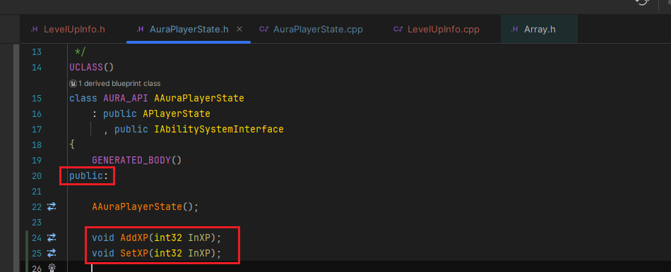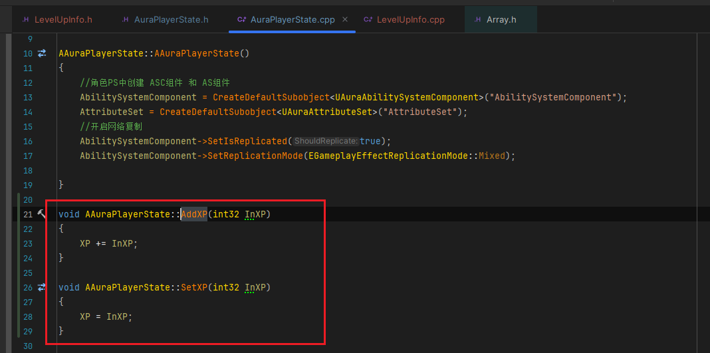

------

#### 需要监听，XP的变化，可以向客户端广播

------

##### 不用在蓝图中实现，所以不用动态多播，多播即可
>- #### 多播命名为，`FOnPlayerStatChanged`
>
>```cpp
>DECLARE_MULTICAST_DELEGATE_OneParam(FOnPlayerStatChanged,int32/*StatValue*/)
>```
>
>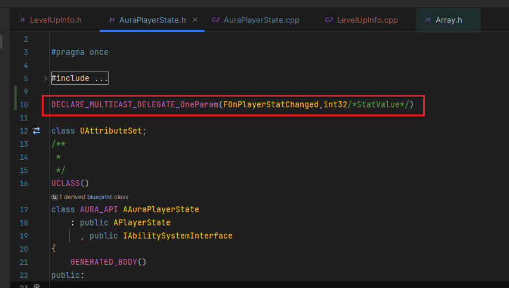

------

##### 需要在 `C` 中绑定所以需要公开委托
>```cpp
>public:
>    
>    FOnPlayerStatChanged OnXPChangedDelegate;
>```
>
>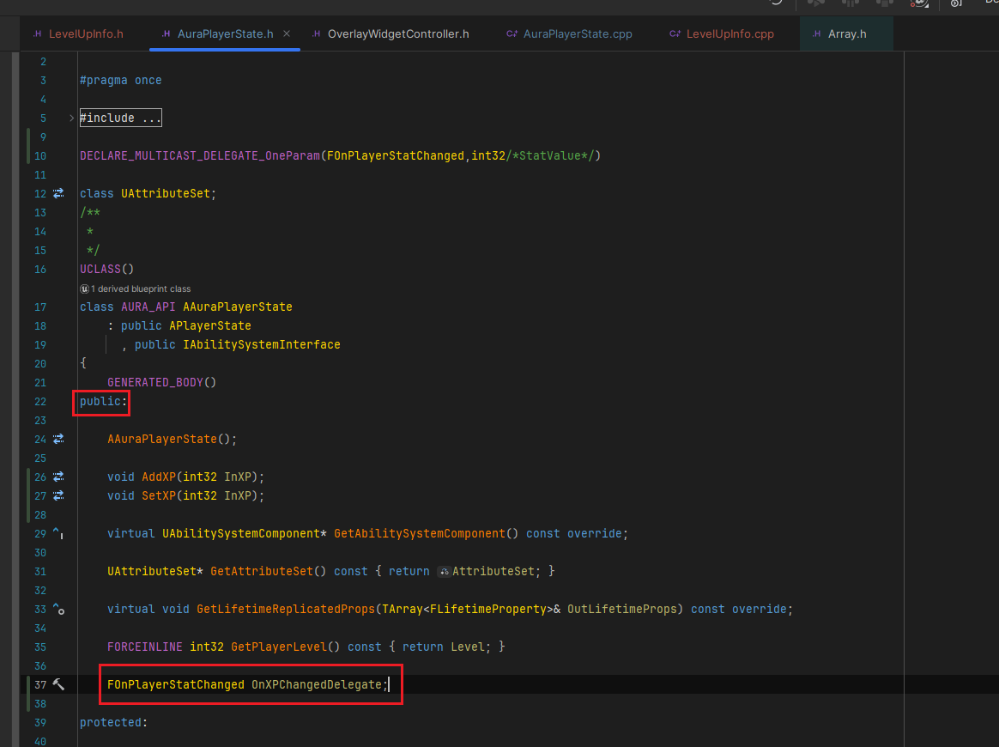

------

##### 接下来在客户端和服务器进行广播
>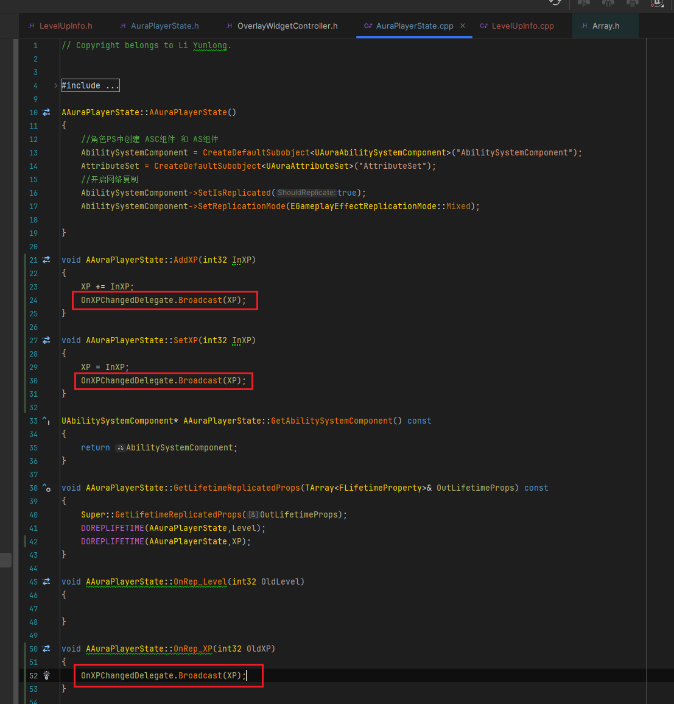
>
>```cpp
>void AAuraPlayerState::AddXP(int32 InXP)
>{
>    XP += InXP;
>    OnXPChangedDelegate.Broadcast(XP);
>}
>
>void AAuraPlayerState::SetXP(int32 InXP)
>{
>    XP = InXP;
>    OnXPChangedDelegate.Broadcast(XP);
>}
>
>void AAuraPlayerState::OnRep_XP(int32 OldXP)
>{
>    OnXPChangedDelegate.Broadcast(XP);
>}
>```

------

### 接下来等级Level也需要添加 `Set` 和 `Add` 函数
>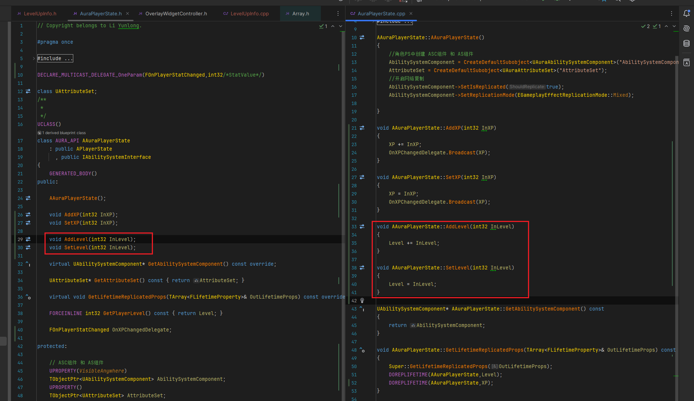

------

### 需要 `监听Level变化`

------

#### 可以用刚才创建的广播
>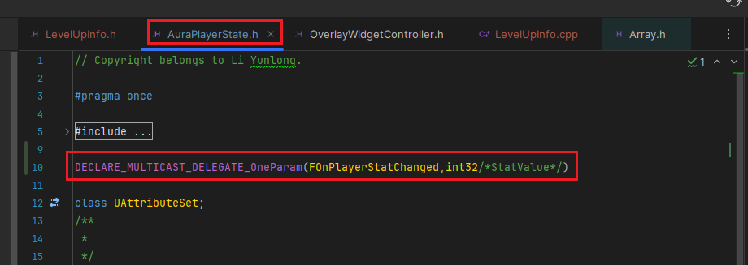
>
>```cpp
>FOnPlayerStatChanged OnLevelChangedDelegate;
>```

------

#### 变化时，广播 Level
>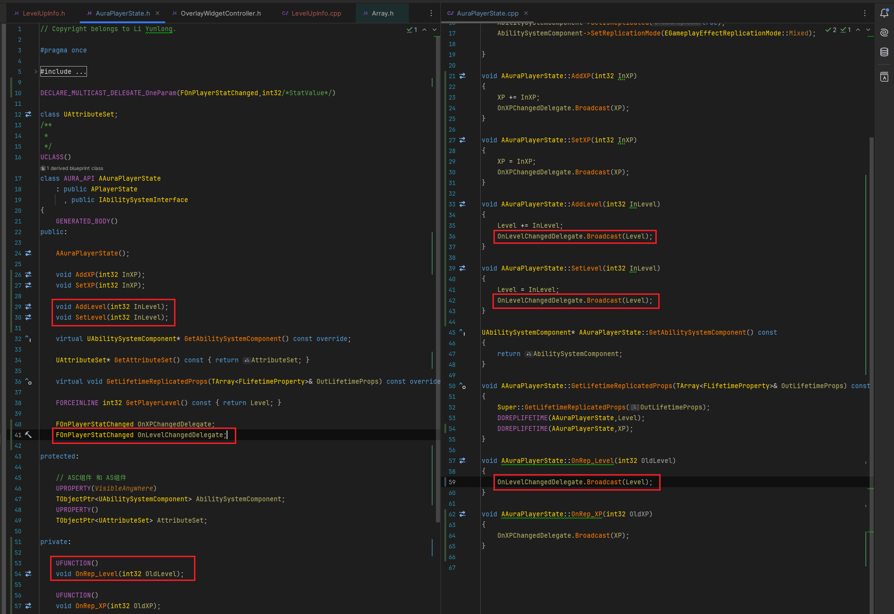

------

### 下一节

------

### 小测试1

>   - #### **在 `OverlayWidgetController` 上绑定 `OnXPChangedDelegate` 委托**
>
>   - #### **算出 XP 条的百分比是多少**
>
>   - #### **`LevelUplnfo` 数据资产应该放在哪里**
>
>   - #### **请记住，我们可能需要在客户端和服务器上的小部件控制器中提供升级信息。**
>
>   - #### **提示： `OverlayWidgetController` 中是否需要 `LevelUplnfo`**
>
>
> 

------

### 自己尝试一下

------

#### 在 `OverlayWidgetController` 中创建回调，并在  `BindCallbacksToDependencies` 函数中绑定回调
>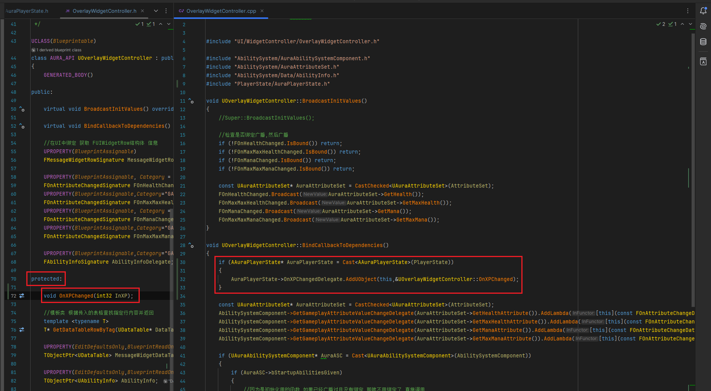

------

#### 关于之前说的问题：`LevelUplnfo` 数据资产应该放在哪里？

  - 应该放在PS中，因为PS会复制到客户端，所以升级的信息，每个客户端都能拿到

------

##### 在PS中创建智能指针，持有`LevelUplnfo` DataAsset指针
>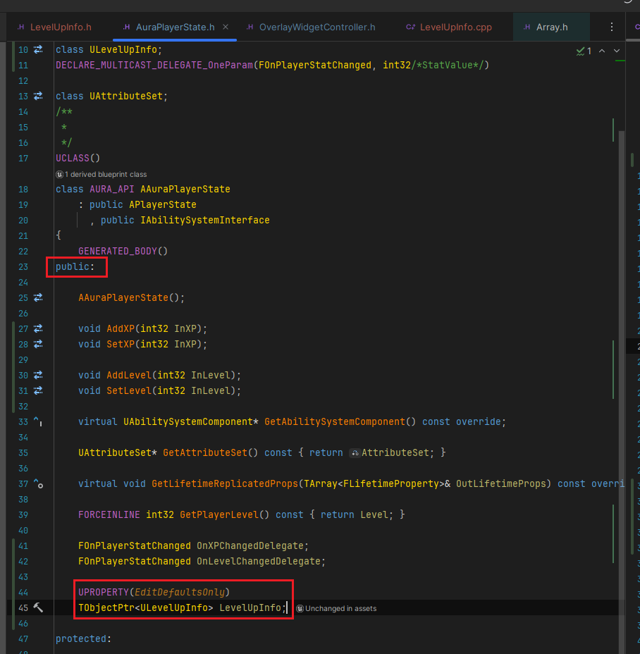

------

#### 我们之前用这个动态多播，广播了float，现在也可以继续用这个，声明一个委托，保存在 `OverlayWidgetController` 中
>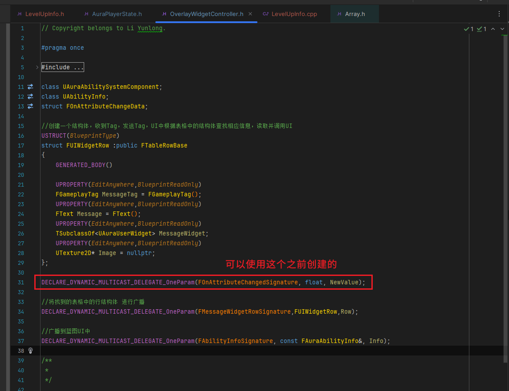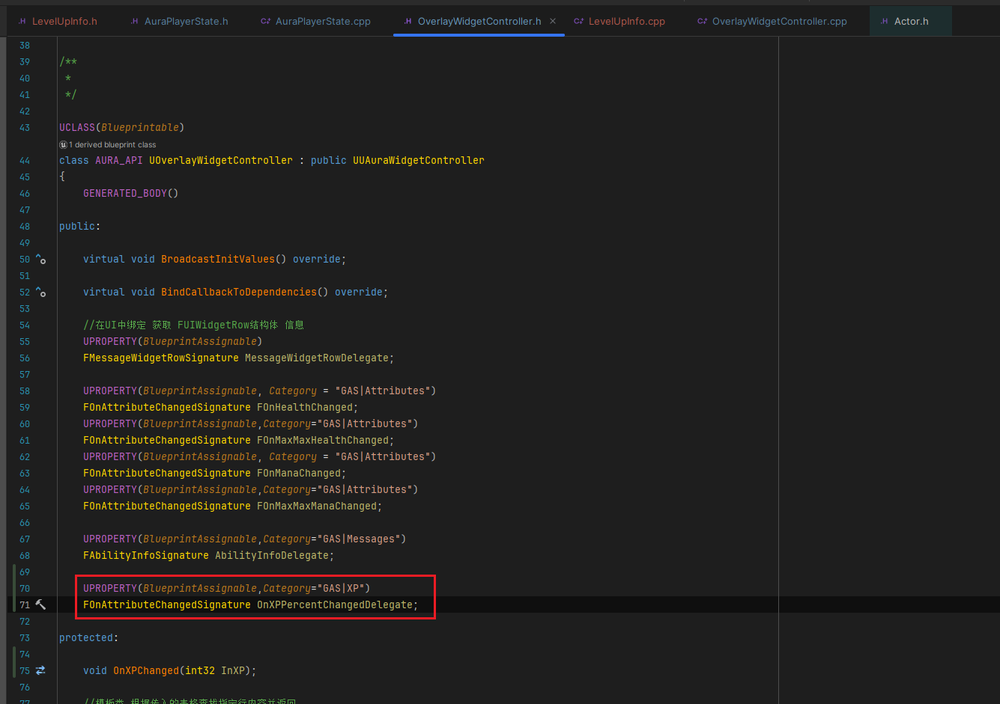
>
>```CPP
>public:
>    
>    UPROPERTY(BlueprintAssignable,Category="GAS|XP")
>	FOnAttributeChangedSignature OnXPPercentChangedDelegate;
>
>```

------

#### 下面需要在回调中向蓝图中广播，但是需要计算百分比之后再广播

------

##### 先拿到PS这样就拿到了数据资产，然后存为局部变量，计算百分比
>```CPP
>void UOverlayWidgetController::OnXPChanged(int32 InXP)
>{
>	const AAuraPlayerState* AuraPlayerState = Cast<AAuraPlayerState>(PlayerState);
>	if (!AuraPlayerState) return;
>	ULevelUpInfo* LevelUpInfo = AuraPlayerState->LevelUpInfo;
>	check(LevelUpInfo);
>	const int32 NewLevel = LevelUpInfo->FindLevelForXP(InXP);
>	if (NewLevel <= 0) return;
>}
>```

------

##### 计算百分比
>- #### **我是自己发挥的，大差不差**
>
>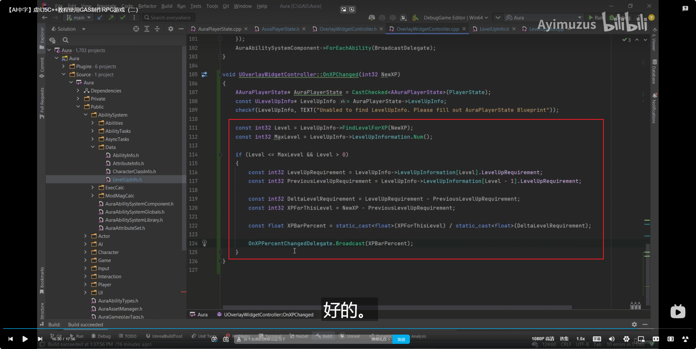
>
>```CPP
>void UOverlayWidgetController::OnXPChanged(int32 InXP)
>{
>	const AAuraPlayerState* AuraPlayerState = Cast<AAuraPlayerState>(PlayerState);
>	if (!AuraPlayerState) return;
>	ULevelUpInfo* LevelUpInfo = AuraPlayerState->LevelUpInfo;
>	check(LevelUpInfo);
>	const int32 NewLevel = LevelUpInfo->FindLevelForXP(InXP);
>	if (NewLevel <= 0) return;
>	int32 MaxXP = LevelUpInfo->LevelUpInformation[NewLevel].LevelUpRequirement - LevelUpInfo->LevelUpInformation[NewLevel - 1].LevelUpRequirement;
>	int32 XP = InXP - LevelUpInfo->LevelUpInformation[NewLevel - 1].LevelUpRequirement;
>	const float Percent = StaticCast<float>(XP)/StaticCast<float>(MaxXP);
>	OnXPPercentChangedDelegate.Broadcast(Percent);
>}
>```


___________________________________________________________________________________________

[返回最上面](#Go主菜单)

___________________________________________________________________________________________