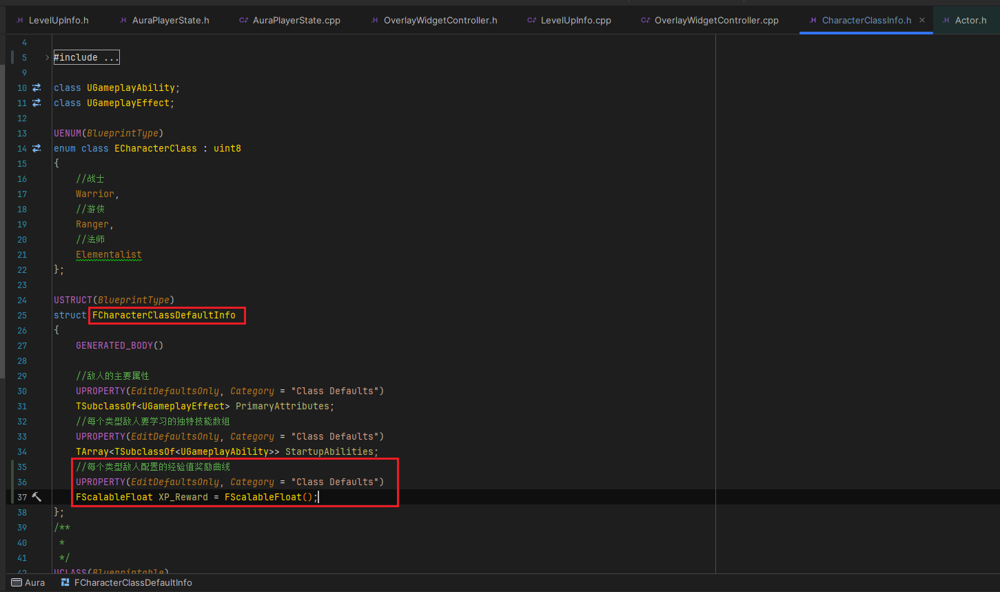

___________________________________________________________________________________________
###### [Go主菜单](../MainMenu.md)
___________________________________________________________________________________________

# GAS 121 梳理整个增加经验的逻辑；为不同敌人使用曲线，配置经验值奖励

___________________________________________________________________________________________

## 处理关键点

1. 使用 `FScalableFloat` 曲线表格的方式回顾


___________________________________________________________________________________________

# 目录


[TOC]


___________________________________________________________________________________________

<details>
<summary>视频链接</summary>

[5. Awarding XP Game Plan_哔哩哔哩_bilibili](https://www.bilibili.com/video/BV1TH4y1L7NP/?p=51&spm_id_from=pageDriver&vd_source=9e1e64122d802b4f7ab37bd325a89e6c)

[6. XP Reward for Enemies_哔哩哔哩_bilibili](https://www.bilibili.com/video/BV1TH4y1L7NP/?p=52&spm_id_from=pageDriver&vd_source=9e1e64122d802b4f7ab37bd325a89e6c)

------

</details>

___________________________________________________________________________________________

### Mermaid整体思路梳理

Mermaid

___________________________________________________________________________________________

### 流程解释
>
>
>- #### **当玩家攻击敌人时，敌人身上需要有对应的 `XP Reward(经验值奖励)` ，当玩家击杀敌人时，我们之前是在计算时拿到的敌人死亡状态，如果敌人死亡，一方面通过 `GameplayEvent` 发送给 `Player` ，但是计算时我们使用到了元属性，也就是只存在于服务器的属性 `AS` ，所以也需要相应的为即将应用的XP创建 `元属性` ；另一方面，需要广播XP到 `WidgetController` 中，使用 `MVC` 完成对UI的更新。关于Player获取经验方面，`GameplayEvent` 发送给 `Player` 敌人死亡的信息后，需要传递 `要增加的XP值` ，这里需要创建一个` GA(也就是图中的GA_ListenForEvents)` 用来 `监听GameplayEvent发送的Tag` ，并根据传递的值，完成对 Player->PS->XP 的修改**

------

### 接下来要处理的流程步骤

>

------

### 下一节

------

### 接下来我们需要的是让敌人拥有一定数量的经验值，攻击者杀死敌人时获得的。

------

#### 创建曲线
>- #### 命名为，`CT_XP_Reward`
>
>
>
>经验值奖励，表格：
>
>| 职业 |                | 1级经验奖励 | 40级经验奖励 |
>| ---- | -------------- | ----------- | ------------ |
>| 战士 | `Warrior`      | 20          | 1000         |
>| 游侠 | `Ranger`       | 25          | 1500         |
>| 法师 | `Elementalist` | 35          | 2500         |

------

#### 在 `CharacterClassinfo.h` 中，添加配置经验值奖励的曲线变量 `FScalableFloat`
>- #### 命名为，`XP_Reward`
>
>

------

#### 在蓝图函数库中创建静态函数根据敌人种类，和等级返回相应的奖励经验值(也就是表格中对应的float) ，函数命名为`GetXPRewardForClassAndLevel`

>   - #### **因为是静态函数需要一个 `WorldContextObject`**
>   - #### **需要一个角色种类**
>   - #### **需要一个角色等级**
>   - 

------

##### 先从GM上拿到角色信息的数据资产指针，然后获取结构体，拿到表格，传入等级获取对应的浮点数

>   - #### 因为用到的经验值是整型，所以需要把 **返回值强制类型转换**
>
>   ```cpp
>   int32 UAuraAbilitySystemLibrary::GetXPRewardForClassAndLevel(const UObject* WorldContextObject,
>       const ECharacterClass CharacterClass, const int32 InLevel)
>   {
>       UCharacterClassInfo* Info = GetCharacterClassInfo(WorldContextObject);
>       if (Info == nullptr) return 0;
>       const FCharacterClassDefaultInfo CharacterDefaultInfo = Info->GetClassDefaultInfo(CharacterClass);
>       return static_cast<int32>(CharacterDefaultInfo.XP_Reward.GetValueAtLevel(InLevel));
>   }
>   ```
>
>   

------

### 接下来需要在角色基类接口 `ICombatInterface` 中创建获取 `角色类型` 的函数
>- #### 命名为，`GetCharacterClass`
>
>  ```cpp
>  UFUNCTION(BlueprintNativeEvent, BlueprintCallable)
>  ECharacterClass GetCharacterClass() const ;
>  ```
>
>

------

### 因为是角色类型，而Aura，也可以是AI，所以想把角色类型枚举的设置挪到角色基类中

#### 也就是将这里的逻辑
>

#### 挪到角色基类中
>

------

### 基类重写接口函数
>```cpp
>public:
>    
>    //~ Begin ICombatInteraction
>    virtual ECharacterClass GetCharacterClass_Implementation() const override;
>    //~ End ICombatInteraction
>```
>
>```cpp
>ECharacterClass AAuraCharacterBase::GetCharacterClass_Implementation() const
>{
>    return CharacterClass;
>}
>```
>
>

------

### 玩家基类的构造中，设置角色类型为元素使
>

------

### ***DA_CharacterInfo*** 中设置敌人经验值奖励曲线
>


___________________________________________________________________________________________

[返回最上面](#Go主菜单)

___________________________________________________________________________________________