___________________________________________________________________________________________
###### [Go主菜单](../MainMenu.md)
___________________________________________________________________________________________

# GAS 122 创建被动技能GA；使用WaitGameplayEvent监听父Tag属性变化，指定Tag使用SetByCaller指定映射float，通过Payload发送接收数据

___________________________________________________________________________________________

## 处理关键点

1. 使用 `AssignTagSetByCallerMagnitude` 绑定 `Tag` 和 `float`

2. 回顾 `AS` 的 `PostGameplayEffectExecute` 后处理函数中，判断属性修改


___________________________________________________________________________________________

# 目录


- [GAS 122 创建被动技能GA；使用WaitGameplayEvent监听父Tag属性变化，指定Tag使用SetByCaller指定映射float，通过Payload发送接收数据](#gas-122-创建被动技能ga使用waitgameplayevent监听父tag属性变化指定tag使用setbycaller指定映射float通过payload发送接收数据)
  - [处理关键点](#处理关键点)
- [目录](#目录)
    - [Mermaid整体思路梳理](#mermaid整体思路梳理)
    - [小测试1](#小测试1)
    - [自己尝试一下](#自己尝试一下)
    - [下一节](#下一节)
    - [下面我们需要创建一个被动能力的GA，`GA_ListenForEvents`，用来监听 `GameplayEvent`，然后绑定 `SetByCaller` 并对目标应用GE。上一节总结过](#下面我们需要创建一个被动能力的gaga_listenforevents用来监听-gameplayevent然后绑定-setbycaller-并对目标应用ge上一节总结过)
      - [创建初始化被动技能文件夹，`Passive_Startup`](#创建初始化被动技能文件夹passive_startup)
      - [创建GA](#创建ga)
    - [设置 `GA_ListenForEvents` 实例化策略 和 网络策略](#设置-ga_listenforevents-实例化策略-和-网络策略)
    - [监听GameplayEventTag时，可以选择父节点Tag，这样就可以监听所有的子节点](#监听gameplayeventtag时可以选择父节点tag这样就可以监听所有的子节点)
      - [只是介绍一下，这两个都不开启，分别为](#只是介绍一下这两个都不开启分别为)
      - [后面我们将使用 `Payload` 发送和接受数据](#后面我们将使用-payload-发送和接受数据)
    - [创建GE，命名为***GE\_EventBasedEffect***](#创建ge命名为ge_eventbasedeffect)
    - [在GE中打算使用 `元属性` + `SetByCaller` 触发Tag](#在ge中打算使用-元属性--setbycaller-触发tag)
      - [创建 `元属性Tag标签`](#创建-元属性tag标签)
      - [回到GE中配置 `元属性Tag标签`](#回到ge中配置-元属性tag标签)
    - [注意此时，因为传入的元属性为 `Attributes` 下的子Tag，所以会触发监听事件，又因为打算使用 `SetByCaller` 键值对触发，所以 `只有绑定的` 才会在后续自定义处理逻辑，(但是所有的属性变化都可以监听到！)](#注意此时因为传入的元属性为-attributes-下的子tag所以会触发监听事件又因为打算使用-setbycaller-键值对触发所以-只有绑定的-才会在后续自定义处理逻辑但是所有的属性变化都可以监听到)
    - [GA中创建变量配置上面创建的 `GE的Class`](#ga中创建变量配置上面创建的-ge的class)
    - [在GA中获取Owner的ASC，创建 `GE_Spec` ，并使用 `GE_Spec` 绑定 `SetByCaller` 键值对映射（Tag和float），然后应用GE](#在ga中获取owner的asc创建-ge_spec-并使用-ge_spec-绑定-setbycaller-键值对映射tag和float然后应用ge)
    - [需要注意的是，我们并没有 `给与` 这个 `被动技能GA` ，所以需要让这个 `被动技能GA` `GiveAbility`并激活一次](#需要注意的是我们并没有-给与-这个-被动技能ga-所以需要让这个-被动技能ga-giveability并激活一次)
      - [在角色基类中，创建被动技能的数组，命名为， `StartupPassiveAbilities`](#在角色基类中创建被动技能的数组命名为-startuppassiveabilities)
      - [ASC组件中创建添加被动技能的函数，命名为，`AddCharacterPassiveAbilities`](#asc组件中创建添加被动技能的函数命名为addcharacterpassiveabilities)
      - [在角色初始化给予技能后，也调用给与被动技能函数](#在角色初始化给予技能后也调用给与被动技能函数)
    - [角色中配置要学习的被动技能GA](#角色中配置要学习的被动技能ga)
    - [接下来，在激活技能时，打印测试](#接下来在激活技能时打印测试)
    - [分别在单人/LS/DS模式下测试](#分别在单人lsds模式下测试)


___________________________________________________________________________________________

<details>
<summary>视频链接</summary>

[7. Incoming XP Meta Attribute_哔哩哔哩_bilibili](https://www.bilibili.com/video/BV1TH4y1L7NP/?p=53&spm_id_from=pageDriver&vd_source=9e1e64122d802b4f7ab37bd325a89e6c)

[8. Passively Listening for Events_哔哩哔哩_bilibili](https://www.bilibili.com/video/BV1TH4y1L7NP/?p=54&spm_id_from=pageDriver&vd_source=9e1e64122d802b4f7ab37bd325a89e6c)

------

</details>

___________________________________________________________________________________________

### Mermaid整体思路梳理

Mermaid

------

### 小测试1

>   - 创建一个XP的元属性，命名为，`InComingXP`
>
>   - 参考之前的，搞定新的元属性
>
>   - 可以打印 `UE_LOG` 测试
>
>
> 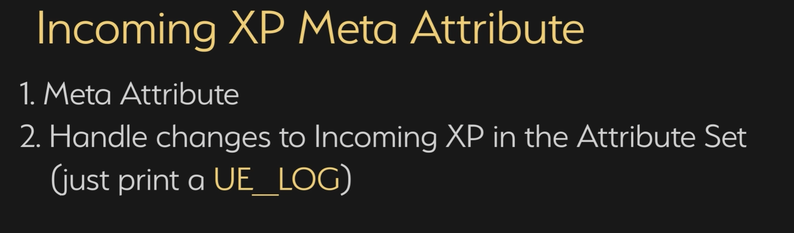

------

### 自己尝试一下

>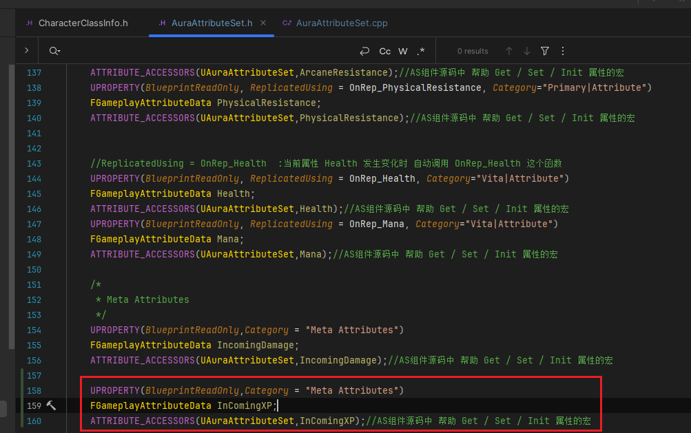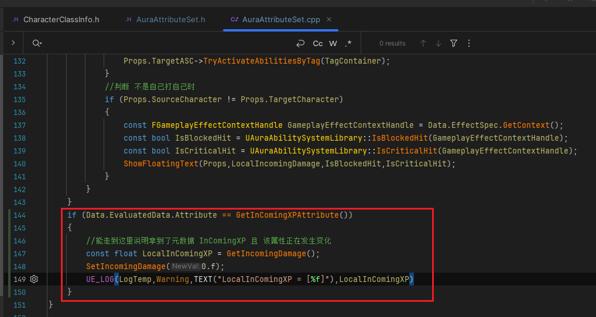
>
>
>
>```cpp
>UPROPERTY(BlueprintReadOnly,Category = "Meta Attributes")
>FGameplayAttributeData InComingXP;
>ATTRIBUTE_ACCESSORS(UAuraAttributeSet,InComingXP);//AS组件源码中 帮助 Get / Set / Init 属性的宏
>```
>
>
>
>#### 后处理函数 `PostGameplayEffectExecute` 中
>
>```cpp
>if (Data.EvaluatedData.Attribute == GetInComingXPAttribute())
>{
>   //能走到这里说明拿到了元数据 InComingXP 且 该属性正在发生变化
>   const float LocalInComingXP = GetIncomingDamage();
>   SetIncomingDamage(0.f);
>   UE_LOG(LogTemp,Warning,TEXT("LocalInComingXP = [%f]"),LocalInComingXP)
>}
>```

------

### 下一节

------

### 下面我们需要创建一个被动能力的GA，`GA_ListenForEvents`，用来监听 `GameplayEvent`，然后绑定 `SetByCaller` 并对目标应用GE。上一节总结过

------

#### 创建初始化被动技能文件夹，`Passive_Startup`
>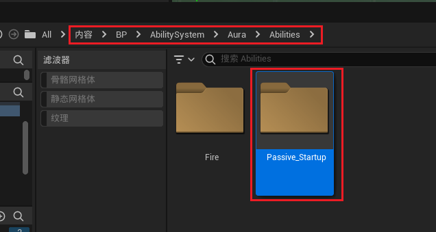

------

#### 创建GA
>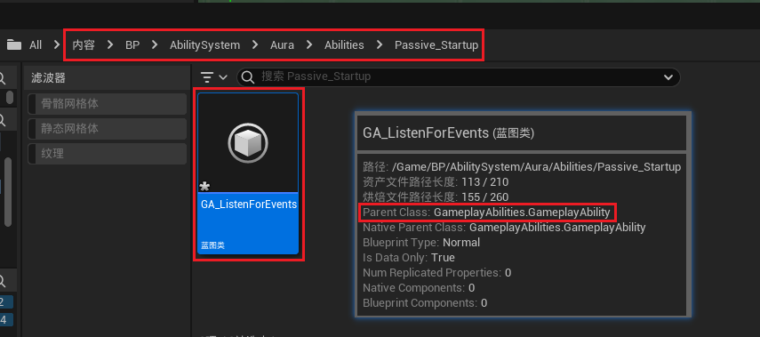

------

### 设置 `GA_ListenForEvents` 实例化策略 和 网络策略

>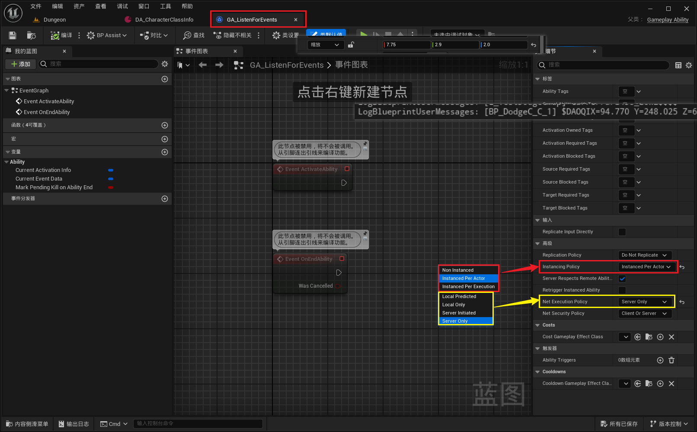

------

### 监听GameplayEventTag时，可以选择父节点Tag，这样就可以监听所有的子节点

>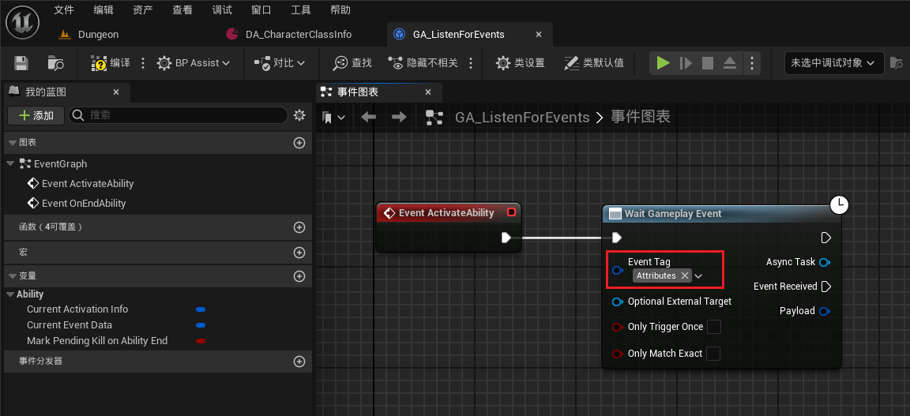

------

#### 只是介绍一下，这两个都不开启，分别为

>  - #### `OnlyTriggerOnce`
>
>    - #### **只触发一次**
>
>      - 这里 == false ，否则 可能会阻碍别的 `GameplayEvent` 触发
>
>  - #### `OnlyMachExact`
>
>    - #### **只精确匹配**
>
>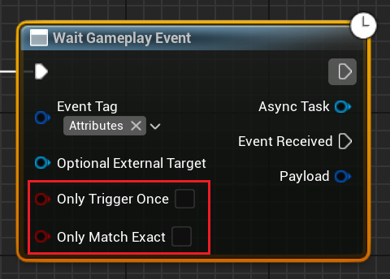

------

#### 后面我们将使用 `Payload` 发送和接受数据

>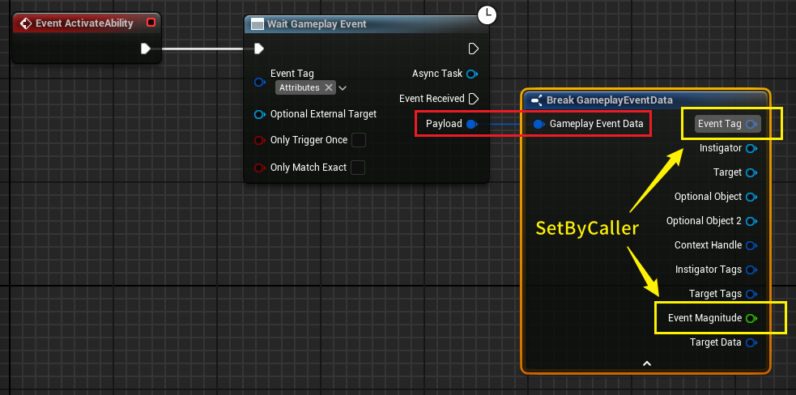

------

### 创建GE，命名为***GE_EventBasedEffect***

>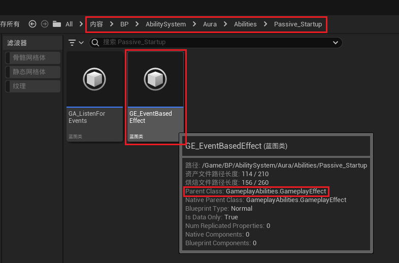

------

### 在GE中打算使用 `元属性` + `SetByCaller` 触发Tag

>- 接下来需要一个 `元属性Tag标签`
>
>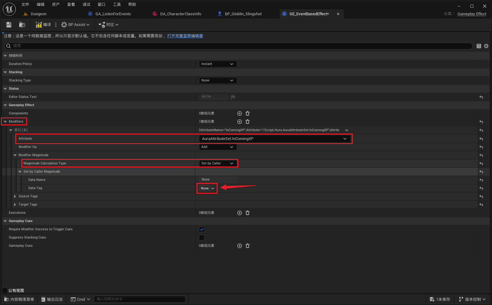

------

#### 创建 `元属性Tag标签`

>```cpp
>FGameplayTag Attributes_Meta_IncomingXP;    /* 元属性 经验值 */
>```
>
>```cpp
>/*
> * 元属性
> */
>GameplayTags.Attributes_Meta_IncomingXP = UGameplayTagsManager::Get().AddNativeGameplayTag(
>    FName("Attributes.Meta.IncomingXP"),
>    FString("Meta Attributes IncomingXP"));
>```
>
>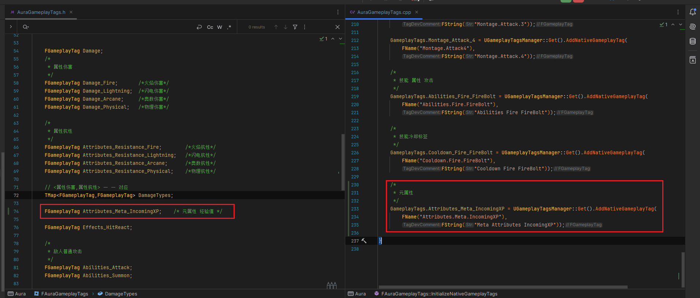

------

#### 回到GE中配置 `元属性Tag标签`

>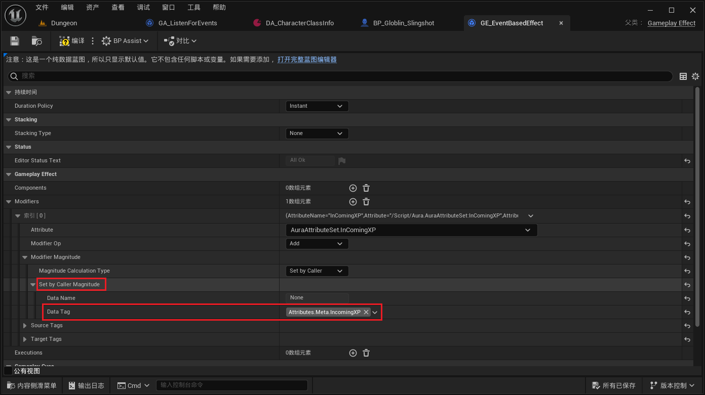

------

### 注意此时，因为传入的元属性为 `Attributes` 下的子Tag，所以会触发监听事件，又因为打算使用 `SetByCaller` 键值对触发，所以 `只有绑定的` 才会在后续自定义处理逻辑，(但是所有的属性变化都可以监听到！)

------

### GA中创建变量配置上面创建的 `GE的Class`

>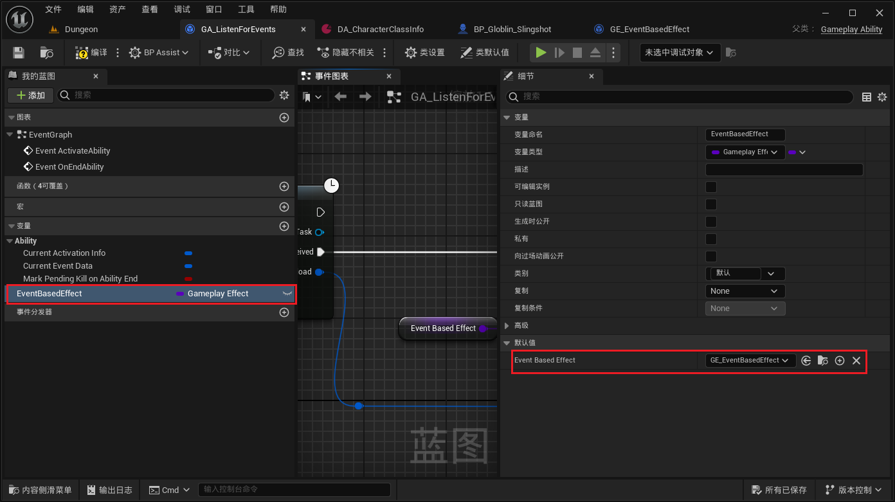

------

### 在GA中获取Owner的ASC，创建 `GE_Spec` ，并使用 `GE_Spec` 绑定 `SetByCaller` 键值对映射（Tag和float），然后应用GE

>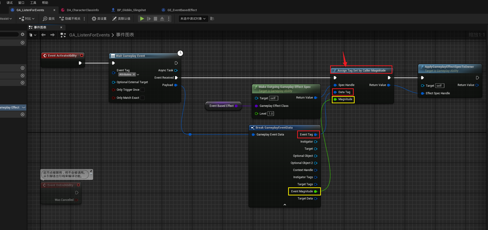

------

### 需要注意的是，我们并没有 `给与` 这个 `被动技能GA` ，所以需要让这个 `被动技能GA` `GiveAbility`并激活一次

>- #### **想在角色基类中配置一个初始时学习的被动技能数组，然后像学习主动技能一样，区别是：这里需要激活一次。**

------

#### 在角色基类中，创建被动技能的数组，命名为， `StartupPassiveAbilities`

>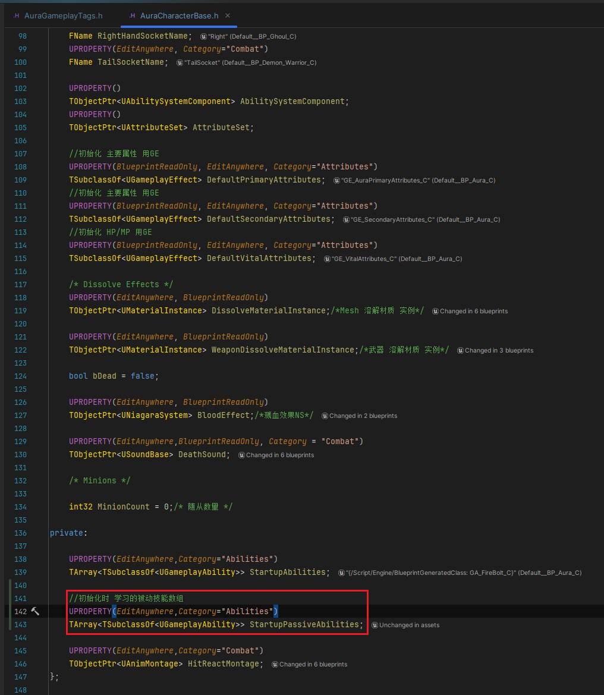
>
>- 这里折叠，找一下之前的技能学习方式步骤截图

------

#### ASC组件中创建添加被动技能的函数，命名为，`AddCharacterPassiveAbilities`

>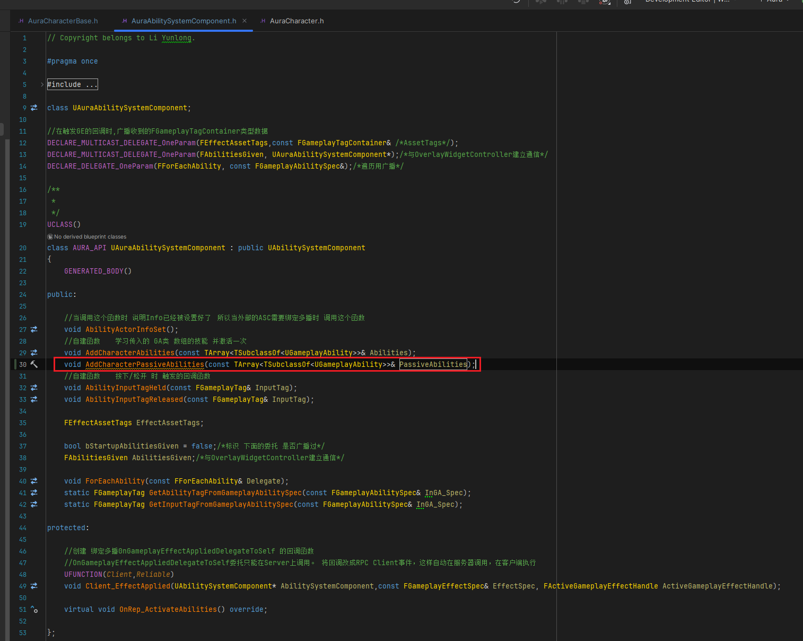

------

#### 在角色初始化给予技能后，也调用给与被动技能函数

>

------

### 角色中配置要学习的被动技能GA

>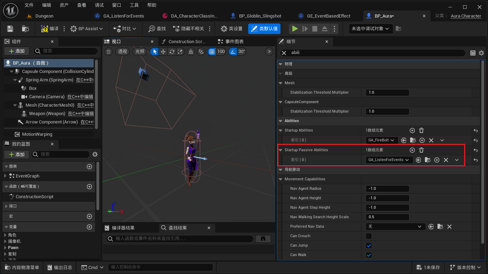

------

### 接下来，在激活技能时，打印测试

>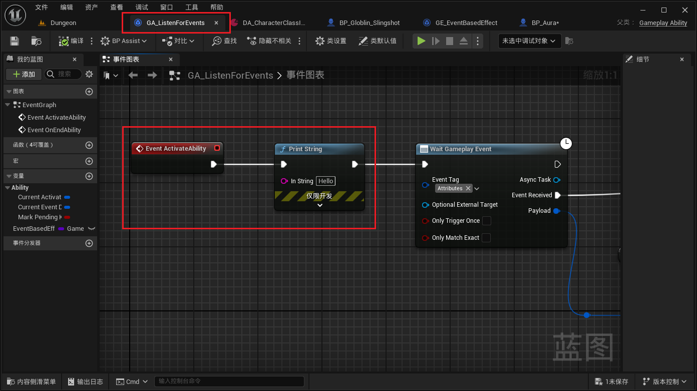

------

### 分别在单人/LS/DS模式下测试

>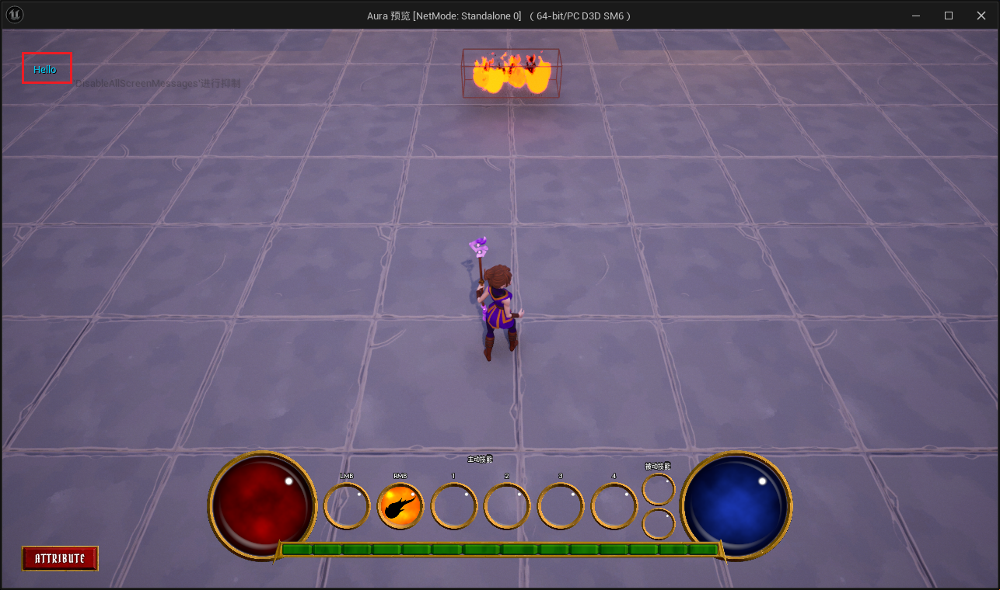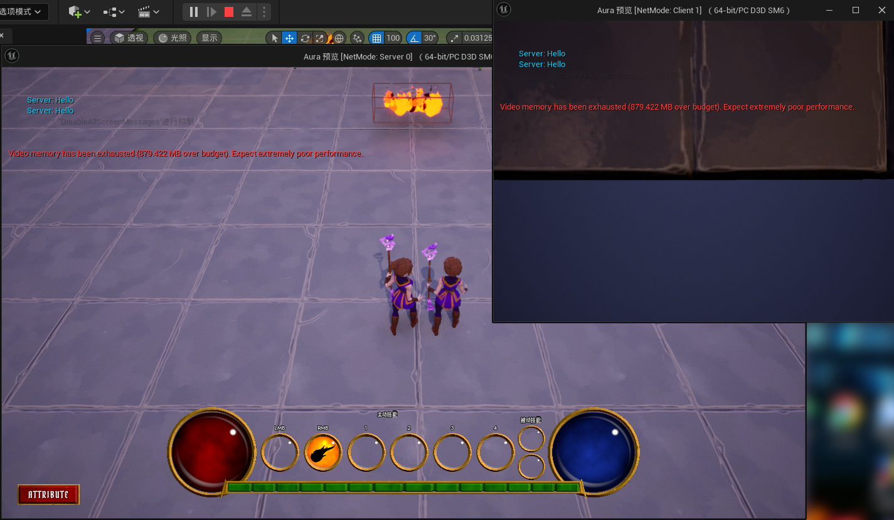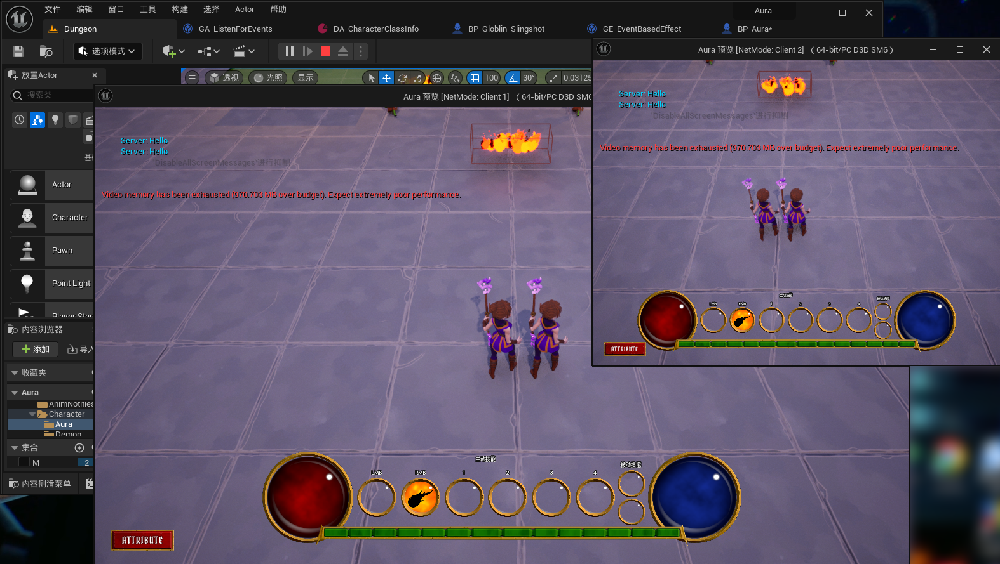


___________________________________________________________________________________________

[返回最上面](#Go主菜单)

___________________________________________________________________________________________