___________________________________________________________________________________________
###### [Go主菜单](../MainMenu.md)
___________________________________________________________________________________________

# GAS 123 C++中使用`UAbilitySystemBlueprintLibrary::SendGameplayEventToActor`发送GameplayEventTag给指定对象

___________________________________________________________________________________________

# 目录

- [GAS 123 C++中使用`UAbilitySystemBlueprintLibrary::SendGameplayEventToActor`发送GameplayEventTag给指定对象](#gas-123-c中使用uabilitysystemblueprintlibrarysendgameplayeventtoactor发送gameplayeventtag给指定对象)
- [目录](#目录)
    - [Mermaid整体思路梳理](#mermaid整体思路梳理)
    - [上节我们处理了监听事件，这节我们需要在 `AS` 中，敌人死亡时发送 `GameplayEventTag`](#上节我们处理了监听事件这节我们需要在-as-中敌人死亡时发送-gameplayeventtag)
    - [在 `AS` 中创建一个死亡时调用的函数，形参使用我们之前保存重要数据的结构体 `Props`，命名为，`SendXPEvent`](#在-as-中创建一个死亡时调用的函数形参使用我们之前保存重要数据的结构体-props命名为sendxpevent)
      - [函数中，需要获取敌人XP奖励，就需要调用之前在蓝图函数库中写好的函数(传入等级和敌人种类返回敌人XP奖励)](#函数中需要获取敌人xp奖励就需要调用之前在蓝图函数库中写好的函数传入等级和敌人种类返回敌人xp奖励)
        - [敌人等级和敌人的种类可以通过接口获取](#敌人等级和敌人的种类可以通过接口获取)
      - [接下来需要调用API发送 `GameplayEventTag`](#接下来需要调用api发送-gameplayeventtag)
    - [接下来，在敌人死亡时调用](#接下来在敌人死亡时调用)
    - [接下来在收到Tag时打印](#接下来在收到tag时打印)
    - [此时击杀敌人报错，原因是接口函数用错了](#此时击杀敌人报错原因是接口函数用错了)
    - [此时我们有两个打印](#此时我们有两个打印)
    - [测试结果](#测试结果)
      - [改成打印float测试](#改成打印float测试)
    - [测试没有问题，可以移除掉 `打印` 和 `UELOG` 了](#测试没有问题可以移除掉-打印-和-uelog-了)
    - [下一节，我们将处理UI中的逻辑](#下一节我们将处理ui中的逻辑)


___________________________________________________________________________________________

<details>
<summary>视频链接</summary>

[9. Sending XP Events_哔哩哔哩_bilibili](https://www.bilibili.com/video/BV1TH4y1L7NP/?p=55&spm_id_from=pageDriver&vd_source=9e1e64122d802b4f7ab37bd325a89e6c)

------

</details>

___________________________________________________________________________________________

### Mermaid整体思路梳理

Mermaid

___________________________________________________________________________________________

### 上节我们处理了监听事件，这节我们需要在 `AS` 中，敌人死亡时发送 `GameplayEventTag`

>#### **我们之前在这里处理了敌人的死亡**
>
>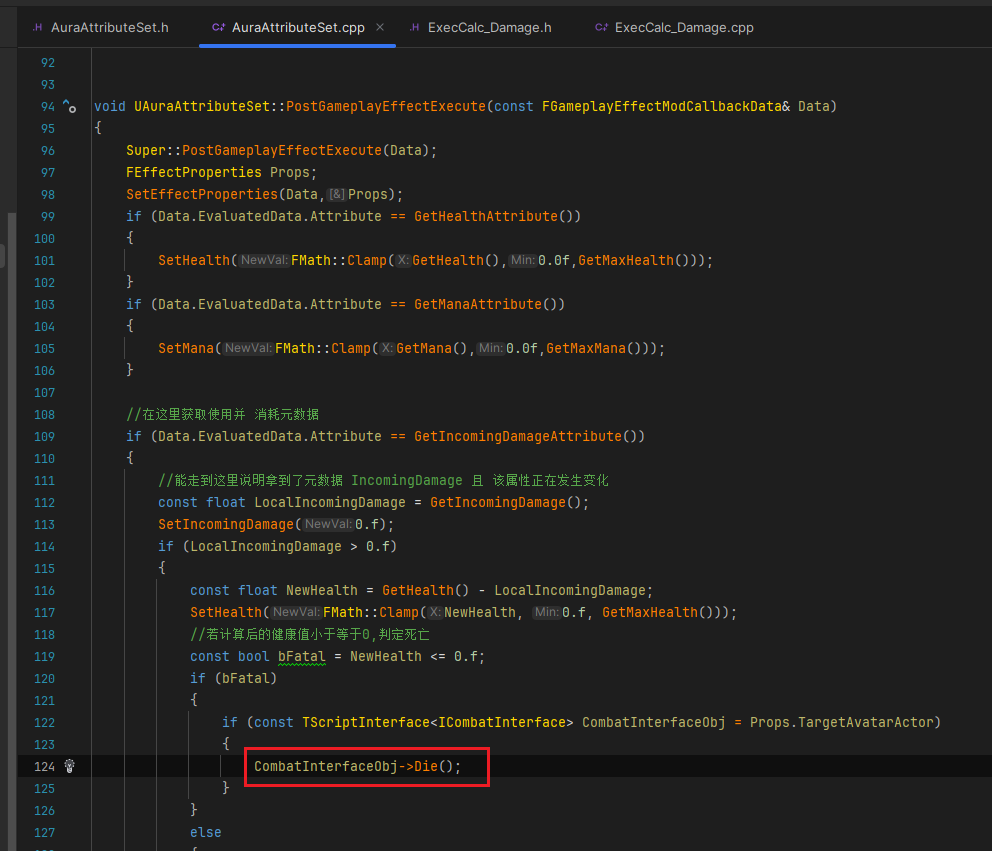

------

### 在 `AS` 中创建一个死亡时调用的函数，形参使用我们之前保存重要数据的结构体 `Props`，命名为，`SendXPEvent`

>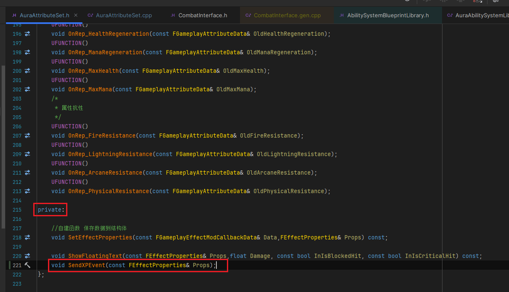
>
>```cpp
>private:
>    void SendXPEvent(const FEffectProperties& Props);
>```

------

#### 函数中，需要获取敌人XP奖励，就需要调用之前在蓝图函数库中写好的函数(传入等级和敌人种类返回敌人XP奖励)

------

##### 敌人等级和敌人的种类可以通过接口获取

>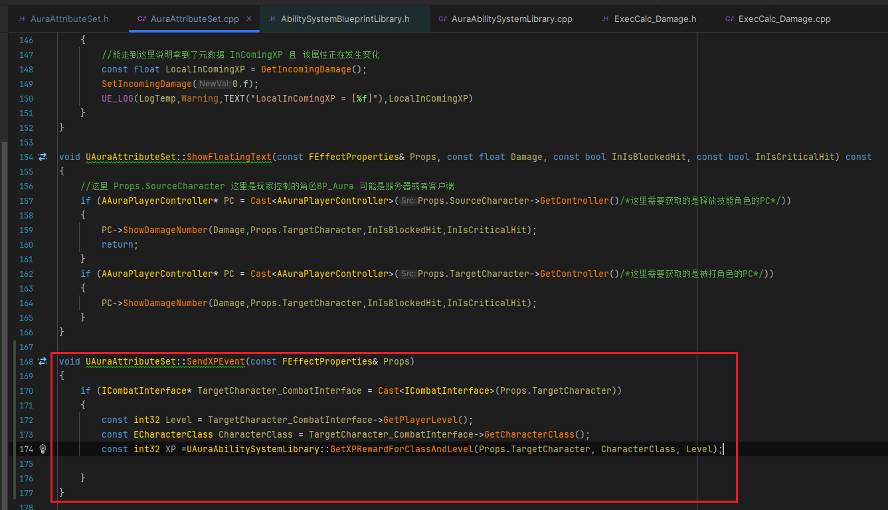
>
>```CPP
>void UAuraAttributeSet::SendXPEvent(const FEffectProperties& Props)
>{
>    if (ICombatInterface* TargetCharacter_CombatInterface = Cast<ICombatInterface>(Props.TargetCharacter))
>    {
>       const int32 Level = TargetCharacter_CombatInterface->GetPlayerLevel();
>		const ECharacterClass CharacterClass = TargetCharacter_CombatInterface->GetCharacterClass();
>		const int32 XP =UAuraAbilitySystemLibrary::GetXPRewardForClassAndLevel(Props.TargetCharacter, CharacterClass, Level);
>    }
>}
>```

------

#### 接下来需要调用API发送 `GameplayEventTag`

>   - #### **发送给谁**
>
>     - 需要一个 **目标**
>
>   - #### **发送的Tag**
>
>   - #### **`Payload`**
>
>     - 可以**传递参数**
>
>
>   ```cpp
>   UAbilitySystemBlueprintLibrary::SendGameplayEventToActor
>   ```
>
>   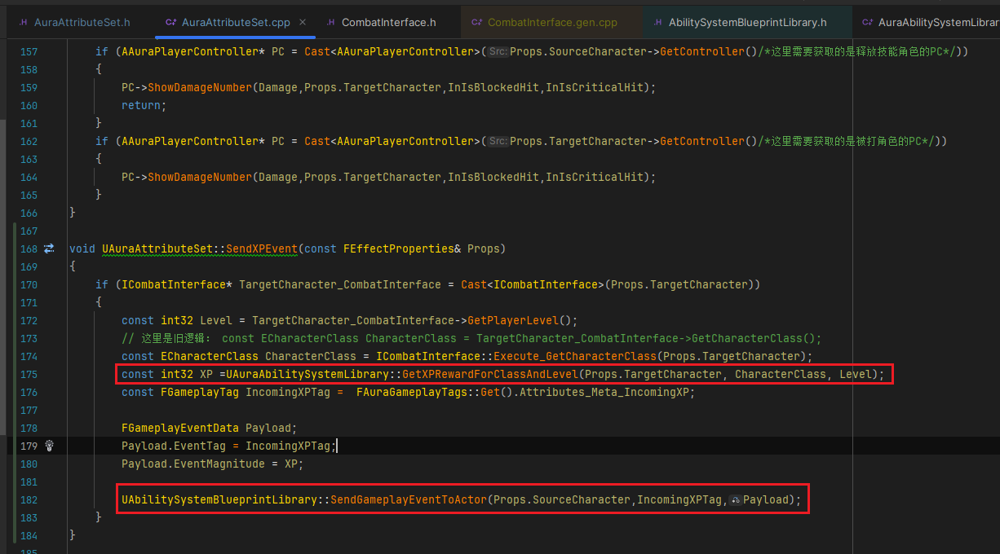
>
>   ```cpp
>   void UAuraAttributeSet::SendXPEvent(const FEffectProperties& Props)
>   {
>   	if (ICombatInterface* TargetCharacter_CombatInterface = Cast<ICombatInterface>(Props.TargetCharacter))
>   	{
>   		const int32 Level = TargetCharacter_CombatInterface->GetPlayerLevel();
>   		// 这里是旧逻辑： const ECharacterClass CharacterClass = TargetCharacter_CombatInterface->GetCharacterClass();
>   		const ECharacterClass CharacterClass = ICombatInterface::Execute_GetCharacterClass(Props.TargetCharacter);
>   		const int32 XP =UAuraAbilitySystemLibrary::GetXPRewardForClassAndLevel(Props.TargetCharacter, CharacterClass, Level);
>   		const FGameplayTag IncomingXPTag =  FAuraGameplayTags::Get().Attributes_Meta_IncomingXP;
>   		
>   		FGameplayEventData Payload;
>   		Payload.EventTag = IncomingXPTag;
>   		Payload.EventMagnitude = XP;
>   		
>   		UAbilitySystemBlueprintLibrary::SendGameplayEventToActor(Props.SourceCharacter,IncomingXPTag,Payload);
>   	}
>   }
>   ```

------

### 接下来，在敌人死亡时调用

>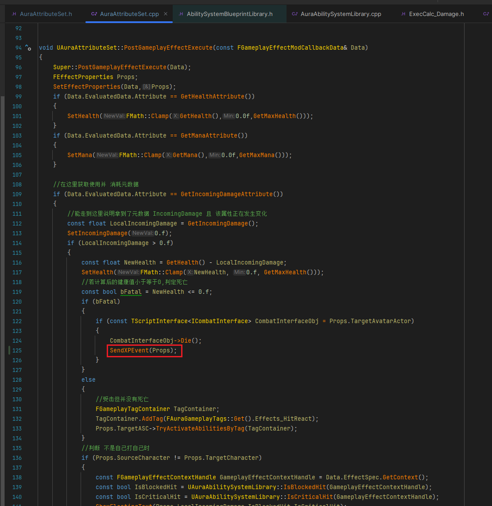

------

### 接下来在收到Tag时打印

>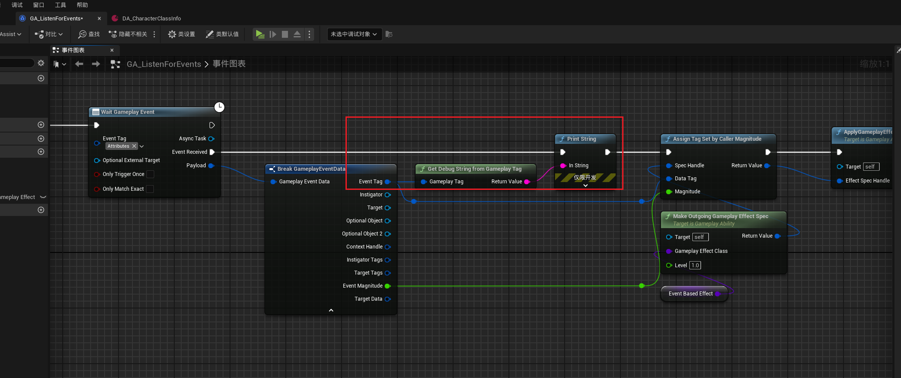

------

### 此时击杀敌人报错，原因是接口函数用错了

>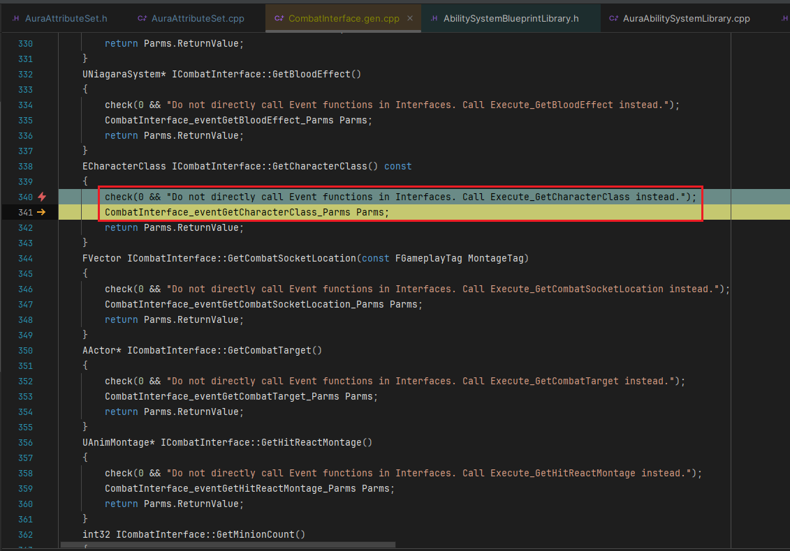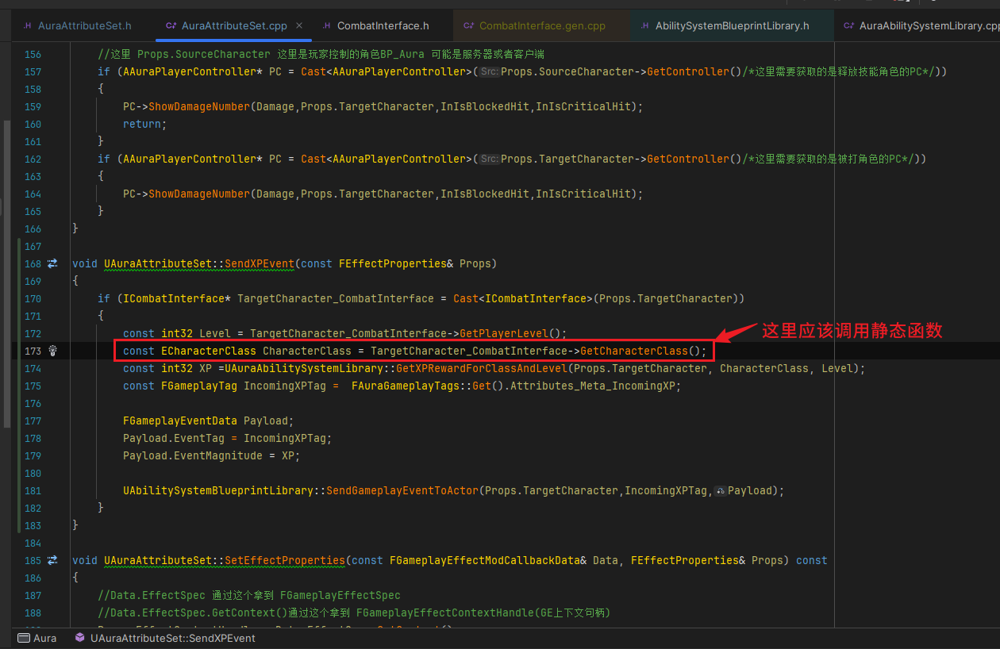
>
>- #### **需要修改成调用反射中的静态函数**
>
>#### 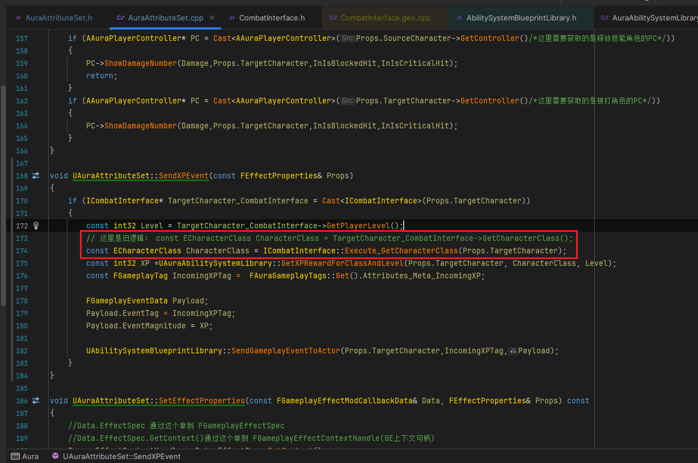

------

### 此时我们有两个打印

> 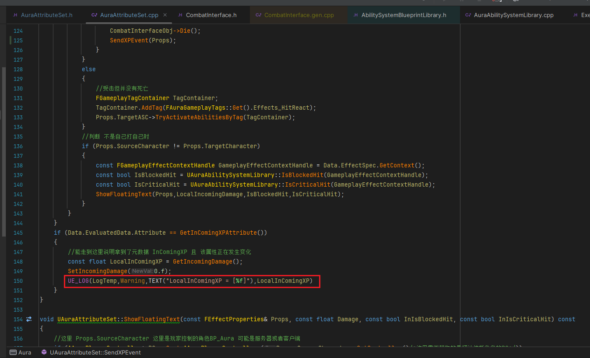

------

### 测试结果

>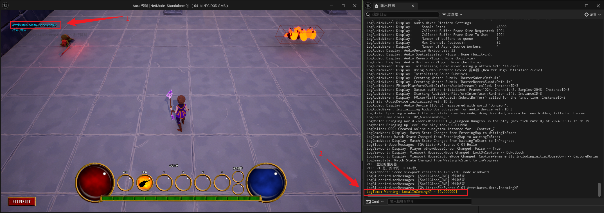

------

#### 改成打印float测试

>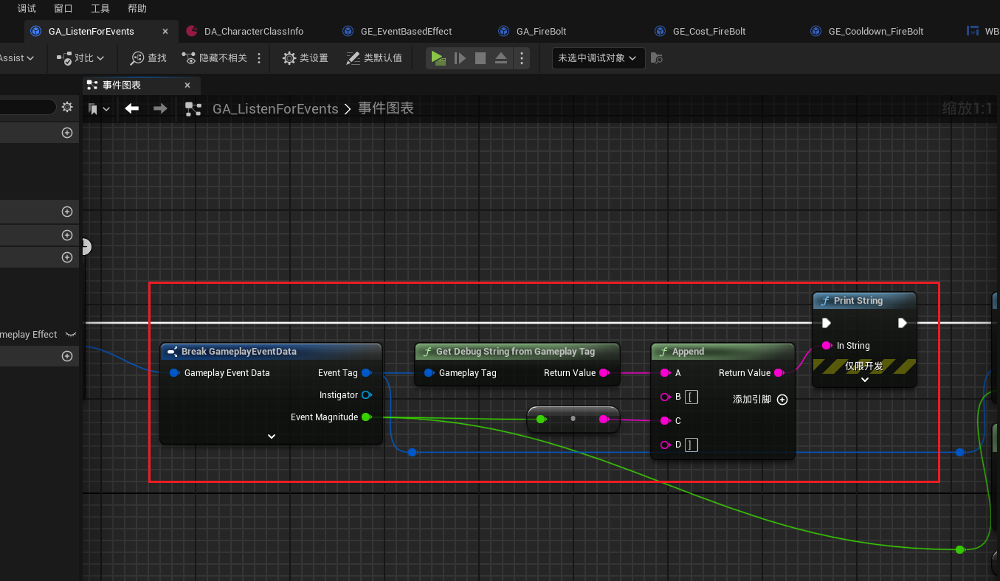

------

### 测试没有问题，可以移除掉 `打印` 和 `UELOG` 了

> 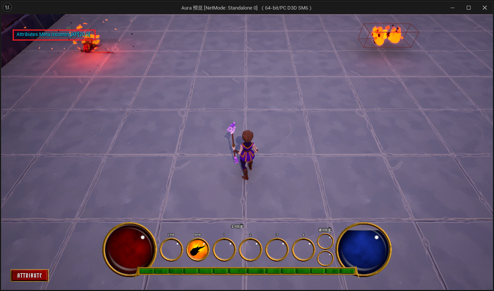

------

### 下一节，我们将处理UI中的逻辑


___________________________________________________________________________________________

[返回最上面](#Go主菜单)

___________________________________________________________________________________________