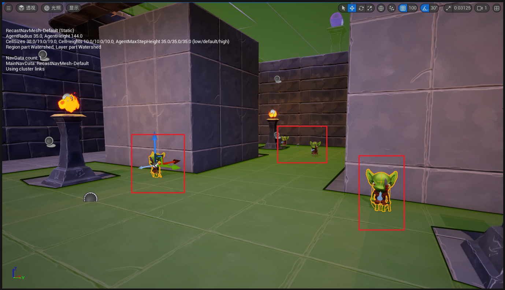

___________________________________________________________________________________________
###### [Go主菜单](../MainMenu.md)
___________________________________________________________________________________________

# GAS 124 创建玩家接口，解耦AS和PS，使用元属性在敌人死亡时传递float

___________________________________________________________________________________________

## 处理关键点

1. 在AS中处理击杀敌人后的死亡和升级事件


___________________________________________________________________________________________

# 目录


- [GAS 124 创建玩家接口，解耦AS和PS，使用元属性在敌人死亡时传递float](#gas-124-创建玩家接口解耦as和ps使用元属性在敌人死亡时传递float)
  - [处理关键点](#处理关键点)
- [目录](#目录)
    - [Mermaid整体思路梳理](#mermaid整体思路梳理)
    - [我们现在是使用元属性，在击杀敌人时，获取了元属性的数值，但是如果想要给玩家升级，就需要调用PS，但是这会让AS和PS之间耦合，可是不想这么耦合。就需要使用接口来完成一系列操作](#我们现在是使用元属性在击杀敌人时获取了元属性的数值但是如果想要给玩家升级就需要调用ps但是这会让as和ps之间耦合可是不想这么耦合就需要使用接口来完成一系列操作)
    - [为玩家创建接口类，命名为，`PlayerInteraction`](#为玩家创建接口类命名为playerinteraction)
    - [接口中创建函数，添加XP函数，`AddToXP` 因为不打算在蓝图中使用，就不要加多余的宏](#接口中创建函数添加xp函数addtoxp-因为不打算在蓝图中使用就不要加多余的宏)
    - [玩家基类中继承该接口，重写接口函数](#玩家基类中继承该接口重写接口函数)
    - [AS中，拿到元属性时，需要判断目标是否实现接口，将元属性作为参数传递给 `AddToXP`](#as中拿到元属性时需要判断目标是否实现接口将元属性作为参数传递给-addtoxp)
    - [现在回顾一下，我们在XP改变时，会触发广播，在这里](#现在回顾一下我们在xp改变时会触发广播在这里)
    - [所以接下来需要在蓝图的经验条UI中，绑定动态多播](#所以接下来需要在蓝图的经验条ui中绑定动态多播)
    - [此时运行测试，触发断点](#此时运行测试触发断点)
    - [因为之前没有在PS中配置 `包含升级用的结构体的数据资产` ***DA\_LevelUpInfo***](#因为之前没有在ps中配置-包含升级用的结构体的数据资产-da_levelupinfo)
    - [别忘了先把XP条UI百分比清零](#别忘了先把xp条ui百分比清零)
    - [测试gif](#测试gif)
    - [普攻的火球间隔太长了，改为 `0.5s`](#普攻的火球间隔太长了改为-05s)
    - [多放一些AI，然后保证 `NavMesh导航` 覆盖整个场景](#多放一些ai然后保证-navmesh导航-覆盖整个场景)
    - [刚打死一只，没蓝了](#刚打死一只没蓝了)
    - [把火球的魔法消耗调低一些，1级差不多-2.5的样子就可以了](#把火球的魔法消耗调低一些1级差不多-25的样子就可以了)
    - [测试gif](#测试gif-1)
    - [下一节，我们来处理升级的逻辑](#下一节我们来处理升级的逻辑)


___________________________________________________________________________________________

<details>
<summary>视频链接</summary>

[10. Showing XP in the HUD_哔哩哔哩_bilibili](https://www.bilibili.com/video/BV1TH4y1L7NP/?p=56&spm_id_from=pageDriver&vd_source=9e1e64122d802b4f7ab37bd325a89e6c)

------

</details>

___________________________________________________________________________________________

### Mermaid整体思路梳理

Mermaid

___________________________________________________________________________________________

### 我们现在是使用元属性，在击杀敌人时，获取了元属性的数值，但是如果想要给玩家升级，就需要调用PS，但是这会让AS和PS之间耦合，可是不想这么耦合。就需要使用接口来完成一系列操作
> #### **我们之前只是制作了 `ICombatInteraction`，但是这个更像是给角色基类使用的通用函数，如果涉及到PS，敌人是没有的，所以需要为玩家创建接口类**

------

### 为玩家创建接口类，命名为，`PlayerInteraction`

>
------

### 接口中创建函数，添加XP函数，`AddToXP` 因为不打算在蓝图中使用，就不要加多余的宏

>
>
>```cpp
>public:
>    
>    UFUNCTION(BlueprintNativeEvent)
>    void AddToXP(int32 InXP);
>
>```
------

### 玩家基类中继承该接口，重写接口函数

>

>
>
>```cpp
>void AAuraCharacter::AddToXP_Implementation(int32 InXP)
>{
>    //第一步先拿到PS
>    const TObjectPtr<AAuraPlayerState> AuraPlayerState = GetPlayerState<AAuraPlayerState>();
>    check(AuraPlayerState);
>    AuraPlayerState->AddXP(InXP);
>}
>```
------

### AS中，拿到元属性时，需要判断目标是否实现接口，将元属性作为参数传递给 `AddToXP` 

>
>
>- #### **项目设定是：只有玩家可以升级，敌人不能，所以需要判断这个接口**
------

### 现在回顾一下，我们在XP改变时，会触发广播，在这里

>
------

### 所以接下来需要在蓝图的经验条UI中，绑定动态多播

>

------

### 此时运行测试，触发断点

>
------

### 因为之前没有在PS中配置 `包含升级用的结构体的数据资产` ***DA_LevelUpInfo***

>
------

### 别忘了先把XP条UI百分比清零

> 

------

### 测试gif

>
------

### 普攻的火球间隔太长了，改为 `0.5s`

>
------

### 多放一些AI，然后保证 `NavMesh导航` 覆盖整个场景

>
------

### 刚打死一只，没蓝了

>
------

### 把火球的魔法消耗调低一些，1级差不多-2.5的样子就可以了

>
------

### 测试gif

>
------

### 下一节，我们来处理升级的逻辑


___________________________________________________________________________________________

[返回最上面](#Go主菜单)

___________________________________________________________________________________________