___________________________________________________________________________________________
###### [Go主菜单](../MainMenu.md)
___________________________________________________________________________________________

# GAS 126 创建MVC中 C 和 V 通信的逻辑

___________________________________________________________________________________________

# 目录


- [GAS 126 创建MVC中 C 和 V 通信的逻辑](#gas-126-创建mvc中-c-和-v-通信的逻辑)
- [目录](#目录)
    - [Mermaid整体思路梳理](#mermaid整体思路梳理)
    - [我们之前在PS上的XP变量发生变化时，进行广播(广播给蓝图)，在这里，但是Level还没有处理(没有创建广播给蓝图的动态多播)，所以需要声明一个等级的动态多播，当然等创建以后，不光等级，属性点、技能点也可以使用同步](#我们之前在ps上的xp变量发生变化时进行广播广播给蓝图在这里但是level还没有处理没有创建广播给蓝图的动态多播所以需要声明一个等级的动态多播当然等创建以后不光等级属性点技能点也可以使用同步)
    - [在 `OverlayWidgetController` 中 声明一个动态多播，用来广播一个整型，这样 `等级`、`技能点`、`属性点` 都可以使用](#在-overlaywidgetcontroller-中-声明一个动态多播用来广播一个整型这样-等级技能点属性点-都可以使用)
    - [在类中，声明了一个委托变量，命名为，`OnPlayerLevelChangedDelegate`](#在类中声明了一个委托变量命名为onplayerlevelchangeddelegate)
    - [打算广播level，回调绑定使用lambda](#打算广播level回调绑定使用lambda)
    - [接下来，在蓝图中复制一个 ***WBP\_SpellGlobe*** ，命名为， ***WBP\_ValueGlobe***](#接下来在蓝图中复制一个-wbp_spellglobe-命名为-wbp_valueglobe)
      - [移除不用的组件，然后删除不用的函数和逻辑](#移除不用的组件然后删除不用的函数和逻辑)
    - [触发 `WidgetControllerSet` 后绑定委托](#触发-widgetcontrollerset-后绑定委托)
    - [拖入 ***WBP\_Overlay***](#拖入-wbp_overlay)
    - [我们可以临时提高敌人的奖励经验，然后测试](#我们可以临时提高敌人的奖励经验然后测试)
    - [之前我的计算方式有问题需要改下](#之前我的计算方式有问题需要改下)
      - [击杀敌人测试gif](#击杀敌人测试gif)
    - [再创建一个玩家的头像WBP](#再创建一个玩家的头像wbp)
      - [运行时](#运行时)


___________________________________________________________________________________________

<details>
<summary>视频链接</summary>

[13. Showing Level in the HUD_哔哩哔哩_bilibili](https://www.bilibili.com/video/BV1TH4y1L7NP?p=59&vd_source=9e1e64122d802b4f7ab37bd325a89e6c)

------

</details>

___________________________________________________________________________________________

### Mermaid整体思路梳理

Mermaid

___________________________________________________________________________________________

### 我们之前在PS上的XP变量发生变化时，进行广播(广播给蓝图)，在这里，但是Level还没有处理(没有创建广播给蓝图的动态多播)，所以需要声明一个等级的动态多播，当然等创建以后，不光等级，属性点、技能点也可以使用同步

>#### **只广播经验没有广播等级**
>
>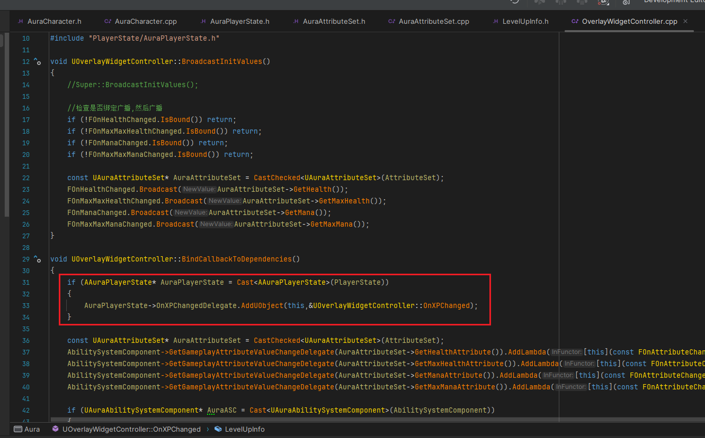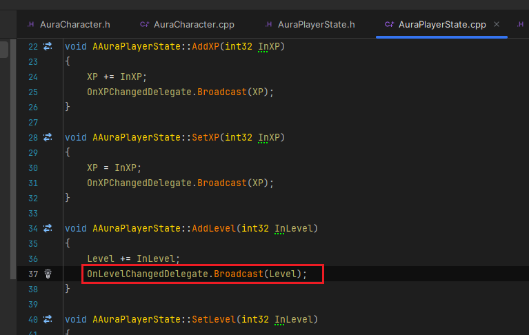
------

### 在 `OverlayWidgetController` 中 声明一个动态多播，用来广播一个整型，这样 `等级`、`技能点`、`属性点` 都可以使用

>- #### 命名为，`FOnPlayerLevelChangedSignature`
>
>```cpp
>//整型 的 广播 (用来同步 等级/技能点/属性点 等)
>DECLARE_DYNAMIC_MULTICAST_DELEGATE_OneParam(FOnPlayerLevelChangedSignature, int32, NewValue);
>```
>
>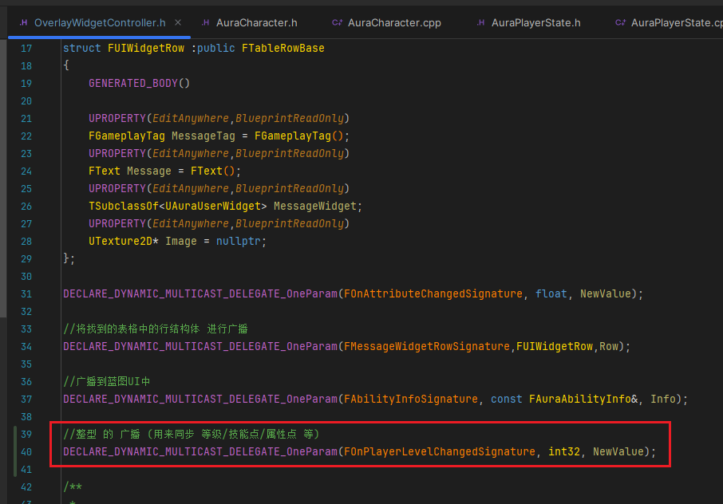
------

### 在类中，声明了一个委托变量，命名为，`OnPlayerLevelChangedDelegate`

>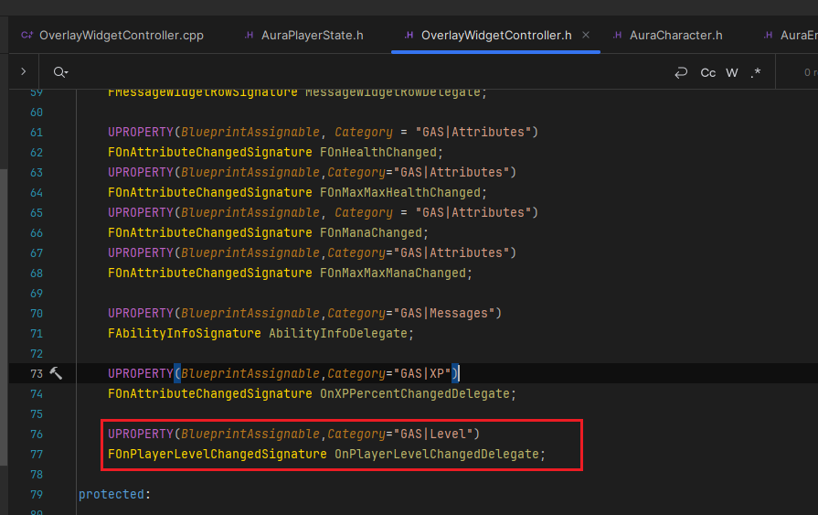
>
>```cpp
>public:
>    
>    UPROPERTY(BlueprintAssignable,Category="GAS|Level")
>    FOnPlayerLevelChangedSignature OnPlayerLevelChangedDelegate;
>    
>```
------

### 打算广播level，回调绑定使用lambda

>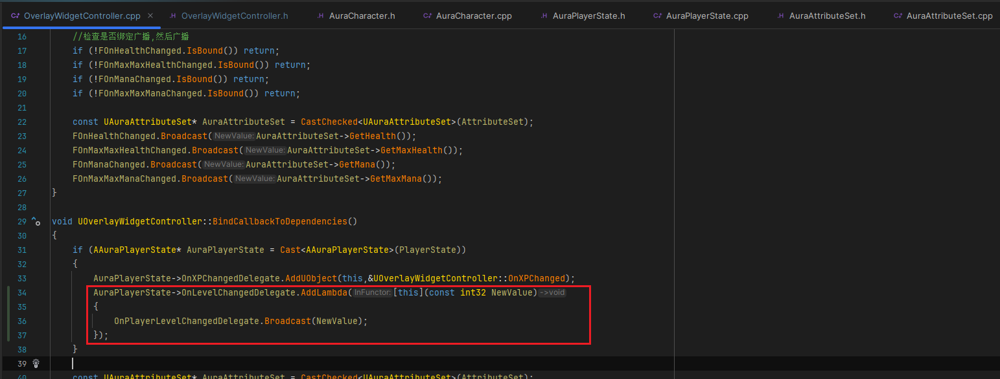
>
>```cpp
>AuraPlayerState->OnLevelChangedDelegate.AddLambda([this](const int32 NewValue)
>{
>    OnPlayerLevelChangedDelegate.Broadcast(NewValue);
>});
>```
------

### 接下来，在蓝图中复制一个 ***WBP_SpellGlobe*** ，命名为， ***WBP_ValueGlobe***
------

#### 移除不用的组件，然后删除不用的函数和逻辑

>- 看着搞，反正不要技能图标了，
>
>- 然后背景使用这个
>
>  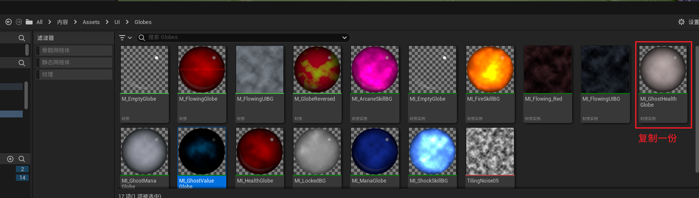
>
>- 差不多是这个样子
>
>  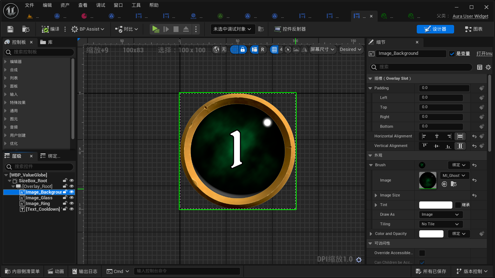
------

### 触发 `WidgetControllerSet` 后绑定委托

>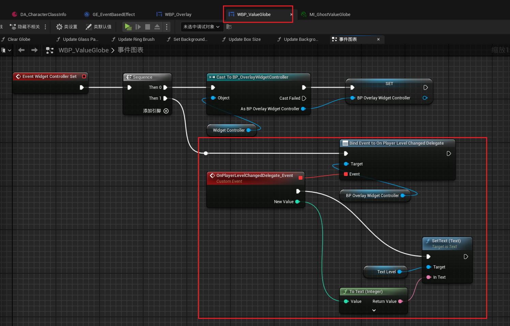
------

### 拖入 ***WBP_Overlay***

>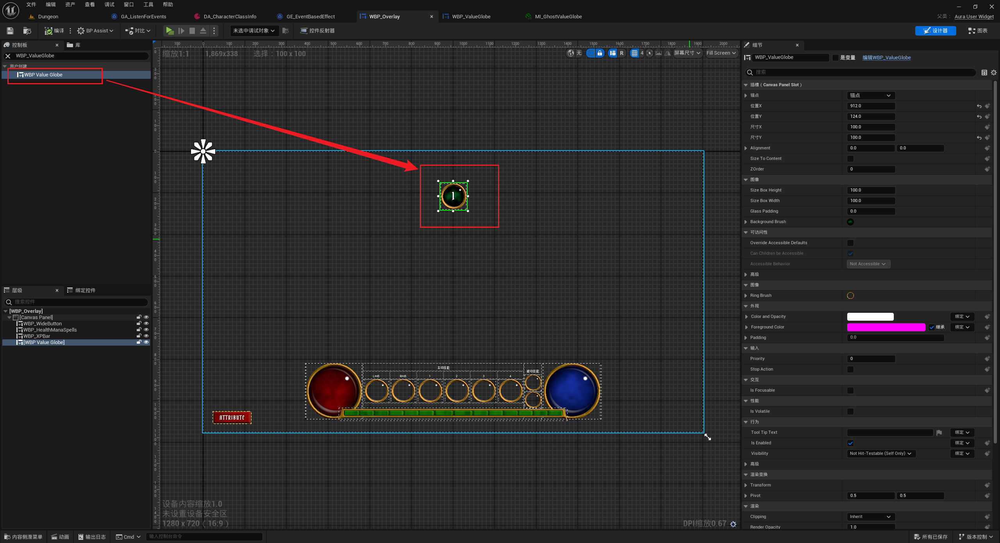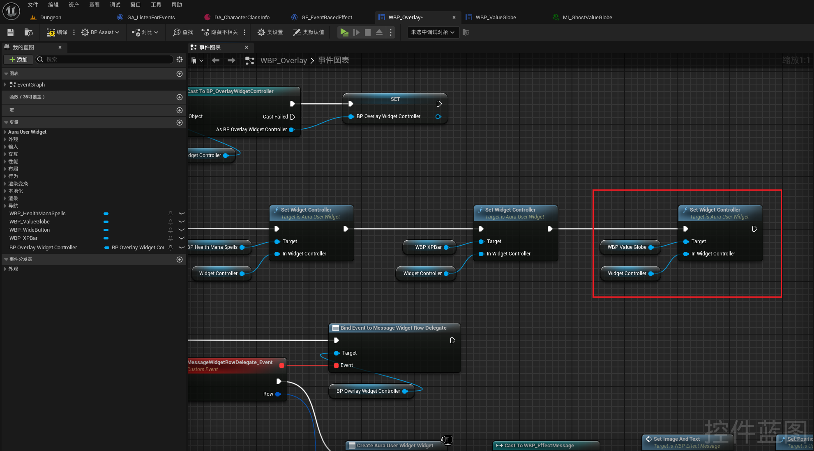
------

### 我们可以临时提高敌人的奖励经验，然后测试

>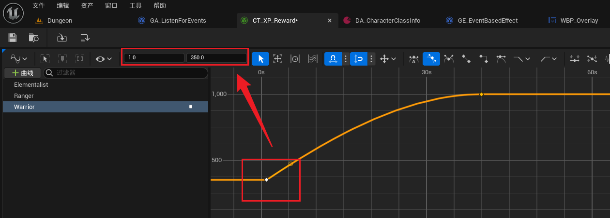
------

### 之前我的计算方式有问题需要改下

> 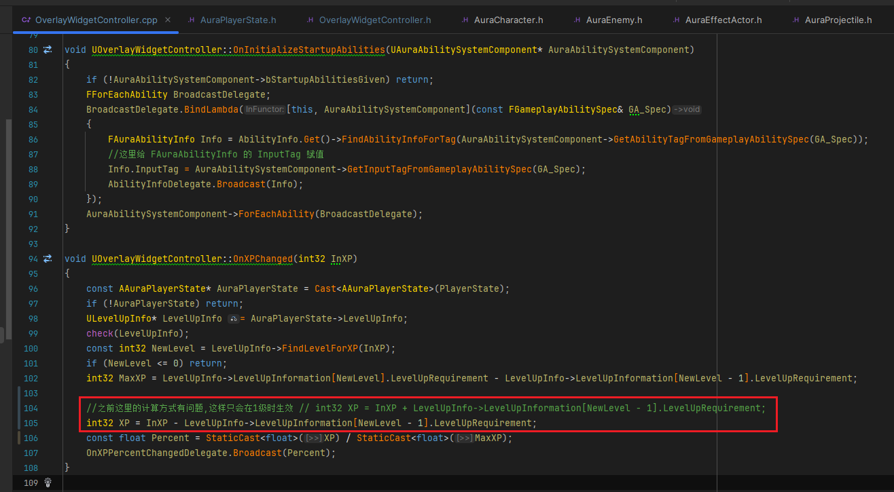
>
> ```CPP
> void UOverlayWidgetController::OnXPChanged(int32 InXP)
> {
> 	const AAuraPlayerState* AuraPlayerState = Cast<AAuraPlayerState>(PlayerState);
> 	if (!AuraPlayerState) return;
> 	ULevelUpInfo* LevelUpInfo = AuraPlayerState->LevelUpInfo;
> 	check(LevelUpInfo);
> 	const int32 NewLevel = LevelUpInfo->FindLevelForXP(InXP);
> 	if (NewLevel <= 0) return;
> 	int32 MaxXP = LevelUpInfo->LevelUpInformation[NewLevel].LevelUpRequirement - LevelUpInfo->LevelUpInformation[NewLevel - 1].LevelUpRequirement;
> 	int32 XP = InXP - LevelUpInfo->LevelUpInformation[NewLevel - 1].LevelUpRequirement;
> 	const float Percent = StaticCast<float>(XP) / StaticCast<float>(MaxXP);
> 	OnXPPercentChangedDelegate.Broadcast(Percent);
> }
> ```

------

#### 击杀敌人测试gif

>
------

### 再创建一个玩家的头像WBP

>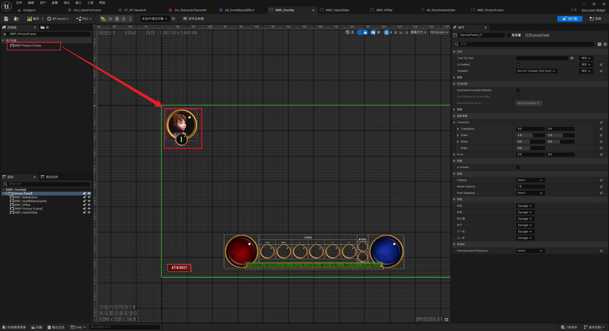
------

#### 运行时

>


___________________________________________________________________________________________

[返回最上面](#Go主菜单)

___________________________________________________________________________________________