___________________________________________________________________________________________
###### [Go主菜单](../MainMenu.md)
___________________________________________________________________________________________

# GAS 127 创建 升级NS特效，使用 `RPC` `Mutlicast` 触发；重构弹簧臂和相机为C++组件

___________________________________________________________________________________________

## 处理关键点

1. NS组件创建和激活的流程


___________________________________________________________________________________________

# 目录


- [GAS 127 创建 升级NS特效，使用 `RPC` `Mutlicast` 触发；重构弹簧臂和相机为C++组件](#gas-127-创建-升级ns特效使用-rpc-mutlicast-触发重构弹簧臂和相机为c组件)
  - [处理关键点](#处理关键点)
- [目录](#目录)
    - [Mermaid整体思路梳理](#mermaid整体思路梳理)
    - [现在升级效果有点干，就是一个细小的数字变化，需要特效，所以接下来我们需要创建和使用升级需要的NS特效](#现在升级效果有点干就是一个细小的数字变化需要特效所以接下来我们需要创建和使用升级需要的ns特效)
      - [特效路径](#特效路径)
    - [玩家基类中，创建NS组件，命名为，`LevelUpNiagaraComponent`](#玩家基类中创建ns组件命名为levelupniagaracomponent)
    - [构造中创建组件，需要注意：NS组件需要设置为不自动激活，也就是 `NS组件->bAutoActivate = false;`](#构造中创建组件需要注意ns组件需要设置为不自动激活也就是-ns组件-bautoactivate--false)
    - [如果是升级特效，首先需要明白，这个是特效是希望在所有的端之间进行同步的，也就是服务器和客户端都需要，所以需要使用多播( `NetMulticast` )](#如果是升级特效首先需要明白这个是特效是希望在所有的端之间进行同步的也就是服务器和客户端都需要所以需要使用多播-netmulticast-)
      - [玩家基类中创建私有 多播](#玩家基类中创建私有-多播)
      - [检查一下组件是否有效，然后就激活组件](#检查一下组件是否有效然后就激活组件)
    - [在角色上配置NS](#在角色上配置ns)
    - [此时升级gif](#此时升级gif)
      - [有个问题，升级的NS是面向角色，并不是相机，所以需要设置NS旋转](#有个问题升级的ns是面向角色并不是相机所以需要设置ns旋转)
    - [这里 在玩家基类上，添加了弹簧臂和相机组件](#这里-在玩家基类上添加了弹簧臂和相机组件)
      - [上面设置的是这里，需要使用C++的组件替换蓝图的，注意不要把Box删了](#上面设置的是这里需要使用c的组件替换蓝图的注意不要把box删了)
    - [使用相机的位置和NS特效的位置计算旋转，然后设置NS的旋转](#使用相机的位置和ns特效的位置计算旋转然后设置ns的旋转)
    - [测试gif](#测试gif)
    - [LS客户端测试gif](#ls客户端测试gif)
    - [LS客户端升级，服务器视角gif看效果是否有问题](#ls客户端升级服务器视角gif看效果是否有问题)
    - [有个顾虑是，升级后立马旋转，可能会带着NS一起旋转，测试一下](#有个顾虑是升级后立马旋转可能会带着ns一起旋转测试一下)
      - [测试gif，还好](#测试gif还好)


___________________________________________________________________________________________

<details>
<summary>视频链接</summary>

[14. Level Up Niagara System_哔哩哔哩_bilibili](https://www.bilibili.com/video/BV1TH4y1L7NP?p=60&spm_id_from=pageDriver&vd_source=9e1e64122d802b4f7ab37bd325a89e6c)

------

</details>

___________________________________________________________________________________________

### Mermaid整体思路梳理

Mermaid

___________________________________________________________________________________________


### 现在升级效果有点干，就是一个细小的数字变化，需要特效，所以接下来我们需要创建和使用升级需要的NS特效
------

#### 特效路径

>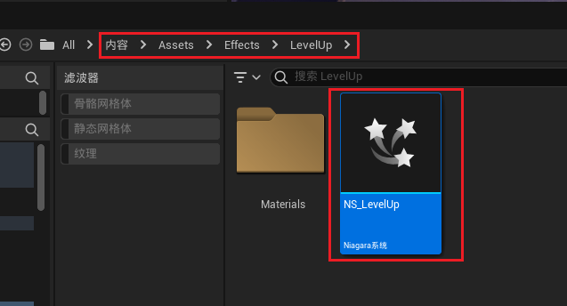
------

### 玩家基类中，创建NS组件，命名为，`LevelUpNiagaraComponent`

>```cpp
>public:
>    UPROPERTY(EditDefaultsOnly, BlueprintReadOnly)
>    TObjectPtr<UNiagaraComponent> LevelUpNiagaraComponent;
>```
>
>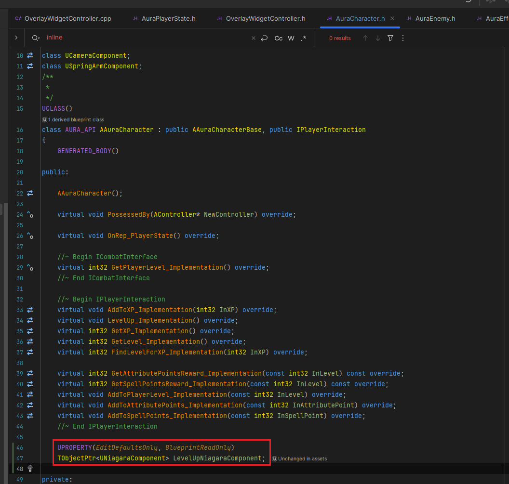
------

### 构造中创建组件，需要注意：NS组件需要设置为不自动激活，也就是 `NS组件->bAutoActivate = false;`

>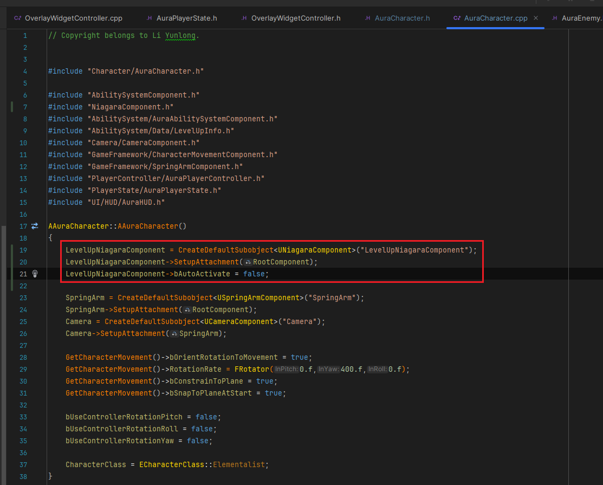
>
>```cpp
>LevelUpNiagaraComponent = CreateDefaultSubobject<UNiagaraComponent>("LevelUpNiagaraComponent");
>LevelUpNiagaraComponent->SetupAttachment(RootComponent);
>LevelUpNiagaraComponent->bAutoActivate = false;
>```
------

### 如果是升级特效，首先需要明白，这个是特效是希望在所有的端之间进行同步的，也就是服务器和客户端都需要，所以需要使用多播( `NetMulticast` )
------

#### 玩家基类中创建私有 多播

>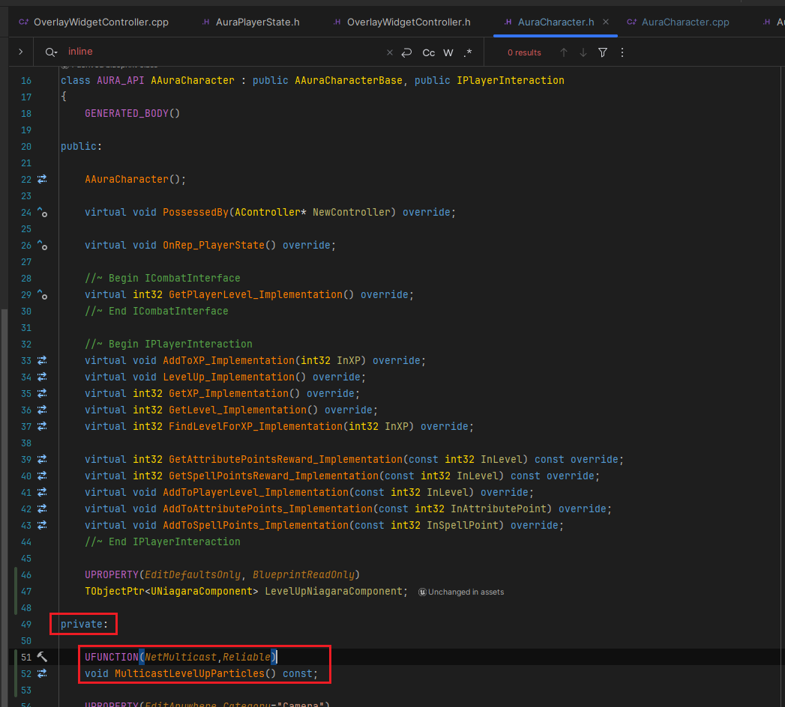
>
>```cpp
>private:
>
>    UFUNCTION(NetMulticast,Reliable)
>    void MulticastLevelUpParticles() const;
>    
>```
------

#### 检查一下组件是否有效，然后就激活组件

>```cpp
>void AAuraCharacter::MulticastLevelUpParticles_Implementation() const
>{
>    if (IsValid(LevelUpNiagaraComponent))
>    {
>       LevelUpNiagaraComponent->SetActive(true);
>    }
>}
>```
>
>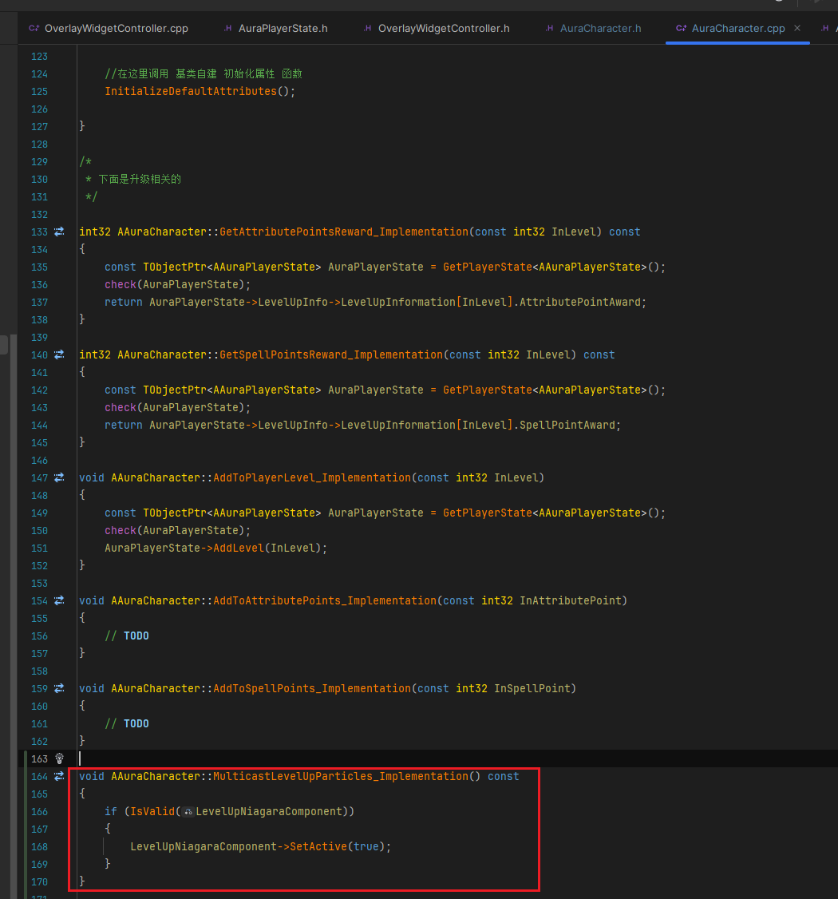
>
>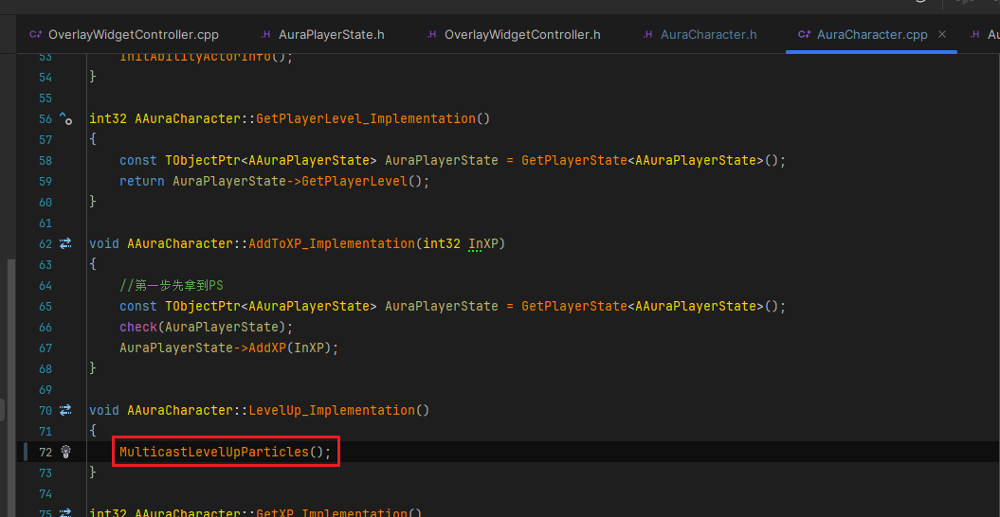
------

### 在角色上配置NS

>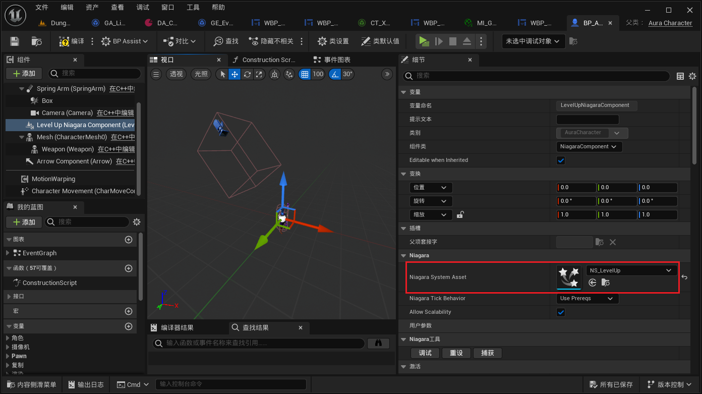
------

### 此时升级gif

>
------

#### 有个问题，升级的NS是面向角色，并不是相机，所以需要设置NS旋转
------

### 这里 在玩家基类上，添加了弹簧臂和相机组件

>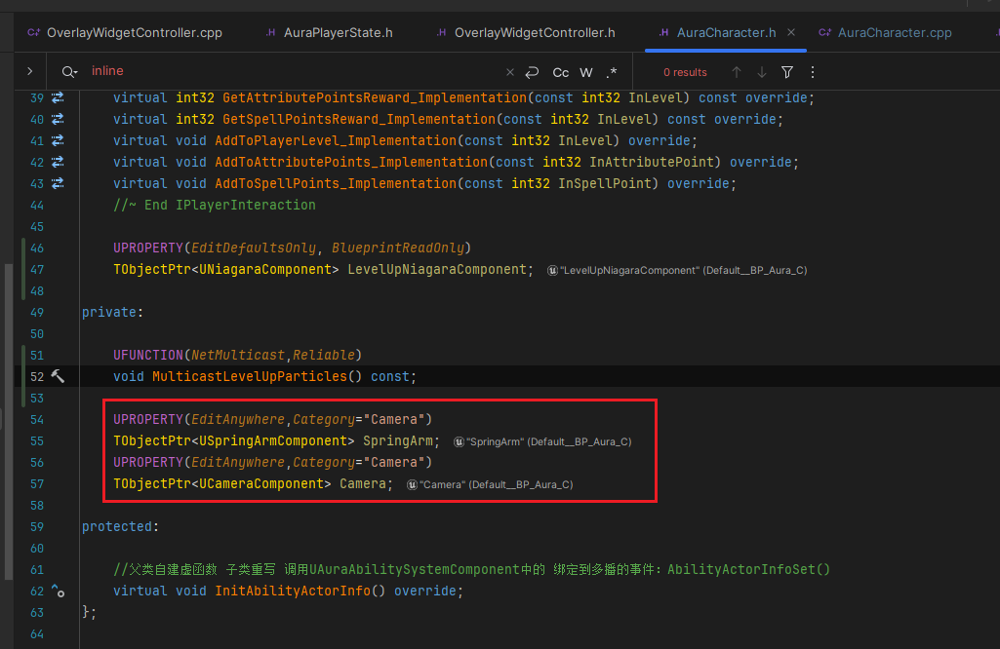
>
>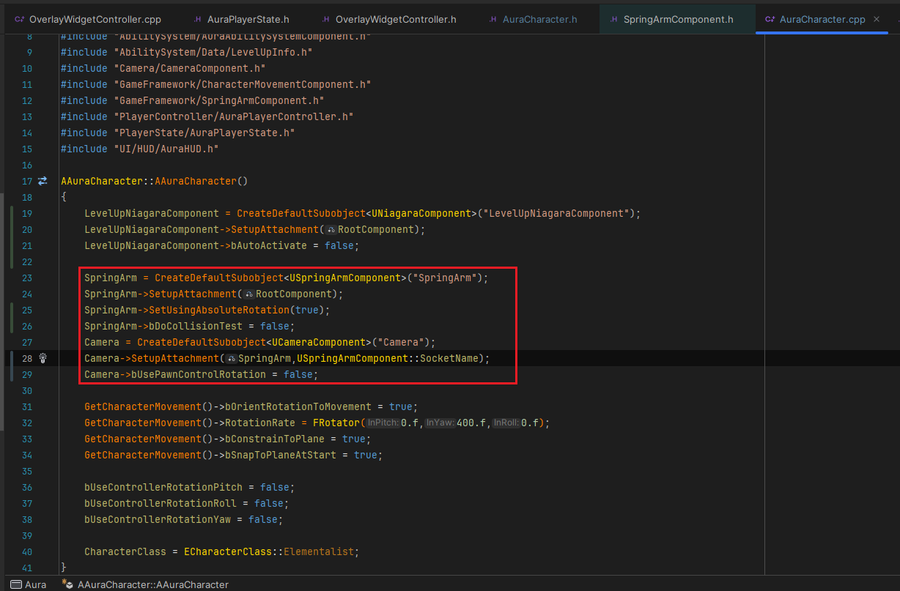
------

#### 上面设置的是这里，需要使用C++的组件替换蓝图的，注意不要把Box删了

>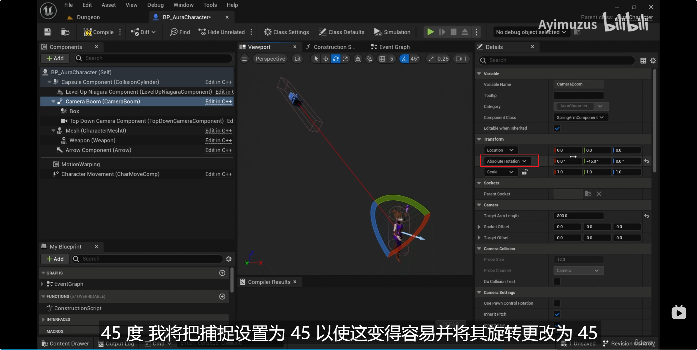
------

### 使用相机的位置和NS特效的位置计算旋转，然后设置NS的旋转

>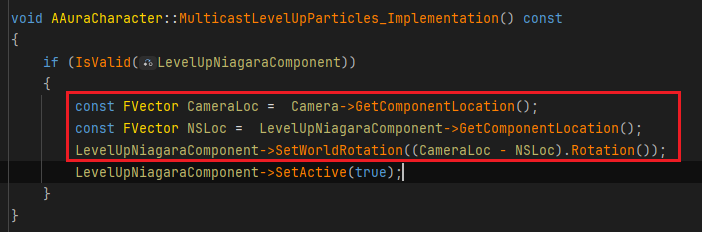
>
>```CPP
>void AAuraCharacter::MulticastLevelUpParticles_Implementation() const
>{
>    if (IsValid(LevelUpNiagaraComponent))
>    {
>       const FVector CameraLoc =  Camera->GetComponentLocation();
>       const FVector NSLoc =  LevelUpNiagaraComponent->GetComponentLocation();
>       LevelUpNiagaraComponent->SetWorldRotation((CameraLoc - NSLoc).Rotation());
>       LevelUpNiagaraComponent->SetActive(true);
>    }
>}
>```
------

### 测试gif

>
------

### LS客户端测试gif

>
------

### LS客户端升级，服务器视角gif看效果是否有问题

------

### 有个顾虑是，升级后立马旋转，可能会带着NS一起旋转，测试一下
------

#### 测试gif，还好

>


___________________________________________________________________________________________

[返回最上面](#Go主菜单)

___________________________________________________________________________________________