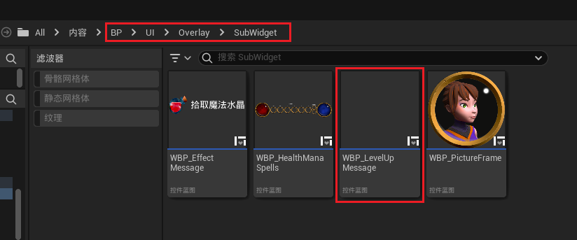
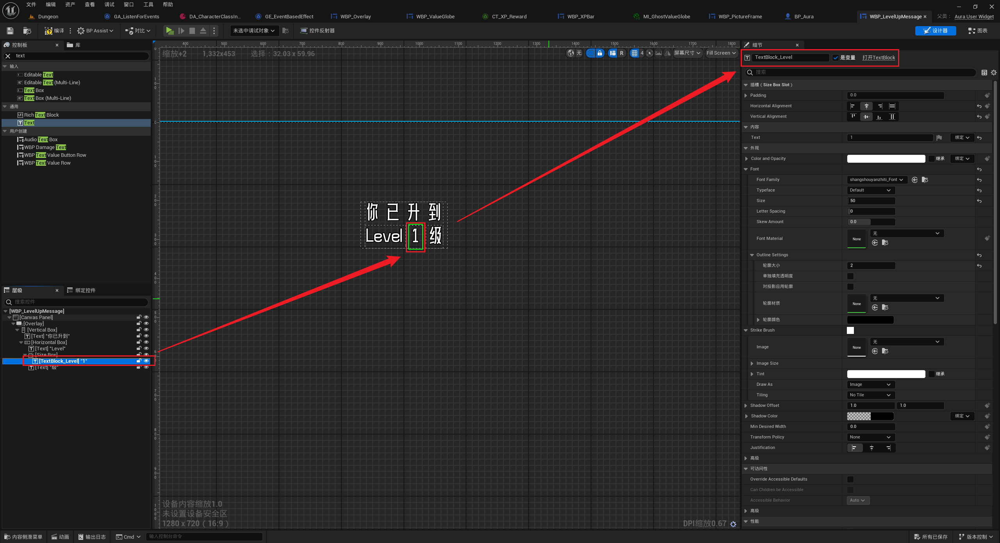
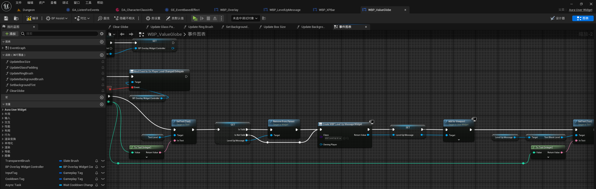
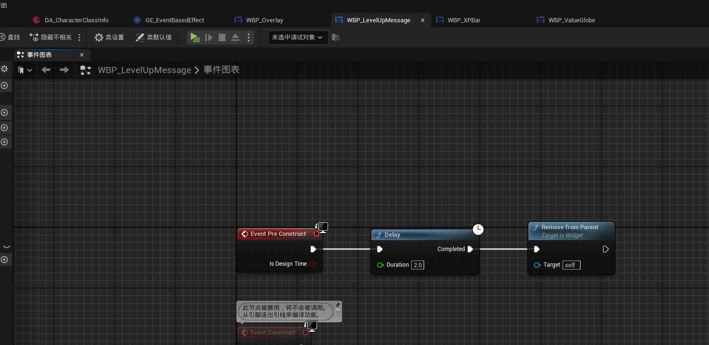
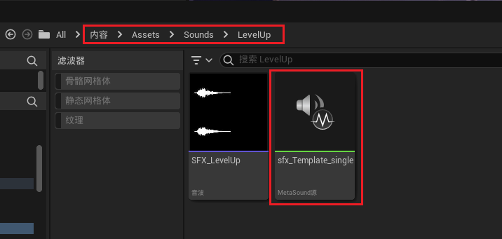
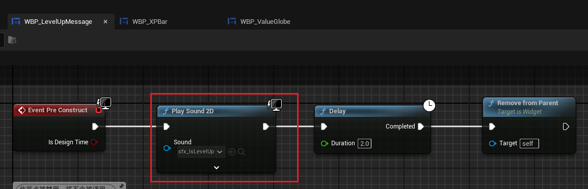
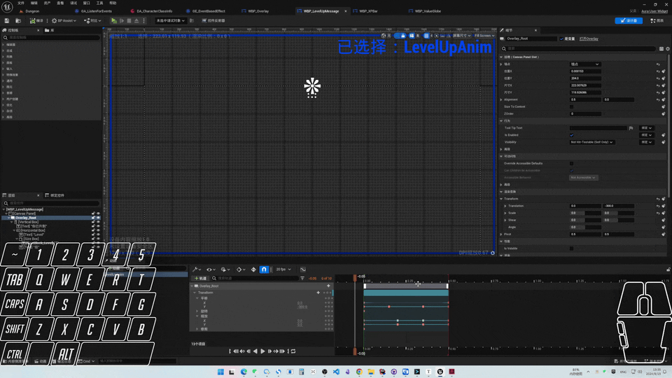
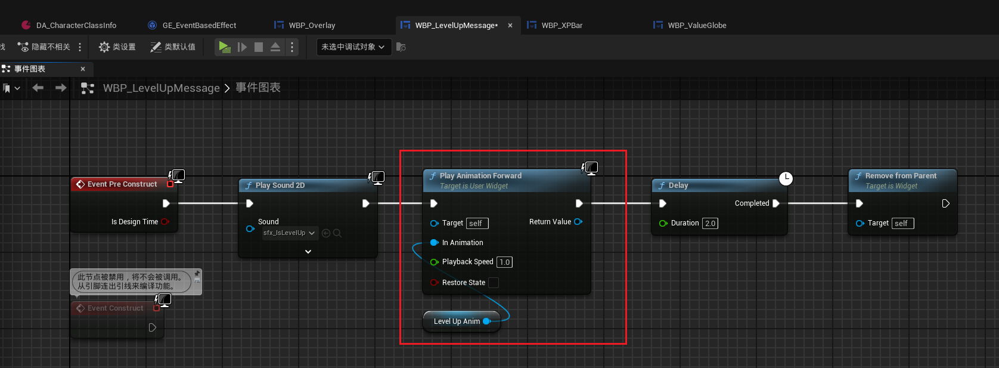

___________________________________________________________________________________________
###### [Go主菜单](../MainMenu.md)
___________________________________________________________________________________________

# GAS 128 创建升级时的屏幕播报UI和音效

___________________________________________________________________________________________

# 目录

- [GAS 128 创建升级时的屏幕播报UI和音效](#gas-128-创建升级时的屏幕播报ui和音效)
- [目录](#目录)
    - [Mermaid整体思路梳理](#mermaid整体思路梳理)
    - [除了升级时的特效之外，正常情况下应该还有一个屏幕上的播报，提示我们已经升到多少级，然后Delay消失；还需要播放一个升级的音效](#除了升级时的特效之外正常情况下应该还有一个屏幕上的播报提示我们已经升到多少级然后delay消失还需要播放一个升级的音效)
    - [创建UI，命名为，***WBP\_LevelUpMessage***](#创建ui命名为wbp_levelupmessage)
    - [***WBP\_Overlay*** 中 当触发升级的回调时，生成UI然后设置Text](#wbp_overlay-中-当触发升级的回调时生成ui然后设置text)
    - [此时gif](#此时gif)
    - [接下来需要创建动画，并在小UI上自行销毁，然后播放音频](#接下来需要创建动画并在小ui上自行销毁然后播放音频)
      - [音频路径](#音频路径)
      - [播放音频+自行移除](#播放音频自行移除)
      - [创建动画](#创建动画)
    - [整体gif效果](#整体gif效果)
    - [大功告成](#大功告成)

___________________________________________________________________________________________

视频链接

[15. Level Up HUD Message_哔哩哔哩_bilibili](https://www.bilibili.com/video/BV1TH4y1L7NP?p=61&vd_source=9e1e64122d802b4f7ab37bd325a89e6c)

------

___________________________________________________________________________________________

### Mermaid整体思路梳理

Mermaid

___________________________________________________________________________________________

### 除了升级时的特效之外，正常情况下应该还有一个屏幕上的播报，提示我们已经升到多少级，然后Delay消失；还需要播放一个升级的音效

------

### 创建UI，命名为，***WBP_LevelUpMessage***

>
------

### ***WBP_Overlay*** 中 当触发升级的回调时，生成UI然后设置Text

>- 保存前一个变量，这样可以在当连续升级时，两个UI不会叠加
>
>
>
>

------

### 此时gif

>
------

### 接下来需要创建动画，并在小UI上自行销毁，然后播放音频
------

#### 音频路径

>
------

#### 播放音频+自行移除

>
------

#### 创建动画

>
------

### 整体gif效果

>
------

### 大功告成

___________________________________________________________________________________________

[返回最上面](#Go主菜单)

___________________________________________________________________________________________