___________________________________________________________________________________________
###### [Go主菜单](../MainMenu.md)
___________________________________________________________________________________________

# GAS 131 使用后处理函数 `PostAttributeChange` 修复设置血量魔法最大值异常的bug；修复LOG  `SetByCaller` 报错

___________________________________________________________________________________________

## 处理关键点

1. 明白 `AS` 中的两个 **后处理函数** 的 **触发顺序** ：
   - `PostGameplayEffectExecute` 属性 `应用修改之前` 生效
   - `PostAttributeChange` 属性 `应用修改之后` 生效
2. 解决 `GE` 触发的 `SetByCaller` **报错**

___________________________________________________________________________________________

# 目录


- [GAS 131 使用后处理函数 `PostAttributeChange` 修复设置血量魔法最大值异常的bug；修复LOG  `SetByCaller` 报错](#gas-131-使用后处理函数-postattributechange-修复设置血量魔法最大值异常的bug修复log--setbycaller-报错)
  - [处理关键点](#处理关键点)
- [目录](#目录)
    - [Mermaid整体思路梳理](#mermaid整体思路梳理)
    - [我们之前在这里处理了升级后将 `HP` 和 `MP` 设为最大值，但是没有生效](#我们之前在这里处理了升级后将-hp-和-mp-设为最大值但是没有生效)
    - [断点检查一下](#断点检查一下)
    - [会发现先触发的 `AS`，后触发的 `MMC_MaxHealth`，这说明我们先基于目前的等级设置了最大值的血量，然后升级，会导致我们的血量无法恢复当前等级的最大值](#会发现先触发的-as后触发的-mmc_maxhealth这说明我们先基于目前的等级设置了最大值的血量然后升级会导致我们的血量无法恢复当前等级的最大值)
      - [重写基类的 `PostAttributeChange` 函数，`AS` 中创建 `bool` 记录变量](#重写基类的-postattributechange-函数as-中创建-bool-记录变量)
      - [在需要设置最大值时，设置 `bool`](#在需要设置最大值时设置-bool)
      - [在中如果检测到变化，且bool为true，则设置为最大值同时设置bool为false，`保证只执行一次`](#在中如果检测到变化且bool为true则设置为最大值同时设置bool为false保证只执行一次)
    - [此时效果gif](#此时效果gif)
    - [此时打开log日志，会发现 `报错`](#此时打开log日志会发现-报错)
    - [`报错原因`](#报错原因)
    - [打印测试 无报错 gif](#打印测试-无报错-gif)


___________________________________________________________________________________________

<details>
<summary>视频链接</summary>
[5. Top Off Our Fluids_哔哩哔哩_bilibili](https://www.bilibili.com/video/BV1TH4y1L7NP?p=66&spm_id_from=pageDriver&vd_source=9e1e64122d802b4f7ab37bd325a89e6c)

------

</details>

___________________________________________________________________________________________

### Mermaid整体思路梳理

Mermaid

___________________________________________________________________________________________

### 我们之前在这里处理了升级后将 `HP` 和 `MP` 设为最大值，但是没有生效
>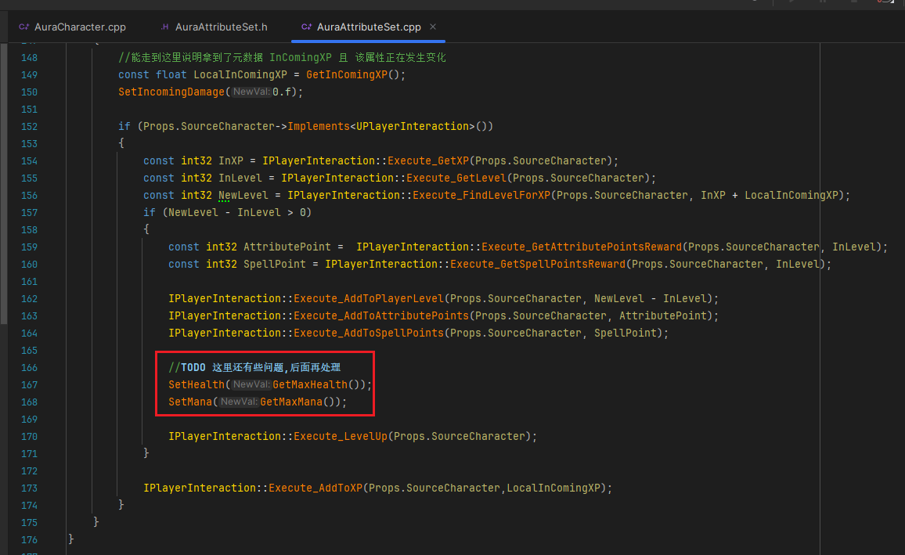

------

### 断点检查一下
>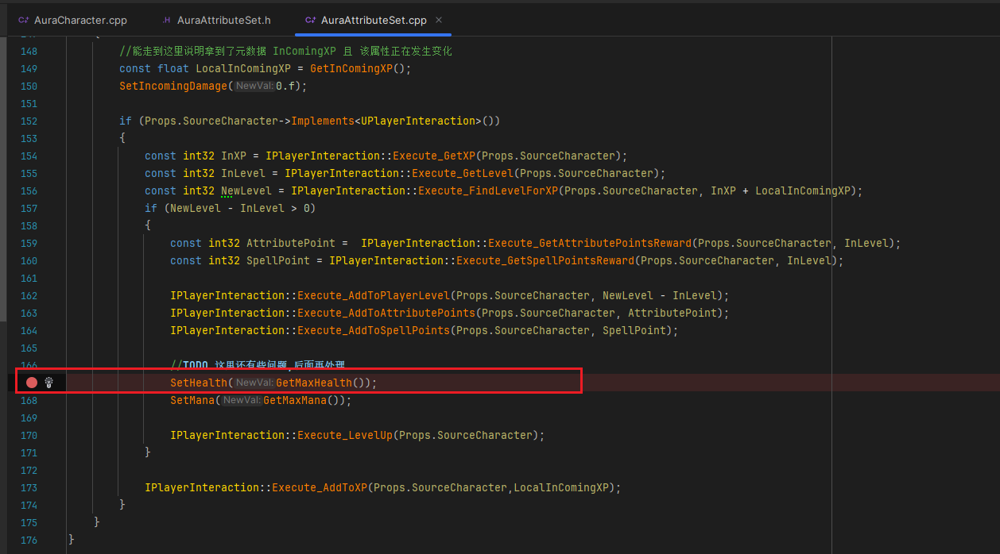
>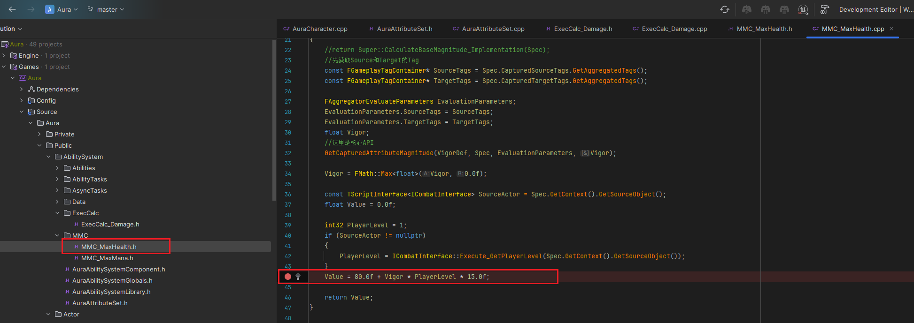


------

### 会发现先触发的 `AS`，后触发的 `MMC_MaxHealth`，这说明我们先基于目前的等级设置了最大值的血量，然后升级，会导致我们的血量无法恢复当前等级的最大值

- ##### 解决办法是，应该在设置属性的后处理函数，不是之前使用的 `PostGameplayEffectExecute` 函数，这个函数是在应用前调用的，我们要再重写 `PostAttributeChange` 函数才是属性值修改后调用的

>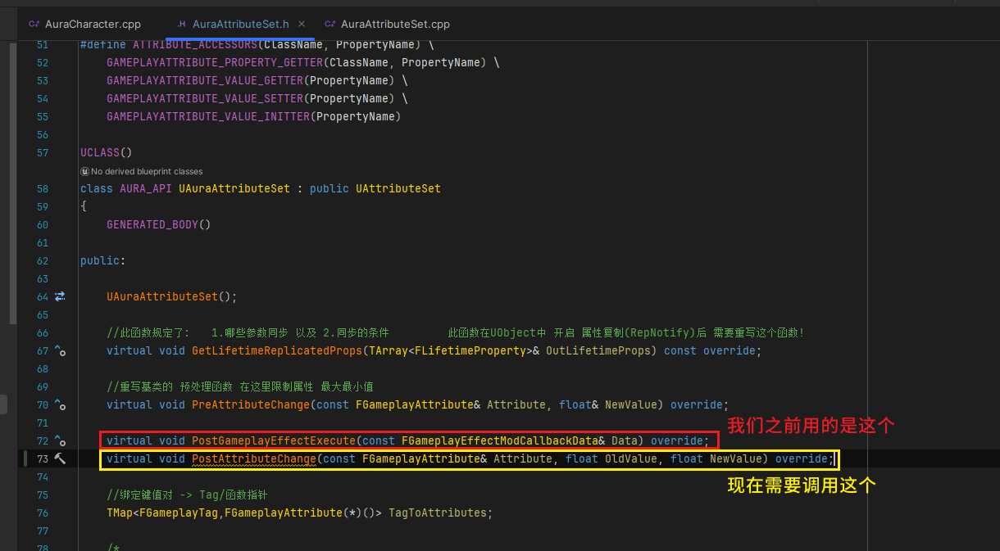

  - 但是会有个问题，这个函数会在属性变化后修改，假设我们在这里，检查最大值是否发生修改，然后将HP设为最大值的话，目前我们还没有游戏中修改HP最大值的道具，一旦有，就会收到这里的影响，所以需要使用Bool来记录是否需要设置血量到最大值和魔法最大值的状态


------

#### 重写基类的 `PostAttributeChange` 函数，`AS` 中创建 `bool` 记录变量

  - 命名为

    - `bTopOffHealth`

    - `bTopOffMana`


>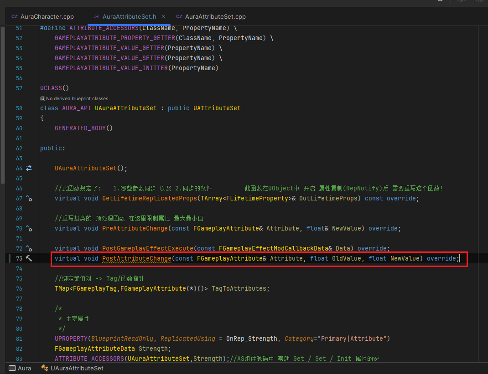
>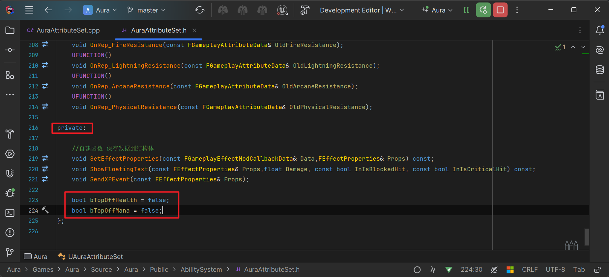


------

#### 在需要设置最大值时，设置 `bool`
>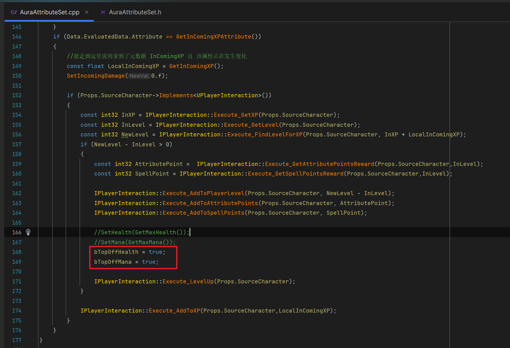


------

#### 在中如果检测到变化，且bool为true，则设置为最大值同时设置bool为false，`保证只执行一次`
>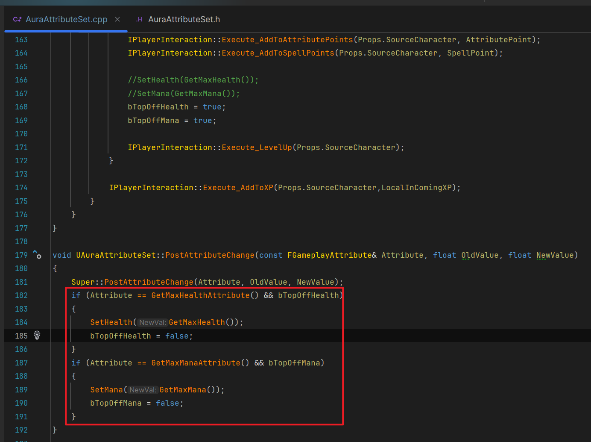
>
>```cpp
>void UAuraAttributeSet::PostAttributeChange(const FGameplayAttribute& Attribute, float OldValue, float NewValue)
>{
>    Super::PostAttributeChange(Attribute, OldValue, NewValue);
>    if (Attribute == GetMaxHealthAttribute() && bTopOffHealth)
>    {
>       SetHealth(GetMaxHealth());
>       bTopOffHealth = false;
>    }
>    if (Attribute == GetMaxManaAttribute() && bTopOffMana)
>    {
>       SetMana(GetMaxMana());
>       bTopOffMana = false;
>    }
>}
>```


------

### 此时效果gif
>


------

### 此时打开log日志，会发现 `报错`
>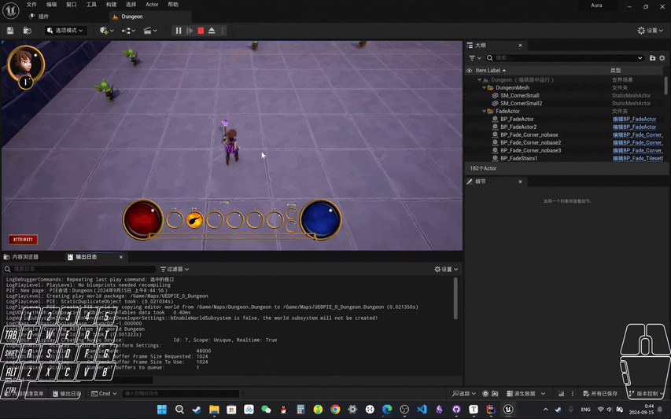
>
>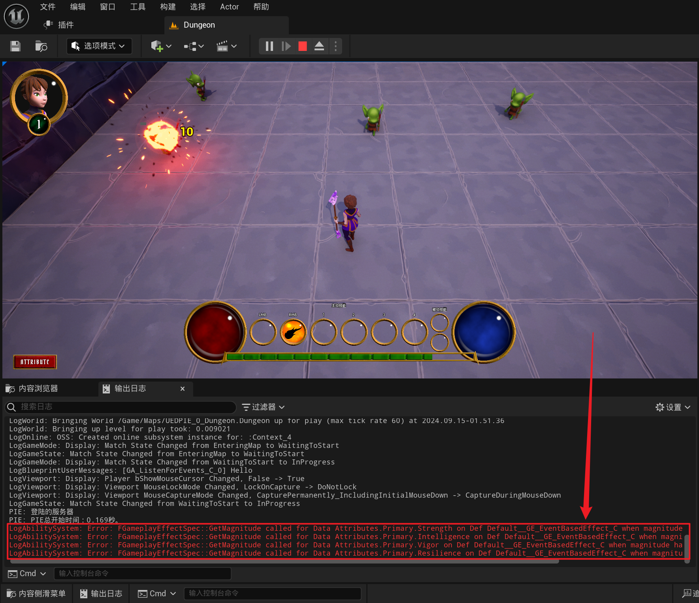
>
>
>
>### **需要修改这里的逻辑**
>
>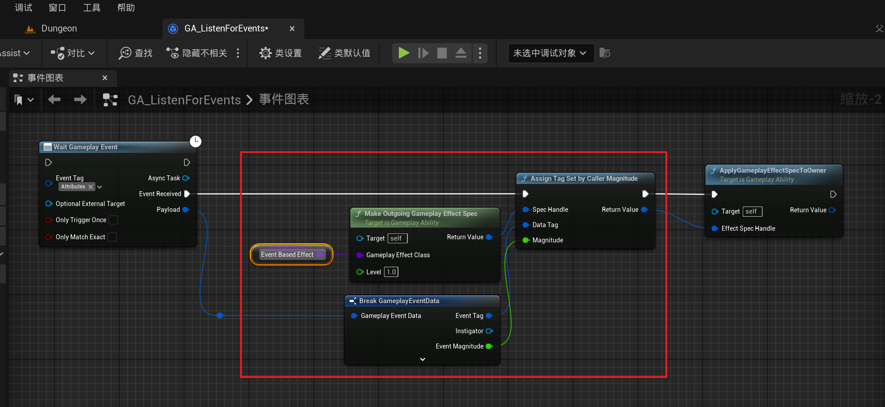
>
>- 有两种选择：
>
>  - 改为C++逻辑
>
>  - 蓝图中保证不会有不触发的Tag输入


------

### `报错原因`
>#### **报错原因是：当绑定了 `SetByCaller` ，然后应用GE时，因为GE中有五个属性，在应用后，就会使用API：`GE_Spec.GetSetByCallerMagnitude` 然后这一轮没有绑定 `SetByCaller` 的就会报错**
>
>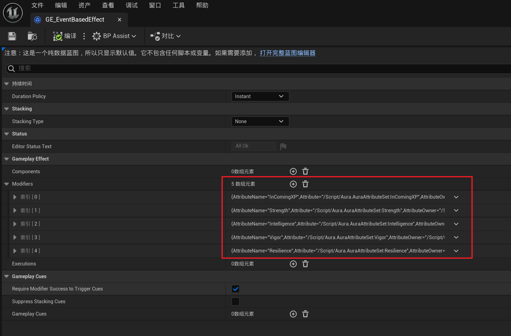
>
>我这里使用C++在蓝图函数库创建了静态函数做的
>
>- #### **这样会报错：**
>
>  > 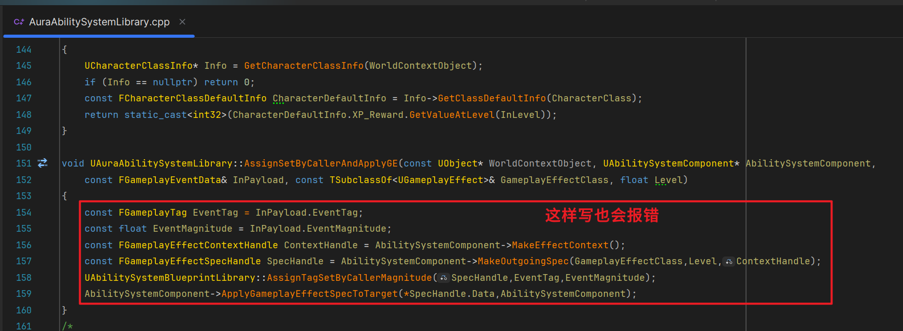
>
>- #### **我修改成这样就不会报错了（这里 `FGameplayTag数组` 其实可以 `外部传参` ，我就直接这么搞了）**
>
>  > ```CPP
>  > void UAuraAbilitySystemLibrary::AssignSetByCallerAndApplyGE(const UObject* WorldContextObject, UAbilitySystemComponent* AbilitySystemComponent,
>  >     const FGameplayEventData& InPayload, const TSubclassOf<UGameplayEffect>& GameplayEffectClass, float Level)
>  > {
>  >     TArray<FGameplayTag> EventTags;
>  >     EventTags.Add(FAuraGameplayTags::Get().Attributes_Primary_Intelligence);
>  >     EventTags.Add(FAuraGameplayTags::Get().Attributes_Primary_Strength);
>  >     EventTags.Add(FAuraGameplayTags::Get().Attributes_Primary_Resilience);
>  >     EventTags.Add(FAuraGameplayTags::Get().Attributes_Primary_Vigor);
>  >     EventTags.Add(FAuraGameplayTags::Get().Attributes_Meta_IncomingXP);
>  >     
>  >     const FGameplayTag EventTag = InPayload.EventTag;
>  >     const float EventMagnitude = InPayload.EventMagnitude;
>  >     const FGameplayEffectContextHandle ContextHandle = AbilitySystemComponent->MakeEffectContext();
>  >     const FGameplayEffectSpecHandle SpecHandle = AbilitySystemComponent->MakeOutgoingSpec(GameplayEffectClass,Level,ContextHandle);
>  >     for (const FGameplayTag& Tag : EventTags)
>  >     {
>  >        if (Tag.MatchesTag(EventTag))
>  >        {
>  >           UAbilitySystemBlueprintLibrary::AssignTagSetByCallerMagnitude(SpecHandle,EventTag,EventMagnitude);
>  >        }
>  >        else
>  >        {
>  >           UAbilitySystemBlueprintLibrary::AssignTagSetByCallerMagnitude(SpecHandle,Tag,0.f);
>  >           
>  >        }
>  >     }
>  >     AbilitySystemComponent->ApplyGameplayEffectSpecToTarget(*SpecHandle.Data,AbilitySystemComponent);
>  > }
>  > ```
>  >
>  > 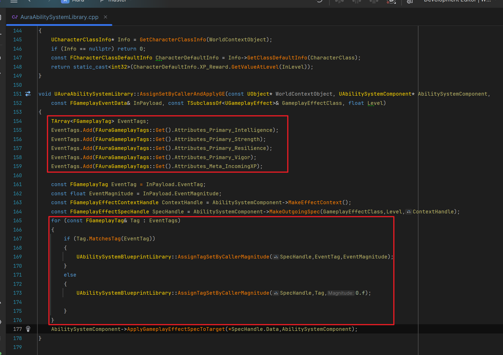
>  >
>  > 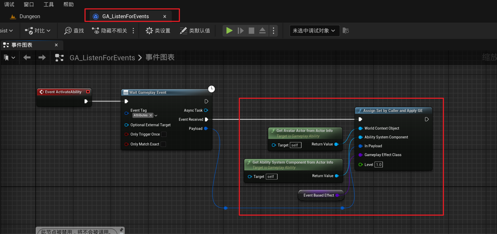
>
>## 解决方法是：当应用GE时，如果这个 `SetByCaller` 的 `EventTag` 没有对应的 `EventMagnitude` ，就手动赋值 `0` ，避免报错


------

### 打印测试 无报错 gif
>


___________________________________________________________________________________________

[返回最上面](#Go主菜单)

___________________________________________________________________________________________