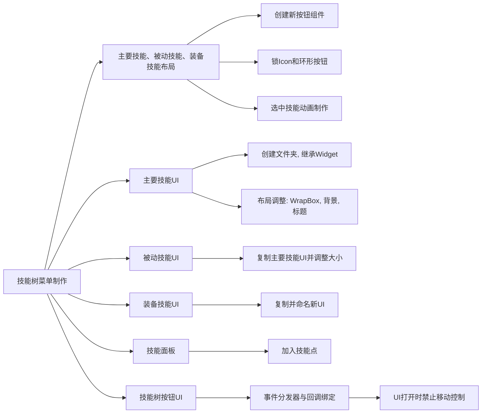

___________________________________________________________________________________________
###### [Go主菜单](../MainMenu.md)
___________________________________________________________________________________________

# GAS 132 创建技能树菜单UI；处理打开和关闭逻辑
_________________________________________________________________________________________

# 目录

- [GAS 132 创建技能树菜单UI；处理打开和关闭逻辑](#gas-132-创建技能树菜单ui处理打开和关闭逻辑)
- [目录](#目录)
    - [Mermaid整体思路梳理](#mermaid整体思路梳理)
    - [接下来我们将制作技能树菜单，从上到下依次为主要技能，被动技能，装备的技能](#接下来我们将制作技能树菜单从上到下依次为主要技能被动技能装备的技能)
    - [下一节](#下一节)
    - [虽然技能球和原来的差不多但是不能复用，因为有一些逻辑和回调，需要复制一份，处理一下](#虽然技能球和原来的差不多但是不能复用因为有一些逻辑和回调需要复制一份处理一下)
    - [添加 `Image`，设为锁的 `icon`](#添加-image设为锁的-icon)
    - [下面想把外面这一圈环 变成 按钮](#下面想把外面这一圈环-变成-按钮)
      - [为环的Button配置资产](#为环的button配置资产)
    - [下面将创建一个当技能被选中时的动画，打算使用Image来制作，制作完先隐藏](#下面将创建一个当技能被选中时的动画打算使用image来制作制作完先隐藏)
    - [这样就完成了基础的按钮](#这样就完成了基础的按钮)
    - [下一节](#下一节-1)
    - [下面我们将制作图中红色部分，也就是主要技能的UI部分](#下面我们将制作图中红色部分也就是主要技能的ui部分)
      - [创建 `技能树菜单` UI的文件夹](#创建-技能树菜单-ui的文件夹)
      - [创建UI继承自 `AuraUserWidget`](#创建ui继承自-aurauserwidget)
      - [创建函数 `UpdateBoxSize`](#创建函数-updateboxsize)
      - [加入几个 `WrapBox` ，然后加入刚才创建的技能按钮](#加入几个-wrapbox-然后加入刚才创建的技能按钮)
      - [从属性菜单，拷贝背景和标题，整一些要用的元素](#从属性菜单拷贝背景和标题整一些要用的元素)
      - [放入 ***WBP\_Overlay***](#放入-wbp_overlay)
    - [运行游戏，看下效果](#运行游戏看下效果)
      - [加一个SizeBox，设置大小](#加一个sizebox设置大小)
      - [加入Image分隔](#加入image分隔)
      - [左右使用Spacer分隔](#左右使用spacer分隔)
    - [运行游戏查看效果](#运行游戏查看效果)
    - [下一节](#下一节-2)
    - [这节我们来制作被动技能的部分](#这节我们来制作被动技能的部分)
      - [之前的这个最大的菜单部分挪到新的里面，旧的里面只保留部分](#之前的这个最大的菜单部分挪到新的里面旧的里面只保留部分)
      - [复制一份主要技能的技能树UI，制作被动技能技能树](#复制一份主要技能的技能树ui制作被动技能技能树)
      - [设置一下 大小 和 间距](#设置一下-大小-和-间距)
      - [测试一下按钮点击和悬浮效果gif](#测试一下按钮点击和悬浮效果gif)
    - [下一节](#下一节-3)
    - [这一节我们来制作，装备的技能部分](#这一节我们来制作装备的技能部分)
      - [复制一个新的](#复制一个新的)
      - [做一个这样的效果](#做一个这样的效果)
    - [运行查看一下效果](#运行查看一下效果)
    - [下一节](#下一节-4)
    - [制作技能面板](#制作技能面板)
    - [加入技能点](#加入技能点)
    - [下一节](#下一节-5)
    - [做一个这样的效果](#做一个这样的效果-1)
      - [自己看着实现](#自己看着实现)
    - [下一节](#下一节-6)
    - [我们也需要一个技能树的按钮UI](#我们也需要一个技能树的按钮ui)
    - [根据之前的创建属性菜单的逻辑修改](#根据之前的创建属性菜单的逻辑修改)
      - [技能树面板创建事件分发器，关闭时移除，然后广播](#技能树面板创建事件分发器关闭时移除然后广播)
      - [***WBP\_Overlay*** 中生成技能树UI面板并设置窗口偏移，绑定回调](#wbp_overlay-中生成技能树ui面板并设置窗口偏移绑定回调)
    - [现在有一个情况，当UI挡住视野时，依旧可以移动，这里的设定是，当UI开启时，禁止点击移动](#现在有一个情况当ui挡住视野时依旧可以移动这里的设定是当ui开启时禁止点击移动)
      - [***WBP\_Overlay*** 中创建两个bool变量分别代表两个菜单是否打开，只有当两个菜但都关闭时，才能继续移动](#wbp_overlay-中创建两个bool变量分别代表两个菜单是否打开只有当两个菜但都关闭时才能继续移动)
    - [此时效果gif](#此时效果gif)

___________________________________________________________________________________________

视频链接

[1. Spell Menu Design_哔哩哔哩_bilibili](https://www.bilibili.com/video/BV1TH4y1L7NP/?p=68&vd_source=9e1e64122d802b4f7ab37bd325a89e6c)

[2. Spell Globe Button_哔哩哔哩_bilibili](https://www.bilibili.com/video/BV1TH4y1L7NP/?p=69&spm_id_from=pageDriver&vd_source=9e1e64122d802b4f7ab37bd325a89e6c)

[3. Offensive Spell Tree_哔哩哔哩_bilibili](https://www.bilibili.com/video/BV1TH4y1L7NP/?p=70&spm_id_from=pageDriver&vd_source=9e1e64122d802b4f7ab37bd325a89e6c)

[4. Passive Spell Tree_哔哩哔哩_bilibili](https://www.bilibili.com/video/BV1TH4y1L7NP/?p=71&spm_id_from=pageDriver&vd_source=9e1e64122d802b4f7ab37bd325a89e6c)

[5. Equipped Spell Row_哔哩哔哩_bilibili](https://www.bilibili.com/video/BV1TH4y1L7NP/?p=72&spm_id_from=pageDriver&vd_source=9e1e64122d802b4f7ab37bd325a89e6c)

[6. Spell Menu Widget_哔哩哔哩_bilibili](https://www.bilibili.com/video/BV1TH4y1L7NP/?p=73&spm_id_from=pageDriver&vd_source=9e1e64122d802b4f7ab37bd325a89e6c)

[7. Spell Description Box_哔哩哔哩_bilibili](https://www.bilibili.com/video/BV1TH4y1L7NP/?p=74&spm_id_from=pageDriver&vd_source=9e1e64122d802b4f7ab37bd325a89e6c)

[8. Spell Menu Button_哔哩哔哩_bilibili](https://www.bilibili.com/video/BV1TH4y1L7NP/?p=75&spm_id_from=pageDriver&vd_source=9e1e64122d802b4f7ab37bd325a89e6c)

------

___________________________________________________________________________________________

### Mermaid整体思路梳理

Mermaid

___________________________________________________________________________________________

### 接下来我们将制作技能树菜单，从上到下依次为主要技能，被动技能，装备的技能
>

------

### 下一节

------

### 虽然技能球和原来的差不多但是不能复用，因为有一些逻辑和回调，需要复制一份，处理一下

  - 命名为，***WBP_SpellGlobe_Button***

>

------

### 添加 `Image`，设为锁的 `icon`
>

------

### 下面想把外面这一圈环 变成 按钮
>

- 需要把旧的环删除换成 `button`
>
>

------

#### 为环的Button配置资产
>

------

### 下面将创建一个当技能被选中时的动画，打算使用Image来制作，制作完先隐藏
>
>
>

- 然后删除多余逻辑

------

### 这样就完成了基础的按钮

------

### 下一节

------

### 下面我们将制作图中红色部分，也就是主要技能的UI部分
>

------

#### 创建 `技能树菜单` UI的文件夹

  - 命名为，`SpellMenu`

>

------

#### 创建UI继承自 `AuraUserWidget`
>

------

#### 创建函数 `UpdateBoxSize` 
>
>

------

#### 加入几个 `WrapBox` ，然后加入刚才创建的技能按钮
>

------

#### 从属性菜单，拷贝背景和标题，整一些要用的元素
>

------

#### 放入 ***WBP_Overlay***
>

------

### 运行游戏，看下效果
>

------

#### 加一个SizeBox，设置大小
>

------

#### 加入Image分隔
>

------

#### 左右使用Spacer分隔
>

------

### 运行游戏查看效果
>

------

### 下一节

------

### 这节我们来制作被动技能的部分
>

------

#### 之前的这个最大的菜单部分挪到新的里面，旧的里面只保留部分
>
>

------

#### 复制一份主要技能的技能树UI，制作被动技能技能树

  - 命名为，***WBP_PassiveSpellTree***

>

------

#### 设置一下 大小 和 间距
>
>

------

#### 测试一下按钮点击和悬浮效果gif
>

------

### 下一节

------

### 这一节我们来制作，装备的技能部分
>

------

#### 复制一个新的

  - 命名为，***WBP_EquippedSpellRow***

>

------

#### 做一个这样的效果
>

------

### 运行查看一下效果
>

------

### 下一节

------

### 制作技能面板
>

------

### 加入技能点
>
>

------

### 下一节

------

### 做一个这样的效果
>

------

#### 自己看着实现
>

------

### 下一节

------

### 我们也需要一个技能树的按钮UI
>

------

### 根据之前的创建属性菜单的逻辑修改

------

#### 技能树面板创建事件分发器，关闭时移除，然后广播
>
>

------

#### ***WBP_Overlay*** 中生成技能树UI面板并设置窗口偏移，绑定回调
>

------

### 现在有一个情况，当UI挡住视野时，依旧可以移动，这里的设定是，当UI开启时，禁止点击移动

------

#### ***WBP_Overlay*** 中创建两个bool变量分别代表两个菜单是否打开，只有当两个菜但都关闭时，才能继续移动

  - 在点击和触发回调时设置

>

------

### 此时效果gif

> 

___________________________________________________________________________________________

[返回最上面](#Go主菜单)

___________________________________________________________________________________________