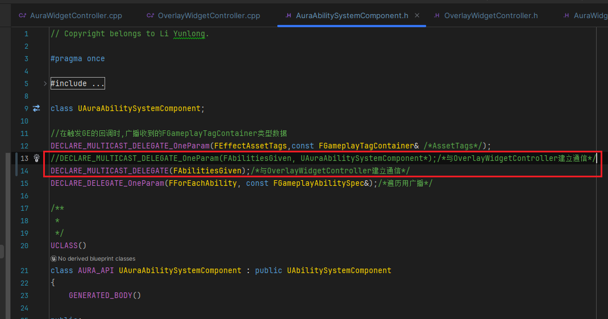

___________________________________________________________________________________________
###### [Go主菜单](../MainMenu.md)
___________________________________________________________________________________________

# GAS 133 创建 `SpellMenu` 要使用的 `WidgetConttroller`；重构 `OverlayWidgetController` 中的逻辑到父类中

___________________________________________________________________________________________

## 处理关键点

1. 多次触发广播的框架结构

___________________________________________________________________________________________

# 目录


- [GAS 133 创建 `SpellMenu` 要使用的 `WidgetConttroller`；重构 `OverlayWidgetController` 中的逻辑到父类中](#gas-133-创建-spellmenu-要使用的-widgetconttroller重构-overlaywidgetcontroller-中的逻辑到父类中)
  - [处理关键点](#处理关键点)
- [目录](#目录)
    - [Mermaid整体思路梳理](#mermaid整体思路梳理)
    - [添加装备技能的按钮](#添加装备技能的按钮)
    - [创建 `SpellMenu` 要使用的 `WidgetConttroller` 继承自 `AuraWidgetController`](#创建-spellmenu-要使用的-widgetconttroller-继承自-aurawidgetcontroller)
    - [`SpellMenuWidgetController` 中需要重写父类中的两个自建虚函数，一个是绑定回调用 `BindCallbacksToDependencies` ，一个是广播用 `BroadcastInitialValues`](#spellmenuwidgetcontroller-中需要重写父类中的两个自建虚函数一个是绑定回调用-bindcallbackstodependencies-一个是广播用-broadcastinitialvalues)
      - [这两个函数在父类中没有写逻辑，所以可以删除 `Super` 调用](#这两个函数在父类中没有写逻辑所以可以删除-super-调用)
    - [我们需要在UI初始化时,广播我们拥有的技能](#我们需要在ui初始化时广播我们拥有的技能)
      - [我们先看一下之前在 `OverlayWidgetController` 中初始化技能图标的逻辑](#我们先看一下之前在-overlaywidgetcontroller-中初始化技能图标的逻辑)
      - [我们可以将这个 `初始化函数` 里面的逻辑挪到父类 `AuraWidgetController` 中](#我们可以将这个-初始化函数-里面的逻辑挪到父类-aurawidgetcontroller-中)
    - [下面需要重构逻辑](#下面需要重构逻辑)
    - [有个问题是，这个初始化函数依赖于 `AuraASC组件` 中创建的函数，所以父类上必须有 `AuraASC组件`](#有个问题是这个初始化函数依赖于-auraasc组件-中创建的函数所以父类上必须有-auraasc组件)
    - [下面在父类中保存四大数据的子类指针，和Get四大数据子类的函数](#下面在父类中保存四大数据的子类指针和get四大数据子类的函数)
    - [此时编译会报错，需要使用父类中的 `获取四大数据子类方法` 替换原来的 `Cast子类` 的逻辑（涉及到的地方，都需要处理）](#此时编译会报错需要使用父类中的-获取四大数据子类方法-替换原来的-cast子类-的逻辑涉及到的地方都需要处理)
    - [父类中，准备迁移初始化广播技能信息的函数，新建函数，命名为，`BroadcastAbilityInfo`](#父类中准备迁移初始化广播技能信息的函数新建函数命名为broadcastabilityinfo)
    - [需要在原来调用子类函数的时候，改成调用父类的 `BroadcastAbilityInfo` 函数，绑定的回调也需要处理](#需要在原来调用子类函数的时候改成调用父类的-broadcastabilityinfo-函数绑定的回调也需要处理)
      - [绑定的回调也需要处理](#绑定的回调也需要处理)
        - [但如果处理绑定的回调，创建的多播就需要改成不能传递参数（反正传递的也是AuraASC，父类上有获取方法）](#但如果处理绑定的回调创建的多播就需要改成不能传递参数反正传递的也是auraasc父类上有获取方法)
        - [需要在ASC组件上广播时，也修改传递的参数](#需要在asc组件上广播时也修改传递的参数)
        - [这样就可以绑定回调为 `BroadcastAbilityInfo` 了](#这样就可以绑定回调为-broadcastabilityinfo-了)
      - [然后删除子类的函数，因为可以直接使用父类函数](#然后删除子类的函数因为可以直接使用父类函数)
    - [上面这样就完成了重构逻辑](#上面这样就完成了重构逻辑)
    - [接下来运行测试，重构逻辑后，应该和之前的一样，没有异常](#接下来运行测试重构逻辑后应该和之前的一样没有异常)


___________________________________________________________________________________________

<details>
<summary>视频链接</summary>

[9. Spell Menu Widget Controller_哔哩哔哩_bilibili](https://www.bilibili.com/video/BV1TH4y1L7NP/?p=76&spm_id_from=333.880.my_history.page.click&vd_source=9e1e64122d802b4f7ab37bd325a89e6c)

------

</details>

___________________________________________________________________________________________

### Mermaid整体思路梳理

Mermaid


___________________________________________________________________________________________

### 添加装备技能的按钮
>


------

### 创建 `SpellMenu` 要使用的 `WidgetConttroller` 继承自 `AuraWidgetController`

  - 命名为，`SpellMenuWidgetController`
>


------

### `SpellMenuWidgetController` 中需要重写父类中的两个自建虚函数，一个是绑定回调用 `BindCallbacksToDependencies` ，一个是广播用 `BroadcastInitialValues`
>


------

#### 这两个函数在父类中没有写逻辑，所以可以删除 `Super` 调用
>


------

### 我们需要在UI初始化时,广播我们拥有的技能

  - UI初始化时

    - 需要调用 `SetWidgetController`

    - 然后绑定回调

    - 最后调用 `BroadcastInitialValues` 广播 `技能结构体` 数据


------

#### 我们先看一下之前在 `OverlayWidgetController` 中初始化技能图标的逻辑
>

- 通过循环广播，多次触发这个 `lambda` 从而广播激活的技能数据到UI
>


------

#### 我们可以将这个 `初始化函数` 里面的逻辑挪到父类 `AuraWidgetController` 中

  - 所以委托也需要移动到父类中
>
>
>
>


------

### 下面需要重构逻辑


------

### 有个问题是，这个初始化函数依赖于 `AuraASC组件` 中创建的函数，所以父类上必须有 `AuraASC组件`

  - 既然父类需要拥有ASC的子类，而ASC又是WidgetController中需要保存的四大数据之一，那就把四大数据全部子类化保存在父类上

    - 也就是，再保存四个子类的指针

      - `AuraASC`

      - `AuraAS`

      - `AuraPC`

      - `AuraPS`


------

### 下面在父类中保存四大数据的子类指针，和Get四大数据子类的函数
>
>
>
>```cpp
>protected:
>
>    // 保存四大数据：PC/PS/ASC/AS
>    UPROPERTY(BlueprintReadOnly,Category="WidgetController")
>    TObjectPtr<APlayerController> PlayerController;
>    UPROPERTY(BlueprintReadOnly,Category="WidgetController")
>    TObjectPtr<APlayerState> PlayerState;
>    UPROPERTY(BlueprintReadOnly,Category="WidgetController")
>    TObjectPtr<UAbilitySystemComponent> AbilitySystemComponent;
>    UPROPERTY(BlueprintReadOnly,Category="WidgetController")
>    TObjectPtr<UAttributeSet> AttributeSet;
>    
>    // 保存四大数据子类：AuraPC/AuraPS/AuraASC/AuraAS
>    UPROPERTY(BlueprintReadOnly,Category="WidgetController")
>    TObjectPtr<AAuraPlayerController> AuraPC;
>    UPROPERTY(BlueprintReadOnly,Category="WidgetController")
>    TObjectPtr<AAuraPlayerState> AuraPS;
>    UPROPERTY(BlueprintReadOnly,Category="WidgetController")
>    TObjectPtr<UAuraAbilitySystemComponent> AuraASC;
>    UPROPERTY(BlueprintReadOnly,Category="WidgetController")
>    TObjectPtr<UAuraAttributeSet> AuraAS;
>    
>    //获取方法
>    AAuraPlayerController* GetAuraPC();
>    AAuraPlayerState* GetAuraPS();
>    UAuraAbilitySystemComponent* GetAuraASC();
>    UAuraAttributeSet* GetAuraAS();
>```
>
>```cpp
>AAuraPlayerController* UAuraWidgetController::GetAuraPC()
>{
>    if (AuraPC == nullptr)
>    {
>       AuraPC = Cast<AAuraPlayerController>(PlayerController);
>    }
>    return AuraPC;
>}
>
>AAuraPlayerState* UAuraWidgetController::GetAuraPS() 
>{
>    if (AuraPS == nullptr)
>    {
>       AuraPS = Cast<AAuraPlayerState>(PlayerState);
>    }
>    return AuraPS;
>}
>
>UAuraAbilitySystemComponent* UAuraWidgetController::GetAuraASC()
>{
>    if (AuraASC == nullptr)
>    {
>       AuraASC = Cast<UAuraAbilitySystemComponent>(AbilitySystemComponent);
>    }
>    return AuraASC;
>}
>
>UAuraAttributeSet* UAuraWidgetController::GetAuraAS() 
>{
>    if (AuraAS == nullptr)
>    {
>       AuraAS = Cast<UAuraAttributeSet>(AttributeSet);
>    }
>    return AuraAS;
>}
>```


------

### 此时编译会报错，需要使用父类中的 `获取四大数据子类方法` 替换原来的 `Cast子类` 的逻辑（涉及到的地方，都需要处理）
>


------

### 父类中，准备迁移初始化广播技能信息的函数，新建函数，命名为，`BroadcastAbilityInfo`
>

- 迁移逻辑后，包含技能结构体的数据资产报错

>

  - 因为数据资产是在 `OverlayWidgetController` 上配置的，所以也需要迁移到父类中
>
>


------

### 需要在原来调用子类函数的时候，改成调用父类的 `BroadcastAbilityInfo` 函数，绑定的回调也需要处理
>


------

#### 绑定的回调也需要处理
>


------

##### 但如果处理绑定的回调，创建的多播就需要改成不能传递参数（反正传递的也是AuraASC，父类上有获取方法）
>
>


------

##### 需要在ASC组件上广播时，也修改传递的参数
>


------

##### 这样就可以绑定回调为 `BroadcastAbilityInfo` 了
>


------

#### 然后删除子类的函数，因为可以直接使用父类函数
>
>


------

### 上面这样就完成了重构逻辑


------

### 接下来运行测试，重构逻辑后，应该和之前的一样，没有异常
>


___________________________________________________________________________________________

[返回最上面](#go主菜单)

___________________________________________________________________________________________