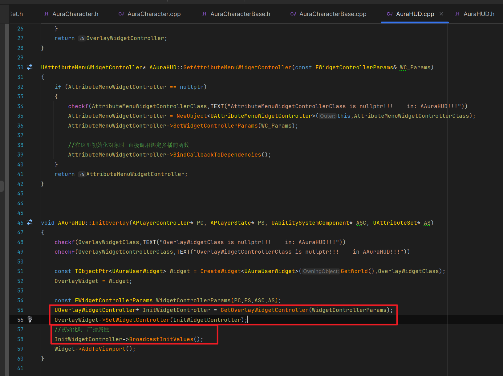

___________________________________________________________________________________________
###### [Go主菜单](../MainMenu.md)
___________________________________________________________________________________________

# GAS 134 重构函数参数的思路方法！！！初始化和获取 `SpellMenuWidgetController`

___________________________________________________________________________________________

## 处理关键点

1. 梳理初始化技能广播技能信息的框架
2. 重构函数参数的思路方法！！！
   - 我们修改创建参数的函数，不要返回Param结构体，改成传进一个Param结构体的引用，这样可以在函数内部修改值，返回值改为bool，这样可以知道成功或者失败。而且这样做有一个好处是：如果返回结构体，则需要在头文件中引用结构体所在的头文件；但如果引用传参，只需前向声明结构体即可，减少项目冗余引用，提高运行效率
3. 使用蓝图反射宏：蓝图节点中的参数 **默认值 设置为 Self**
   -  `UFUNCTION(meta = (DefaultToSelf = "WorldContextObiect")` 

___________________________________________________________________________________________

# 目录


- [GAS 134 重构函数参数的思路方法！！！初始化和获取 `SpellMenuWidgetController`](#gas-134-重构函数参数的思路方法初始化和获取-spellmenuwidgetcontroller)
  - [处理关键点](#处理关键点)
- [目录](#目录)
    - [Mermaid整体思路梳理](#mermaid整体思路梳理)
    - [回顾一下，之前我们的 `WidgetController` 的几个问题](#回顾一下之前我们的-widgetcontroller-的几个问题)
    - [在 `AuraHUD` 中创建获取 `SpellMenu` 并初始化的函数，和持有指针，初始化时的Class](#在-aurahud-中创建获取-spellmenu-并初始化的函数和持有指针初始化时的class)
      - [参考别的写一下初始化](#参考别的写一下初始化)
    - [我们需要优化蓝图函数库中的逻辑，因为这部分复用率有点高](#我们需要优化蓝图函数库中的逻辑因为这部分复用率有点高)
      - [我们创建一个函数，来创建需要的参数](#我们创建一个函数来创建需要的参数)
      - [但是这样做会有一个问题，假如我们某一步的转换失败，那么我们将得到一个空的参数，后面会用这个空的参数去初始化 `WidgetController` 这有点不太行](#但是这样做会有一个问题假如我们某一步的转换失败那么我们将得到一个空的参数后面会用这个空的参数去初始化-widgetcontroller-这有点不太行)
      - [我们修改创建参数的函数，不要返回Param结构体，改成传进一个Param结构体的引用，这样可以在函数内部修改值，返回值改为bool，这样可以知道成功或者失败。而且这样做有一个好处是：如果返回结构体，则需要在头文件中引用结构体所在的头文件；但如果引用传参，只需前向声明结构体即可，减少项目冗余引用，提高运行效率](#我们修改创建参数的函数不要返回param结构体改成传进一个param结构体的引用这样可以在函数内部修改值返回值改为bool这样可以知道成功或者失败而且这样做有一个好处是如果返回结构体则需要在头文件中引用结构体所在的头文件但如果引用传参只需前向声明结构体即可减少项目冗余引用提高运行效率)
      - [当我们在原来的函数中使用时，还会遇到一个问题：原来的函数中使用了HUD来调用不同的函数，所以需要一个HUD的指针](#当我们在原来的函数中使用时还会遇到一个问题原来的函数中使用了hud来调用不同的函数所以需要一个hud的指针)
      - [我们可以在创建参数结构体的函数中，再传递一个HUD的指针引用，来让函数内部赋值，从而在函数外部使用](#我们可以在创建参数结构体的函数中再传递一个hud的指针引用来让函数内部赋值从而在函数外部使用)
        - [比如像这样](#比如像这样)
      - [这样就可以正常调用函数逻辑了](#这样就可以正常调用函数逻辑了)
      - [接下来重构其他的获取WidgetController的函数](#接下来重构其他的获取widgetcontroller的函数)
    - [接下来我们需要创建 `SpellMenuWidgetController` 的蓝图子类所以需要加上 `蓝图可实例化` 和 `蓝图类` 的宏](#接下来我们需要创建-spellmenuwidgetcontroller-的蓝图子类所以需要加上-蓝图可实例化-和-蓝图类-的宏)
      - [创建蓝图子类，配置 `升级的数据资产`](#创建蓝图子类配置-升级的数据资产)
        - [为所有WidgetController都配置上了 `升级的数据资产`](#为所有widgetcontroller都配置上了-升级的数据资产)
    - [***BP\_AuraHUD*** 中也需要配置](#bp_aurahud-中也需要配置)
    - [纠正一点！之前的发送广播的逻辑是在 `EventDestruct` 时调用的](#纠正一点之前的发送广播的逻辑是在-eventdestruct-时调用的)
    - [我们也需要在Construct时调用 `SetWidgetController`](#我们也需要在construct时调用-setwidgetcontroller)
  - [有一个小技巧：蓝图可读节点中的参数比如 `WorldContextObject` 能不能像有些函数一样默认值是Self呢？](#有一个小技巧蓝图可读节点中的参数比如-worldcontextobject-能不能像有些函数一样默认值是self呢)
    - [需要使用宏 `UFUNCTION(meta = (DefaultToSelf = "WorldContextObiect")`](#需要使用宏-ufunctionmeta--defaulttoself--worldcontextobiect)
    - [为获取函数，加上默认Self的宏](#为获取函数加上默认self的宏)
    - [打印测试拿到的 `SpellMenuWidgetController`](#打印测试拿到的-spellmenuwidgetcontroller)
    - [下一节我们将处理，让 `SpellMenu` 中的装备技能与 `Overlay面板` 中的技能同步](#下一节我们将处理让-spellmenu-中的装备技能与-overlay面板-中的技能同步)


___________________________________________________________________________________________

<details>
<summary>视频链接</summary>

[10. Constructing the Spell Menu Widget Controller_哔哩哔哩_bilibili](https://www.bilibili.com/video/BV1TH4y1L7NP/?p=77&spm_id_from=pageDriver&vd_source=9e1e64122d802b4f7ab37bd325a89e6c)

------

</details>

___________________________________________________________________________________________

### Mermaid整体思路梳理

Mermaid

___________________________________________________________________________________________

### 回顾一下，之前我们的 `WidgetController` 的几个问题

  - #### **保存在哪里？**

  - #### **如何初始化？**

  - #### **如何广播初始值的？**

#### 回忆一下

>


<details>
<summary>答案</summary>

>- #### **保存在哪里？**
>
>- #### **如何初始化？**
>
>- #### **如何广播初始值的？**
>
>
>#### **流程梳理：**
>
>- 第一次调用时（在角色中），调用AuraHUD中的获取函数传入参数初始化
>
>
>- 角色初始化时调用 `AuraHUD` 中的初始化UI的函数，然后给函数传参（四大数据）
>
>
>
>- 创建 `OverlayWidgetController` 并传入四大数据，创建时，根据ASC中的广播状态选择直接调用初始化或者绑定回调
>
>
>
>
>- 别的WidgetController则在 `EventConstruct` 触发时，调用蓝图函数库中获取函数，这时调用AuraHUD中的Get逻辑：创建初始化并绑定回调（与OverlayWidgetController的区别是，Overlay是在代码中调用的）
>
>
>
>
>
>
>
>- 调用这个函数，就会将所有激活的函数，发送到UI（也就是更新UI中的技能数据）
>
>
>- 所以总结就是：只要调用了 `BroadcastAbilityInfo` 就会广播所有的技能结构体，接下来只需要处理这个广播和判断状态即可（比如什么技能什么状态才能显示是否锁定这种，当然目前还没制作）

------

</details>


------

### 在 `AuraHUD` 中创建获取 `SpellMenu` 并初始化的函数，和持有指针，初始化时的Class
>
>


------

#### 参考别的写一下初始化
>
>
>


------

### 我们需要优化蓝图函数库中的逻辑，因为这部分复用率有点高

  - 我们先来看一下，我们使用PC拿到HUD然后获取四大数据，然后分别调用不同函数传递参数并返回 `WidgetController`
    - 可以先搞一个创建Param参数的函数
>
>
>```cpp
>USpellMenuWidgetController* UAuraAbilitySystemLibrary::GetSpellMenuWidgetController(const UObject* WorldContextObject)
>{
>    if (APlayerController* PlayerController = UGameplayStatics::GetPlayerController(WorldContextObject, 0))
>    {
>       if (AAuraHUD* HUD = Cast<AAuraHUD>(PlayerController->GetHUD()))
>       {
>          AAuraPlayerState* AuraPlayerState = PlayerController->GetPlayerState<AAuraPlayerState>();
>          UAbilitySystemComponent* AuraAbilitySystemComponent = AuraPlayerState->GetAbilitySystemComponent();
>          UAttributeSet* AuraAttributeSet = AuraPlayerState->GetAttributeSet();
>          const FWidgetControllerParams Params = FWidgetControllerParams(PlayerController, AuraPlayerState, AuraAbilitySystemComponent, AuraAttributeSet);
>          return  HUD->GetSpellMenuWidgetController(Params);
>       }
>       return nullptr;
>    }
>}
>```


------

#### 我们创建一个函数，来创建需要的参数
>
>


------

#### 但是这样做会有一个问题，假如我们某一步的转换失败，那么我们将得到一个空的参数，后面会用这个空的参数去初始化 `WidgetController` 这有点不太行


------

#### 我们修改创建参数的函数，不要返回Param结构体，改成传进一个Param结构体的引用，这样可以在函数内部修改值，返回值改为bool，这样可以知道成功或者失败。而且这样做有一个好处是：如果返回结构体，则需要在头文件中引用结构体所在的头文件；但如果引用传参，只需前向声明结构体即可，减少项目冗余引用，提高运行效率
>
>


------

#### 当我们在原来的函数中使用时，还会遇到一个问题：原来的函数中使用了HUD来调用不同的函数，所以需要一个HUD的指针
>

- 如果我们还是 `Cast` 获取，太愚蠢了


------

#### 我们可以在创建参数结构体的函数中，再传递一个HUD的指针引用，来让函数内部赋值，从而在函数外部使用


------

##### 比如像这样
>
>
>
>```cpp
>bool UAuraAbilitySystemLibrary::MakeWidgetControllerParams(const UObject* WorldContextObject, FWidgetControllerParams& OutWCParams, AAuraHUD*& AuraHUD)
>{
>    if (APlayerController* PlayerController = UGameplayStatics::GetPlayerController(WorldContextObject, 0))
>    {
>       if (AAuraHUD* HUD = Cast<AAuraHUD>(PlayerController->GetHUD()))
>       {
>          AAuraPlayerState* AuraPlayerState = PlayerController->GetPlayerState<AAuraPlayerState>();
>          UAbilitySystemComponent* AuraAbilitySystemComponent = AuraPlayerState->GetAbilitySystemComponent();
>          UAttributeSet* AuraAttributeSet = AuraPlayerState->GetAttributeSet();
>          
>          OutWCParams.AttributeSet = AuraAttributeSet;
>          OutWCParams.PlayerController = PlayerController;
>          OutWCParams.PlayerState = AuraPlayerState;
>          OutWCParams.AbilitySystemComponent = AuraAbilitySystemComponent;
>          
>          AuraHUD = HUD;
>          
>          return true;
>       }
>    }
>    return false;
>}
>```


------

#### 这样就可以正常调用函数逻辑了
>


------

#### 接下来重构其他的获取WidgetController的函数
>


------

### 接下来我们需要创建 `SpellMenuWidgetController` 的蓝图子类所以需要加上 `蓝图可实例化` 和 `蓝图类` 的宏
>


------

#### 创建蓝图子类，配置 `升级的数据资产` 
>
>


------

##### 为所有WidgetController都配置上了 `升级的数据资产`
>


------

### ***BP_AuraHUD*** 中也需要配置
>


------

### 纠正一点！之前的发送广播的逻辑是在 `EventDestruct` 时调用的
>


------

### 我们也需要在Construct时调用 `SetWidgetController` 
>


------

## 有一个小技巧：蓝图可读节点中的参数比如 `WorldContextObject` 能不能像有些函数一样默认值是Self呢？
>
>


------

### 需要使用宏 `UFUNCTION(meta = (DefaultToSelf = "WorldContextObiect")` 
>```cpp
>UFUNCTION(BlueprintPure, meta=(DefaultToSelf="WorldContextObject"))
>static bool TestFunction(const UObject* WorldContextObject);
>```
>
>


------

### 为获取函数，加上默认Self的宏
>


------

### 打印测试拿到的 `SpellMenuWidgetController`
>
>


------

### 下一节我们将处理，让 `SpellMenu` 中的装备技能与 `Overlay面板` 中的技能同步
>


___________________________________________________________________________________________

[返回最上面](#Go主菜单)

___________________________________________________________________________________________