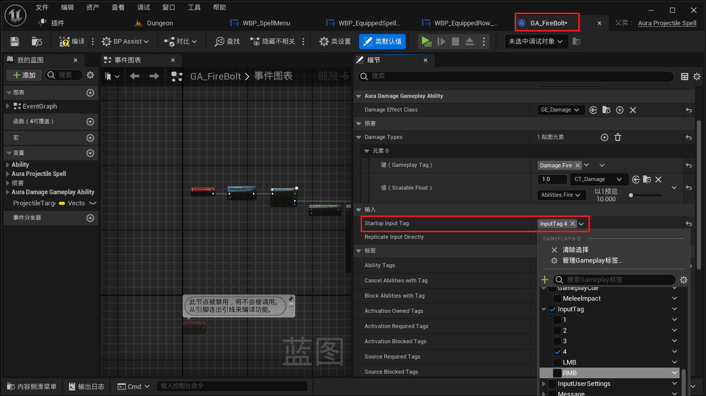

___________________________________________________________________________________________
###### [Go主菜单](../MainMenu.md)
___________________________________________________________________________________________

# GAS 135 装备技能区的显示技能的逻辑

___________________________________________________________________________________________

# 目录


- [GAS 135 装备技能区的显示技能的逻辑](#gas-135-装备技能区的显示技能的逻辑)
- [目录](#目录)
    - [Mermaid整体思路梳理](#mermaid整体思路梳理)
    - [主动技能/被动技能和装备技能区域的技能球的底层绑定委托和逻辑不同，所以需要单独创建](#主动技能被动技能和装备技能区域的技能球的底层绑定委托和逻辑不同所以需要单独创建)
      - [复制一份原来的按钮](#复制一份原来的按钮)
      - [将装备技能区原来的按钮，换成这个新的](#将装备技能区原来的按钮换成这个新的)
    - [下面想让装备区也像Overlay上一样显示当前的技能](#下面想让装备区也像overlay上一样显示当前的技能)
      - [`SpellMenuWidgetController` 中广播时，调用父类中的广播所有技能信息的函数 `BroadcastAbilityInfo`](#spellmenuwidgetcontroller-中广播时调用父类中的广播所有技能信息的函数-broadcastabilityinfo)
      - [在 ***WBP\_SpellMenu*** 中 调用设置装备技能区的WidgetController](#在-wbp_spellmenu-中-调用设置装备技能区的widgetcontroller)
      - [最后还需要广播一下](#最后还需要广播一下)
      - [新的技能球 ***WBP\_EquippedRow\_Button*** 中移除用不到的逻辑，然后调用设置每一个技能球的WidgetController](#新的技能球-wbp_equippedrow_button-中移除用不到的逻辑然后调用设置每一个技能球的widgetcontroller)
        - [然后绑定技能信息结构体广播](#然后绑定技能信息结构体广播)
      - [和Overlay中的逻辑相似，如果广播，每一个技能球都会收到信息，所以需要为每一个技能球配置对应的InputTag，这样就可以判断后自行设置](#和overlay中的逻辑相似如果广播每一个技能球都会收到信息所以需要为每一个技能球配置对应的inputtag这样就可以判断后自行设置)
        - [创建 `FGameplayTag` ，配置 `InputTag`](#创建-fgameplaytag-配置-inputtag)
        - [为每一个技能球配置Tag](#为每一个技能球配置tag)
        - [如果匹配，设置图标](#如果匹配设置图标)
      - [这样就可以在菜单中看到技能图标了](#这样就可以在菜单中看到技能图标了)
        - [将GA中InputTag改成别的测试](#将ga中inputtag改成别的测试)
      - [接下来需要添加 `被动技能的InputTag标签`，而且当技能图标未设置技能时，需要清空背景（需要创建一个函数）](#接下来需要添加-被动技能的inputtag标签而且当技能图标未设置技能时需要清空背景需要创建一个函数)
        - [别忘了在蓝图中配置 被动技能的 `InputTag`](#别忘了在蓝图中配置-被动技能的-inputtag)


___________________________________________________________________________________________

<details>
<summary>视频链接</summary>

[11. Equipped Row Button_哔哩哔哩_bilibili](https://www.bilibili.com/video/BV1TH4y1L7NP?p=78&vd_source=9e1e64122d802b4f7ab37bd325a89e6c)

------

</details>

___________________________________________________________________________________________

### Mermaid整体思路梳理

Mermaid

___________________________________________________________________________________________

### 主动技能/被动技能和装备技能区域的技能球的底层绑定委托和逻辑不同，所以需要单独创建
>

- 比如在游戏运行时的这些技能球，并不是按钮，装备技能区域需要和这里类似的功能
>


------

#### 复制一份原来的按钮

  - 命名为，`WBP_EquippedRow_Button`

>


------

#### 将装备技能区原来的按钮，换成这个新的
>


------

### 下面想让装备区也像Overlay上一样显示当前的技能
>


------

#### `SpellMenuWidgetController` 中广播时，调用父类中的广播所有技能信息的函数 `BroadcastAbilityInfo`
>


------

#### 在 ***WBP_SpellMenu*** 中 调用设置装备技能区的WidgetController
>


------

#### 最后还需要广播一下
>


------

#### 新的技能球 ***WBP_EquippedRow_Button*** 中移除用不到的逻辑，然后调用设置每一个技能球的WidgetController
>
>


------

##### 然后绑定技能信息结构体广播
>


------

#### 和Overlay中的逻辑相似，如果广播，每一个技能球都会收到信息，所以需要为每一个技能球配置对应的InputTag，这样就可以判断后自行设置
>


------

##### 创建 `FGameplayTag` ，配置 `InputTag`
>


------

##### 为每一个技能球配置Tag

  - 但是会有一个问题就是：没有被动技能的 `InputTag`
>


------

##### 如果匹配，设置图标
>


------

#### 这样就可以在菜单中看到技能图标了
>


------

##### 将GA中InputTag改成别的测试
>
>
>
>


------

#### 接下来需要添加 `被动技能的InputTag标签`，而且当技能图标未设置技能时，需要清空背景（需要创建一个函数）

  - 创建两个Tag，命名为

    - `InputTag_Passive_1`

    - `InputTag_Passive_2`
>我自己写了个可以双调节的函数
>
>
>
>
>
>
>
>```cpp
>FGameplayTag InputTag_Passive_1;
>FGameplayTag InputTag_Passive_2;
>```
>
>```cpp
>GameplayTags.InputTag_Passive_1 = UGameplayTagsManager::Get().AddNativeGameplayTag(
>    FName("InputTag.Passive.1"),
>    FString("InputTag Passive 1"));
>
>GameplayTags.InputTag_Passive_2 = UGameplayTagsManager::Get().AddNativeGameplayTag(
>    FName("InputTag.Passive.2"),
>    FString("InputTag Passive 2"));
>```


------

##### 别忘了在蓝图中配置 被动技能的 `InputTag`

> 


___________________________________________________________________________________________

[返回最上面](#Go主菜单)

___________________________________________________________________________________________