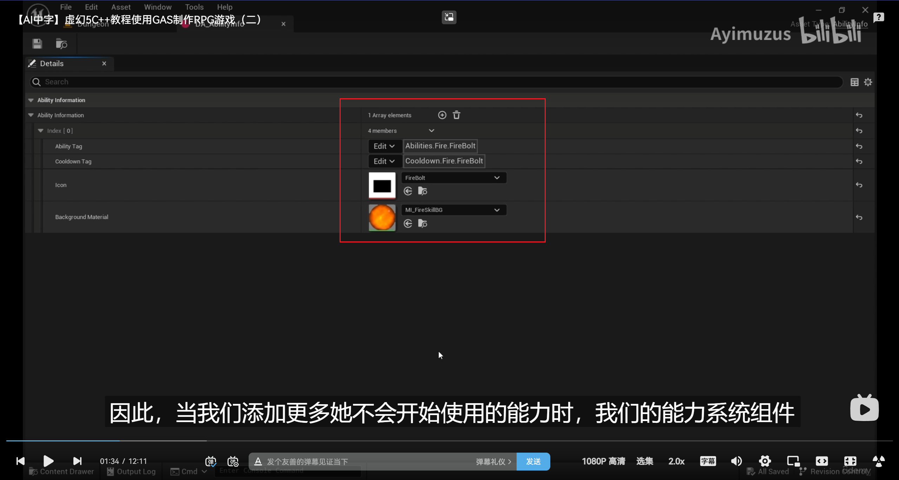

___________________________________________________________________________________________
###### [Go主菜单](../MainMenu.md)
___________________________________________________________________________________________

# GAS 137服务器中在角色升级时遍历技能，找到合格的技能，然后学习（在服务器），并同步给客户端UI

___________________________________________________________________________________________

## 处理关键点

1. **技能列表锁** `FScopedAbilityListLock`

2. 当角色升级时，因为属性开启了属性复制，所以会同步到服务器，在服务器根据 `技能可以学习的等级` 遍历技能，然后学习，再使用RPC_Client同步给指定客户端

   - 这样有两个时间节点在同步数据分别是：

     - 初始化时

     - 升级时

3. 当我们修改了技能，然后更改了该能力的某些内容，有可能不会马上更新同步到客户端，那么需要调用API 强制更新，这样可以立即复制该GA_Spec到客户端，不用等到下一轮同步周期

   - 使用API：`MarkAbilitySpecDirty(传入该GA的Spec);`

___________________________________________________________________________________________

# 目录


- [GAS 137服务器中在角色升级时遍历技能，找到合格的技能，然后学习（在服务器），并同步给客户端UI](#gas-137服务器中在角色升级时遍历技能找到合格的技能然后学习在服务器并同步给客户端ui)
  - [处理关键点](#处理关键点)
- [目录](#目录)
    - [Mermaid整体思路梳理](#mermaid整体思路梳理)
    - [当我们升级时，加入我们解锁了图中的技能，那么当到达指定的等级，那么该技能的图标也会被解锁，可以学习，技能等级应该在 `FAuraAbilityInfo结构体` 中并可以在蓝图中配置，ASC组件也应该有一个检索的函数](#当我们升级时加入我们解锁了图中的技能那么当到达指定的等级那么该技能的图标也会被解锁可以学习技能等级应该在-fauraabilityinfo结构体-中并可以在蓝图中配置asc组件也应该有一个检索的函数)
    - [在结构体中添加两个变量](#在结构体中添加两个变量)
    - [当角色升级时，ASC组件需要一个可以访问这个数据资产的方法，需要找与一个服务器的位置存放数据资产](#当角色升级时asc组件需要一个可以访问这个数据资产的方法需要找与一个服务器的位置存放数据资产)
    - [在GM中创建持有数据资产的智能指针](#在gm中创建持有数据资产的智能指针)
    - [蓝图函数库中创建获取数据资产的函数](#蓝图函数库中创建获取数据资产的函数)
    - [蓝图技能结构体中设置火球 `可以学习技能的等级为1`](#蓝图技能结构体中设置火球-可以学习技能的等级为1)
    - [蓝图GM中配置](#蓝图gm中配置)
    - [既然需要别的技能，我们需要先创建一个新的技能，触发先是临时打印逻辑](#既然需要别的技能我们需要先创建一个新的技能触发先是临时打印逻辑)
    - [但是我们缺新的技能的技能Tag](#但是我们缺新的技能的技能tag)
      - [创建新 `AbilityTag`](#创建新-abilitytag)
      - [配置技能Tag](#配置技能tag)
    - [蓝图技能信息结构体中，添加新的技能](#蓝图技能信息结构体中添加新的技能)
    - [UI中配置](#ui中配置)
    - [现在每次升级时，都希望图标可以自动更新，请看下一节](#现在每次升级时都希望图标可以自动更新请看下一节)
    - [下一节](#下一节)
    - [只有ASC可以学习技能，所以需要在ASC上创建函数，当我们需要时调用，函数体内会遍历技能信息的数据资产中的技能信息数组，找到合格的技能，然后学习（在服务器），并同步给客户端UI](#只有asc可以学习技能所以需要在asc上创建函数当我们需要时调用函数体内会遍历技能信息的数据资产中的技能信息数组找到合格的技能然后学习在服务器并同步给客户端ui)
    - [ASC上创建函数，需要传入一个等级根据传入的等级来设置技能状态](#asc上创建函数需要传入一个等级根据传入的等级来设置技能状态)
      - [在遍历中，考虑一个情况：如果我们找到了一个技能（比如火球）该技能已经被学习了，但是我们怎么知道找到的技能是否已被学习呢？](#在遍历中考虑一个情况如果我们找到了一个技能比如火球该技能已经被学习了但是我们怎么知道找到的技能是否已被学习呢)
      - [创建一个根据 `AbilityTag` 查找指定 `FGameplayAbilitySpec` 的函数，因为要修改返回的 `FGameplayAbilitySpec` ，所以需要返回 `指针` ！](#创建一个根据-abilitytag-查找指定-fgameplayabilityspec-的函数因为要修改返回的-fgameplayabilityspec-所以需要返回-指针-)
        - [当遍历时，技能可能会随时被取消和移除，所以需要一个**技能列表锁** `FScopedAbilityListLock`](#当遍历时技能可能会随时被取消和移除所以需要一个技能列表锁-fscopedabilitylistlock)
        - [遍历ASC的激活技能数组，然后遍历每个激活技能的AbilityTag，如果包含 `实参的标签` 就返回](#遍历asc的激活技能数组然后遍历每个激活技能的abilitytag如果包含-实参的标签-就返回)
      - [遍历数据资产中的技能，如果该技能已在技能列表中则会返回 `nullptr` 说明已学习该技能，如果返回 `nullptr` 说明未学习该技能，需要检查技能条件判断是否满足等级，若满足就学习](#遍历数据资产中的技能如果该技能已在技能列表中则会返回-nullptr-说明已学习该技能如果返回-nullptr-说明未学习该技能需要检查技能条件判断是否满足等级若满足就学习)
  - [但是有一个问题，当我们1修改了技能，然后更改了该能力的某些内容，有可能不会马上更新同步到客户端，那么需要调用API 强制更新，这样可以立即复制该GA\_Spec到客户端，不用等到下一轮同步周期](#但是有一个问题当我们1修改了技能然后更改了该能力的某些内容有可能不会马上更新同步到客户端那么需要调用api-强制更新这样可以立即复制该ga_spec到客户端不用等到下一轮同步周期)
    - [接下来需要向客户端的UI中创建委托更新视觉表现，下一节](#接下来需要向客户端的ui中创建委托更新视觉表现下一节)
    - [下一节](#下一节-1)
    - [上一节我们创建了ASC在服务器上更新技能状态的函数，但是还没有地方调用，我们需要在升级时调用](#上一节我们创建了asc在服务器上更新技能状态的函数但是还没有地方调用我们需要在升级时调用)
    - [在玩家基类中，升级时（这里的逻辑数据处理是在服务器执行的），调用ASC的服务器逻辑 `UpdateAbilityStatuses`](#在玩家基类中升级时这里的逻辑数据处理是在服务器执行的调用asc的服务器逻辑-updateabilitystatuses)
    - [接下来需要往UI中同步消息](#接下来需要往ui中同步消息)
      - [接下来在ASC中创建包含两个参数的多播，不用在蓝图中使用，所以不用动态的](#接下来在asc中创建包含两个参数的多播不用在蓝图中使用所以不用动态的)
        - [声明一个委托实例](#声明一个委托实例)
      - [现在需要在客户端和服务器同步消息，所以需要创建RPC函数](#现在需要在客户端和服务器同步消息所以需要创建rpc函数)
      - [当ASC更新技能状态后，调用 `RPC_Client` 函数](#当asc更新技能状态后调用-rpc_client-函数)
      - [接下来在 `SpellMenuWidgetController` 中绑定ASC的委托 `AbilityStatusChanged` 的回调](#接下来在-spellmenuwidgetcontroller-中绑定asc的委托-abilitystatuschanged-的回调)
    - [此时升级我们应该可以看到，技能树中新的技能被解锁(并不能)](#此时升级我们应该可以看到技能树中新的技能被解锁并不能)
    - [我们断点ASC中的更新函数，看看Level数据是否有问题](#我们断点asc中的更新函数看看level数据是否有问题)
      - [修改传入的等级](#修改传入的等级)
    - [运行时测试gif，升级后修改可以解锁的技能球状态](#运行时测试gif升级后修改可以解锁的技能球状态)
      - [LS模式下测试](#ls模式下测试)
      - [DS模式下测试](#ds模式下测试)
    - [接下来测试，打开UI的情况下，升级，是否会同步修改状态](#接下来测试打开ui的情况下升级是否会同步修改状态)
      - [LS模式下测试gif](#ls模式下测试gif)
      - [DS模式下测试gif](#ds模式下测试gif)
    - [接下来我们将处理，技能点，并应用技能点解锁的逻辑，请看下集](#接下来我们将处理技能点并应用技能点解锁的逻辑请看下集)


___________________________________________________________________________________________

<details>
<summary>视频链接</summary>

[14. Ability Level Requirement_哔哩哔哩_bilibili](https://www.bilibili.com/video/BV1TH4y1L7NP/?p=81&spm_id_from=pageDriver&vd_source=9e1e64122d802b4f7ab37bd325a89e6c)

[15. Update Ability Statuses_哔哩哔哩_bilibili](https://www.bilibili.com/video/BV1TH4y1L7NP/?p=82&spm_id_from=pageDriver&vd_source=9e1e64122d802b4f7ab37bd325a89e6c)

[16. Updating Status in the Spell Menu_哔哩哔哩_bilibili](https://www.bilibili.com/video/BV1TH4y1L7NP/?p=83&spm_id_from=pageDriver&vd_source=9e1e64122d802b4f7ab37bd325a89e6c)

------

</details>

___________________________________________________________________________________________

### Mermaid整体思路梳理

Mermaid

___________________________________________________________________________________________

### 当我们升级时，加入我们解锁了图中的技能，那么当到达指定的等级，那么该技能的图标也会被解锁，可以学习，技能等级应该在 `FAuraAbilityInfo结构体` 中并可以在蓝图中配置，ASC组件也应该有一个检索的函数
>
>


------

### 在结构体中添加两个变量

  - 一个是当前技能的 `GA Class`
    - 命名为，`Ability`
  - 一个是解锁该技能需要的等级
    - 命名为，`LevelRequirement`
>


------

### 当角色升级时，ASC组件需要一个可以访问这个数据资产的方法，需要找与一个服务器的位置存放数据资产

  - 打算放在GM中


------

### 在GM中创建持有数据资产的智能指针
>


------

### 蓝图函数库中创建获取数据资产的函数
>
>
>


------

### 蓝图技能结构体中设置火球 `可以学习技能的等级为1`
>


------

### 蓝图GM中配置
>


------

### 既然需要别的技能，我们需要先创建一个新的技能，触发先是临时打印逻辑

  - 命名为，`GA_Electrocute`
>#### **新建文件夹 `Lightning`**
>
>
>
>这里我有点疑问，不是应该是继承自 `AuraDamageGameplayAbility` 吗
>
>
>


------

### 但是我们缺新的技能的技能Tag
>


------

#### 创建新 `AbilityTag`

  - `Abilities_Lightning_Electrocute`
>```cpp
>FGameplayTag Abilities_Lightning_Electrocute;
>```
>
>```cpp
>GameplayTags.Abilities_Lightning_Electrocute = UGameplayTagsManager::Get().AddNativeGameplayTag(
>    FName("Abilities.Lightning.Electrocute"),
>    FString("Abilities Lightning Electrocute"));
>```
>
>


------

#### 配置技能Tag
>


------

### 蓝图技能信息结构体中，添加新的技能
>


------

### UI中配置
>


------

### 现在每次升级时，都希望图标可以自动更新，请看下一节
>


------

### 下一节


------

### 只有ASC可以学习技能，所以需要在ASC上创建函数，当我们需要时调用，函数体内会遍历技能信息的数据资产中的技能信息数组，找到合格的技能，然后学习（在服务器），并同步给客户端UI


------

### ASC上创建函数，需要传入一个等级根据传入的等级来设置技能状态

  - 命名为，`UpdateAbilityStatuses`
>
>
>
>```CPP
>void UAuraAbilitySystemComponent::UpdateAbilityStatuses(const int32 InLevel)
>{
>    if (const UAbilityInfo* AbilityInfo =  UAuraAbilitySystemLibrary::GetAbilityInfo(this))
>    {
>       for (FAuraAbilityInfo Info : AbilityInfo->AbilityInformation)
>       {
>          
>       }
>    }
>}
>```


------

#### 在遍历中，考虑一个情况：如果我们找到了一个技能（比如火球）该技能已经被学习了，但是我们怎么知道找到的技能是否已被学习呢？

  - 如果我们能够检查一下我们是否已经具备了这种游戏能力，那就太好了

  - 所以需要创建一个函数，根据技能规范，查找是否已学习，如果未学习，就可以学习了，如果学习了就返回已学习，这样就不用重复学习了


------

#### 创建一个根据 `AbilityTag` 查找指定 `FGameplayAbilitySpec` 的函数，因为要修改返回的 `FGameplayAbilitySpec` ，所以需要返回 `指针` ！
>```cpp
>FGameplayAbilitySpec* GetSpecFromAbilityTag(const FGameplayTag& AbilityTag);
>```
>
>

- 如果没找到就返回空指针，这样就可以判断


------

##### 当遍历时，技能可能会随时被取消和移除，所以需要一个**技能列表锁** `FScopedAbilityListLock`

> ASC中使用，this指的是ASC组件
>
> ```cpp
> FScopedAbilityListLock AbilityListLock(*this);//使用技能列表锁，锁住当前操作区域
> ```


------

##### 遍历ASC的激活技能数组，然后遍历每个激活技能的AbilityTag，如果包含 `实参的标签` 就返回
>
>
>```cpp
>FGameplayAbilitySpec* UAuraAbilitySystemComponent::GetSpecFromAbilityTag(const FGameplayTag& AbilityTag)
>{
>    FScopedAbilityListLock AbilityListLock(*this);//使用技能列表锁，锁住当前操作区域
>    for (FGameplayAbilitySpec& AbilitySpec : GetActivatableAbilities())
>    {
>       if (!AbilitySpec.Ability.Get()) continue;
>       for (const FGameplayTag& Tag : AbilitySpec.Ability.Get()->AbilityTags)
>       {
>          if (Tag.MatchesTagExact(AbilityTag))
>          {
>             return &AbilitySpec;
>          }  
>       }
>    }
>}
>```


------

#### 遍历数据资产中的技能，如果该技能已在技能列表中则会返回 `nullptr` 说明已学习该技能，如果返回 `nullptr` 说明未学习该技能，需要检查技能条件判断是否满足等级，若满足就学习
>


------

## 但是有一个问题，当我们1修改了技能，然后更改了该能力的某些内容，有可能不会马上更新同步到客户端，那么需要调用API 强制更新，这样可以立即复制该GA_Spec到客户端，不用等到下一轮同步周期

  - 使用API：`MarkAbilitySpecDirty(传入该GA的Spec);`
>```cpp
>MarkAbilitySpecDirty(AbilitySpec);/*强制更新，这样可以立即复制该GA_Spec到客户端，不用等到下一轮同步周期*/
>```
>
>
>
>```cpp
>void UAuraAbilitySystemComponent::UpdateAbilityStatuses(const int32 InLevel)
>{
>    if (const UAbilityInfo* AbilityInfo =  UAuraAbilitySystemLibrary::GetAbilityInfo(this))
>    {
>       for (FAuraAbilityInfo Info : AbilityInfo->AbilityInformation)
>       {
>          if (Info.AbilityTag.IsValid() && GetSpecFromAbilityTag(Info.AbilityTag) == nullptr)
>          {
>             if (Info.LevelRequirement <= InLevel)
>             {
>                //Info.StatusTag = FAuraGameplayTags::Get().Abilities_Status_Eligible;
>                FGameplayAbilitySpec AbilitySpec = FGameplayAbilitySpec(Info.Ability,1);
>                AbilitySpec.DynamicAbilityTags.AddTag(FAuraGameplayTags::Get().Abilities_Status_Eligible);
>                GiveAbility(AbilitySpec);
>                MarkAbilitySpecDirty(AbilitySpec);/*强制更新，这样可以立即复制该GA_Spec到客户端，不用等到下一轮同步周期*/
>             }
>          }
>       }
>    }
>}
>```


------

### 接下来需要向客户端的UI中创建委托更新视觉表现，下一节


------

### 下一节


------

### 上一节我们创建了ASC在服务器上更新技能状态的函数，但是还没有地方调用，我们需要在升级时调用
>

- 在玩家基类中调用升级的函数时，可以处理这些逻辑，因为我们的函数需要等级，而这里可以拿到升级后的等级，不写在 `LeveUp函数` 中省了一次函数调用
>


------

### 在玩家基类中，升级时（这里的逻辑数据处理是在服务器执行的），调用ASC的服务器逻辑 `UpdateAbilityStatuses`
>


------

### 接下来需要往UI中同步消息

> 还是使用之前的这个 `动态多播` 同步到蓝图中
>
> 


------

#### 接下来在ASC中创建包含两个参数的多播，不用在蓝图中使用，所以不用动态的

  - 两个参数分别为：

    - 技能Tag `AbilityTag`

    - 状态Tag `StatusTag`
  - 命名为，`FAbilitystatusChanged`
>```CPP
>DECLARE_MULTICAST_DELEGATE_TwoParams(FAbilityStatusChanged, const FGameplayTag& /*AbilityTag*/, const FGameplayTag& /*StatusTag*/);
>```
>
>


------

##### 声明一个委托实例
>


------

#### 现在需要在客户端和服务器同步消息，所以需要创建RPC函数

  - 命名为，`ClientUpdateAbilityStatus`
  - `RPC_Client` 函数中广播
>
>
>
>
>
>
>```cpp
>UFUNCTION(Client,Reliable)
>void ClientUpdateAbilityStatus(const FGameplayTag& AbilityTag, const FGameplayTag& StatusTag);
>```
>
>```cpp
>void UAuraAbilitySystemComponent::ClientUpdateAbilityStatus_Implementation(const FGameplayTag& AbilityTag,
>    const FGameplayTag& StatusTag)
>{
>    AbilityStatusChanged.Broadcast(AbilityTag, StatusTag);
>}
>```


------

#### 当ASC更新技能状态后，调用 `RPC_Client` 函数
>


------

#### 接下来在 `SpellMenuWidgetController` 中绑定ASC的委托 `AbilityStatusChanged` 的回调

  - 这样会在初始化时绑定 `AbilityStatusChanged` 的回调，每当升级时，玩家基类调用ASC的`UpdateAbilityStatuses` 函数（在服务器）然后触发 `RPC_Client` 函数 `ClientUpdateAbilityStatus` 函数体内，广播触发在 `SpellMenuWidgetController` 中的委托 `AbilityStatusChanged` 回调


------

### 此时升级我们应该可以看到，技能树中新的技能被解锁(并不能)
>

- 可是并没有解锁


------

### 我们断点ASC中的更新函数，看看Level数据是否有问题
>

- 升级时传入的等级好像不对
>


------

#### 修改传入的等级
>


------

### 运行时测试gif，升级后修改可以解锁的技能球状态
>


------

#### LS模式下测试

------

#### DS模式下测试

------

### 接下来测试，打开UI的情况下，升级，是否会同步修改状态

  - 需要暂时修改之前的“打开UI时无法移动的逻辑”

  - 测试完记得改回来！

  - 我这里有个bug，是因为我把这俩函数的逻辑写反了（如果真的写反了，像我一样其实每次打开菜单都会广播，问题就是重复绑定，消息是可以同步的）

    > 
    >
    > 
    >
    > 那蓝图调用肯定错了
    >
    > 果然


------

#### LS模式下测试gif
>


------

#### DS模式下测试gif
>


------

### 接下来我们将处理，技能点，并应用技能点解锁的逻辑，请看下集


___________________________________________________________________________________________

[返回最上面](#Go主菜单)

___________________________________________________________________________________________