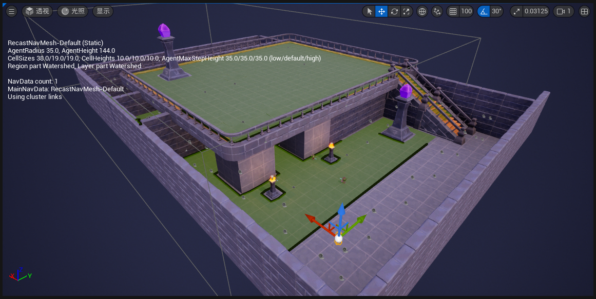
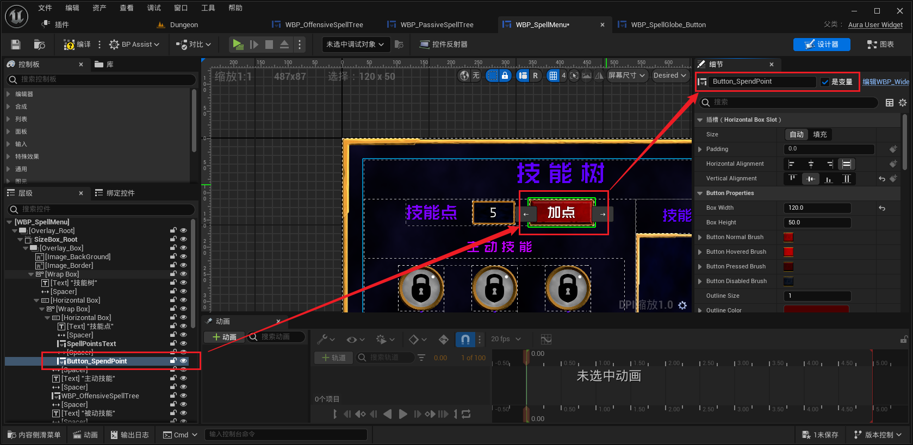

___________________________________________________________________________________________
###### [Go主菜单](../MainMenu.md)
___________________________________________________________________________________________

# GAS 139 使用广播本地根据技能状态和技能点处理花费技能点按钮和装备技能按钮的启用和禁用

_________________________________________________________________________________________

# 目录


- [GAS 139 使用广播本地根据技能状态和技能点处理花费技能点按钮和装备技能按钮的启用和禁用](#gas-139-使用广播本地根据技能状态和技能点处理花费技能点按钮和装备技能按钮的启用和禁用)
- [目录](#目录)
    - [Mermaid整体思路梳理](#mermaid整体思路梳理)
    - [将 `NavMesh` 向前移一段距离，（让玩家所在的区域没有导航，这样AI就无法到达玩家位置，就会在原地不动）为了方便测试](#将-navmesh-向前移一段距离让玩家所在的区域没有导航这样ai就无法到达玩家位置就会在原地不动为了方便测试)
    - [本节我们将处理这两个按钮的 `启用` 和 `禁用` 状态](#本节我们将处理这两个按钮的-启用-和-禁用-状态)
    - [大致有下面这几种情况](#大致有下面这几种情况)
    - [按钮改下名字](#按钮改下名字)
    - [`构造` 时，禁用按钮](#构造-时禁用按钮)
    - [接下来将，在 `WidgetController` 中创建委托，广播这两个按钮开关的 bool ，在点击技能图标时，可以调用一个 `blueprintCallable` 函数，可以传入 `AbilityTag` ，然后进行对比](#接下来将在-widgetcontroller-中创建委托广播这两个按钮开关的-bool-在点击技能图标时可以调用一个-blueprintcallable-函数可以传入-abilitytag-然后进行对比)
    - [下面我们将 拆分步骤 来完成这些需求](#下面我们将-拆分步骤-来完成这些需求)
      - [当我们选中技能图标时，调用一个 `blueprintCallable` 函数，传入 `AbilityTag` ，这样可以知道我们选择的是哪个技能图标](#当我们选中技能图标时调用一个-blueprintcallable-函数传入-abilitytag-这样可以知道我们选择的是哪个技能图标)
        - [`SpellMenuWidgetController` 中创建蓝图可调用函数](#spellmenuwidgetcontroller-中创建蓝图可调用函数)
        - [在点击时，调用](#在点击时调用)
      - [接下来声明一个含有两个 `bool` 的动态多播](#接下来声明一个含有两个-bool-的动态多播)
      - [接下来我们需要考虑在何时进行广播？](#接下来我们需要考虑在何时进行广播)
      - [这是有一个问题，我们需要一个 `GameplayTag` 来标注，无技能的状态](#这是有一个问题我们需要一个-gameplaytag-来标注无技能的状态)
        - [创建标注无技能状态的 `GameplayTag`](#创建标注无技能状态的-gameplaytag)
      - [使用 `AbilityTag` ，对技能状态进行归类](#使用-abilitytag-对技能状态进行归类)
      - [需要获取 `技能状态`](#需要获取-技能状态)
      - [下面需要创建两个 `bool` ，并根据技能点和技能状态，设置 `bool` （因为业务逻辑比较多，应该搞成一个 `函数` ，通过引用传参，进行内部修改值，供给外部使用）](#下面需要创建两个-bool-并根据技能点和技能状态设置-bool-因为业务逻辑比较多应该搞成一个-函数-通过引用传参进行内部修改值供给外部使用)
      - [点击技能函数 `SpellGlobeSelected` 中，创建两个局部变量 `bool` ，调用上面创建的函数，修改值，然后进行广播（ `注意顺序` 不要搞错了）](#点击技能函数-spellglobeselected-中创建两个局部变量-bool-调用上面创建的函数修改值然后进行广播-注意顺序-不要搞错了)
    - [此时运行游戏，断点测试，看结果是否正常](#此时运行游戏断点测试看结果是否正常)
    - [在打开菜单后进行广播，然后设置两个按钮的启用禁用状态](#在打开菜单后进行广播然后设置两个按钮的启用禁用状态)
    - [先关掉 “打开菜单时无法攻击的功能” 整个大章节完成再打开，因为需要测试额外情况！](#先关掉-打开菜单时无法攻击的功能-整个大章节完成再打开因为需要测试额外情况)
    - [此时测试一下结果gif](#此时测试一下结果gif)
    - [有一个报错，当我们运行时点击被动技能图标时，会报错](#有一个报错当我们运行时点击被动技能图标时会报错)
    - [现在有一个问题是，当我们选中了一个技能，因为我们是远程攻击角色，所以，我们可能先攻击一个敌人，然后打开 `UI` ，此时飞行的火球把敌人打死，然后升级，但这时，我们选中的技能并不会随之更新按钮的状态（也就是说，在升级时，需要处理广播更新UI的逻辑）下一节处理](#现在有一个问题是当我们选中了一个技能因为我们是远程攻击角色所以我们可能先攻击一个敌人然后打开-ui-此时飞行的火球把敌人打死然后升级但这时我们选中的技能并不会随之更新按钮的状态也就是说在升级时需要处理广播更新ui的逻辑下一节处理)


___________________________________________________________________________________________

<details>
<summary>视频链接</summary>

[20. Spell Menu Buttons_哔哩哔哩_bilibili](https://www.bilibili.com/video/BV1TH4y1L7NP?p=87&vd_source=9e1e64122d802b4f7ab37bd325a89e6c)

------

</details>

___________________________________________________________________________________________

### Mermaid整体思路梳理

Mermaid

___________________________________________________________________________________________

### 将 `NavMesh` 向前移一段距离，（让玩家所在的区域没有导航，这样AI就无法到达玩家位置，就会在原地不动）为了方便测试

>


------

### 本节我们将处理这两个按钮的 `启用` 和 `禁用` 状态

>


------

### 大致有下面这几种情况

  - 当菜单打开是默认禁用，这两个按钮
  - 当点击一个已经激活的技能时（ `已解锁状态` 和 `已装备状态` ），可以使用技能点提升该技能的等级，加点按钮应该启用，同时，装备技能按钮也应该启用，因为可以装备该技能
  - 选定 `技能图标` 的状态

| 技能状态             | 加点按钮 | 装备技能按钮 |
| -------------------- | -------- | ------------ |
| 锁定状态             | 禁用     | 禁用         |
| 待解锁状态           | 启用     | 禁用         |
| 已解锁状态（未装备） | 启用     | 启用         |
| 已装备状态           | 启用     | 启用         |

  - 除此之外，当 `技能点数 == 0` 时，也 不应该启用 该按钮


------

### 按钮改下名字

>


------

### `构造` 时，禁用按钮

>
>
>


------

### 接下来将，在 `WidgetController` 中创建委托，广播这两个按钮开关的 bool ，在点击技能图标时，可以调用一个 `blueprintCallable` 函数，可以传入 `AbilityTag` ，然后进行对比

  - **至于为什么只同步这两个 `bool` ? 多余的数据不要随随便便同步**


------

### 下面我们将 拆分步骤 来完成这些需求


------

#### 当我们选中技能图标时，调用一个 `blueprintCallable` 函数，传入 `AbilityTag` ，这样可以知道我们选择的是哪个技能图标


------

##### `SpellMenuWidgetController` 中创建蓝图可调用函数

  - 命名为，`SpellGlobeSelected`

>```cpp
>public:
>    
>    UFUNCTION(BlueprintCallable)
>    void SpellGlobeSelected(const FGameplayTag& AbilityTag);
>```
>
>
>


------

##### 在点击时，调用

>


------

#### 接下来声明一个含有两个 `bool` 的动态多播

  - 命名为，`FSpellGlobeSelectedSignature`

  - **委托实例(蓝图实现)**，命名为，`SpellGlobeSelectedDelegate`

>```cpp
>DECLARE_DYNAMIC_MULTICAST_DELEGATE_TwoParams(FSpellGlobeSelectedSignature, bool, bSpendPointsButtonEnabled, bool, bEquipButtonEnabled);
>```
>
>```cpp
>UPROPERTY(BlueprintAssignable)
>    FSpellGlobeSelectedSignature SpellGlobeSelectedDelegate;
>```
>
>
>


------

#### 接下来我们需要考虑在何时进行广播？

  - 先在**点击技能图标**时，拿到**技能点**，通过**技能点**和**技能状态**判断该执行的策略，这时**分情况 广播**不同数据


------

#### 这是有一个问题，我们需要一个 `GameplayTag` 来标注，无技能的状态

  - 需要创建一个 `GameplayTag` 


------

##### 创建标注无技能状态的 `GameplayTag`

>


<details>
<summary>回顾一下，之前在ASC中创建的函数 GetStatusFromSpec 和 GetSpecFromAbilityTag </summary>

>
>
>
>- 我们是在当前已激活的能力列表中遍历 `GetActivatableAbilities()` ，然后返回该技能的 `GA Spec` ，也就是说如果该技能没有学习，是不会在列表中的，也就是会返回 `空指针` 

------

</details>

------

#### 使用 `AbilityTag` ，对技能状态进行归类

  - 有几种情况：当一下一种情况发生时，判定该技能状态等同于 `锁定状态` （相当于广播两个false，也就是两个 **按钮** 都 **不启用** ）

    - `AbilityTag` 失效

    - `AbilityTag == None` ，也就是我们的 `无技能` 状态标记

    - 调用 `ASC` 上的 `GetSpecFromAbilityTag` 函数，返回的 `Spec` 有效（说明已经学习了该技能）

>```CPP
>void USpellMenuWidgetController::SpellGlobeSelected(const FGameplayTag& AbilityTag)
>{
>	if (!GetAuraASC()) return;
>	const FAuraGameplayTags AuraGameplayTags = FAuraGameplayTags::Get();
>	//技能标签 有效
>	const bool bIsAbilityTagValid = AbilityTag.IsValid();
>	//技能标签 为 None
>	const bool bIsAbilityTagNone = AbilityTag.MatchesTag(AuraGameplayTags.Abilities_None);
>	//返回的 `Spec` 有效 (说明已经学习了该技能)
>	const bool bIsSpecValid = GetAuraASC()->GetSpecFromAbilityTag(AbilityTag) != nullptr;
>	
>	FGameplayTag AbilityStatus;
>	if (!bIsAbilityTagValid || bIsAbilityTagNone || !bIsSpecValid)
>	{
>		AbilityStatus = AuraGameplayTags.Abilities_Status_Locked;
>	}
>}
>```


------

#### 需要获取 `技能状态`

  - 有个问题，因为 `GetSpecFromAbilityTag` 函数中涉及到 `for` 循环遍历，不宜多次调用，所以 **需要暂存结果，以便后续多次使用**（需要注意下）

>```cpp
>void USpellMenuWidgetController::SpellGlobeSelected(const FGameplayTag& AbilityTag)
>{
>	if (!GetAuraASC()) return;
>	
>	const FAuraGameplayTags AuraGameplayTags = FAuraGameplayTags::Get();
>	const FGameplayAbilitySpec* AbilitySpec = GetAuraASC()->GetSpecFromAbilityTag(AbilityTag);
>	
>	//技能标签 有效
>	const bool bIsAbilityTagValid = AbilityTag.IsValid();
>	//技能标签 为 None
>	const bool bIsAbilityTagNone = AbilityTag.MatchesTag(AuraGameplayTags.Abilities_None);
>	//返回的 `Spec` 有效 (说明已经学习了该技能)
>	const bool bIsSpecValid = AbilitySpec != nullptr;
>	
>	FGameplayTag AbilityStatus;
>	if (!bIsAbilityTagValid || bIsAbilityTagNone || !bIsSpecValid)
>	{
>		AbilityStatus = AuraGameplayTags.Abilities_Status_Locked;
>	}
>	else
>	{
>		AbilityStatus = GetAuraASC()->GetStatusFromSpec(*AbilitySpec);
>	}
>}
>```


------

#### 下面需要创建两个 `bool` ，并根据技能点和技能状态，设置 `bool` （因为业务逻辑比较多，应该搞成一个 `函数` ，通过引用传参，进行内部修改值，供给外部使用）

- 创建函数命名为，`ShouldEnableButtons` 
- **然后 根据情况 设置 `bool`**

>```cpp
>private:
>
>    void ShouldEnableButtons(const FGameplayTag& InAbilityStatus, int32 InSpellPoints, bool& bShouldEnableSpellPointsButton, bool& bShouldEnableEquipButton);
>```
>
>
>
>```cpp
>void USpellMenuWidgetController::ShouldEnableButtons(const FGameplayTag& InAbilityStatus, int32 InSpellPoints,
>    bool& bShouldEnableSpellPointsButton, bool& bShouldEnableEquipButton)
>{
>    bShouldEnableSpellPointsButton = false;
>    bShouldEnableEquipButton = false;
>    const FAuraGameplayTags AuraGameplayTags = FAuraGameplayTags::Get();
>    if (InAbilityStatus.MatchesTagExact(AuraGameplayTags.Abilities_Status_Equipped))
>    {
>       if (InSpellPoints > 0)
>       {
>          bShouldEnableSpellPointsButton = true;
>       }
>       bShouldEnableEquipButton = true;
>    }
>    else if (InAbilityStatus.MatchesTagExact(AuraGameplayTags.Abilities_Status_Eligible))
>    {
>       if (InSpellPoints > 0)
>       {
>          bShouldEnableSpellPointsButton = true;
>       }
>    }
>    else if (InAbilityStatus.MatchesTagExact(AuraGameplayTags.Abilities_Status_Unlocked))
>    {
>       if (InSpellPoints > 0)
>       {
>          bShouldEnableSpellPointsButton = true;
>       }
>       bShouldEnableEquipButton = true;
>    }
>}
>```


------

#### 点击技能函数 `SpellGlobeSelected` 中，创建两个局部变量 `bool` ，调用上面创建的函数，修改值，然后进行广播（ `注意顺序` 不要搞错了）

>### 先获取 获取两个bool
>
>```cpp
>bool bEnableSpellPointsButton = false;
>bool bEnableEquipButton = false;
>ShouldEnableButtons(AbilityStatus,GetAuraPS()->GetSpellPoints(),bEnableSpellPointsButton,bEnableEquipButton);
>```
>
>### 再广播
>
>```cpp
>SpellGlobeSelectedDelegate.Broadcast(bEnableSpellPointsButton,bEnableEquipButton);
>```
>
>


------

### 此时运行游戏，断点测试，看结果是否正常

>#### **我这里因为一上来技能点为0，所以不能使用加点按钮，可使用 装备按钮 ，且 `状态标签` 也没问题**
>
>
>
>


------

### 在打开菜单后进行广播，然后设置两个按钮的启用禁用状态

>
>
>

- 合并函数，命名为，`SetButtonsEnabled`

>
>
>

- 构造时也可以使用这个函数初始化了

>


------

### 先关掉 “打开菜单时无法攻击的功能” 整个大章节完成再打开，因为需要测试额外情况！

------

### 此时测试一下结果gif

  - 当我们单击装备的能力时，我们将启用这两个按钮（我初始的技能点是0，所以不会启用加点的按钮，只会启用装备按钮，升1级以后测试结果应该两个按钮都启用）

  - 当我们点击锁定的技能或没有技能球的技能球时禁用这两个按钮

>


------

### 有一个报错，当我们运行时点击被动技能图标时，会报错

>
>

- 是说我们没有实现被动技能球的 `WidgetControllerSet` 事件，所以技能球没有 `WidgetConreoller`

- 需要设置下

>


------

### 现在有一个问题是，当我们选中了一个技能，因为我们是远程攻击角色，所以，我们可能先攻击一个敌人，然后打开 `UI` ，此时飞行的火球把敌人打死，然后升级，但这时，我们选中的技能并不会随之更新按钮的状态（也就是说，在升级时，需要处理广播更新UI的逻辑）下一节处理

>


___________________________________________________________________________________________

[返回最上面](#Go主菜单)

___________________________________________________________________________________________