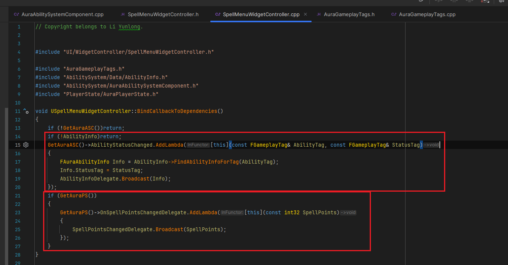
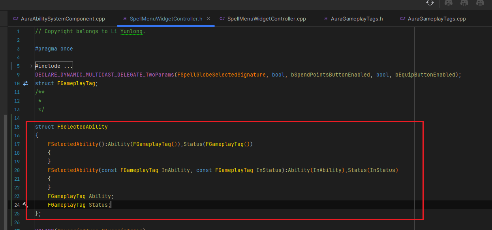
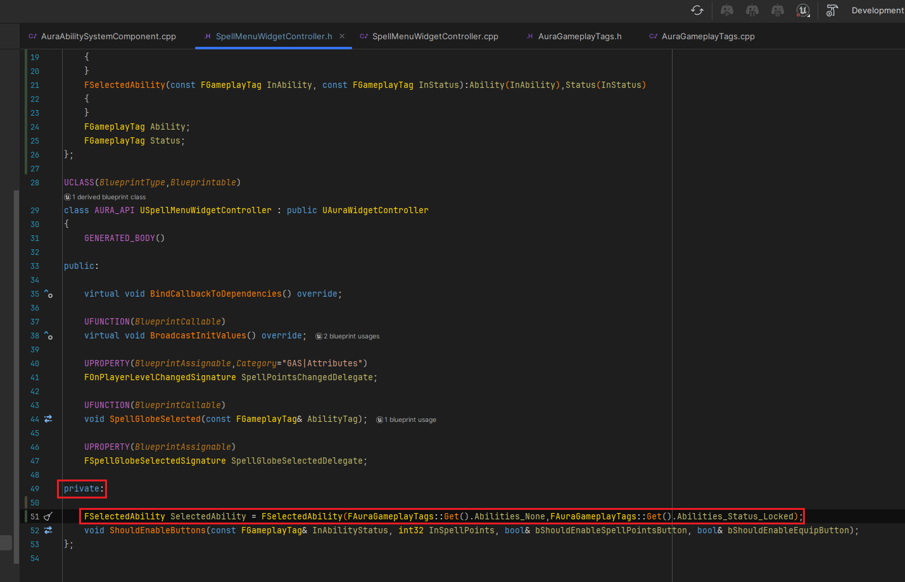
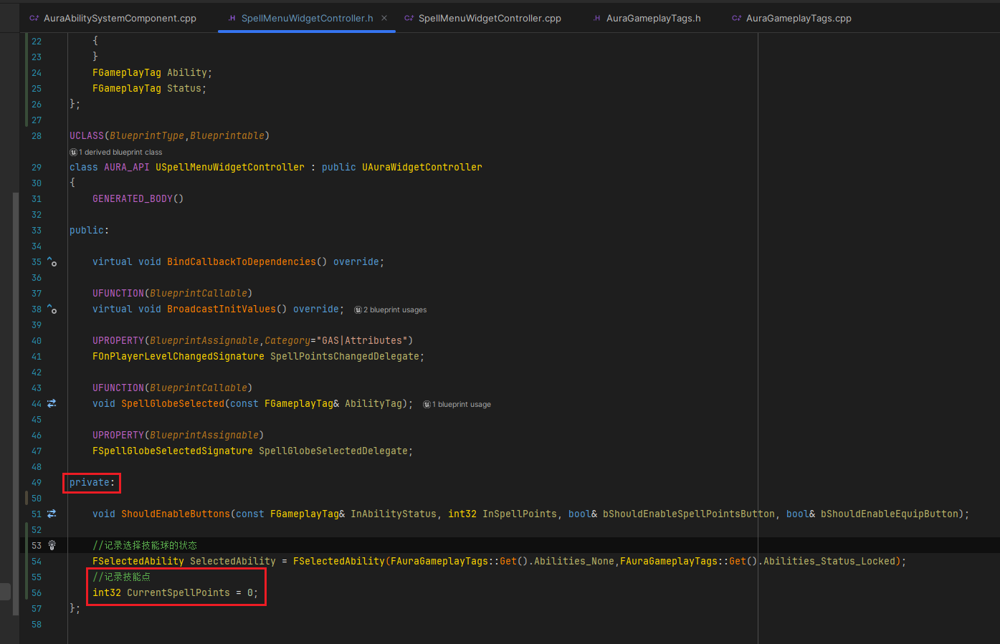
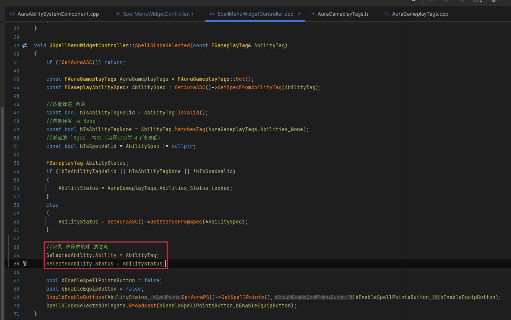
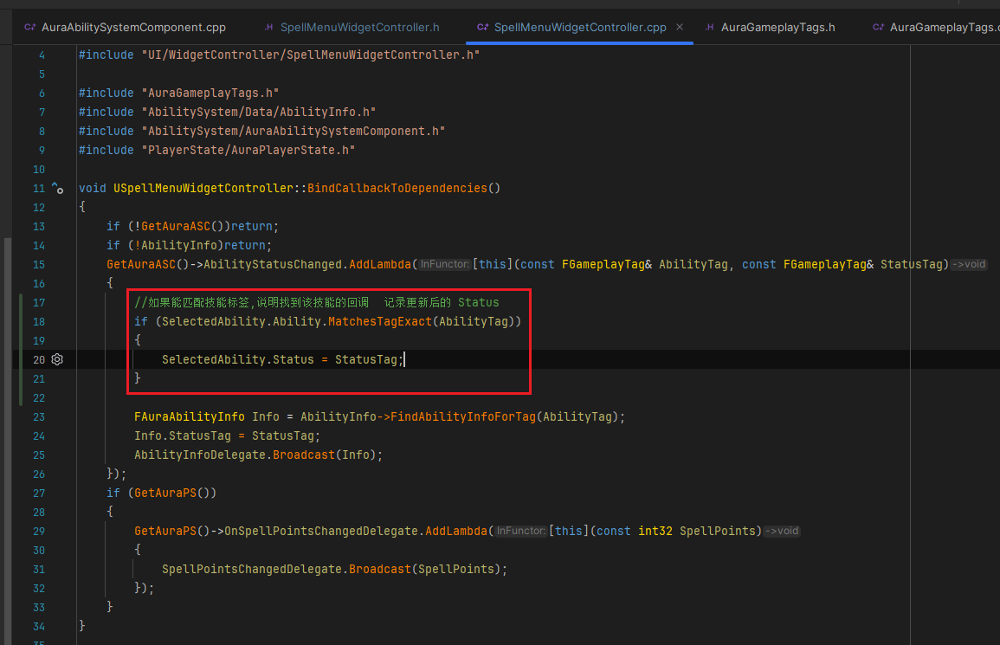
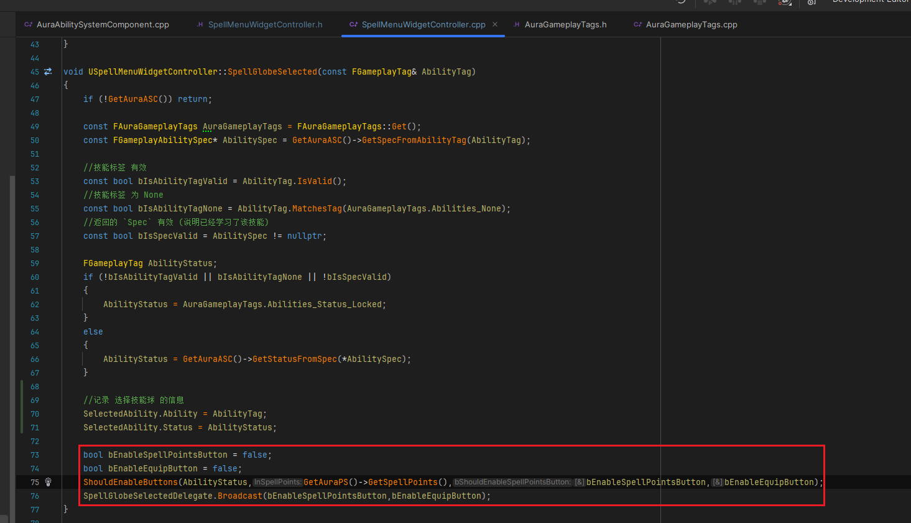
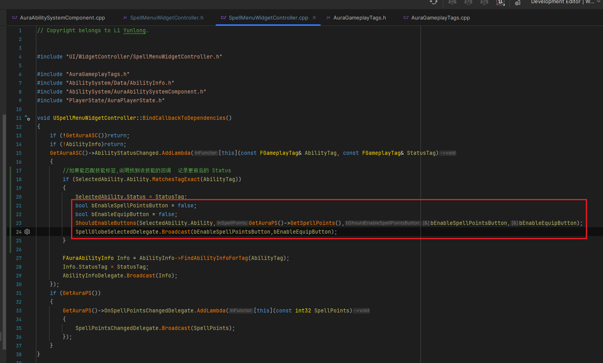
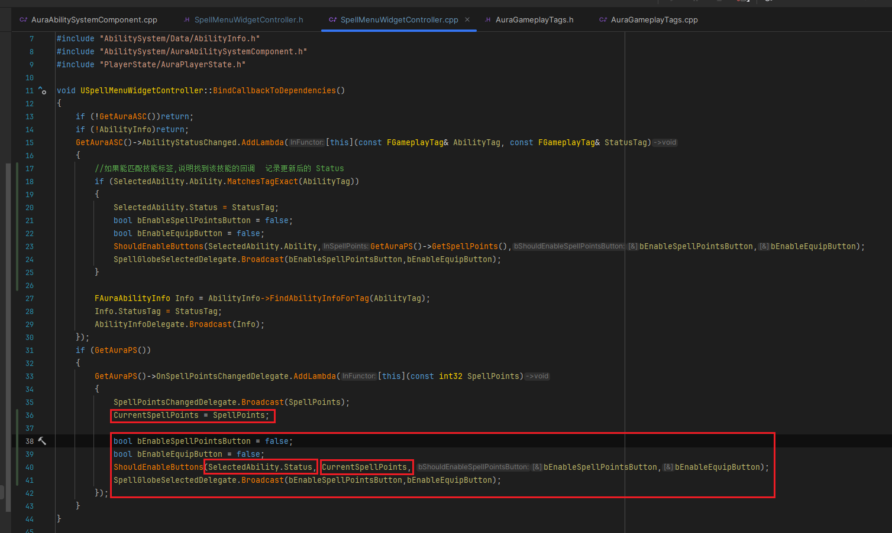

___________________________________________________________________________________________
###### [Go主菜单](../MainMenu.md)
___________________________________________________________________________________________

# GAS 140 在角色升级时，将需要的信息同步到UI；处理当一个广播的内容依赖于两个不一定先后触发的回调时的处理方案

___________________________________________________________________________________________

## 处理关键点

1. 当一个广播内容依赖于两个回调(不一定先后触发)的逻辑时，可本地持有结构体变量包含两个回调结果(或在两个回调中设置参数)处理

___________________________________________________________________________________________

# 目录


- [GAS 140 在角色升级时，将需要的信息同步到UI；处理当一个广播的内容依赖于两个不一定先后触发的回调时的处理方案](#gas-140-在角色升级时将需要的信息同步到ui处理当一个广播的内容依赖于两个不一定先后触发的回调时的处理方案)
  - [处理关键点](#处理关键点)
- [目录](#目录)
    - [Mermaid整体思路梳理](#mermaid整体思路梳理)
    - [接下来我们将处理打开菜单后，角色升级，后续的更新按钮UI逻辑](#接下来我们将处理打开菜单后角色升级后续的更新按钮ui逻辑)
      - [我们之前创建了两个回调 `lambda` ，用来处理广播按钮贴图信息和技能点](#我们之前创建了两个回调-lambda-用来处理广播按钮贴图信息和技能点)
    - [当我们选中一个技能球之后，并且我们刚刚升级了技能，这种情况下，两个广播的回调都会被触发，然后广播，但我们不确定哪一个先发生，](#当我们选中一个技能球之后并且我们刚刚升级了技能这种情况下两个广播的回调都会被触发然后广播但我们不确定哪一个先发生)
    - [解决方法是：我们在 `WidgetController` 中 `本地保存状态` ，当两个广播都被触发后，执行广播](#解决方法是我们在-widgetcontroller-中-本地保存状态-当两个广播都被触发后执行广播)
    - [在 `SpellMenuWidgetController` 中创建结构体，保存 `状态Tag` 和 `技能Tag`，还需要记录下技能点](#在-spellmenuwidgetcontroller-中创建结构体保存-状态tag-和-技能tag还需要记录下技能点)
    - [接下来，需要在每次选择时，在结构体中，记录数据](#接下来需要在每次选择时在结构体中记录数据)
    - [因为在 `Construct` 时，会绑定技能状态变化的动态多播，后续升级时会 `多次` 触发回调，所以需要在每次触发回调时，要判断，本次的技能是否与保存的 `AbilityTag` 数据一致，如果一致，就使用传进来的 `Status` 设置结构体的 `状态Tag` ，这样就会在升级时触发回调，更新选中技能图标的最新 `状态Tag`](#因为在-construct-时会绑定技能状态变化的动态多播后续升级时会-多次-触发回调所以需要在每次触发回调时要判断本次的技能是否与保存的-abilitytag-数据一致如果一致就使用传进来的-status-设置结构体的-状态tag-这样就会在升级时触发回调更新选中技能图标的最新-状态tag)
    - [接下来需要设置 `bool` ，然后广播](#接下来需要设置-bool-然后广播)
    - [当技能点更新（回调触发时），也需要调用这四行逻辑，(这样可以保证无论哪个回调先触发，后者都会覆盖前者，最后这个会广播正确的 `bool` 数值)](#当技能点更新回调触发时也需要调用这四行逻辑这样可以保证无论哪个回调先触发后者都会覆盖前者最后这个会广播正确的-bool-数值)
    - [接下来，打开 `技能树Menu` ，选中一个技能，然后升级，分别测试一下这两个按钮gif](#接下来打开-技能树menu-选中一个技能然后升级分别测试一下这两个按钮gif)
    - [我们还没有办法真正的解锁技能，下一节，真正的解锁技能，需要上服务器使用 `RPC_Server`](#我们还没有办法真正的解锁技能下一节真正的解锁技能需要上服务器使用-rpc_server)


___________________________________________________________________________________________

<details>
<summary>视频链接</summary>

[21. Selected Ability_哔哩哔哩_bilibili](https://www.bilibili.com/video/BV1TH4y1L7NP?p=88&vd_source=9e1e64122d802b4f7ab37bd325a89e6c)

------

</details>

___________________________________________________________________________________________

### Mermaid整体思路梳理

Mermaid

___________________________________________________________________________________________


### 接下来我们将处理打开菜单后，角色升级，后续的更新按钮UI逻辑

  - 选择技能后，升级了，这是需要读取被选中的技能球的信息，所以，需要持有当前选中技能球的信息


------

#### 我们之前创建了两个回调 `lambda` ，用来处理广播按钮贴图信息和技能点

>

- 现在，在能力发生变化时，需要知道选中的技能球是哪个

- 可以保存Tag的信息


------

### 当我们选中一个技能球之后，并且我们刚刚升级了技能，这种情况下，两个广播的回调都会被触发，然后广播，但我们不确定哪一个先发生，

  - 假设现在我们升级了，广播了技能信息

  - 在我们调用我们广播两个bool时，需要拿到正确的技能点，假设，我们拿到的技能点还没有被广播，那我们就会广播错误的bool

  - 如果我们尝试从与我们所选择的内容相对应的能力中获取状态，该怎么办?并旦该状态尚未从能力系统组件复制到客户端？


------

### 解决方法是：我们在 `WidgetController` 中 `本地保存状态` ，当两个广播都被触发后，执行广播

  - 保存数据需要在本地创建一个结构体保存两个Tag

    - 状态Tag

    - 技能Tag


------

### 在 `SpellMenuWidgetController` 中创建结构体，保存 `状态Tag` 和 `技能Tag`，还需要记录下技能点

  - 命名为，`FSelectedAbility`

>```cpp
>struct FSelectedAbility
>{
>	FSelectedAbility():Ability(FGameplayTag()),Status(FGameplayTag())
>	{
>	}
>	FSelectedAbility(const FGameplayTag InAbility, const FGameplayTag InStatus):Ability(InAbility),Status(InStatus)
>	{
>	}
>	FGameplayTag Ability;
>	FGameplayTag Status;
>};
>```
>
>

- 给一个初始化值

>```cpp
>private:
>    
>    FSelectedAbility SelectedAbility = FSelectedAbility(FAuraGameplayTags::Get().Abilities_None,FAuraGameplayTags::Get().Abilities_Status_Locked);
>```
>
>

- 记录技能点，命名为，`CurrentSpellPoints`

>


------

### 接下来，需要在每次选择时，在结构体中，记录数据

>


------

### 因为在 `Construct` 时，会绑定技能状态变化的动态多播，后续升级时会 `多次` 触发回调，所以需要在每次触发回调时，要判断，本次的技能是否与保存的 `AbilityTag` 数据一致，如果一致，就使用传进来的 `Status` 设置结构体的 `状态Tag` ，这样就会在升级时触发回调，更新选中技能图标的最新 `状态Tag`

>


------

### 接下来需要设置 `bool` ，然后广播

  - **可以复制之前做的这四行**

>
>
>```cpp
>bool bEnableSpellPointsButton = false;
>bool bEnableEquipButton = false;
>ShouldEnableButtons(SelectedAbility.Ability,GetAuraPS()->GetSpellPoints(),bEnableSpellPointsButton,bEnableEquipButton);
>SpellGlobeSelectedDelegate.Broadcast(bEnableSpellPointsButton,bEnableEquipButton);
>```

  - **技能点，可以使用本地保存的技能点信息**

>


------

### 当技能点更新（回调触发时），也需要调用这四行逻辑，(这样可以保证无论哪个回调先触发，后者都会覆盖前者，最后这个会广播正确的 `bool` 数值)

>


------

### 接下来，打开 `技能树Menu` ，选中一个技能，然后升级，分别测试一下这两个按钮gif

>
>


------

### 我们还没有办法真正的解锁技能，下一节，真正的解锁技能，需要上服务器使用 `RPC_Server`


___________________________________________________________________________________________

[返回最上面](#Go主菜单)

___________________________________________________________________________________________