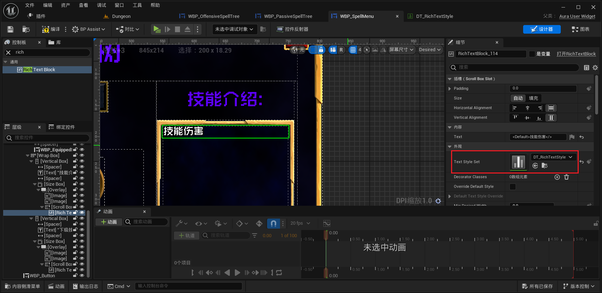

___________________________________________________________________________________________
###### [Go主菜单](../MainMenu.md)
___________________________________________________________________________________________

# GAS 142 了解富文本 `RichText` 的使用步骤

___________________________________________________________________________________________

## 处理关键点

1. 富文本使用的步骤：

___________________________________________________________________________________________

# 目录


- [GAS 142 了解富文本 `RichText` 的使用步骤](#gas-142-了解富文本-richtext-的使用步骤)
  - [处理关键点](#处理关键点)
- [目录](#目录)
    - [Mermaid整体思路梳理](#mermaid整体思路梳理)
    - [这一节我们将使用富文本，来制作，当点击技能时，右侧的技能详情描述](#这一节我们将使用富文本来制作当点击技能时右侧的技能详情描述)
    - [先在这里，各添加一个 `ScrollBox` 控件](#先在这里各添加一个-scrollbox-控件)
    - [`使用富文本` 第一步：创建 `数据集`](#使用富文本-第一步创建-数据集)
      - [创建数据表格，必须使用 `RichTextStyleRow` `结构体` ！！！](#创建数据表格必须使用-richtextstylerow-结构体-)
      - [也可以使用 `RichlmageRow` 结构体（需要包含图像信息）仅作了解用](#也可以使用-richlmagerow-结构体需要包含图像信息仅作了解用)
    - [`使用富文本` 第二步：创建富文本的文本结构](#使用富文本-第二步创建富文本的文本结构)
      - [创建行命名](#创建行命名)
      - [设置： `字体` / `大小` / `颜色` / `描边`](#设置-字体--大小--颜色--描边)
      - [可以设置多种样式这就是为什么叫 “富文本”](#可以设置多种样式这就是为什么叫-富文本)
    - [`使用富文本` 第三步：为富文本控件 `配置` 要使用的 `数据表格` 结构体](#使用富文本-第三步为富文本控件-配置-要使用的-数据表格-结构体)
    - [`使用富文本` 第四步：使用 `富文本语法` 处理文本](#使用富文本-第四步使用-富文本语法-处理文本)
    - [启用 `富文本的自动换行`](#启用-富文本的自动换行)


___________________________________________________________________________________________

<details>
<summary>视频链接</summary>

[23. Rich Text Blocks_哔哩哔哩_bilibili](https://www.bilibili.com/video/BV1TH4y1L7NP?p=90&spm_id_from=pageDriver&vd_source=9e1e64122d802b4f7ab37bd325a89e6c)

------

</details>

___________________________________________________________________________________________

### Mermaid整体思路梳理

Mermaid

___________________________________________________________________________________________


### 这一节我们将使用富文本，来制作，当点击技能时，右侧的技能详情描述

>

- 富文本是一种格式丰富的文本控件

  - 富文本块允许我们收到一条消息，我们可以在其中格式化字符串以使用不同的基于该字符串中的字符的样式。


------

### 先在这里，各添加一个 `ScrollBox` 控件

- 命名为，`RichText_Description`，另一个命名为，`RichText_NextLevelDescription`

>


------

### `使用富文本` 第一步：创建 `数据集`


------

#### 创建数据表格，必须使用 `RichTextStyleRow` `结构体` ！！！

>
>
>
>
>

- 命名为，`DT_RichTextStyle`


------

#### 也可以使用 `RichlmageRow` 结构体（需要包含图像信息）仅作了解用


------

### `使用富文本` 第二步：创建富文本的文本结构


------

#### 创建行命名

  - 需要注意的是行命名，后续会在文本格式中使用，需要注意规范

  - 必须至少包含一个 `Default` ，否则无法使用

>


------

#### 设置： `字体` / `大小` / `颜色` / `描边`

>


------

#### 可以设置多种样式这就是为什么叫 “富文本”

>| 行命名   |
>| -------- |
>| Default  |
>| Damage   |
>| Percent  |
>| Time     |
>| ManaCost |
>| Level    |
>| Title    |
>| Cooldown |
>| Small    |
>
>可以先在颜色上简单区分，后续再调整
>
>


------

### `使用富文本` 第三步：为富文本控件 `配置` 要使用的 `数据表格` 结构体

>


------

### `使用富文本` 第四步：使用 `富文本语法` 处理文本

- 语法为：

  `<这里是之前数据表格中的行命名>这里是要显示的文字</>`

- 比如：

  ```CPP
  <Default>文字标题</>
  ```

  

- 使用 `\n` 换行

>


------

### 启用 `富文本的自动换行`

>


___________________________________________________________________________________________

[返回最上面](#Go主菜单)

___________________________________________________________________________________________