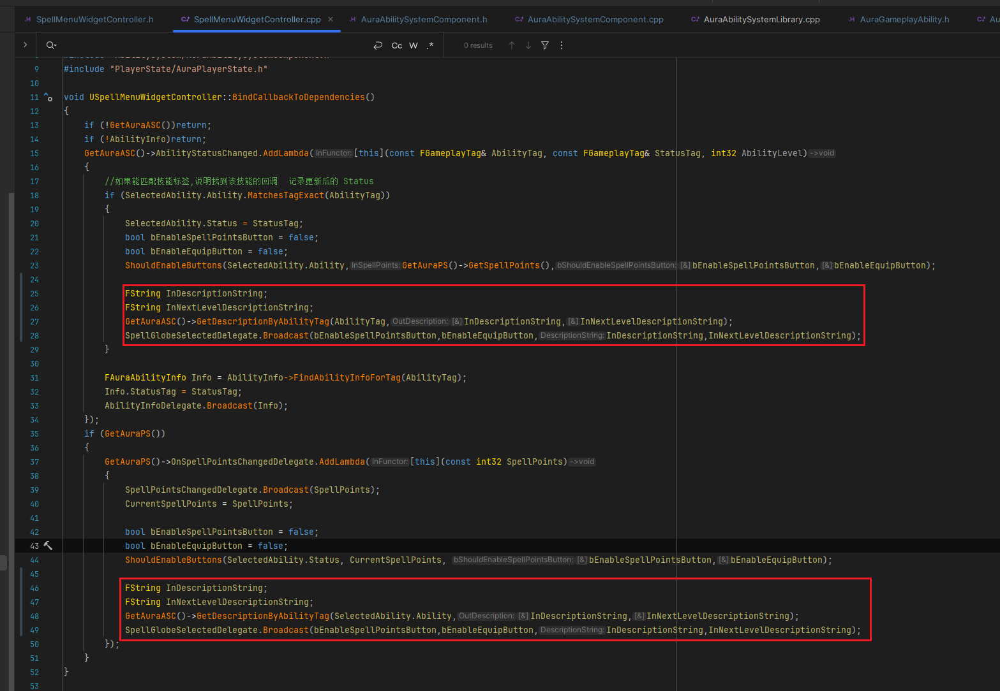
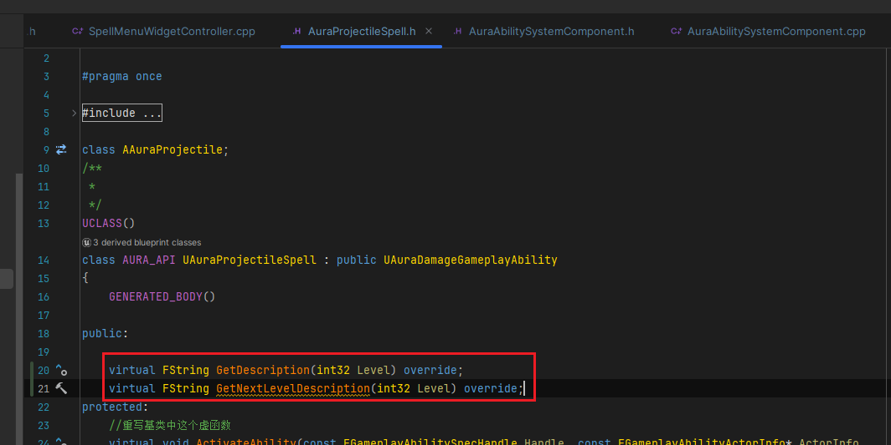

___________________________________________________________________________________________
###### [Go主菜单](../MainMenu.md)
___________________________________________________________________________________________

# GAS 143 C++中 使用 `Printf` 格式化字符串输出到富文本；每个GA中都需要一个返回自身技能描述的虚函数；GA中拿到CD和技能消耗的方法

___________________________________________________________________________________________

# 目录


- [GAS 143 C++中 使用 `Printf` 格式化字符串输出到富文本；每个GA中都需要一个返回自身技能描述的虚函数；GA中拿到CD和技能消耗的方法](#gas-143-c中-使用-printf-格式化字符串输出到富文本每个ga中都需要一个返回自身技能描述的虚函数ga中拿到cd和技能消耗的方法)
- [目录](#目录)
    - [Mermaid整体思路梳理](#mermaid整体思路梳理)
    - [如果使用富文本描述技能相关属性，这里想让描述成为技能本身的属性，也就是在GA基类上创建获取的函数，因为像 `技能CD` 和 `技能消耗` 这种 `GE` ，只有 `通过GA` 才可以 `拿到`](#如果使用富文本描述技能相关属性这里想让描述成为技能本身的属性也就是在ga基类上创建获取的函数因为像-技能cd-和-技能消耗-这种-ge-只有-通过ga-才可以-拿到)
    - [在 `GA基类` 中，创建函数](#在-ga基类-中创建函数)
      - [如果我使用带引号的大写 `L"这里是内容"`，这将为我创建一个宽字符,](#如果我使用带引号的大写-l这里是内容这将为我创建一个宽字符)
      - [`Printf` 中使用 `\n` 换行](#printf-中使用-n-换行)
      - [锁定的技能会返回一串文本，提示 `解锁` 该技能需要的 `等级`](#锁定的技能会返回一串文本提示-解锁-该技能需要的-等级)
    - [我们在使用时，肯定是通过 `ASC组件` 根据当前技能的 `AbilityTag` 来返回当前技能的描述，所以需要在 `ASC` 中创建相应的函数](#我们在使用时肯定是通过-asc组件-根据当前技能的-abilitytag-来返回当前技能的描述所以需要在-asc-中创建相应的函数)
      - [创建函数，根据当前 `AbilityTag` 返回技能的当前等级和下一级描述的格式化文本 `FString` ，返回值为 `bool`](#创建函数根据当前-abilitytag-返回技能的当前等级和下一级描述的格式化文本-fstring-返回值为-bool)
    - [当我们每一次选择技能时，看一下之前的逻辑](#当我们每一次选择技能时看一下之前的逻辑)
      - [所以修改动态多播，除了广播两个bool之外，添加两个变量，是富文本块所需的 `FString`](#所以修改动态多播除了广播两个bool之外添加两个变量是富文本块所需的-fstring)
      - [蓝图中现在多了两个参数，设置富文本Text](#蓝图中现在多了两个参数设置富文本text)
    - [此时运行游戏，发现有问题](#此时运行游戏发现有问题)
    - [启用富文本的自动换行，选中后会执行换行](#启用富文本的自动换行选中后会执行换行)
    - [运行测试，当我们 `1级` 时，选中 闪电技能 ，会提示它在 `2级` 解锁](#运行测试当我们-1级-时选中-闪电技能-会提示它在-2级-解锁)
    - [我们现在的描述有了，但是比较简单，下面将显示更多的信息，下一节](#我们现在的描述有了但是比较简单下面将显示更多的信息下一节)
    - [下一节](#下一节)
    - [希望显示更多的信息，比如：](#希望显示更多的信息比如)
    - [小测试，实现上述更多信息的效果描述](#小测试实现上述更多信息的效果描述)
    - [自己尝试一下](#自己尝试一下)
      - [火球技能中重写描述的虚函数](#火球技能中重写描述的虚函数)
      - [大致效果](#大致效果)
    - [下一节](#下一节-1)
    - [在这一节中我们将显示更多的技能描述，比如 `CD` /和 `技能消耗`](#在这一节中我们将显示更多的技能描述比如-cd-和-技能消耗)
    - [想要搞一个 `AuraProjectileSpell` 的C++子类，作为火球术技能蓝图的父类，然后在类中重写火球术的描述，这部分逻辑可以更加格式化和抽象](#想要搞一个-auraprojectilespell-的c子类作为火球术技能蓝图的父类然后在类中重写火球术的描述这部分逻辑可以更加格式化和抽象)
      - [将父类 `AuraProjectileSpell` 的描述虚函数挪到 `AuraFireBolt` 中](#将父类-auraprojectilespell-的描述虚函数挪到-aurafirebolt-中)
      - [修改蓝图 ***GA\_FireBolt*** 父类](#修改蓝图-ga_firebolt-父类)
    - [接下来需要获取 `技能消耗` 和 `cd` 而这部分逻辑可能别的子类也会使用，所以写在基类 `AuraGameplayAbility` 中，const函数](#接下来需要获取-技能消耗-和-cd-而这部分逻辑可能别的子类也会使用所以写在基类-auragameplayability-中const函数)
      - [关于如何在GA中获取技能消耗的GE?](#关于如何在ga中获取技能消耗的ge)
        - [使用API：`GetCostGameplayEffect` 可以获取 `Cost` 的 `GE`](#使用apigetcostgameplayeffect-可以获取-cost-的-ge)
        - [拿到 `Cost` 的 `Modifiers`](#拿到-cost-的-modifiers)
        - [遍历 `Modifiers` 里面保存着一些结构体，而结构体中，可以拿到设置的属性](#遍历-modifiers-里面保存着一些结构体而结构体中可以拿到设置的属性)
        - [而 `ModifierMagnitude` 就是蓝图中的策略，比如：](#而-modifiermagnitude-就是蓝图中的策略比如)
        - [通过 `结构体的ModifierMagnitude.GetStaticMagnitudeIfPossible`可以拿到固定值（只能拿到固定值，如果是别的设置方式，拿不到！）](#通过-结构体的modifiermagnitudegetstaticmagnitudeifpossible可以拿到固定值只能拿到固定值如果是别的设置方式拿不到)
    - [在 `Printf` 中使用 `%.1f` ，可以保留float小数点右边一位小数](#在-printf-中使用-1f-可以保留float小数点右边一位小数)
    - [可以使用这样的方式 让 `Printf` 里面的内容 更清晰](#可以使用这样的方式-让-printf-里面的内容-更清晰)
    - [现在获取伤害Damage的逻辑有些多，希望能抽象成一个函数](#现在获取伤害damage的逻辑有些多希望能抽象成一个函数)
      - [创建函数，根据 `等级` 和 `伤害类型的Tag`](#创建函数根据-等级-和-伤害类型的tag)
        - [函数体内，进行断言检查，检查包含 **曲线表格和伤害Tag** 的 `TMap` 内是否包含指定“伤害Tag”。`防止忘记配置资产！`](#函数体内进行断言检查检查包含-曲线表格和伤害tag-的-tmap-内是否包含指定伤害tag防止忘记配置资产)
      - [在原位置调用](#在原位置调用)
    - [运行测试，检查 `UI` 显示的 `富文本`](#运行测试检查-ui-显示的-富文本)
    - [消耗，是负值](#消耗是负值)
      - [使用API：`FMath::Abs` 确保技能消耗为正值](#使用apifmathabs-确保技能消耗为正值)
    - [注意一下结尾的符号不要用错了](#注意一下结尾的符号不要用错了)
    - [运行测试gif](#运行测试gif)
    - [如果有这种，需要加一点 `Padding` 偏移](#如果有这种需要加一点-padding-偏移)


___________________________________________________________________________________________

<details>
<summary>视频链接</summary>

[24. Spell Descriptions_哔哩哔哩_bilibili](https://www.bilibili.com/video/BV1TH4y1L7NP?p=91&spm_id_from=pageDriver&vd_source=9e1e64122d802b4f7ab37bd325a89e6c)

[25. FireBolt Description_哔哩哔哩_bilibili](https://www.bilibili.com/video/BV1TH4y1L7NP/?p=92&spm_id_from=pageDriver&vd_source=9e1e64122d802b4f7ab37bd325a89e6c)

[26. Cost and Cooldown in Spell Description_哔哩哔哩_bilibili](https://www.bilibili.com/video/BV1TH4y1L7NP/?p=93&spm_id_from=pageDriver&vd_source=9e1e64122d802b4f7ab37bd325a89e6c)

------

</details>

___________________________________________________________________________________________

### Mermaid整体思路梳理

Mermaid


------

### 如果使用富文本描述技能相关属性，这里想让描述成为技能本身的属性，也就是在GA基类上创建获取的函数，因为像 `技能CD` 和 `技能消耗` 这种 `GE` ，只有 `通过GA` 才可以 `拿到`


------

### 在 `GA基类` 中，创建函数

  - `GetDescription`
    - 当前等级技能详情

  - `GetNextLevelDescription`
    - 下一级描述

  - `GetLockedDescription`

    - 如果技能是锁定的可以调用这个函数

    - 提示，技能待解锁等级

  - 传入当前等级，返回 格式化的字符串

>```cpp
>public:
>    virtual FString GetDescription();
>    virtual FString GetNextLevelDescription();
>```
>
>


------

#### 如果我使用带引号的大写 `L"这里是内容"`，这将为我创建一个宽字符,

**相当于一个 `FString` 类型变量**

```CPP
L"默认技能名字 —— 占位符  占位符  占位符  占位符  占位符  占位符  占位符  占位符  占位符  占位符 "
```


------

#### `Printf` 中使用 `\n` 换行


------

#### 锁定的技能会返回一串文本，提示 `解锁` 该技能需要的 `等级`

>```cpp
>static  FString GetLockedDescription(int32 Level);
>```
>
>```CPP
>FString UAuraGameplayAbility::GetLockedDescription(int32 Level)
>{
>    return FString::Printf(TEXT("<Defailt>%s 需要 %d级 解锁</> "),L"该技能已被锁定",Level);
>}
>```

- 设为静态的含义是，这样可以在别处很方便地调用获取字符串


------

### 我们在使用时，肯定是通过 `ASC组件` 根据当前技能的 `AbilityTag` 来返回当前技能的描述，所以需要在 `ASC` 中创建相应的函数


------

#### 创建函数，根据当前 `AbilityTag` 返回技能的当前等级和下一级描述的格式化文本 `FString` ，返回值为 `bool`

  - 函数命名为，`GetDescriptionsByAbilityTag`

  - **若成功返回 `true` ，失败返回 `false` ，返回值以引用的方式传递**

  - **调用函数 `GetSpecFromAbilityTag` ，如果返回不为空，说明学习了相关技能，可以 `通过GA_Spec拿到Level` 传值，然后调用获取当前和下一级技能描述然后返回 `true` ；如果返回为空，则通过蓝图函数库拿到 `GM` 中的 `AbilityInfo` ，然后获取该技能所需的解锁等级，传入 `待解锁等级`**

>```cpp
>public:
>
>    bool GetDescriptionByAbilityTag(const FGameplayTag& AbilityTag, FString& OutDescription, FString& OutNextLevelDescription);
>```
>
>
>
>
>```CPP
>bool UAuraAbilitySystemComponent::GetDescriptionByAbilityTag(const FGameplayTag& AbilityTag, FString& OutDescription,
>	FString& OutNextLevelDescription)
>{
>	if (const FGameplayAbilitySpec* AbilitySpec = GetSpecFromAbilityTag(AbilityTag))
>	{
>		if (UAuraGameplayAbility* AuraGameplayAbility = Cast<UAuraGameplayAbility>(AbilitySpec->Ability))
>		{
>			OutDescription = AuraGameplayAbility->GetDescription(AbilitySpec->Level);
>			OutNextLevelDescription = AuraGameplayAbility->GetNextLevelDescription(AbilitySpec->Level + 1);
>			return true;
>		}
>	}
>	UAbilityInfo* AbilityInfo = UAuraAbilitySystemLibrary::GetAbilityInfo(GetAvatarActor());
>	OutDescription = UAuraGameplayAbility::GetLockedDescription(AbilityInfo->FindAbilityInfoForTag(AbilityTag).LevelRequirement);
>	OutNextLevelDescription = FString();
>	return false;
>}
>```


------

### 当我们每一次选择技能时，看一下之前的逻辑

  - 我们广播了两个相关按钮的最新状态更新，其实，选择技能球后，也需要广播当前技能的这一级和下一级的描述

>


------

#### 所以修改动态多播，除了广播两个bool之外，添加两个变量，是富文本块所需的 `FString`

  - `DescriptionString`

  - `NextLevelDescriptionString`

  - **如果修改，之前的广播，都需要修改**

>
>
>
>
>```cpp
>DECLARE_DYNAMIC_MULTICAST_DELEGATE_FourParams(FSpellGlobeSelectedSignature, bool, bSpendPointsButtonEnabled, bool, bEquipButtonEnabled, FString, DescriptionString, FString, NextLevelDescriptionString);
>```

- **广播都需要修改，添加参数**

>
>


------

#### 蓝图中现在多了两个参数，设置富文本Text

>
>


------

### 此时运行游戏，发现有问题

>

- 富文本超出了最长的限制，多出的部分也没有被显示


------

### 启用富文本的自动换行，选中后会执行换行

>
>


------

### 运行测试，当我们 `1级` 时，选中 闪电技能 ，会提示它在 `2级` 解锁

>


------

### 我们现在的描述有了，但是比较简单，下面将显示更多的信息，下一节


------

### 下一节


------

### 希望显示更多的信息，比如：

  - 当前等级描述：

    - 技能：火球

    - 发射1枚火球

    - 有一定几率造成9点燃烧伤害

    - 等级：1级

  - 下一级描述：

    - 技能：火球

    - 发射2枚火球

    - 有一定几率造成17点燃烧伤害

    - 等级：2级

>


------

### 小测试，实现上述更多信息的效果描述

>


------

### 自己尝试一下

  - 通过 `GA` 拿伤害的曲线，然后获取当前等级伤害和下一级伤害

  - 等级通过 `AbilityLevel` 获取

  - 格式化文本


------

#### 火球技能中重写描述的虚函数

>```cpp
>public:
>	//技能描述
>	virtual FString GetDescription(int32 Level) override;
>	virtual FString GetNextLevelDescription(int32 Level) override;
>```
>
>
>
>
>```cpp
>FString UAuraProjectileSpell::GetDescription(int32 Level)
>{
>	const float Damage = DamageTypes[FAuraGameplayTags::Get().Damage_Fire].GetValueAtLevel(Level);
>	return FString::Printf(TEXT("<Title>技能：火球</>\n\n"
>							 "<Default>发射</><Percent>%d</><Default>枚火球</>\n"
>							 "<Default>造成</><Damage>%.f</><Default>点燃烧伤害</>\n"
>							 "<Default>当前技能等级：</><Level>%d</><Default>级</>")
>							 ,Level,Damage,Level);
>}
>
>FString UAuraProjectileSpell::GetNextLevelDescription(int32 Level)
>{
>	const float Damage = DamageTypes[FAuraGameplayTags::Get().Damage_Fire].GetValueAtLevel(Level);
>	return FString::Printf(TEXT("<Title>技能：火球</>\n\n"
>							 "<Default>发射</><Percent>%d</><Default>枚火球</>\n"
>							 "<Default>造成</><Damage>%.f</><Default>点燃烧伤害</>\n"
>							 "<Default>升级后技能等级：</><Level>%d</><Default>级</>")
>							 ,Level,Damage,Level);
>}
>```


------

#### 大致效果

>


------

### 下一节


------

### 在这一节中我们将显示更多的技能描述，比如 `CD` /和 `技能消耗`

>


------

### 想要搞一个 `AuraProjectileSpell` 的C++子类，作为火球术技能蓝图的父类，然后在类中重写火球术的描述，这部分逻辑可以更加格式化和抽象

  - **命名为，`AuraFireBolt`**

>


------

#### 将父类 `AuraProjectileSpell` 的描述虚函数挪到 `AuraFireBolt` 中

>


------

#### 修改蓝图 ***GA_FireBolt*** 父类

>


------

### 接下来需要获取 `技能消耗` 和 `cd` 而这部分逻辑可能别的子类也会使用，所以写在基类 `AuraGameplayAbility` 中，const函数

>```cpp
>protected:
>
>    virtual float GetManaCost(float InLevel = 0.f);
>	virtual float GetCooldown(float InLevel = 0.f);
>```
>
>


------

#### 关于如何在GA中获取技能消耗的GE?


------

##### 使用API：`GetCostGameplayEffect` 可以获取 `Cost` 的 `GE`


------

##### 拿到 `Cost` 的 `Modifiers` 


------

##### 遍历 `Modifiers` 里面保存着一些结构体，而结构体中，可以拿到设置的属性


------

##### 而 `ModifierMagnitude` 就是蓝图中的策略，比如：

  - 使用固定值

  - `SetByCaller`

  - 自定义计算方式

  - 这些


------

##### 通过 `结构体的ModifierMagnitude.GetStaticMagnitudeIfPossible`可以拿到固定值（只能拿到固定值，如果是别的设置方式，拿不到！）

>
>
>```CPP
>float UAuraGameplayAbility::GetManaCost(float InLevel)
>{
>    float ManaCost = 0.f;
>    for (const FGameplayModifierInfo& ModifierInfo : GetCostGameplayEffect()->Modifiers)
>    {
>       if (ModifierInfo.Attribute == UAuraAttributeSet::GetManaAttribute())
>       {
>          ModifierInfo.ModifierMagnitude.GetStaticMagnitudeIfPossible(InLevel, ManaCost);
>       }
>    }
>    return ManaCost;
>}
>
>float UAuraGameplayAbility::GetCooldown(float InLevel)
>{
>    float Cooldown = 0.f;
>    if (const UGameplayEffect* CD = GetCooldownGameplayEffect())
>    {
>       CD->DurationMagnitude.GetStaticMagnitudeIfPossible(InLevel,Cooldown);
>    }
>    return Cooldown;
>}
>```


------

### 在 `Printf` 中使用 `%.1f` ，可以保留float小数点右边一位小数

>


------

### 可以使用这样的方式 让 `Printf` 里面的内容 更清晰

>
>
>
>
>```cpp
>FString UAuraFireBolt::GetDescription(int32 Level)
>{
>	const float Damage = DamageTypes[FAuraGameplayTags::Get().Damage_Fire].GetValueAtLevel(Level);
>	const float ManaCost = GetManaCost(Level);
>	const float Cooldown = GetCooldown(Level);
>	return FString::Printf(TEXT(
>						//标题
>						"<Title>技能：火球</>\n\n"
>						//效果
>						"<Default>发射</><Percent>%d</><Default>枚火球</>\n"
>						//伤害
>						"<Default>造成</><Damage>%.1f</><Default>点</><Damage>燃烧</><Default>伤害</>\n\n"
>						//技能消耗
>						"<Default>技能消耗魔法:</><Damage>%.1f</><Default>点</>\n"
>						//CD
>						"<Default>技能CD:</><Damage>%.1f</><Default>秒</>\n\n"
>						//当前技能等级
>						"<Default>当前技能等级：</><Level>%d</><Default>级</>")
>	                       , Level, Damage,ManaCost,Cooldown, Level);
>}
>
>FString UAuraFireBolt::GetNextLevelDescription(int32 Level)
>{
>	const float Damage = DamageTypes[FAuraGameplayTags::Get().Damage_Fire].GetValueAtLevel(Level);
>	const float ManaCost = GetManaCost(Level);
>	const float Cooldown = GetCooldown(Level);
>	return FString::Printf(TEXT(
>						//标题
>						"<Title>技能：火球</>\n\n"
>						//效果
>						"<Default>发射</><Percent>%d</><Default>枚火球</>\n"
>						//伤害
>						"<Default>造成</><Damage>%.1f</><Default>点</><Damage>燃烧</><Default>伤害</>\n\n"
>						//技能消耗
>						"<Default>技能消耗魔法:</><Damage>%.1f</><Default>点</>\n"
>						//CD
>						"<Default>技能CD:</><Damage>%.1f</><Default>秒</>\n\n"
>						//当前技能等级
>						"<Default>升级后技能等级：</><Level>%d</><Default>级</>")
>						   , Level, Damage,ManaCost,Cooldown, Level);
>}
>```


------

### 现在获取伤害Damage的逻辑有些多，希望能抽象成一个函数

>


------

#### 创建函数，根据 `等级` 和 `伤害类型的Tag` 

  - 函数命名为，`GetDamageByDamageType`

>


------

##### 函数体内，进行断言检查，检查包含 **曲线表格和伤害Tag** 的 `TMap` 内是否包含指定“伤害Tag”。`防止忘记配置资产！`

>
>
>```CPP
>float UAuraDamageGameplayAbility::GetDamageByDamageType(float InLevel, const FGameplayTag& DamageType)
>{
>    //检查 TMap中,是否包含指定 Key
>    check(DamageTypes.Contains(DamageType));
>    return  DamageTypes[DamageType].GetValueAtLevel(InLevel);
>}
>```


------

#### 在原位置调用

>


------

### 运行测试，检查 `UI` 显示的 `富文本`

>


------

### 消耗，是负值


------

#### 使用API：`FMath::Abs` 确保技能消耗为正值


------

### 注意一下结尾的符号不要用错了

>


------

### 运行测试gif

>
>
>


------

### 如果有这种，需要加一点 `Padding` 偏移

>
>


___________________________________________________________________________________________

[返回最上面](#Go主菜单)

___________________________________________________________________________________________