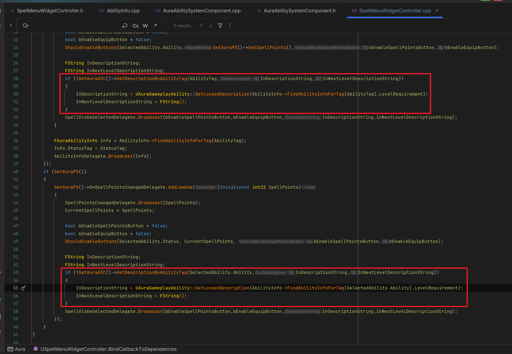

___________________________________________________________________________________________
###### [Go主菜单](../MainMenu.md)
___________________________________________________________________________________________

# GAS 144 记录选中技能树中的技能球，处理点击和取消的逻辑；处理技能详情显示升级时的bug

______________________________________________________________________________________

# 目录


- [GAS 144 记录选中技能树中的技能球，处理点击和取消的逻辑；处理技能详情显示升级时的bug](#gas-144-记录选中技能树中的技能球处理点击和取消的逻辑处理技能详情显示升级时的bug)
- [目录](#目录)
    - [Mermaid整体思路梳理](#mermaid整体思路梳理)
    - [这一节制作当技能球UI已经被选中时，再次选中会取消自身的逻辑](#这一节制作当技能球ui已经被选中时再次选中会取消自身的逻辑)
    - [在 `SpellMenuWidgetController` 中创建函数](#在-spellmenuwidgetcontroller-中创建函数)
      - [清空本地保存的结构体数据](#清空本地保存的结构体数据)
      - [然后广播 设置 两个按钮为 `false` ， `技能详情为空`](#然后广播-设置-两个按钮为-false--技能详情为空)
    - [现在，当技能球本身被选中时，蓝图中，需要 `bool` 记录一下，`自身是否被选中的状态`](#现在当技能球本身被选中时蓝图中需要-bool-记录一下自身是否被选中的状态)
    - [当被选中时，再触发，执行取消逻辑，否则执行选择技能逻辑](#当被选中时再触发执行取消逻辑否则执行选择技能逻辑)
    - [这里有一个问题，我在DS环境下，点击锁定的技能球崩溃](#这里有一个问题我在ds环境下点击锁定的技能球崩溃)
    - [此时效果gif](#此时效果gif)
    - [为 取消选中 ，配置按键音效](#为-取消选中-配置按键音效)
    - [下面打开 `UI` ，选中闪电技能，然后升级，加点，在取消。测试效果gif](#下面打开-ui-选中闪电技能然后升级加点在取消测试效果gif)
    - [有一个bug，此时如果我们什么也不选择就升级，`当前等级技能详情` 会显示有问题gif](#有一个bug此时如果我们什么也不选择就升级当前等级技能详情-会显示有问题gif)
    - [在获取技能详情的函数中，我们之前只是默认返回技能锁定的描述，没有处理啥也没选或者 `AbilityTag` 失效的情况](#在获取技能详情的函数中我们之前只是默认返回技能锁定的描述没有处理啥也没选或者-abilitytag-失效的情况)
      - [修复bug，分别处理 `空技能` 和 `锁定技能` 逻辑](#修复bug分别处理-空技能-和-锁定技能-逻辑)
    - [此时在运行测试，打开菜单，什么也不选择然后升级，技能详情描述为空字符，正常！gif](#此时在运行测试打开菜单什么也不选择然后升级技能详情描述为空字符正常gif)


___________________________________________________________________________________________

<details>
<summary>视频链接</summary>

[27. Self Deselect_哔哩哔哩_bilibili](https://www.bilibili.com/video/BV1TH4y1L7NP?p=94&vd_source=9e1e64122d802b4f7ab37bd325a89e6c)

------

</details>

___________________________________________________________________________________________

### Mermaid整体思路梳理

Mermaid

___________________________________________________________________________________________


### 这一节制作当技能球UI已经被选中时，再次选中会取消自身的逻辑


------

### 在 `SpellMenuWidgetController` 中创建函数

  - 函数命名为，`GlobeDeselect`

  - **清空本地保存的结构体数据**

  - **然后广播**


------

#### 清空本地保存的结构体数据

>```cpp
>public:
>    
>    UFUNCTION(BlueprintCallable)
>    void GlobeDeselect();
>```
>
>```cpp
>void USpellMenuWidgetController::GlobeDeselect()
>{
>    SelectedAbility.Ability = FAuraGameplayTags::Get().Abilities_None;
>    SelectedAbility.Status = FAuraGameplayTags::Get().Abilities_Status_Locked;
>}
>```
>
>


------

#### 然后广播 设置 两个按钮为 `false` ， `技能详情为空`

>```cpp
>void USpellMenuWidgetController::GlobeDeselect()
>{
>    SelectedAbility.Ability = FAuraGameplayTags::Get().Abilities_None;
>    SelectedAbility.Status = FAuraGameplayTags::Get().Abilities_Status_Locked;
>    SpellGlobeSelectedDelegate.Broadcast(false,false,FString(),FString());
>}
>```
>
>


------

### 现在，当技能球本身被选中时，蓝图中，需要 `bool` 记录一下，`自身是否被选中的状态`

  - 变量名为，`Selected`

>


------

### 当被选中时，再触发，执行取消逻辑，否则执行选择技能逻辑

>


------

### 这里有一个问题，我在DS环境下，点击锁定的技能球崩溃

> 
>
> #### 我在这里加了判断
>
> 
>
> #### 在这两个地方根据返回值判断在 `WidgetController` 中使用 `AbilityInfo`
>
> 
>
> 

------

### 此时效果gif

>


------

### 为 取消选中 ，配置按键音效

>
>


------

### 下面打开 `UI` ，选中闪电技能，然后升级，加点，在取消。测试效果gif

>


------

### 有一个bug，此时如果我们什么也不选择就升级，`当前等级技能详情` 会显示有问题gif

>


------

### 在获取技能详情的函数中，我们之前只是默认返回技能锁定的描述，没有处理啥也没选或者 `AbilityTag` 失效的情况

  - 所以如果 `技能Tag失效` 或者 `AbilityTag == None` ，需要返回空的字符串

- 如果失效，也会走下图中 `红色区域的逻辑` ，所以需要分情况处理

>


------

#### 修复bug，分别处理 `空技能` 和 `锁定技能` 逻辑

>```cpp
>//当 下一级是锁定状态 或者为空 时:下一级的描述 FString 均为空
>OutNextLevelDescription = FString();
>	
>if (!AbilityTag.IsValid() || AbilityTag.MatchesTagExact(FAuraGameplayTags::Get().Abilities_None))
>{
>	OutDescription = FString();
>	return true;
>}
>```
>
>
>
>#### **这个是视频的操作，我的和这个不太一样**
>
>


------

### 此时在运行测试，打开菜单，什么也不选择然后升级，技能详情描述为空字符，正常！gif

>


___________________________________________________________________________________________

[返回最上面](#Go主菜单)

___________________________________________________________________________________________