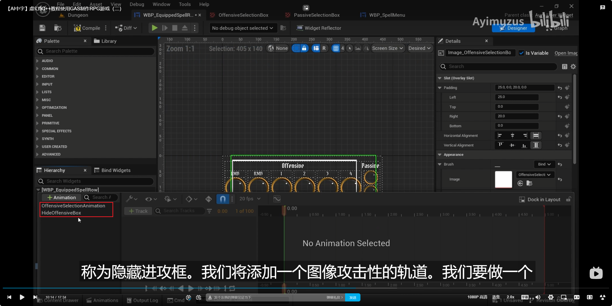

___________________________________________________________________________________________
###### [Go主菜单](../MainMenu.md)
___________________________________________________________________________________________

# GAS 145 制作装备技能点击提示动画和相关显示和隐藏的逻辑；显示后动画循环

___________________________________________________________________________________________

# 目录


- [GAS 145 制作装备技能点击提示动画和相关显示和隐藏的逻辑；显示后动画循环](#gas-145-制作装备技能点击提示动画和相关显示和隐藏的逻辑显示后动画循环)
- [目录](#目录)
    - [Mermaid整体思路梳理](#mermaid整体思路梳理)
    - [接下来我们将处理装备技能的逻辑](#接下来我们将处理装备技能的逻辑)
    - [当我们点击一个可以装备的技能，我们需要一个UI的动画来提示用户需要点击的区域，区域分为两个](#当我们点击一个可以装备的技能我们需要一个ui的动画来提示用户需要点击的区域区域分为两个)
    - [这一节制作UI动画](#这一节制作ui动画)
      - [添加Image控件，制作动画](#添加image控件制作动画)
      - [`Construct` 时播放动画测试，`Loop` 动画，调试位置gif](#construct-时播放动画测试loop-动画调试位置gif)
    - [下一节，处理逻辑](#下一节处理逻辑)
    - [我们接下来制作：当我们点击主动技能，主动技能区域播放动画，点击被动技能，被动技能区域闪烁](#我们接下来制作当我们点击主动技能主动技能区域播放动画点击被动技能被动技能区域闪烁)
      - [`技能结构体` 中添加 `技能类型` 的标签Tag](#技能结构体-中添加-技能类型-的标签tag)
      - [创建点击装备按钮时调用的 `BlueprintCallable` 函数](#创建点击装备按钮时调用的-blueprintcallable-函数)
    - [梳理下，当我们点击装备按键时，会触发什么逻辑](#梳理下当我们点击装备按键时会触发什么逻辑)
      - [声明创建动态多播，广播 `技能类型`](#声明创建动态多播广播-技能类型)
      - [点击时，通过选择技能时保存的结构体中的 `AbilityTag` ，从所有技能信息的 `数据资产` 中找到包含的 `结构体Info` ，然后就拿到了 `技能类型`](#点击时通过选择技能时保存的结构体中的-abilitytag-从所有技能信息的-数据资产-中找到包含的-结构体info-然后就拿到了-技能类型)
      - [我们需要一个 `bool` 变量来记录 `当前等待用户装备技能的状态`](#我们需要一个-bool-变量来记录-当前等待用户装备技能的状态)
      - [按下按钮后设为 `true`](#按下按钮后设为-true)
    - [蓝图中配置技能类型](#蓝图中配置技能类型)
    - [`技能Menu` 中绑定委托](#技能menu-中绑定委托)
    - [创建一个回调函数](#创建一个回调函数)
      - [回调函数内，根据 `类型` 实施策略](#回调函数内根据-类型-实施策略)
    - [最后一步当点击按钮时，调用 `BlueprintCallable` 函数 `EquipButtonPressed`](#最后一步当点击按钮时调用-blueprintcallable-函数-equipbuttonpressed)
    - [运行测试，播放动画gif](#运行测试播放动画gif)
    - [现在是可以播放动画了，但是没有停止，我们需要，参考播放动画的逻辑，在停止播放时，也创建委托广播数据，下面情况需要停止动画](#现在是可以播放动画了但是没有停止我们需要参考播放动画的逻辑在停止播放时也创建委托广播数据下面情况需要停止动画)
      - [创建委托（可以使用之前的动态多播）处理关闭的回调](#创建委托可以使用之前的动态多播处理关闭的回调)
      - [在取消技能时，拿到技能的 `技能类型Tag` ，然后广播](#在取消技能时拿到技能的-技能类型tag-然后广播)
      - [在选择技能球时，也需要广播取消](#在选择技能球时也需要广播取消)
      - [蓝图中绑定回调](#蓝图中绑定回调)
    - [这个时候有一个bug，当我们每次选择技能，都会触发关闭的广播，而这时（因为我们关闭是个动画），所以会在每次点击时 `闪烁` ，需要处理，只有当选择的 `bool` 为 `true` 时，才执行](#这个时候有一个bug当我们每次选择技能都会触发关闭的广播而这时因为我们关闭是个动画所以会在每次点击时-闪烁-需要处理只有当选择的-bool-为-true-时才执行)
      - [别忘了每次判断后，因为状态已经广播发生改变，所以需要 `设置 bool 为 false`](#别忘了每次判断后因为状态已经广播发生改变所以需要-设置-bool-为-false)
    - [此时效果gif](#此时效果gif)
    - [接下来我们将处理，点击 `装备技能区` ，装备 技能 的逻辑](#接下来我们将处理点击-装备技能区-装备-技能-的逻辑)


___________________________________________________________________________________________

<details>
<summary>视频链接</summary>

[28. Equipped Spell Row Animations_哔哩哔哩_bilibili](https://www.bilibili.com/video/BV1TH4y1L7NP?p=95&spm_id_from=pageDriver&vd_source=9e1e64122d802b4f7ab37bd325a89e6c)

[29. Ability Types_哔哩哔哩_bilibili](https://www.bilibili.com/video/BV1TH4y1L7NP/?p=96&spm_id_from=pageDriver&vd_source=9e1e64122d802b4f7ab37bd325a89e6c)

------

</details>

___________________________________________________________________________________________

### Mermaid整体思路梳理

Mermaid

___________________________________________________________________________________________


### 接下来我们将处理装备技能的逻辑

>


------

### 当我们点击一个可以装备的技能，我们需要一个UI的动画来提示用户需要点击的区域，区域分为两个

  - 主动技能区域

  - 被动技能区域


------

### 这一节制作UI动画


------

#### 添加Image控件，制作动画

>
>
>
>### 关闭我就直接关了，不做动画了
>
>


------

#### `Construct` 时播放动画测试，`Loop` 动画，调试位置gif

>
>
>


------

### 下一节，处理逻辑


------

### 我们接下来制作：当我们点击主动技能，主动技能区域播放动画，点击被动技能，被动技能区域闪烁

  - 所以还需要为我们的技能信息结构体添加一个技能类型，标注主动和被动技能

>

  - 此外还需要像 `使用技能点按钮` 一样，创建一个蓝图触发的 `BlueprintCallable` 函数


------

#### `技能结构体` 中添加 `技能类型` 的标签Tag

>
>
>```
>USTRUCT(BlueprintType)
>struct FAuraAbilityInfo
>{
>    GENERATED_BODY()
>    
>    UPROPERTY(EditDefaultsOnly, BlueprintReadOnly)
>    FGameplayTag AbilityTag = FGameplayTag();
>
>    /*这个属性在C++中设置,所以也在C++中配置*/
>    UPROPERTY(BlueprintReadOnly)
>    FGameplayTag InputTag = FGameplayTag();
>    
>    /* 技能状态 这个属性在C++中设置,所以也在C++中配置*/
>    UPROPERTY(BlueprintReadOnly)
>    FGameplayTag StatusTag = FGameplayTag();
>    
>    UPROPERTY(EditDefaultsOnly, BlueprintReadOnly)
>    FGameplayTag CooldownTag = FGameplayTag();
>    
>    UPROPERTY(EditDefaultsOnly, BlueprintReadOnly)
>    FGameplayTag AbilityType = FGameplayTag();
>    
>    UPROPERTY(EditDefaultsOnly, BlueprintReadOnly)
>    TObjectPtr<UTexture2D> Icon = nullptr;
>    
>    UPROPERTY(EditDefaultsOnly, BlueprintReadOnly)
>    TObjectPtr<UMaterialInterface> BackgroundMaterial = nullptr;
>
>    //解锁该技能需要的等级
>    UPROPERTY(EditDefaultsOnly, BlueprintReadOnly)
>    int32 LevelRequirement = 1;
>    
>    //当前技能Class
>    UPROPERTY(EditDefaultsOnly, BlueprintReadOnly)
>    TSubclassOf<UAuraGameplayAbility> Ability = nullptr;
>    
>};
>```


------

#### 创建点击装备按钮时调用的 `BlueprintCallable` 函数

  - 命名为，`EquipButtonPressed`

>```cpp
>public:
>    
>    UFUNCTION(BlueprintCallable)
>    void EquipButtonPressed();
>```
>
>


------

### 梳理下，当我们点击装备按键时，会触发什么逻辑

  - **需要广播选中的技能球的技能类型**
    - **主动技能**
    
    - **被动技能**
    
  - **根据技能类型播放不同区域的等待装备技能的动画**

  - **点击后应该禁用按钮，防止多次点击**


------

#### 声明创建动态多播，广播 `技能类型`

  - 命名为，`FWaitForEquiptelectionSignature`

  - 委托命名为，`WaitForEquipDelegate`

>```CPP
>DECLARE_DYNAMIC_MULTICAST_DELEGATE_OneParam(FWaitForEquiptelectionSignature, const FGameplayTag&, AbilityType);
>```
>
>```CPP
>public:
>    //监听 点击 装备技能按钮
>    UPROPERTY(BlueprintAssignable)
>    FWaitForEquiptelectionSignature WaitForEquipDelegate;
>```
>
>
>


------

#### 点击时，通过选择技能时保存的结构体中的 `AbilityTag` ，从所有技能信息的 `数据资产` 中找到包含的 `结构体Info` ，然后就拿到了 `技能类型`

>```cpp
>void USpellMenuWidgetController::EquipButtonPressed()
>{
>    WaitForEquipDelegate.Broadcast(AbilityInfo->FindAbilityInfoForTag(SelectedAbility.Ability).AbilityType);
>}
>```
>
>


------

#### 我们需要一个 `bool` 变量来记录 `当前等待用户装备技能的状态`

  - 命名为，`bWaitingForEquipSelection`

>```cpp
>private:
>    //记录 当前等待用户装备技能的状态
>    bool bWaitingForEquipSelection = false;
>```
>
>


------

#### 按下按钮后设为 `true`

>


------

### 蓝图中配置技能类型

>


------

### `技能Menu` 中绑定委托

>


------

### 创建一个回调函数

  - 函数命名为，`OnWaitForEquip`

>


------

#### 回调函数内，根据 `类型` 实施策略

>


------

### 最后一步当点击按钮时，调用 `BlueprintCallable` 函数 `EquipButtonPressed`

>


------

### 运行测试，播放动画gif

>
>
>将火球技能改成被动技能再试试
>
>
>
>


------

### 现在是可以播放动画了，但是没有停止，我们需要，参考播放动画的逻辑，在停止播放时，也创建委托广播数据，下面情况需要停止动画

  - 用户取消选择技能球

  - 选择别的技能球


参考下播放动画的逻辑

>


------

#### 创建委托（可以使用之前的动态多播）处理关闭的回调

  - 命名为，`StopWaitingForEquipDelegate`

>```cpp
>public:
>    //监听 停止 装备技能动画
>    UPROPERTY(BlueprintAssignable)
>    FWaitForEquiptelectionSignature StopWaitingForEquipDelegate;
>```
>
>


------

#### 在取消技能时，拿到技能的 `技能类型Tag` ，然后广播

>


------

#### 在选择技能球时，也需要广播取消

>


------

#### 蓝图中绑定回调

>因为这个功能跟打开比较像，而我又没有做关闭的动画
>
>我直接抽象了这里的逻辑
>
>
>
>


------

### 这个时候有一个bug，当我们每次选择技能，都会触发关闭的广播，而这时（因为我们关闭是个动画），所以会在每次点击时 `闪烁` ，需要处理，只有当选择的 `bool` 为 `true` 时，才执行

>#### **这里因为我没有关闭动画，看不出这个bug，但是还是会触发逻辑，所以还是需要处理下**
>
>

- 增加判断

>```cpp
>if (bWaitingForEquipSelection)
>{
>    StopWaitingForEquipDelegate.Broadcast(AbilityInfo->FindAbilityInfoForTag(SelectedAbility.Ability).AbilityType);
>}
>```
>
>

- 取消技能选择时，也需要增加判断

>


------

#### 别忘了每次判断后，因为状态已经广播发生改变，所以需要 `设置 bool 为 false`

>
>
>


------

### 此时效果gif

  - 选择其他的按钮后，取消装备技能的动画

>有个bug：之前有个地方的Tag用错了 状态标签 用成了技能标签在这里：
>
>
>
>


------

### 接下来我们将处理，点击 `装备技能区` ，装备 技能 的逻辑


___________________________________________________________________________________________

[返回最上面](#Go主菜单)

___________________________________________________________________________________________