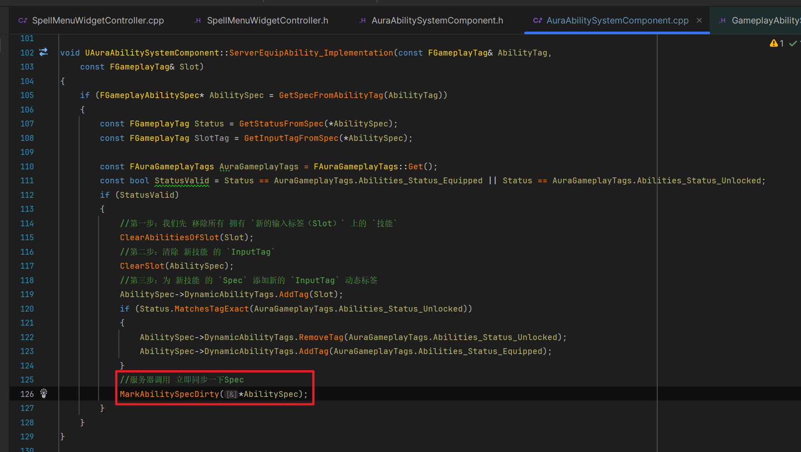
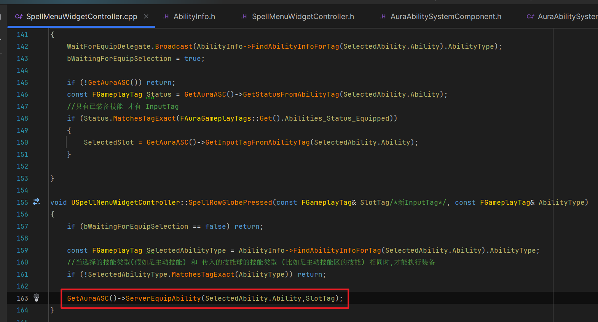
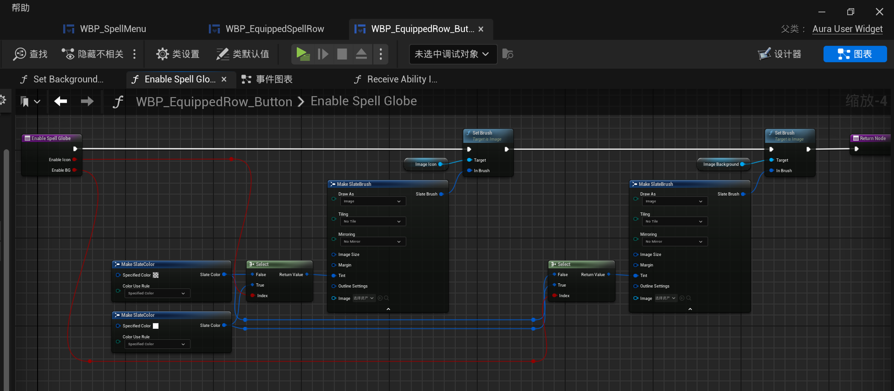

___________________________________________________________________________________________
###### [Go主菜单](../MainMenu.md)
___________________________________________________________________________________________

# GAS 146 点击装备技能的逻辑，(需要记录之前的技能球，移除InputTag，旧的UI还原，新的添加 `InputTag`，两个都需要更新状态Tag)；需要 `RPC` 上 `服务器` 处理，然后同步给 `客户端`

___________________________________________________________________________________________

## 处理关键点

1. 技能 一定要 **在服务器上处理！！！**
2. 如果涉及到技能列表，该 `加锁` **加锁！！！**
3. 一定要熟悉这个联网流程：
   - **客户端调用 `RPC_Server` 上服务器操作数据，然后再调用 `RPC_Client` 向客户端同步数据！！！**

___________________________________________________________________________________________

# 目录


- [GAS 146 点击装备技能的逻辑，(需要记录之前的技能球，移除InputTag，旧的UI还原，新的添加 `InputTag`，两个都需要更新状态Tag)；需要 `RPC` 上 `服务器` 处理，然后同步给 `客户端`](#gas-146-点击装备技能的逻辑需要记录之前的技能球移除inputtag旧的ui还原新的添加-inputtag两个都需要更新状态tag需要-rpc-上-服务器-处理然后同步给-客户端)
  - [处理关键点](#处理关键点)
- [目录](#目录)
    - [Mermaid整体思路梳理](#mermaid整体思路梳理)
    - [这一节我们来处理，点击 `装备技能区` ，装备 技能 的逻辑，这位我们的新技能分配输入标签和绑定输入](#这一节我们来处理点击-装备技能区-装备-技能-的逻辑这位我们的新技能分配输入标签和绑定输入)
    - [先来梳理一下，当我们点击 `装备技能区` 的 `技能球` 后会触发的逻辑](#先来梳理一下当我们点击-装备技能区-的-技能球-后会触发的逻辑)
    - [我们先来处理点击，当我们点击 装备按钮 后，需要检查技能的 `状态标签` ，是否为 `已解锁` 和 `可装备` 状态，其他状态无法装备；如果状态没有问题，我们需要保存该技能的 `InputTag` ，这样就能知道这个技能所在的是 `装备技能区` 的哪个技能球（后面叫插槽）](#我们先来处理点击当我们点击-装备按钮-后需要检查技能的-状态标签-是否为-已解锁-和-可装备-状态其他状态无法装备如果状态没有问题我们需要保存该技能的-inputtag-这样就能知道这个技能所在的是-装备技能区-的哪个技能球后面叫插槽)
      - [在 `SpellMenuWidgetController` 中保存该 `插槽`](#在-spellmenuwidgetcontroller-中保存该-插槽)
      - [我们需要检查该技能的技能状态](#我们需要检查该技能的技能状态)
        - [我们需要获得的是 `技能` 的 `状态标签` ， `实时的` ，而不是从Select结构体上拿的，所以需要通过 `ASC组件` 拿到](#我们需要获得的是-技能-的-状态标签--实时的-而不是从select结构体上拿的所以需要通过-asc组件-拿到)
          - [我们在 `ASC组件` 上创建函数，根据传入的 `AbilityTag` ，获取并返回 `状态标签`](#我们在-asc组件-上创建函数根据传入的-abilitytag-获取并返回-状态标签)
          - [调用之前的组合函数即可](#调用之前的组合函数即可)
        - [然后我们就可以拿到 技能 的 `状态标签`](#然后我们就可以拿到-技能-的-状态标签)
      - [然后如果 `技能状态` 是 `已装备的` ，那我们就可以获取 该技能的 `InputTag`](#然后如果-技能状态-是-已装备的-那我们就可以获取-该技能的-inputtag)
        - [所以也需要在ASC中创建一个函数，根据 `AbilityTag` ，返回对应的 `InputTag`](#所以也需要在asc中创建一个函数根据-abilitytag-返回对应的-inputtag)
        - [先判断一下，状态是否为已装备（说明有肯定有 `InputTag` ）然后拿到 `InputTag`](#先判断一下状态是否为已装备说明有肯定有-inputtag-然后拿到-inputtag)
      - [当我们点击 `装备技能区` 的技能球后，需要创建一个 BlueprintCallable 蓝图可调用事件，关于需要的参数：](#当我们点击-装备技能区-的技能球后需要创建一个-blueprintcallable-蓝图可调用事件关于需要的参数)
        - [首先， `装备技能区` 技能球上是不知道自己是主动技能还是被动技能的现在，所以需要加一个 `配置标签` ，](#首先-装备技能区-技能球上是不知道自己是主动技能还是被动技能的现在所以需要加一个-配置标签-)
        - [然后，技能球有自身所表示的技能的 `AbilityTag` 可以作为参数传入](#然后技能球有自身所表示的技能的-abilitytag-可以作为参数传入)
      - [下面是函数体中的逻辑处理：](#下面是函数体中的逻辑处理)
        - [首先，如果 `bWaitingForEquipSelection == false` （不是在点击装备按钮进入装备技能状态）说明不是要装备技能时点击，不能触发逻辑](#首先如果-bwaitingforequipselection--false-不是在点击装备按钮进入装备技能状态说明不是要装备技能时点击不能触发逻辑)
        - [其次，不能在 主动技能 `插槽` 中 装备 被动技能 ，反之亦然](#其次不能在-主动技能-插槽-中-装备-被动技能-反之亦然)
        - [然后拿到选择技能的 `技能类型` （通过结构体）](#然后拿到选择技能的-技能类型-通过结构体)
          - [如果 `技能类型` 与 `技能球` 的 `技能类型` 一致，才能处理逻辑](#如果-技能类型-与-技能球-的-技能类型-一致才能处理逻辑)
      - [接下来，需要 `ASC上服务器` 修改 `技能的标签`](#接下来需要-asc上服务器-修改-技能的标签)
        - [ASC中创建 `RPC_Server` 函数](#asc中创建-rpc_server-函数)
          - [需要先检查该技能是否有有效的 `AbilitySpec`](#需要先检查该技能是否有有效的-abilityspec)
          - [然后检查该技能状态是否有效（也就是是否为 `已解锁` 和 `已装备` 状态）](#然后检查该技能状态是否有效也就是是否为-已解锁-和-已装备-状态)
          - [接下来，我们需要在 `Spec` 中移除 `指定的标签` ，需要创建一个函数](#接下来我们需要在-spec-中移除-指定的标签-需要创建一个函数)
          - [创建函数：检查 `技能` 是否含有 `某个标签`](#创建函数检查-技能-是否含有-某个标签)
          - [创建调用上面两个函数的函数： 检查所有已激活技能表，调用 `AbilityHasSlot` 检查是否含有某个标签，然后调用 `ClearSlot` 移除（因为遍历了已激活技能列表，所以需要使用技能列表锁！！！）](#创建调用上面两个函数的函数-检查所有已激活技能表调用-abilityhasslot-检查是否含有某个标签然后调用-clearslot-移除因为遍历了已激活技能列表所以需要使用技能列表锁)
        - [然后会到 `ASC上服务器` 的函数中，“下面假定我们使用 `新技能` 覆盖 `旧技能` 的 `InputTag`”](#然后会到-asc上服务器-的函数中下面假定我们使用-新技能-覆盖-旧技能-的-inputtag)
          - [第一步：我们先 移除所有 拥有 `新的输入标签（Slot）` 上的 `技能`](#第一步我们先-移除所有-拥有-新的输入标签slot-上的-技能)
          - [第二步：清除 新技能 的 `InputTag`](#第二步清除-新技能-的-inputtag)
          - [第三步：为 新技能 的 `Spec` 添加新的 `InputTag` 动态标签](#第三步为-新技能-的-spec-添加新的-inputtag-动态标签)
          - [这时候需要检查，如果该技能状态是 `未装备` ，需要 移除 ，然后换成 `已装备`](#这时候需要检查如果该技能状态是-未装备-需要-移除-然后换成-已装备)
        - [最后别忘了要 `使用API立即同步一下Spec！！！`](#最后别忘了要-使用api立即同步一下spec)
      - [现在我们完成了服务器上的逻辑，还需要一个 `RPC_Client` 函数来 通知 客户端](#现在我们完成了服务器上的逻辑还需要一个-rpc_client-函数来-通知-客户端)
        - [`ASC` 上创建 `Client函数` ，传递参数](#asc-上创建-client函数-传递参数)
      - [服务器上函数体最后需要调用 `RPC_Client` 函数来 通知 客户端](#服务器上函数体最后需要调用-rpc_client-函数来-通知-客户端)
      - [ASC 中需要创建多播来广播这 四个参数](#asc-中需要创建多播来广播这-四个参数)
        - [声明委托实例](#声明委托实例)
        - [广播](#广播)
    - [在 `SpellMenuWidgetController` 中创建该委托的回调](#在-spellmenuwidgetcontroller-中创建该委托的回调)
      - [在 `BindCallbacksToDependencies` 函数中绑定回调](#在-bindcallbackstodependencies-函数中绑定回调)
      - [接下来处理回调函数中的逻辑](#接下来处理回调函数中的逻辑)
        - [我们需要将前一个技能球的信息设为空，然后广播，后一个在广播修改后的数据](#我们需要将前一个技能球的信息设为空然后广播后一个在广播修改后的数据)
        - [先将 `bWaitingForEquipSelection` 设为false](#先将-bwaitingforequipselection-设为false)
        - [使用之前的 技能结构体 `FAuraAbilityInfo` ，创建一个 `局部变量` ，如果我们选择的 `技能状态` 是 `已装备技能`，就需要向前一个技能球广播空数据，否则不用向前一个广播，然后 `广播修改后的技能球` ，最后，还需要让播放 `装备技能区` UI的动画停止的广播](#使用之前的-技能结构体-fauraabilityinfo-创建一个-局部变量-如果我们选择的-技能状态-是-已装备技能就需要向前一个技能球广播空数据否则不用向前一个广播然后-广播修改后的技能球-最后还需要让播放-装备技能区-ui的动画停止的广播)
      - [接上之前的逻辑，我们需要在按下 `装备技能区` 的技能球触发的 BlueprintCallable 函数 `SpellRowGlobePressed` 中调用 `RPC_Server` 函数](#接上之前的逻辑我们需要在按下-装备技能区-的技能球触发的-blueprintcallable-函数-spellrowglobepressed-中调用-rpc_server-函数)
    - [梳理一下整体逻辑：](#梳理一下整体逻辑)
    - [蓝图中 为插槽配置 `技能类型`](#蓝图中-为插槽配置-技能类型)
    - [插槽的UI中，调用](#插槽的ui中调用)
    - [之前我这里设置的类型点不了，需要改下类型](#之前我这里设置的类型点不了需要改下类型)
    - [这个时候运行应该有个bug](#这个时候运行应该有个bug)
      - [需要将 `技能Tag` 设置为空（就是不选）](#需要将-技能tag-设置为空就是不选)
      - [这个时候再装备技能，发现被修改过的就好了](#这个时候再装备技能发现被修改过的就好了)
      - [将被动技能也设置一下](#将被动技能也设置一下)
    - [但是对于已装备技能的插槽，我们之前的逻辑在这里，需要修改下](#但是对于已装备技能的插槽我们之前的逻辑在这里需要修改下)
      - [假如接受的 `AbilityTag` 为 `None` ，需要 `手动配置` 要使用的贴图](#假如接受的-abilitytag-为-none-需要-手动配置-要使用的贴图)
    - [在测试就正常了 gif](#在测试就正常了-gif)
    - [有一个bug是，当我们装备新的技能后会清空其余的所有技能](#有一个bug是当我们装备新的技能后会清空其余的所有技能)
    - [下一节，处理](#下一节处理)


___________________________________________________________________________________________

<details>
<summary>视频链接</summary>

[30. Equipping Abilities_哔哩哔哩_bilibili](https://www.bilibili.com/video/BV1TH4y1L7NP/?p=97&spm_id_from=pageDriver&vd_source=9e1e64122d802b4f7ab37bd325a89e6c)

------

</details>

___________________________________________________________________________________________

### Mermaid整体思路梳理

Mermaid

___________________________________________________________________________________________


### 这一节我们来处理，点击 `装备技能区` ，装备 技能 的逻辑，这位我们的新技能分配输入标签和绑定输入


------

### 先来梳理一下，当我们点击 `装备技能区` 的 `技能球` 后会触发的逻辑

1. 需要为技能重新分配输入标签，并清除该 `技能` 和 `技能球` 之前的配置

2. 假如这个技能已经装备，我们需要记录修改之前的技能球，然后将其恢复成无技能的状态

3. 除了装备技能区，更新时，也需要更新 ***WBP_Overlay*** 上的技能UI


------

### 我们先来处理点击，当我们点击 装备按钮 后，需要检查技能的 `状态标签` ，是否为 `已解锁` 和 `可装备` 状态，其他状态无法装备；如果状态没有问题，我们需要保存该技能的 `InputTag` ，这样就能知道这个技能所在的是 `装备技能区` 的哪个技能球（后面叫插槽）

  - 可以在 `WidgetController` 上持有该 `InputTag` ，叫 `插槽`


------

#### 在 `SpellMenuWidgetController` 中保存该 `插槽`

  - 命名为，`SelectedSlot`

>```cpp
>private:
>    //保存装备技能时的 InputTag 这样可以在装备技能后 使用这个对原来的 技能球 进行还原
>    FGameplayTag SelectedSlot;
>```
>
>


------

#### 我们需要检查该技能的技能状态


------

##### 我们需要获得的是 `技能` 的 `状态标签` ， `实时的` ，而不是从Select结构体上拿的，所以需要通过 `ASC组件` 拿到

- **而 `ASC组件` 如果想要拿 `状态标签` ，使用之前的函数，则必须要一个 `AbilitySpec`**

>我们这时候可以从Select结构体 `SelectedAbility` 上 拿到技能标签，所以有需要调用两个函数，可以在ASC中整合成一个
>
>


------

###### 我们在 `ASC组件` 上创建函数，根据传入的 `AbilityTag` ，获取并返回 `状态标签`

- 命名为，`GetStatusFromAbilityTag`

>```cpp
>public:
>    FGameplayTag GetStatusFromAbilityTag(const FGameplayTag& AbilityTag);
>```
>
>


------

###### 调用之前的组合函数即可

>```CPP
>FGameplayTag UAuraAbilitySystemComponent::GetStatusFromAbilityTag(const FGameplayTag& AbilityTag)
>{
>    if (const FGameplayAbilitySpec* AbilitySpec = GetSpecFromAbilityTag(AbilityTag))
>    {
>       return GetStatusFromSpec(*AbilitySpec);
>    }
>    else
>    {
>       UE_LOG(LogTemp,Error,TEXT(" %s FUNCTION:%hs    AbilitySpec = nullptr !!!!!!"),*GetNameSafe(this),__FUNCTION__)
>    }
>    return FGameplayTag();
>}
>```
>
>


------

##### 然后我们就可以拿到 技能 的 `状态标签`

>


------

#### 然后如果 `技能状态` 是 `已装备的` ，那我们就可以获取 该技能的 `InputTag`

  - **但是 `ASC` 中的函数也是根 `据AbilitySpec` 获取 `InputTag`**
    - 也想修改成根据 `AbilityTag` 获取


------

##### 所以也需要在ASC中创建一个函数，根据 `AbilityTag` ，返回对应的 `InputTag`

- 命名为，`GetInputTagFromAbilityTag`

- **还是调用组合函数**

>
>


------

##### 先判断一下，状态是否为已装备（说明有肯定有 `InputTag` ）然后拿到 `InputTag`

>


------

#### 当我们点击 `装备技能区` 的技能球后，需要创建一个 BlueprintCallable 蓝图可调用事件，关于需要的参数：

  - 命名为，`SpellRowGlobePressed`

##### 首先， `装备技能区` 技能球上是不知道自己是主动技能还是被动技能的现在，所以需要加一个 `配置标签` ，

##### 然后，技能球有自身所表示的技能的 `AbilityTag` 可以作为参数传入

>```cpp
>public:
>	UFUNCTION(BlueprintCallable)
>    void SpellRowGlobePressed(const FGameplayTag& SlotTag/*AbilityTag*/, const FGameplayTag& AbilityType);
>```
>
>


------

#### 下面是函数体中的逻辑处理：


------

##### 首先，如果 `bWaitingForEquipSelection == false` （不是在点击装备按钮进入装备技能状态）说明不是要装备技能时点击，不能触发逻辑


------

##### 其次，不能在 主动技能 `插槽` 中 装备 被动技能 ，反之亦然 


------

##### 然后拿到选择技能的 `技能类型` （通过结构体）

>


------

###### 如果 `技能类型` 与 `技能球` 的 `技能类型` 一致，才能处理逻辑


------

#### 接下来，需要 `ASC上服务器` 修改 `技能的标签`

  - **需要两个参数：**

    - **技能标签**

    - **输入标签**


------

##### ASC中创建 `RPC_Server` 函数

  - 命名为， `ServerEquipAbility`

>```cpp
>public:
>	UFUNCTION(Server, Reliable)
>	void ServerEquipAbility(const FGameplayTag& AbilityTag, const FGameplayTag& Slot);
>```
>
>


------

###### 需要先检查该技能是否有有效的 `AbilitySpec`

  - **因为我们之前处理了逻辑，当技能解锁后花费点数，学习技能（添加到可激活的技能表中）**

- **拿到该技能的 `输入标签` 和 `状态`**


------

###### 然后检查该技能状态是否有效（也就是是否为 `已解锁` 和 `已装备` 状态）

>声明局部bool变量记录 `status` 是否为有效的状态
>
>```cpp
>void UAuraAbilitySystemComponent::ServerEquipAbility_Implementation(const FGameplayTag& AbilityTag,
>    const FGameplayTag& Slot)
>{
>    if (FGameplayAbilitySpec* AbilitySpec = GetSpecFromAbilityTag(AbilityTag))
>    {
>       const FGameplayTag Status = GetStatusFromSpec(*AbilitySpec);
>       const FGameplayTag SlotTag = GetInputTagFromSpec(*AbilitySpec);
>        
>       const FAuraGameplayTags AuraGameplayTags = FAuraGameplayTags::Get();
>       bool StatusValid = Status == AuraGameplayTags.Abilities_Status_Equipped || Status == AuraGameplayTags.Abilities_Status_Unlocked;
>    }
>}
>```
>
>


------

###### 接下来，我们需要在 `Spec` 中移除 `指定的标签` ，需要创建一个函数

  - 命名为，`ClearSlot`

  - 需要先移除某个动态标签，使用动态标签API移除

  - 然后调用API同步 `AbilitySpec`

>```cpp
>public:
>    void ClearSlot(FGameplayAbilitySpec* AbilitySpec);
>```
>
>
>
>```cpp
>void UAuraAbilitySystemComponent::ClearSlot(FGameplayAbilitySpec* AbilitySpec)
>{
>    const FGameplayTag Slot = GetInputTagFromSpec(*AbilitySpec);
>    AbilitySpec->DynamicAbilityTags.RemoveTag(Slot);
>    //服务器调用 立即同步一下Spec
>    MarkAbilitySpecDirty(*AbilitySpec);
>}
>```
>
>


------

###### 创建函数：检查 `技能` 是否含有 `某个标签`

  - 命名为，`AbilityHasSlot`

  - **遍历检查动态标签中，是否包含指定 `Slot` 标签**

  - **因为是纯操作数据，所以可以改成 `Static` 函数**

>```CPP
>public:
>    bool AbilityHasSlot(FGameplayAbilitySpec* AbilitySpec, const FGameplayTag& SlotTag);
>```
>
>```cpp
>bool UAuraAbilitySystemComponent::AbilityHasSlot(FGameplayAbilitySpec* AbilitySpec, const FGameplayTag& SlotTag)
>{
>    if (AbilitySpec)
>    {
>       for (const FGameplayTag& DynamicAbilityTag : AbilitySpec->DynamicAbilityTags)
>       {
>          if (DynamicAbilityTag.MatchesTagExact(SlotTag))
>          {
>             return true;
>          }
>       }
>    }
>    return false;
>}
>```
>
>

>


------

###### 创建调用上面两个函数的函数： 检查所有已激活技能表，调用 `AbilityHasSlot` 检查是否含有某个标签，然后调用 `ClearSlot` 移除（因为遍历了已激活技能列表，所以需要使用技能列表锁！！！）

> # 需要使用技能列表锁！！！

  - 命名为，`ClearAbilitiesOfSlot`

  - 遍历已激活技能表，是否包含指定 `Slot` 标签，然后移除

  - 在函数开始时，使用 `技能列表锁` 

>```CPP
>public:
>    void ClearAbilitiesOfSlot(const FGameplayTag& SlotTag);
>```
>
>```CPP
>void UAuraAbilitySystemComponent::ClearAbilitiesOfSlot(const FGameplayTag& SlotTag)
>{
>	//因为遍历 激活的技能列表 所以需要技能锁
>	FScopedAbilityListLock ScopedAbilityListLock(*this);
>	for (FGameplayAbilitySpec& Spec : GetActivatableAbilities())
>	{
>		if (AbilityHasSlot(&Spec,SlotTag))
>		{
>			ClearSlot(&Spec);
>		}
>	}
>}
>```
>
>

>


------

##### 然后会到 `ASC上服务器` 的函数中，“下面假定我们使用 `新技能` 覆盖 `旧技能` 的 `InputTag`”

  - **如果该技能状态有效，则执行移除 `Slot标签`**

>
>
>```cpp
>void UAuraAbilitySystemComponent::ServerEquipAbility_Implementation(const FGameplayTag& AbilityTag,
>    const FGameplayTag& Slot)
>{
>    if (FGameplayAbilitySpec* AbilitySpec = GetSpecFromAbilityTag(AbilityTag))
>    {
>       const FGameplayTag Status = GetStatusFromSpec(*AbilitySpec);
>       const FGameplayTag SlotTag = GetInputTagFromSpec(*AbilitySpec);
>       
>       const FAuraGameplayTags AuraGameplayTags = FAuraGameplayTags::Get();
>       const bool StatusValid = Status == AuraGameplayTags.Abilities_Status_Equipped || Status == AuraGameplayTags.Abilities_Status_Unlocked;
>       if (StatusValid)
>       {
>          ClearAbilitiesOfSlot(Slot);
>       }
>    }
>}
>```


------

###### 第一步：我们先 移除所有 拥有 `新的输入标签（Slot）` 上的 `技能`

  - 这样所有技能都不会有新的 `Slot` 的 `InputTag`


------

###### 第二步：清除 新技能 的 `InputTag`


------

###### 第三步：为 新技能 的 `Spec` 添加新的 `InputTag` 动态标签


------

###### 这时候需要检查，如果该技能状态是 `未装备` ，需要 移除 ，然后换成 `已装备`

>


------

##### 最后别忘了要 `使用API立即同步一下Spec！！！`

>```cpp
>void UAuraAbilitySystemComponent::ServerEquipAbility_Implementation(const FGameplayTag& AbilityTag,
>    const FGameplayTag& Slot)
>{
>    if (FGameplayAbilitySpec* AbilitySpec = GetSpecFromAbilityTag(AbilityTag))
>    {
>       const FGameplayTag Status = GetStatusFromSpec(*AbilitySpec);
>       const FGameplayTag SlotTag = GetInputTagFromSpec(*AbilitySpec);
>       
>       const FAuraGameplayTags AuraGameplayTags = FAuraGameplayTags::Get();
>       const bool StatusValid = Status == AuraGameplayTags.Abilities_Status_Equipped || Status == AuraGameplayTags.Abilities_Status_Unlocked;
>       if (StatusValid)
>       {
>          //第一步：我们先 移除所有 拥有 `新的输入标签（Slot）` 上的 `技能`
>          ClearAbilitiesOfSlot(Slot);
>          //第二步：清除 新技能 的 `InputTag`
>          ClearSlot(AbilitySpec);
>          //第三步：为 新技能 的 `Spec` 添加新的 `InputTag` 动态标签
>          AbilitySpec->DynamicAbilityTags.AddTag(Slot);
>          if (Status.MatchesTagExact(AuraGameplayTags.Abilities_Status_Unlocked))
>          {
>             AbilitySpec->DynamicAbilityTags.RemoveTag(AuraGameplayTags.Abilities_Status_Unlocked);
>             AbilitySpec->DynamicAbilityTags.AddTag(AuraGameplayTags.Abilities_Status_Equipped);
>          }
>          //服务器调用 立即同步一下Spec
>          MarkAbilitySpecDirty(*AbilitySpec);
>       }
>    }
>}
>```
>
>


------

#### 现在我们完成了服务器上的逻辑，还需要一个 `RPC_Client` 函数来 通知 客户端


------

##### `ASC` 上创建 `Client函数` ，传递参数

  - `AbilityTag`

  - `StatusTag`

  - `InputTag`

  - `上一个技能的 InputTag`

>函数命名为，`ClientEquipAbility`
>
>```cpp
>public:
>    //通知 客户端 装备技能到 装备技能区
>    UFUNCTION(Client, Reliable)
>    void ClientEquipAbility(const FGameplayTag& AbilityTag, const FGameplayTag& Status, const FGameplayTag& Slot/*新InputTag*/, const FGameplayTag& PrevSlot/*旧InputTag*/);
>```
>
>


------

#### 服务器上函数体最后需要调用 `RPC_Client` 函数来 通知 客户端

>
>
>```cpp
>void UAuraAbilitySystemComponent::ServerEquipAbility_Implementation(const FGameplayTag& AbilityTag,
>    const FGameplayTag& Slot/*新InputTag*/)
>{
>    FGameplayAbilitySpec* AbilitySpec = GetSpecFromAbilityTag(AbilityTag);
>    const FAuraGameplayTags AuraGameplayTags = FAuraGameplayTags::Get();
>    const FGameplayTag Status = GetStatusFromSpec(*AbilitySpec);
>    const FGameplayTag SlotTag/*旧InputTag*/ = GetInputTagFromSpec(*AbilitySpec);
>    const bool StatusValid = Status == AuraGameplayTags.Abilities_Status_Equipped || Status == AuraGameplayTags.Abilities_Status_Unlocked;
>    if (StatusValid)
>    {
>       //第一步：我们先 移除所有 拥有 `新的输入标签（Slot）` 上的 `技能`
>       ClearAbilitiesOfSlot(Slot);
>       //第二步：清除 新技能 的 `InputTag`
>       ClearSlot(AbilitySpec);
>       //第三步：为 新技能 的 `Spec` 添加新的 `InputTag` 动态标签
>       AbilitySpec->DynamicAbilityTags.AddTag(Slot);
>       if (Status.MatchesTagExact(AuraGameplayTags.Abilities_Status_Unlocked))
>       {
>          AbilitySpec->DynamicAbilityTags.RemoveTag(AuraGameplayTags.Abilities_Status_Unlocked);
>          AbilitySpec->DynamicAbilityTags.AddTag(AuraGameplayTags.Abilities_Status_Equipped);
>       }
>       //服务器调用 立即同步一下Spec
>       MarkAbilitySpecDirty(*AbilitySpec);
>    }
>    ClientEquipAbility(AbilityTag,AuraGameplayTags.Abilities_Status_Equipped,Slot/*新InputTag*/,SlotTag/*旧InputTag*/);
>}
>```


------

####  ASC 中需要创建多播来广播这 四个参数

  - 命名为，`FAbilityEquipped`

>```CPP
>DECLARE_MULTICAST_DELEGATE_FourParams(FAbilityEquipped,const FGameplayTag& /*AbilityTag*/, const FGameplayTag&/*Status*/, const FGameplayTag&/*新InputTag*/, const FGameplayTag&/*旧InputTag*/);
>```
>
>


------

##### 声明委托实例

  - 命名为，`AbilityEquipped`

>


------

##### 广播

>```cpp
>void UAuraAbilitySystemComponent::ClientEquipAbility_Implementation(const FGameplayTag& AbilityTag,
>    const FGameplayTag& Status, const FGameplayTag& Slot/*新InputTag*/, const FGameplayTag& PrevSlot/*旧InputTag*/)
>{
>    AbilityEquipped.Broadcast(AbilityTag,Status,Slot/*新InputTag*/,PrevSlot/*旧InputTag*/);
>}
>```
>
>


------

### 在 `SpellMenuWidgetController` 中创建该委托的回调

  - 命名为，`OnAbilityEquipped`

>```cpp
>public:
>    void OnAbilityEquipped(const FGameplayTag& AbilityTag, const FGameplayTag& Status, const FGameplayTag& Slot/*新InputTag*/, const FGameplayTag& PrevSlot/*旧InputTag*/);
>```
>
>


------

#### 在 `BindCallbacksToDependencies` 函数中绑定回调

>
>
>```cpp
>GetAuraASC()->AbilityEquipped.AddUObject(this,&USpellMenuWidgetController::OnAbilityEquipped);
>```


------

#### 接下来处理回调函数中的逻辑


------

##### 我们需要将前一个技能球的信息设为空，然后广播，后一个在广播修改后的数据


------

##### 先将 `bWaitingForEquipSelection` 设为false

  - **标识这一段逻辑的闭环**

```cpp
void USpellMenuWidgetController::OnAbilityEquipped(const FGameplayTag& AbilityTag, const FGameplayTag& Status,
    const FGameplayTag& Slot, const FGameplayTag& PrevSlot)
{
    bWaitingForEquipSelection = false;
}
```


------

##### 使用之前的 技能结构体 `FAuraAbilityInfo` ，创建一个 `局部变量` ，如果我们选择的 `技能状态` 是 `已装备技能`，就需要向前一个技能球广播空数据，否则不用向前一个广播，然后 `广播修改后的技能球` ，最后，还需要让播放 `装备技能区` UI的动画停止的广播

>```cpp
>void USpellMenuWidgetController::OnAbilityEquipped(const FGameplayTag& AbilityTag, const FGameplayTag& Status, const FGameplayTag& Slot/*新InputTag*/, const FGameplayTag& PrevSlot/*旧InputTag*/)
>{
>    bWaitingForEquipSelection = false;
>
>    const FAuraGameplayTags AuraGameplayTags = FAuraGameplayTags::Get();
>
>    //先广播前一个技能的信息，修改图标
>    FAuraAbilityInfo LastSelectedInfo;/*创建技能信息的结构体*/
>    LastSelectedInfo.StatusTag = AuraGameplayTags.Abilities_Status_Unlocked;
>    LastSelectedInfo.InputTag = PrevSlot/*旧InputTag*/;
>    LastSelectedInfo.AbilityTag = AuraGameplayTags.Abilities_None;
>    AbilityInfoDelegate.Broadcast(LastSelectedInfo);/*广播前一个技能球的状态信息*/
>
>    //再处理修改后的技能球
>    FAuraAbilityInfo InAbilityInfo = AbilityInfo->FindAbilityInfoForTag(AbilityTag);
>    InAbilityInfo.StatusTag = Status;
>    InAbilityInfo.InputTag = Slot;
>    AbilityInfoDelegate.Broadcast(InAbilityInfo);
>
>    //停止播放 装备技能的动画
>    StopWaitingForEquipDelegate.Broadcast(AbilityInfo->FindAbilityInfoForTag(AbilityTag).AbilityType);
>}
>```
>
>

- 这里的逻辑没有判断之前选中技能球的状态


------

#### 接上之前的逻辑，我们需要在按下 `装备技能区` 的技能球触发的 BlueprintCallable 函数 `SpellRowGlobePressed` 中调用 `RPC_Server` 函数

>
>
>```cpp
>void USpellMenuWidgetController::SpellRowGlobePressed(const FGameplayTag& SlotTag/*新InputTag*/, const FGameplayTag& AbilityType)
>{
>    if (bWaitingForEquipSelection == false) return;
>
>    const FGameplayTag SelectedAbilityType = AbilityInfo->FindAbilityInfoForTag(SelectedAbility.Ability).AbilityType;
>    //当选择的技能类型(假如是主动技能) 和 传入的技能球的技能类型 (比如是主动技能区的技能) 相同时,才能执行装备
>    if (!SelectedAbilityType.MatchesTagExact(AbilityType)) return;
>
>    GetAuraASC()->ServerEquipAbility(SelectedAbility.Ability,SlotTag);
>}
>```


------

### 梳理一下整体逻辑：

<details>
<summary>这里梳理一下整体流程逻辑：</summary>

># 整体流程：
>
>  - 在 `SpellMenuWidgetController` 的 `SpellRowGlobePressed` 函数中，如果，在播放 `装备技能的动画` ，且选中技能与 `点击区插槽的技能` 类型一致，就调用ASC的函数 `ServerEquipAbility` ，上服务器
>
>  - （这里假设使用新技能覆盖旧技能输入Tag）ASC服务器函数 `ServerEquipAbility` 中，检查技能类型，若无误，将包含 `InputTag` 的技能移除该输入Tag，然后为新技能添加该 `InputTag` ，此时如果技能是已解锁状态，还需要把 `已解锁状态` 的Tag移除后换成 `已装备状态` Tag，调用API立即同步一下Spec数据，然后调用 `RPC_Client` 函数 `ClientEquipAbility` 通知指定客户端
>
>  - `RPC_Client` 函数 `ClientEquipAbility` 中，广播数据到UI 的 `SpellMenuWidgetController` 中
>
>  - `SpellMenuWidgetController` 中，初始化时绑定回调，这样触发回调函数时，先向旧的插槽中广播空数据清空图标，再向新插槽中广播新数据，然后调用关闭 `装备技能的动画` 的广播
>
>
># 每一步解释：
>
>  - 在 `SpellMenuWidgetController` 的 `SpellRowGlobePressed` 函数中，如果，在播放 `装备技能的动画` ，且选中技能与 `点击区插槽的技能` 类型一致，就调用ASC的函数 `ServerEquipAbility` ，上服务器
>  - （这里假设使用新技能覆盖旧技能输入Tag）ASC服务器函数 `ServerEquipAbility` 中，检查技能类型，若无误，将包含 `InputTag` 的技能移除该输入Tag，然后为新技能添加该 `InputTag` ，此时如果技能是已解锁状态，还需要把 `已解锁状态` 的Tag移除后换成 `已装备状态` Tag，调用API立即同步一下Spec数据，然后调用 `RPC_Client` 函数 `ClientEquipAbility` 通知指定客户端
>
>  - `RPC_Client` 函数 `ClientEquipAbility` 中，广播数据到UI 的 `SpellMenuWidgetController` 中
>
>  - `SpellMenuWidgetController` 中，初始化时绑定回调，这样触发回调函数时，先向旧的插槽中广播空数据清空图标，再向新插槽中广播新数据，然后调用关闭 `装备技能的动画` 的广播

------

</details>

------

### 蓝图中 为插槽配置 `技能类型`

>
>
>
>


------

### 插槽的UI中，调用

>


------

### 之前我这里设置的类型点不了，需要改下类型

> 

------

### 这个时候运行应该有个bug

  - 装备技能后，除了火球和闪电技能，所有图标都被修改了
    - 因为被修改的都是技能的图标被配置为 `None` 的

- 因为都是这么设置的

>

>
>
>


------

#### 需要将 `技能Tag` 设置为空（就是不选）

>


------

#### 这个时候再装备技能，发现被修改过的就好了

>


------

#### 将被动技能也设置一下

>


------

### 但是对于已装备技能的插槽，我们之前的逻辑在这里，需要修改下

>


------

#### 假如接受的 `AbilityTag` 为 `None` ，需要 `手动配置` 要使用的贴图

>
>


------

### 在测试就正常了 gif

>


------

### 有一个bug是，当我们装备新的技能后会清空其余的所有技能

>


------

### 下一节，处理


___________________________________________________________________________________________

[返回最上面](#Go主菜单)

___________________________________________________________________________________________