___________________________________________________________________________________________
###### [Go主菜单](../MainMenu.md)
___________________________________________________________________________________________

# GAS 147 处理装备技能广播技能新位置后，其他技能球贴图材质清空的bug；同步装备技能 `InputTag` 变化到主UI(WBP_Overlay)；装备技能后取消选择

___________________________________________________________________________________________

# 目录


- [GAS 147 处理装备技能广播技能新位置后，其他技能球贴图材质清空的bug；同步装备技能 `InputTag` 变化到主UI(WBP\_Overlay)；装备技能后取消选择](#gas-147-处理装备技能广播技能新位置后其他技能球贴图材质清空的bug同步装备技能-inputtag-变化到主uiwbp_overlay装备技能后取消选择)
- [目录](#目录)
    - [Mermaid整体思路梳理](#mermaid整体思路梳理)
    - [现在有一个bug，当我们装备一个 技能 到 `插槽` 上时，会清除所有技能的图标](#现在有一个bug当我们装备一个-技能-到-插槽-上时会清除所有技能的图标)
      - [修改一下，先判断是否匹配 `输入Tag` ，再判断是否为 `None`](#修改一下先判断是否匹配-输入tag-再判断是否为-none)
    - [运行测试，这次正常了](#运行测试这次正常了)
      - [当我们按下闪电对应的 `InputTag` 后 会触发技能](#当我们按下闪电对应的-inputtag-后-会触发技能)
    - [测试一下gif：技能可以随意切换，还可以互相覆盖，且可以使用对应输入按键触发技能](#测试一下gif技能可以随意切换还可以互相覆盖且可以使用对应输入按键触发技能)
    - [下面就需要更新 ***WBP\_Overlay*** 的逻辑了](#下面就需要更新-wbp_overlay-的逻辑了)
      - [这里是我们之前在 `SpellMenuWidgetController` 中制作的主要逻辑，在回调中](#这里是我们之前在-spellmenuwidgetcontroller-中制作的主要逻辑在回调中)
    - [在 `OverlayWidgetController` 中，也创建一个回调](#在-overlaywidgetcontroller-中也创建一个回调)
    - [绑定回调](#绑定回调)
    - [拷贝 `SpellMenuWidgetController` 回调函数中的逻辑，移除不用的逻辑](#拷贝-spellmenuwidgetcontroller-回调函数中的逻辑移除不用的逻辑)
    - [运行测试gif：虽然我们可以监听同步消息，但是也遇到了之前的问题](#运行测试gif虽然我们可以监听同步消息但是也遇到了之前的问题)
      - [还是同样的问题，在匹配 `InputTag` 后检查图标的技能标签是否匹配 `None` ，如果是，自己 设置 默认贴图纹理](#还是同样的问题在匹配-inputtag-后检查图标的技能标签是否匹配-none-如果是自己-设置-默认贴图纹理)
    - [此时运行测试gif有一个bug：当我们先装备火球到右键上，再释放技能时，左键的位置贴图就会变成白色](#此时运行测试gif有一个bug当我们先装备火球到右键上再释放技能时左键的位置贴图就会变成白色)
      - [在技能CD时，没有清空对应的 `CooldownTag` ，导致它还会 `接收CD的广播` ，所以手动设置默认时，需要清空一下](#在技能cd时没有清空对应的-cooldowntag-导致它还会-接收cd的广播-所以手动设置默认时需要清空一下)
    - [在测试就正常了gif](#在测试就正常了gif)
    - [下一节我们将处理：当我们装备技能后，取消选择该技能，然后为装备技能，播放音效](#下一节我们将处理当我们装备技能后取消选择该技能然后为装备技能播放音效)
    - [思路是，创建一个委托，广播技能标签，因为每个技能球都只知道自己的标签](#思路是创建一个委托广播技能标签因为每个技能球都只知道自己的标签)
      - [创建动态多播，广播一个参数，再声明一个委托](#创建动态多播广播一个参数再声明一个委托)
      - [在执行完 `点击装备技能区插槽` 的回调 `OnAbilityEquipped` 后，广播动态委托](#在执行完-点击装备技能区插槽-的回调-onabilityequipped-后广播动态委托)
      - [然后手动调用 BlueprintCallable 取消选择的函数 `GlobeDeselect`](#然后手动调用-blueprintcallable-取消选择的函数-globedeselect)
      - [蓝图创建整合的回调函数](#蓝图创建整合的回调函数)
      - [音频资产路径](#音频资产路径)
    - [这个时候有个bug：当我们装备一个技能后，如果还选择同一个技能，会听到取消选择的音效](#这个时候有个bug当我们装备一个技能后如果还选择同一个技能会听到取消选择的音效)
    - [此时运行测试gif](#此时运行测试gif)


___________________________________________________________________________________________

<details>
<summary>视频链接</summary>

[31. Updating the Overlay When Equipping Abilities_哔哩哔哩_bilibili](https://www.bilibili.com/video/BV1TH4y1L7NP/?p=98&spm_id_from=pageDriver&vd_source=9e1e64122d802b4f7ab37bd325a89e6c)

[32. Globe Reassigned_哔哩哔哩_bilibili](https://www.bilibili.com/video/BV1TH4y1L7NP/?p=99&spm_id_from=pageDriver&vd_source=9e1e64122d802b4f7ab37bd325a89e6c)

------

</details>

___________________________________________________________________________________________

### Mermaid整体思路梳理

Mermaid

___________________________________________________________________________________________


### 现在有一个bug，当我们装备一个 技能 到 `插槽` 上时，会清除所有技能的图标

  - 原因是：我们原来检查只要是 `None` 就调用恢复图标的函数，但是需要判断是否与 `输入Tag` 匹配

>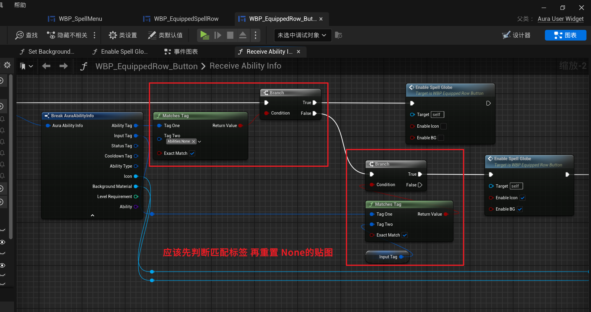


------

#### 修改一下，先判断是否匹配 `输入Tag` ，再判断是否为 `None`

>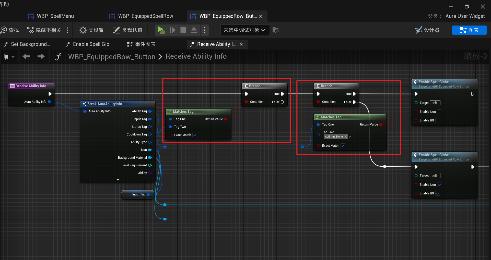


------

### 运行测试，这次正常了

>


------

#### 当我们按下闪电对应的 `InputTag` 后 会触发技能

>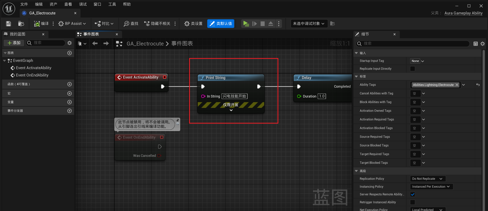
>
>
>
>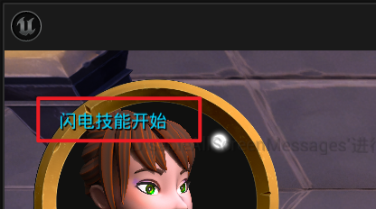


------

### 测试一下gif：技能可以随意切换，还可以互相覆盖，且可以使用对应输入按键触发技能

>


------

### 下面就需要更新 ***WBP_Overlay*** 的逻辑了


------

#### 这里是我们之前在 `SpellMenuWidgetController` 中制作的主要逻辑，在回调中

>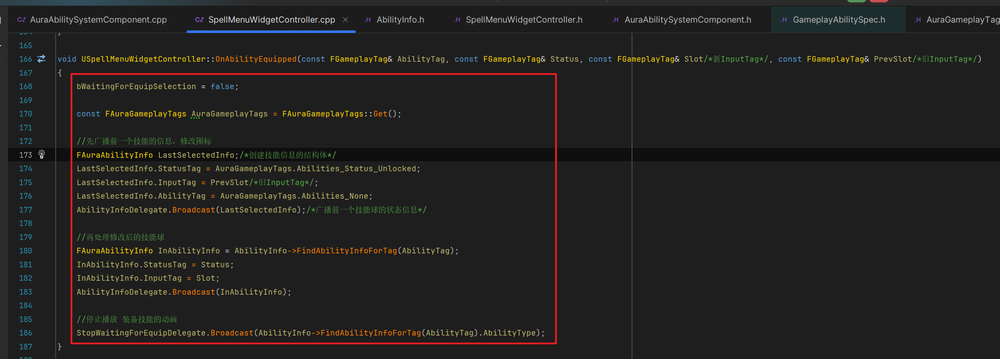

- **需要在 `OverlayWidgetController` 中做同样的操作**


------

### 在 `OverlayWidgetController` 中，也创建一个回调

>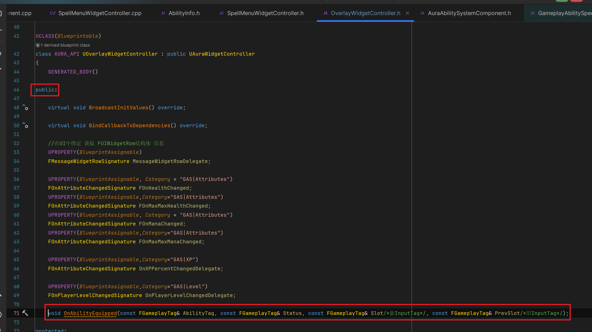


------

### 绑定回调

>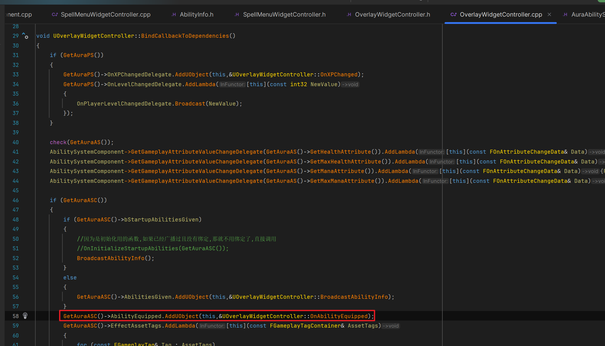


------

### 拷贝 `SpellMenuWidgetController` 回调函数中的逻辑，移除不用的逻辑

>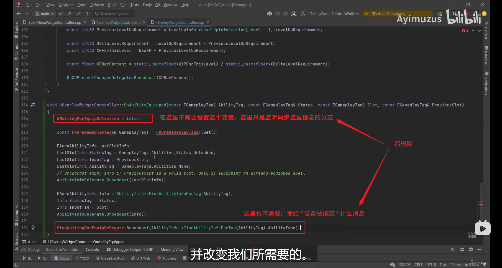
>
>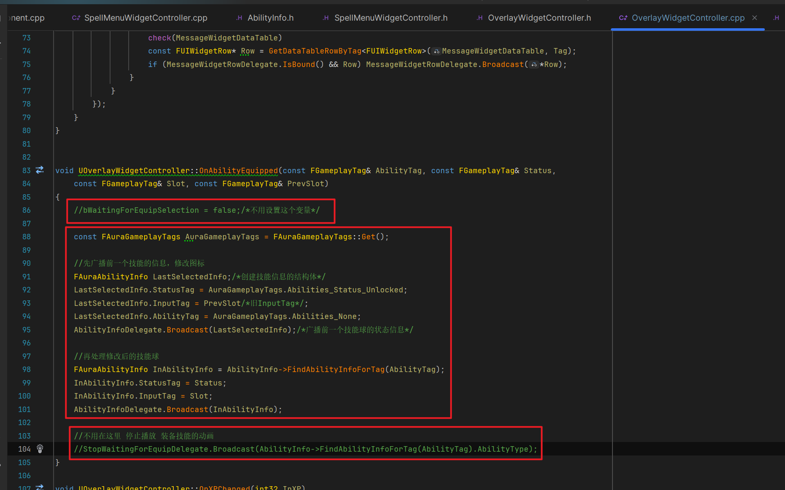
>
>```cpp
>//只保留这些逻辑
>void UOverlayWidgetController::OnAbilityEquipped(const FGameplayTag& AbilityTag, const FGameplayTag& Status,
>    const FGameplayTag& Slot, const FGameplayTag& PrevSlot)
>{
>    const FAuraGameplayTags AuraGameplayTags = FAuraGameplayTags::Get();
>
>    //先广播前一个技能的信息，修改图标
>    FAuraAbilityInfo LastSelectedInfo;/*创建技能信息的结构体*/
>    LastSelectedInfo.StatusTag = AuraGameplayTags.Abilities_Status_Unlocked;
>    LastSelectedInfo.InputTag = PrevSlot/*旧InputTag*/;
>    LastSelectedInfo.AbilityTag = AuraGameplayTags.Abilities_None;
>    AbilityInfoDelegate.Broadcast(LastSelectedInfo);/*广播前一个技能球的状态信息*/
>
>    //再处理修改后的技能球
>    FAuraAbilityInfo InAbilityInfo = AbilityInfo->FindAbilityInfoForTag(AbilityTag);
>    InAbilityInfo.StatusTag = Status;
>    InAbilityInfo.InputTag = Slot;
>    AbilityInfoDelegate.Broadcast(InAbilityInfo);
>}
>```


------

### 运行测试gif：虽然我们可以监听同步消息，但是也遇到了之前的问题

>


------

#### 还是同样的问题，在匹配 `InputTag` 后检查图标的技能标签是否匹配 `None` ，如果是，自己 设置 默认贴图纹理

>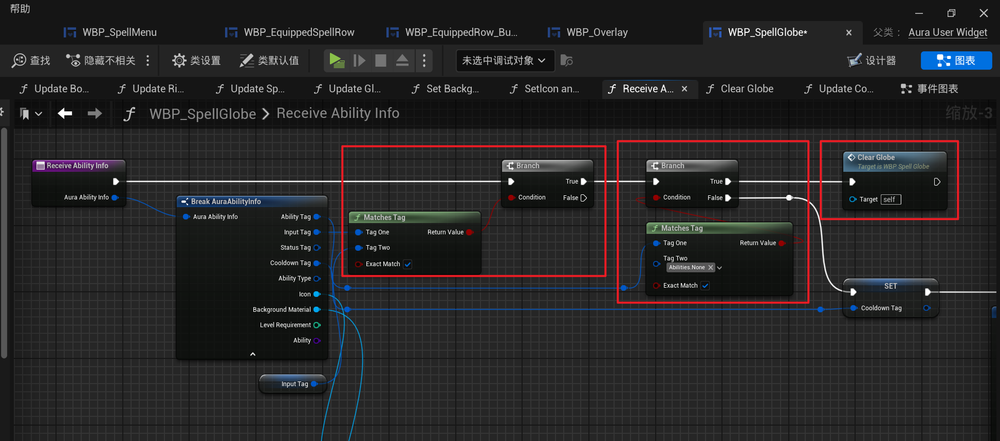


------

### 此时运行测试gif有一个bug：当我们先装备火球到右键上，再释放技能时，左键的位置贴图就会变成白色

  - 看着好像与技能CD有关

>


------

#### 在技能CD时，没有清空对应的 `CooldownTag` ，导致它还会 `接收CD的广播` ，所以手动设置默认时，需要清空一下

>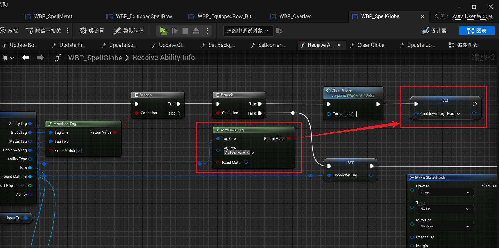


------

### 在测试就正常了gif

>


------

### 下一节我们将处理：当我们装备技能后，取消选择该技能，然后为装备技能，播放音效


------

### 思路是，创建一个委托，广播技能标签，因为每个技能球都只知道自己的标签

>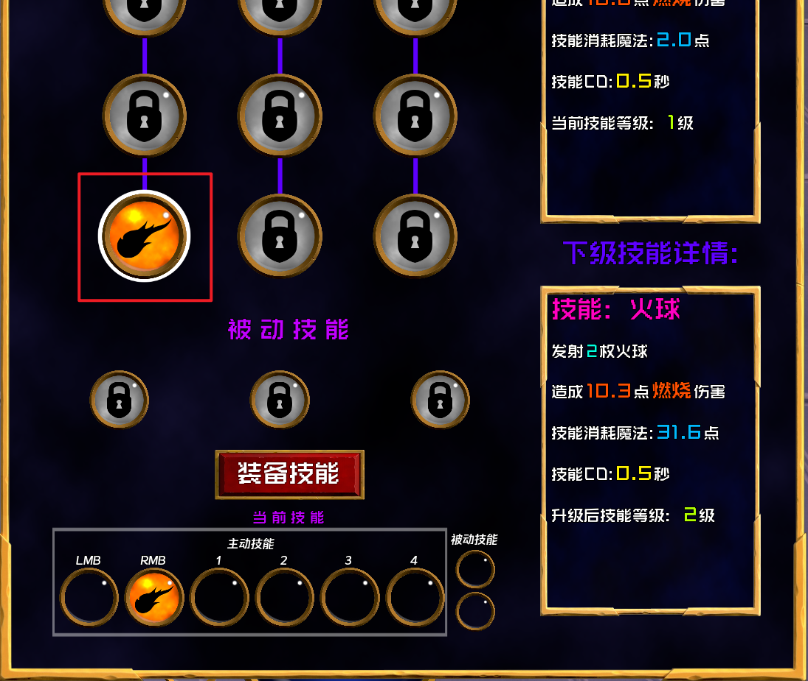


------

#### 创建动态多播，广播一个参数，再声明一个委托

  - 命名为，`FSpellGlobeReassignedSignature`

  - 委托命名为，`SpellGlobeReassignedDelegate`

>```cpp
>DECLARE_DYNAMIC_MULTICAST_DELEGATE_OneParam(FSpellGlobeReassignedSignature, const FGameplayTag&, AbilityTag);
>```
>
>```cpp
>public:
>    //监听 取消 技能的选择状态
>    UPROPERTY(BlueprintAssignable)
>    FSpellGlobeReassignedSignature SpellGlobeReassignedDelegate;
>```
>
>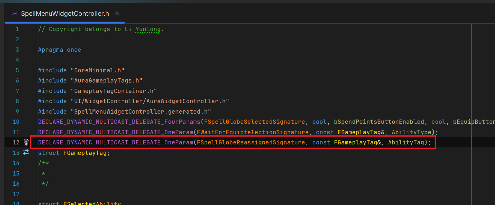

>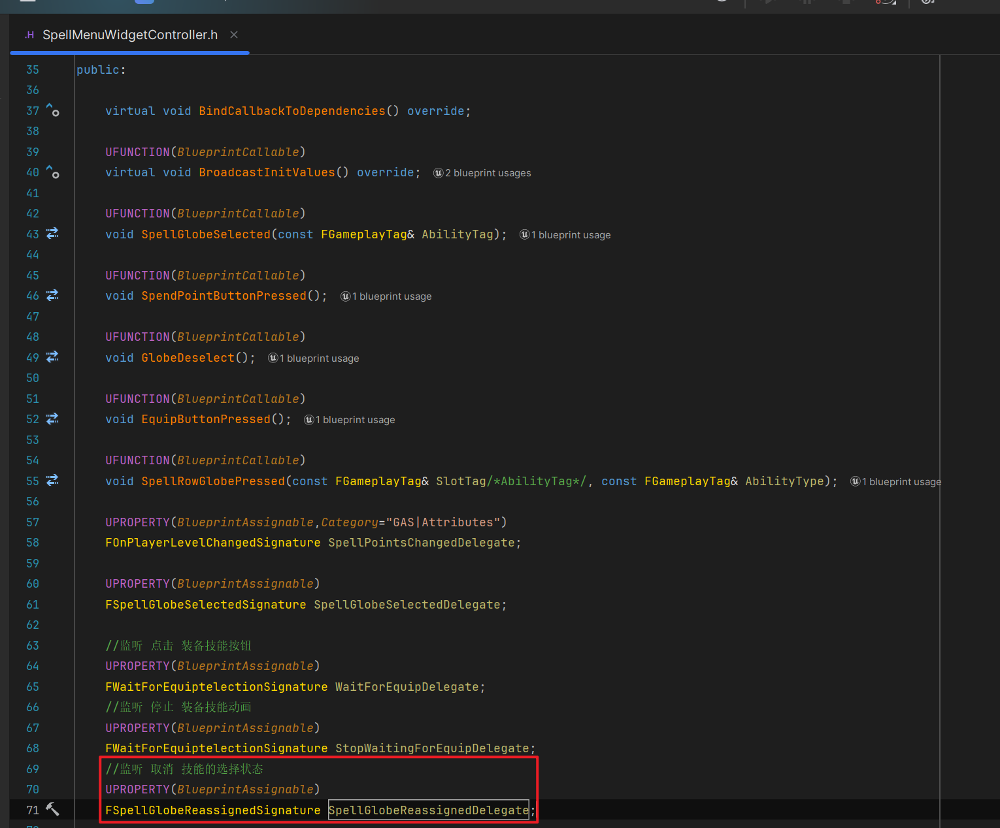


------

#### 在执行完 `点击装备技能区插槽` 的回调 `OnAbilityEquipped` 后，广播动态委托

>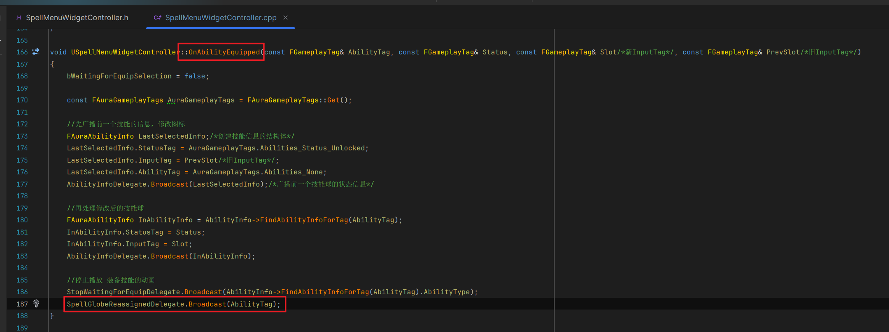


------

#### 然后手动调用 BlueprintCallable 取消选择的函数 `GlobeDeselect`

>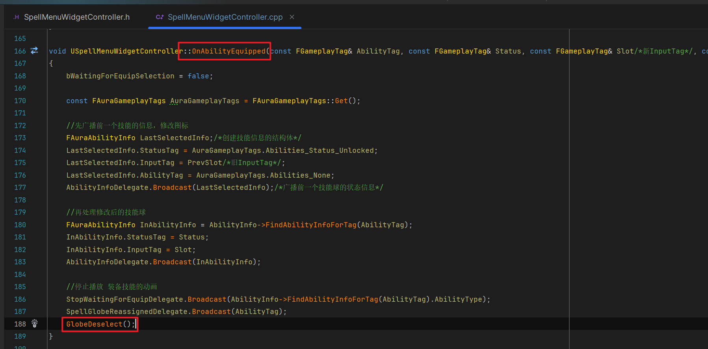


------

#### 蓝图创建整合的回调函数

  - 命名为，`OnSpellGlobeReassigned`

>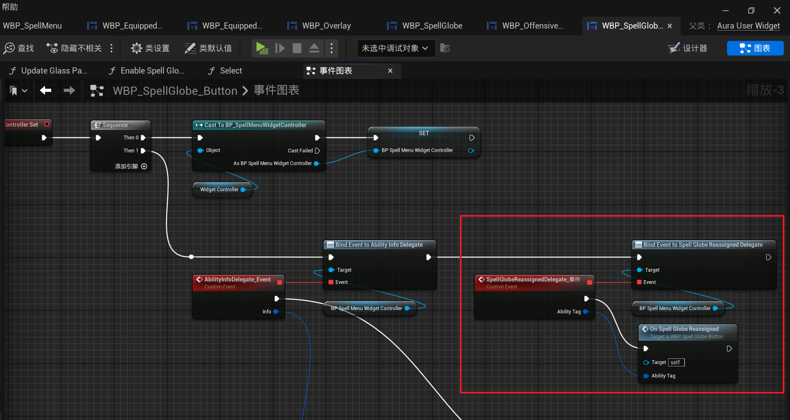
>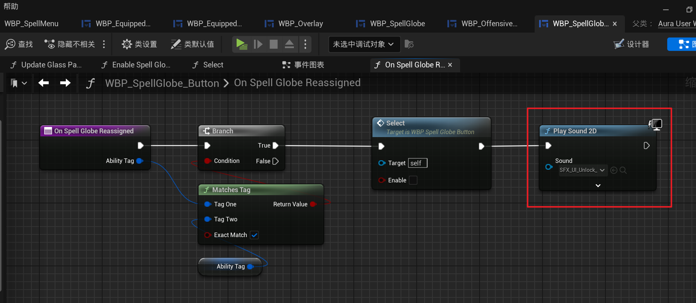
>
>#### Select函数是之前创建的，长这样
>
>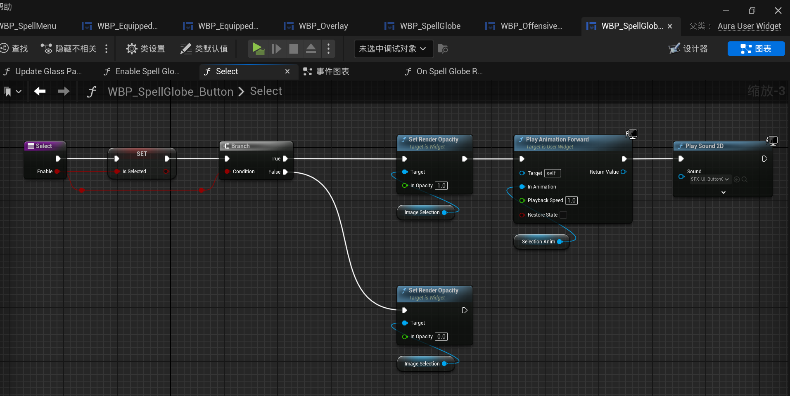


------

#### 音频资产路径

>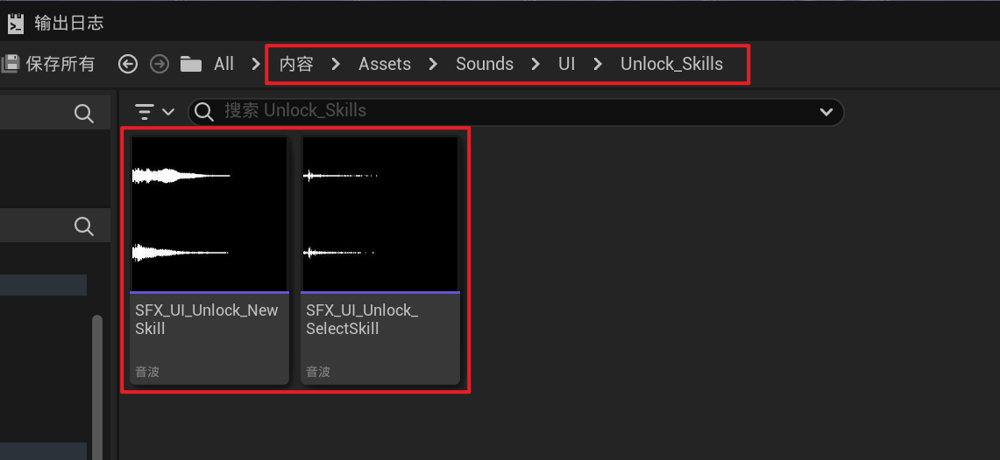


------

### 这个时候有个bug：当我们装备一个技能后，如果还选择同一个技能，会听到取消选择的音效

>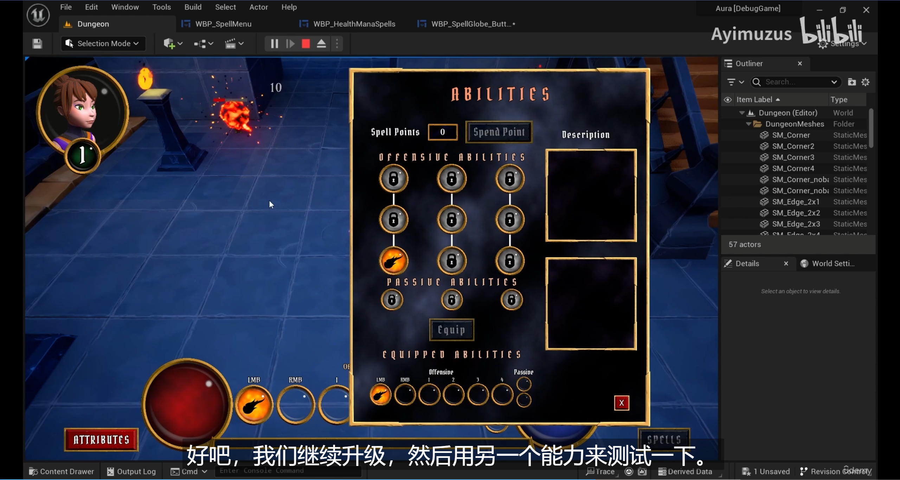

- 因为，之前的bool还没重置，也需要重置下（这里视频中有这个问题，但是我是整合了函数，函数中有处理）

>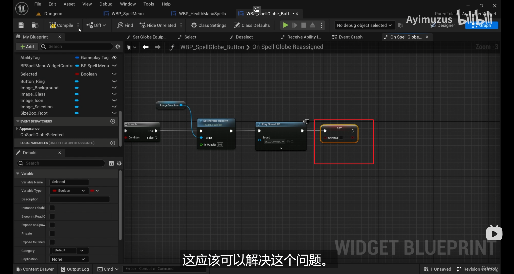
>
>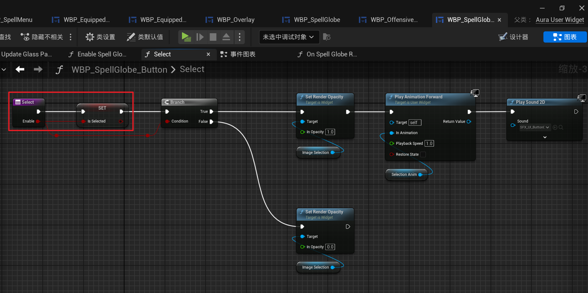


------

### 此时运行测试gif

>


___________________________________________________________________________________________

[返回最上面](#Go主菜单)

___________________________________________________________________________________________