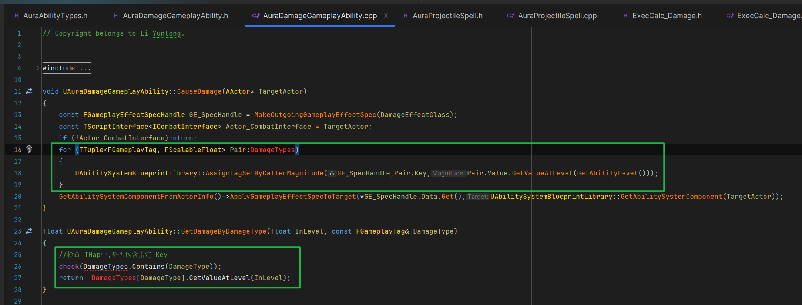

___________________________________________________________________________________________
###### [Go主菜单](../MainMenu.md)
___________________________________________________________________________________________

# GAS 149 重构属性伤害Tag和属性伤害的映射逻辑，添加DebuffTag和映射

___________________________________________________________________________________________

## 处理关键点

1. 当两个TMap中有一个元素相同时，可以联合使用，比较方便

___________________________________________________________________________________________

# 目录


- [GAS 149 重构属性伤害Tag和属性伤害的映射逻辑，添加DebuffTag和映射](#gas-149-重构属性伤害tag和属性伤害的映射逻辑添加debufftag和映射)
  - [处理关键点](#处理关键点)
- [目录](#目录)
    - [Mermaid整体思路梳理](#mermaid整体思路梳理)
    - [先解释下要做什么](#先解释下要做什么)
      - [现在希望在敌人受到火球伤害时，会有一定几率造成Debuff效果](#现在希望在敌人受到火球伤害时会有一定几率造成debuff效果)
      - [接下来，需要将伤害类型和对应的Debuff挂钩](#接下来需要将伤害类型和对应的debuff挂钩)
    - [接下来，在 `AuraDamageGameplayAbility` 中移除TMap，改为只持有技能自身的一个元素类型和曲线表格](#接下来在-auradamagegameplayability-中移除tmap改为只持有技能自身的一个元素类型和曲线表格)
    - [更改了数据结构之后，需要重构逻辑](#更改了数据结构之后需要重构逻辑)
      - [在 `AuraProjectileSpell` 中，之前引用了 `TMap` ，火球技能攻击时触发](#在-auraprojectilespell-中之前引用了-tmap-火球技能攻击时触发)
      - [在 `ExecCalc_Damage` 中，使用了TMap，来获取对应的属性伤害抗性](#在-execcalc_damage-中使用了tmap来获取对应的属性伤害抗性)
      - [在 `AuraDamageGameplayAbility` 中，近战敌人的攻击时触发的函数 `CauseDamage`](#在-auradamagegameplayability-中近战敌人的攻击时触发的函数-causedamage)
      - [在 `AuraDamageGameplayAbility` 中，我们之前创建了函数根据伤害类型返回伤害](#在-auradamagegameplayability-中我们之前创建了函数根据伤害类型返回伤害)
        - [接下来需要修改调用这个函数的地方](#接下来需要修改调用这个函数的地方)
          - [`AuraFireBolt` 中 `获取技能详情描述` 函数中](#aurafirebolt-中-获取技能详情描述-函数中)
      - [接下来需要在所有GA配置TMap的地方修改引用](#接下来需要在所有ga配置tmap的地方修改引用)
    - [此时运行测试，攻击敌人，被敌人（近战/远程）攻击无异常gif](#此时运行测试攻击敌人被敌人近战远程攻击无异常gif)
    - [现在可以开始制作 `Debuff` 效果了](#现在可以开始制作-debuff-效果了)
    - [创建 `Debuff` 的 `FGameplayTag` 标签](#创建-debuff-的-fgameplaytag-标签)
    - [为了一一对应，还需要参考之前的（属性伤害类型和属性抗性）创建一个TMap](#为了一一对应还需要参考之前的属性伤害类型和属性抗性创建一个tmap)
    - [下一节，我们将配置和实施Debuff](#下一节我们将配置和实施debuff)


___________________________________________________________________________________________

<details>
<summary>视频链接</summary>

[1. Debuff Tags_哔哩哔哩_bilibili](https://www.bilibili.com/video/BV1TH4y1L7NP?p=101&vd_source=9e1e64122d802b4f7ab37bd325a89e6c)

------

</details>

___________________________________________________________________________________________

### Mermaid整体思路梳理

Mermaid

___________________________________________________________________________________________

### 先解释下要做什么


------

#### 现在希望在敌人受到火球伤害时，会有一定几率造成Debuff效果

 - 根据伤害的类型(比如：火焰/闪电/奥术/物理)造成对应的Debuff伤害(比如：灼伤/电击/奥术灼烧/物理流血的效果，名字是我随便起的)，并让Debuff持续一段时间，并在持续时间内每隔一段时间生效一次（比如：灼烧伤害持续3s，每0.1s造成一次伤害）

 - 需要将伤害类型和对应的Debuff挂钩

 - 对于这个游戏项目，每种进攻能力都将与其元素相关联,

 - 我们可以使用基于三种 `属性伤害类型` 的能力，敌人使用 `物理伤害类型`
>


------

#### 接下来，需要将伤害类型和对应的Debuff挂钩

 - 之前我们制作了，火球携带多种类型伤害的TMap，我们需要修改这里的逻辑

 - 下面我们相当于简化这里的逻辑，让伤害元素类型与对应的Debuff挂钩，这样一一映射，想要这样设计，也就是将之前的逻辑，做成一个简化版的键值表（这样会使伤害类型单一，如果想要混合元素输出，也可以保留之前的逻辑结构，重新创建一个类来处理）


------

### 接下来，在 `AuraDamageGameplayAbility` 中移除TMap，改为只持有技能自身的一个元素类型和曲线表格
>
>
>
>```cpp
>protected:
>    UPROPERTY(EditDefaultsOnly, Category = "Damage")
>    FGameplayTag DamageType = FGameplayTag();
>    UPROPERTY(EditDefaultsOnly, Category = "Damage")
>    FScalableFloat Damage;
>```

------

### 更改了数据结构之后，需要重构逻辑


------

#### 在 `AuraProjectileSpell` 中，之前引用了 `TMap` ，火球技能攻击时触发

  - 之前：我们在for循环中处理将元素一一映射到 `SetByCaller` 中
>

  - 不用循环了，现在直接使用 `成员变量` 即可
>
>
>```cpp
>const float ScaledDamage = Damage.GetValueAtLevel(GetAbilityLevel());
>UAbilitySystemBlueprintLibrary::AssignTagSetByCallerMagnitude(EffectSpecHandle,DamageType,ScaledDamage);
>```

------

#### 在 `ExecCalc_Damage` 中，使用了TMap，来获取对应的属性伤害抗性
>

- 这里不用修改，因为，之前绑定 `SetByCaller` 之后，这里还是会依次触发，没有问题


------

#### 在 `AuraDamageGameplayAbility` 中，近战敌人的攻击时触发的函数 `CauseDamage`

  - 这里也是根据配置的TMap，拿到属性伤害类型和曲线中的float， 一一映射到 `SetByCaller` 中
>

  - 不用循环了，现在直接使用 `成员变量` 即可
>

------

#### 在 `AuraDamageGameplayAbility` 中，我们之前创建了函数根据伤害类型返回伤害

  - 现在不用TMap，也就不需要这个函数了
>
>

------

##### 接下来需要修改调用这个函数的地方


------

###### `AuraFireBolt` 中 `获取技能详情描述` 函数中

  - 之前：
>

  - 之后：(因为新名字与局部变量同名，需要给局部变量 **改个名**)
>

------

#### 接下来需要在所有GA配置TMap的地方修改引用

  - 火球

  - 敌人火球

  - 敌人近战攻击

  - 敌人游侠远程攻击
>
>
>
>

------

### 此时运行测试，攻击敌人，被敌人（近战/远程）攻击无异常gif
>
>

------

### 现在可以开始制作 `Debuff` 效果了

  - 现在需要：`Debuff` 和 `属性伤害类型` 一一对应

  - 需要为每种减益类型设置 `FGameplayTag`


------

### 创建 `Debuff` 的 `FGameplayTag` 标签
>
>
>
>#### 这里图中后三个搞错了父Tag标签！

------

### 为了一一对应，还需要参考之前的（属性伤害类型和属性抗性）创建一个TMap

  - 命名为，`DamageTypesToDebuffs`

  - 之前的：

>
>

  - 将 `属性伤害` 和 `对应Debuff` 一一对应加入TMap `DamageTypesToDebuffs`
>
>
>
>```cpp
>//一一映射<属性伤害,属性伤害Debuff>
>GameplayTags.DamageTypesToDebuffs.Add(GameplayTags.Damage_Fire,GameplayTags.Debuff_Burn);
>GameplayTags.DamageTypesToDebuffs.Add(GameplayTags.Damage_Lightning,GameplayTags.Debuff_Stun);
>GameplayTags.DamageTypesToDebuffs.Add(GameplayTags.Damage_Arcane,GameplayTags.Debuff_Arcane);
>GameplayTags.DamageTypesToDebuffs.Add(GameplayTags.Damage_Physical,GameplayTags.Debuff_Physical);
>```

------

### 下一节，我们将配置和实施Debuff
___________________________________________________________________________________________

[返回最上面](#Go主菜单)

___________________________________________________________________________________________