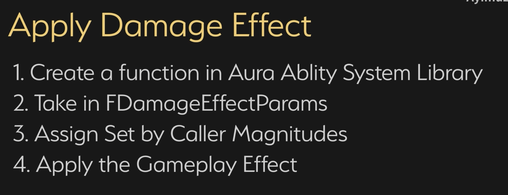

___________________________________________________________________________________________
###### [Go主菜单](../MainMenu.md)
___________________________________________________________________________________________

# GAS 150 GA中添加Debuff参数；创建结构体保存传递要使用的诸多参数；GA中使用上下文设置结构体参数；使用结构体中的信息对目标应用GE

___________________________________________________________________________________________

# 目录


- [GAS 150 GA中添加Debuff参数；创建结构体保存传递要使用的诸多参数；GA中使用上下文设置结构体参数；使用结构体中的信息对目标应用GE](#gas-150-ga中添加debuff参数创建结构体保存传递要使用的诸多参数ga中使用上下文设置结构体参数使用结构体中的信息对目标应用ge)
- [目录](#目录)
    - [Mermaid整体思路梳理](#mermaid整体思路梳理)
    - [上一节我们创建了 `Debuff` 的 `FGameplayTag` 标签，如果想要实现 `Debuff` 还需要在 GA 上配置一些变量，比如：](#上一节我们创建了-debuff-的-fgameplaytag-标签如果想要实现-debuff-还需要在-ga-上配置一些变量比如)
    - [在 `AuraDamageGameplayAbility` 中，添加 配置 `Debuff` 的变量](#在-auradamagegameplayability-中添加-配置-debuff-的变量)
    - [接下来，需要考虑，如何传递GA中的这些消息](#接下来需要考虑如何传递ga中的这些消息)
      - [这里希望使用 `SetByCaller` 来绑定对应 `FGameplayTag` 和 `float`](#这里希望使用-setbycaller-来绑定对应-fgameplaytag-和-float)
      - [创建 `Debuff` 的 `FGameplayTag` 对应 变量(为了使用 `SetByCaller` )](#创建-debuff-的-fgameplaytag-对应-变量为了使用-setbycaller-)
      - [我们之前在创建火球的Actor时，绑定了 `伤害类型` 和 `伤害` 的 `SetByCaller`，然后在 `ExecCalc_Damage` 中遍历获取，然后计算对应的属性抗性](#我们之前在创建火球的actor时绑定了-伤害类型-和-伤害-的-setbycaller然后在-execcalc_damage-中遍历获取然后计算对应的属性抗性)
    - [下一节，处理](#下一节处理)
    - [随着后面的处理越来越多的参数，如果手动配置大量的参数，会越来越麻烦。现在打算创建一个自建结构体的数据结构，当调用函数时，根据上下文配置大部分参数，方便使用](#随着后面的处理越来越多的参数如果手动配置大量的参数会越来越麻烦现在打算创建一个自建结构体的数据结构当调用函数时根据上下文配置大部分参数方便使用)
      - [在 `AuraAbilityTypes` 中，创建结构体](#在-auraabilitytypes-中创建结构体)
      - [在 `AuraDamageGameplayAbility` 中，创建函数，根据上下文设置结构体的变量](#在-auradamagegameplayability-中创建函数根据上下文设置结构体的变量)
        - [函数体内，创建结构体，然后 根据上下文逐一设置，然后返回该结构体](#函数体内创建结构体然后-根据上下文逐一设置然后返回该结构体)
    - [小测试1](#小测试1)
    - [自己尝试一下](#自己尝试一下)
      - [蓝图函数库中创建一个静态函数](#蓝图函数库中创建一个静态函数)
      - [`ApplyDamageEffect` 函数体内，获取 `ASC` ，应用 `Spec`](#applydamageeffect-函数体内获取-asc-应用-spec)
        - [其中绑定 `SetByCaller` 时，不光要绑定 `伤害` 和 `属性伤害类型` ，还需要绑定 `Debuff变量` 和 `Tag`](#其中绑定-setbycaller-时不光要绑定-伤害-和-属性伤害类型-还需要绑定-debuff变量-和-tag)
        - [最后返回 `FGameplayEffectContextHandle`](#最后返回-fgameplayeffectcontexthandle)
    - [下一节，我们将使用这个 `使用结构体的 函数` 来应用伤害](#下一节我们将使用这个-使用结构体的-函数-来应用伤害)


___________________________________________________________________________________________

<details>
<summary>视频链接</summary>

[2. Debuff Parameters_哔哩哔哩_bilibili](https://www.bilibili.com/video/BV1TH4y1L7NP?p=102&spm_id_from=pageDriver&vd_source=9e1e64122d802b4f7ab37bd325a89e6c)

[3. Damage Effect Params Struct_哔哩哔哩_bilibili](https://www.bilibili.com/video/BV1TH4y1L7NP?p=103&spm_id_from=pageDriver&vd_source=9e1e64122d802b4f7ab37bd325a89e6c)

------

</details>

___________________________________________________________________________________________

### Mermaid整体思路梳理

Mermaid

___________________________________________________________________________________________

### 上一节我们创建了 `Debuff` 的 `FGameplayTag` 标签，如果想要实现 `Debuff` 还需要在 GA 上配置一些变量，比如：

- Debuff 触发的概率
- Debuff 每次的伤害
- Debuff 多久生效一次
- Debuff 持续时间

上面说的这些，可以自己配表，这里只使用 `float` + `Level` 来简单计算


------

### 在 `AuraDamageGameplayAbility` 中，添加 配置 `Debuff` 的变量

| 变量类型 | 变量名          | 作用                |
| -------- | --------------- | ------------------- |
| `float`  | DebuffChance    | Debuff 触发的概率   |
| `float`  | DebuffDamage    | Debuff 每次的伤害   |
| `float`  | DebuffFrequency | Debuff 多久生效一次 |
| `float`  | DebuffDuration  | Debuff 持续时间     |

>
>
>```cpp
>protected:
>    /*
>     * 下面是Debuff相关参数配置
>     */
>    UPROPERTY(EditDefaultsOnly, Category = "Damage")
>    float DebuffChance = 20.f;//Debuff 触发的概率
>    UPROPERTY(EditDefaultsOnly, Category = "Damage")
>    float DebuffDamage = 5.f;//Debuff 每次的伤害
>    UPROPERTY(EditDefaultsOnly, Category = "Damage")
>    float DebuffFrequency = 1.f;//Debuff 多久生效一次
>    UPROPERTY(EditDefaultsOnly, Category = "Damage")
>    float DebuffDuration = 5.f;//Debuff 持续时间
>```

------

### 接下来，需要考虑，如何传递GA中的这些消息


------

#### 这里希望使用 `SetByCaller` 来绑定对应 `FGameplayTag` 和 `float`

  - 所以需要创建对应 `FGameplayTag`


------

#### 创建 `Debuff` 的 `FGameplayTag` 对应 变量(为了使用 `SetByCaller` )
>
>
>```cpp
>public:
>	//Debuff参数
>	FGameplayTag Debuff_Chance;    /*触发的概率*/
>	FGameplayTag Debuff_Damage;    /*每次的伤害*/
>	FGameplayTag Debuff_Frequency;  /*多久生效一次*/
>	FGameplayTag Debuff_Duration;   /*持续时间*/
>```
>
>```cpp
>/*
> * Debuff参数
> */
>GameplayTags.Debuff_Chance = UGameplayTagsManager::Get().AddNativeGameplayTag(
>    FName("Debuff.Chance"),
>    FString("Debuff Chance"));
>
>GameplayTags.Debuff_Damage = UGameplayTagsManager::Get().AddNativeGameplayTag(
>    FName("Debuff.Damage"),
>    FString("Debuff Damage"));
>
>GameplayTags.Debuff_Frequency = UGameplayTagsManager::Get().AddNativeGameplayTag(
>    FName("Debuff.Frequency"),
>    FString("Debuff Frequency"));
>
>GameplayTags.Debuff_Duration = UGameplayTagsManager::Get().AddNativeGameplayTag(
>    FName("Debuff.Duration"),
>    FString("Debuff Duration"));
>```

------

#### 我们之前在创建火球的Actor时，绑定了 `伤害类型` 和 `伤害` 的 `SetByCaller`，然后在 `ExecCalc_Damage` 中遍历获取，然后计算对应的属性抗性
>

------

### 下一节，处理


------

### 随着后面的处理越来越多的参数，如果手动配置大量的参数，会越来越麻烦。现在打算创建一个自建结构体的数据结构，当调用函数时，根据上下文配置大部分参数，方便使用


------

#### 在 `AuraAbilityTypes` 中，创建结构体

  - 我们之前在这个文件中创建了自己的 `FGameplayEffectContext`
>

- 命名为，`FDamageEffectParams`

- 保存如下参数：

  | 变量类型                       | 变量名                       | 作用               |
  | ------------------------------ | ---------------------------- | ------------------ |
  | `UObject`                      | WorldContextObject           | 世界上下文         |
  | `TSubclassOf<UGameplayEffect>` | GameplayEffectClass          | 伤害的GE_Class     |
  | `UAbilitySystemComponent`      | SourceAbilitySystemComponent | 源对象的ASC组件    |
  | `UAbilitySystemComponent`      | TargetAbilitySystemComponent | 目标对象ASC组件    |
  | `float`                        | BaseDamage                   | 技能的伤害值       |
  | `int32`                        | AbilityLevel                 | 技能等级           |
  | `FGameplayTag`                 | DamageType                   | 技能的属性伤害类型 |

  - 以及 四个Debuff的参数：

  | 变量类型 | 变量名          | 作用                |
  | -------- | --------------- | ------------------- |
  | `float`  | DebuffChance    | Debuff 触发的概率   |
  | `float`  | DebuffDamage    | Debuff 每次的伤害   |
  | `float`  | DebuffFrequency | Debuff 多久生效一次 |
  | `float`  | DebuffDuration  | Debuff 持续时间     |


>
>
>```cpp
>USTRUCT(BlueprintType)
>struct FDamageEffectParams
>{
>    GENERATED_BODY()
>
>    UPROPERTY()
>    TObjectPtr<UObject> WorldContextObject = nullptr;                       		//世界上下文
>    
>    UPROPERTY()
>    TSubclassOf<UGameplayEffect> GameplayEffectClass = nullptr;                  	//伤害的GE_Class
>    
>    UPROPERTY()
>    TObjectPtr<UAbilitySystemComponent> SourceAbilitySystemComponent = nullptr;     //源对象的ASC组件
>    
>    UPROPERTY()
>    TObjectPtr<UAbilitySystemComponent> TargetAbilitySystemComponent = nullptr;     //目标对象ASC组件
>    
>    UPROPERTY()
>    float BaseDamage = 0.f;                                              //技能的伤害值
>    
>    UPROPERTY()
>    int32 AbilityLevel = 1;                                              //技能等级
>    
>    UPROPERTY()
>    FGameplayTag DamageType = FGameplayTag();                            //技能的属性伤害类型
>
>    //下面是Debuff参数
>    UPROPERTY()
>    float DebuffChance = 0.f;                                         // Debuff 触发的概率
>    UPROPERTY()
>    float DebuffDamage = 0.f;                                         // Debuff 每次的伤害
>    UPROPERTY()
>    float DebuffFrequency = 0.f;                                      // Debuff 多久生效一次
>    UPROPERTY()
>    float DebuffDuration = 0.f;                                       // Debuff 持续时间
>    
>};
>```

------

#### 在 `AuraDamageGameplayAbility` 中，创建函数，根据上下文设置结构体的变量

  - 命名为，`MakeDamageEffectParamsFromClassDefaults`

  - 形参为：`TargetActor` 因为可能调用这个函数时(初始化时)没有Target，比如远程技能火球创建时并不知道Target，所以给一个默参 `nullptr`
    - 这样可以在后面参数变化时，手动设置 `TargetActor` 

  - 返回结构体，所以需要引入头文件
>

------

##### 函数体内，创建结构体，然后 根据上下文逐一设置，然后返回该结构体

- 因为调用了ASC函数库的静态函数，判断目标是否实现了ASC组件，本来想在函数外判空指针，查看源码发现，该静态函数内已经判空，所以直接调用即可
>```cpp
>if (TargetActor)
>{
>    UAbilitySystemBlueprintLibrary::GetAbilitySystemComponent(TargetActor);
>}
>```
>
>
>

- 设置完返回结构体即可
>```cpp
>FDamageEffectParams UAuraDamageGameplayAbility::MakeDamageEffectParamsFromClassDefaults(AActor* TargetActor) const
>{
>    FDamageEffectParams Params;
>    
>    Params.WorldContextObject = GetAvatarActorFromActorInfo();
>	Params.GameplayEffectClass = DamageEffectClass;
>    Params.SourceAbilitySystemComponent = GetAbilitySystemComponentFromActorInfo();
>    Params.TargetAbilitySystemComponent = UAbilitySystemBlueprintLibrary::GetAbilitySystemComponent(TargetActor);
>    Params.BaseDamage = Damage.GetValueAtLevel(GetAbilityLevel());
>    Params.AbilityLevel = GetAbilityLevel();
>    Params.DamageType = DamageType;
>    Params.DebuffChance = DebuffChance;
>    Params.DebuffDamage = DebuffDamage;
>    Params.DebuffFrequency = DebuffFrequency;
>    Params.DebuffDuration = DebuffDuration;
>    
>    return Params;
>}
>```

------

### 小测试1

  - 在蓝图函数库中创建一个静态函数，形参使用上面创建的结构体，然后绑定 `SetByCaller` ，之后对目标应用GE效果
>

------

### 自己尝试一下


------

#### 蓝图函数库中创建一个静态函数

  - 函数命名为，`ApplyDamageEffect`

  - 返回值可能使用到 `FGameplayEffectContextHandle` 所以需要返回该类型
>
>
>```cpp
>UFUNCTION(BlueprintCallable, Category = "AuraAbilitySystemLibrary|DamageEffect")
>static FGameplayEffectContextHandle ApplyDamageEffect(const FDamageEffectParams& Params);
>```

------

#### `ApplyDamageEffect` 函数体内，获取 `ASC` ，应用 `Spec` 
>1. 创建 `Context` 
>2. 创建 `Spec` 
>3. 添加 `SourceActor` 
>4. 绑定 `SetByCaller` 
>5. 应用 `Spec` 
>6. 返回
>
>
>
>```cpp
>FGameplayEffectContextHandle UAuraAbilitySystemLibrary::ApplyDamageEffect(const FDamageEffectParams& Params)
>{
>    const UAbilitySystemComponent* SourceASC = Params.SourceAbilitySystemComponent;
>    const AActor* SourceObject = SourceASC->GetAvatarActor();
>    FGameplayEffectContextHandle ContextHandle = SourceASC->MakeEffectContext();
>    ContextHandle.AddSourceObject(SourceObject);
>    const FGameplayEffectSpecHandle SpecHandle = SourceASC->MakeOutgoingSpec(Params.GameplayEffectClass,Params.AbilityLevel,ContextHandle);
>    UAbilitySystemBlueprintLibrary::AssignTagSetByCallerMagnitude(SpecHandle,Params.DamageType,Params.BaseDamage);
>    if (Params.TargetAbilitySystemComponent)
>    {
>       Params.TargetAbilitySystemComponent->ApplyGameplayEffectSpecToSelf(*SpecHandle.Data);
>    }
>    return ContextHandle;
>}
>```

------

##### 其中绑定 `SetByCaller` 时，不光要绑定 `伤害` 和 `属性伤害类型` ，还需要绑定 `Debuff变量` 和 `Tag`
>
>
>```cpp
>FGameplayEffectContextHandle UAuraAbilitySystemLibrary::ApplyDamageEffect(const FDamageEffectParams& Params)
>{
>    const UAbilitySystemComponent* SourceASC = Params.SourceAbilitySystemComponent;
>    const AActor* SourceObject = SourceASC->GetAvatarActor();
>    const FAuraGameplayTags GameplayTags = FAuraGameplayTags::Get();
>    
>    FGameplayEffectContextHandle ContextHandle = SourceASC->MakeEffectContext();
>    ContextHandle.AddSourceObject(SourceObject);
>    const FGameplayEffectSpecHandle SpecHandle = SourceASC->MakeOutgoingSpec(Params.GameplayEffectClass,Params.AbilityLevel,ContextHandle);
>    
>    UAbilitySystemBlueprintLibrary::AssignTagSetByCallerMagnitude(SpecHandle,Params.DamageType,Params.BaseDamage);
>    //绑定 Debuff相关参数 和 Tag
>    UAbilitySystemBlueprintLibrary::AssignTagSetByCallerMagnitude(SpecHandle,GameplayTags.Debuff_Chance,Params.DebuffChance);
>    UAbilitySystemBlueprintLibrary::AssignTagSetByCallerMagnitude(SpecHandle,GameplayTags.Debuff_Damage,Params.DebuffDamage);
>    UAbilitySystemBlueprintLibrary::AssignTagSetByCallerMagnitude(SpecHandle,GameplayTags.Debuff_Frequency,Params.DebuffFrequency);
>    UAbilitySystemBlueprintLibrary::AssignTagSetByCallerMagnitude(SpecHandle,GameplayTags.Debuff_Duration,Params.DebuffDuration);
>    
>    if (Params.TargetAbilitySystemComponent) Params.TargetAbilitySystemComponent->ApplyGameplayEffectSpecToSelf(*SpecHandle.Data);
>    return ContextHandle;
>}
>```

------

##### 最后返回 `FGameplayEffectContextHandle` 
>

------

### 下一节，我们将使用这个 `使用结构体的 函数` 来应用伤害
___________________________________________________________________________________________

[返回最上面](#Go主菜单)

___________________________________________________________________________________________