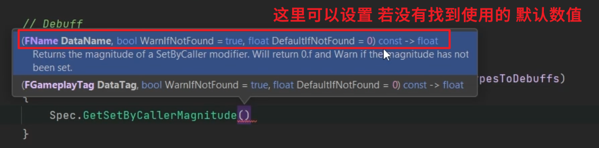

___________________________________________________________________________________________
###### [Go主菜单](../MainMenu.md)
___________________________________________________________________________________________

# GAS 152 计算准备应用Debuff；为敌人添加属性伤害抗性；处理未能捕获属性伤害抗性的BUG

___________________________________________________________________________________________

## 处理关键点

1. 需要查一下：懒单例结构体中有一个TMap，构造中为TMap添加元素，使用TMap时元素并没有全部添加完成，请问是因为什么？
2. 捕获属性不要忘了，在构造中将 `要捕获属性的Def` 加入捕获属性数组！！！
___________________________________________________________________________________________

# 目录


- [GAS 152 计算准备应用Debuff；为敌人添加属性伤害抗性；处理未能捕获属性伤害抗性的BUG](#gas-152-计算准备应用debuff为敌人添加属性伤害抗性处理未能捕获属性伤害抗性的bug)
  - [处理关键点](#处理关键点)
- [目录](#目录)
    - [Mermaid整体思路梳理](#mermaid整体思路梳理)
    - [现在我们可以在 `ExecCalc_Damage` 中，获取 `SetByCaller`](#现在我们可以在-execcalc_damage-中获取-setbycaller)
    - [`Spec.GetSetByCallerMagnitude` 函数中，可以设置 `float DefaultlfNotFound` (若没有找到使用的 默认数值)](#specgetsetbycallermagnitude-函数中可以设置-float-defaultlfnotfound-若没有找到使用的-默认数值)
    - [如果，可以拿到有效的 `属性伤害` 的 `SetByCaller` 的 `float`](#如果可以拿到有效的-属性伤害-的-setbycaller-的-float)
      - [通过 `SetByCaller` 拿到 `Debuff的概率` 参数](#通过-setbycaller-拿到-debuff的概率-参数)
      - [我们之前在  的懒单例结构体构造中，为TMap赋值，一一映射了 `<属性抗性,对应的捕获Def>`](#我们之前在--的懒单例结构体构造中为tmap赋值一一映射了-属性抗性对应的捕获def)
      - [这里解释一下：我们使用了三个TMap分别映射](#这里解释一下我们使用了三个tmap分别映射)
        - [所以可以通过 `属性伤害` 拿到 `对应的抗性` 再拿到 `对应捕获属性抗性的Def`](#所以可以通过-属性伤害-拿到-对应的抗性-再拿到-对应捕获属性抗性的def)
      - [再通过 `ExecutionParams.AttemptCalculateCapturedAttributeMagnitude` 拿到对应的属性值](#再通过-executionparamsattemptcalculatecapturedattributemagnitude-拿到对应的属性值)
        - [别忘了 `夹值` !](#别忘了-夹值-)
    - [Debuff概率，计算公式如下：](#debuff概率计算公式如下)
    - [现在的处理步骤已经很多了，应该抽象一个函数](#现在的处理步骤已经很多了应该抽象一个函数)
    - [逻辑上应该是判断本次收到Damage的值以后(说明本次攻击有效)，才开始判断Debuff的概率](#逻辑上应该是判断本次收到damage的值以后说明本次攻击有效才开始判断debuff的概率)
      - [接下来，断点测试，看逻辑的参数是否正常](#接下来断点测试看逻辑的参数是否正常)
    - [运行测试，向敌人发射火球，提前触发断点](#运行测试向敌人发射火球提前触发断点)
    - [在函数 `Execute_Implementation` 中创建成员变量TMap，保存静态表（将懒单例中构造中的添加元素挪到这里实现）](#在函数-execute_implementation-中创建成员变量tmap保存静态表将懒单例中构造中的添加元素挪到这里实现)
      - [但是所有引用到 `对应捕获属性抗性的Def` 的地方都需要修改](#但是所有引用到-对应捕获属性抗性的def-的地方都需要修改)
      - [函数 `DetermineDebuff` 中，也需要添加形参，需要这个TMap！](#函数-determinedebuff-中也需要添加形参需要这个tmap)
    - [编译引擎后](#编译引擎后)
    - [现在有一个问题，我们之前没有为敌人 `次要属性GE` 添加  `4种属性的抗性`](#现在有一个问题我们之前没有为敌人-次要属性ge-添加--4种属性的抗性)
      - [先使用固定值20测试一下](#先使用固定值20测试一下)
  - [断点之前有一个问题，我发现捕获的属性值一直为 `0.f`，找了半天，是因为之前没有把 `属性伤害抗性` 加到捕获列表！！！！！！！！！！！！](#断点之前有一个问题我发现捕获的属性值一直为-0f找了半天是因为之前没有把-属性伤害抗性-加到捕获列表)
    - [继续测试断点结果是否正常](#继续测试断点结果是否正常)
    - [参考Aura的 `次要属性GE` 来配置敌人的 `次要属性GE`](#参考aura的-次要属性ge-来配置敌人的-次要属性ge)
    - [我们将在下一节，处理应用Debuff 需要发生的一系列逻辑](#我们将在下一节处理应用debuff-需要发生的一系列逻辑)


___________________________________________________________________________________________

<details>
<summary>视频链接</summary>

[5. Determining Debuff_哔哩哔哩_bilibili](https://www.bilibili.com/video/BV1TH4y1L7NP?p=105&spm_id_from=pageDriver&vd_source=9e1e64122d802b4f7ab37bd325a89e6c)

------

</details>

___________________________________________________________________________________________

### Mermaid整体思路梳理

Mermaid

___________________________________________________________________________________________

### 现在我们可以在 `ExecCalc_Damage` 中，获取 `SetByCaller` 
>
>

- 我们可以通过遍历 `FAuraGameplayTags` 中的 `TMap` 拿到所有的 `属性伤害` 和对应的 `Debuff`
>

------

### `Spec.GetSetByCallerMagnitude` 函数中，可以设置 `float DefaultlfNotFound` (若没有找到使用的 默认数值)
>

  - `DefaultNotFound` 可以给 -1，便于后面从逻辑上识别(但是因为是浮点值，可能会有误差，使用时可以使用 `> 0.5 这样的判断` )
>```CPP
>const float SourceDebuffChance = GE_Spec.GetSetByCallerMagnitude(GameplayTags.Debuff_Chance/*要查找的FGameplayTag*/,false,-1/*若没有找到的默认值可以给-1*/);
>```

------

### 如果，可以拿到有效的 `属性伤害` 的 `SetByCaller` 的 `float`


------

#### 通过 `SetByCaller` 拿到 `Debuff的概率` 参数
>

------

#### 我们之前在  的懒单例结构体构造中，为TMap赋值，一一映射了 `<属性抗性,对应的捕获Def>`
>

------

#### 这里解释一下：我们使用了三个TMap分别映射

  - `属性伤害抗性` 和 `对应捕获属性抗性的Def`
>

  - `属性伤害` 和 `对应属性伤害抗性`
>

  - `属性伤害类型` 和 `Debuff`
>

------

##### 所以可以通过 `属性伤害` 拿到 `对应的抗性` 再拿到 `对应捕获属性抗性的Def`

> 


------

#### 再通过 `ExecutionParams.AttemptCalculateCapturedAttributeMagnitude` 拿到对应的属性值


------

##### 别忘了 `夹值` !

> ```CPP
> //处理Debuff
> FAuraGameplayTags GameplayTags = FAuraGameplayTags::Get();
> for (const TTuple<FGameplayTag, FGameplayTag> Pair : GameplayTags.DamageTypesToDebuffs)
> {
>     const FGameplayTag DamageTag = Pair.Key;
>     const FGameplayTag DebuffTag = Pair.Value;
>     const FGameplayTag ResistanceTag = GameplayTags.DamageTypesToResistances[DamageTag];
>     //源Actor 的 Debuff触发概率
>     const float SourceDebuffChance = GE_Spec.GetSetByCallerMagnitude(GameplayTags.Debuff_Chance,false,-1);
>     if (SourceDebuffChance > -0.5f)/*给float保留了0.5的误差*/
>     {
>        float TargetDebuffResistance = 0.f;
>        ExecutionParams.AttemptCalculateCapturedAttributeMagnitude(DamageStatics().TagsToCaptureDefs[ResistanceTag]/*对应抗性Def*/,EvaluateParameters,TargetDebuffResistance);
>        TargetDebuffResistance = FMath::Max<float>(TargetDebuffResistance,0.f);/*夹值*/
>     }
> }
> ```


------

### Debuff概率，计算公式如下：

  - `应用Debuff概率 = Debuff概率参数 * （100 - 目标对应属性抗性）/ 100`

  - 这里就使用固定值了，也可以使用曲线

  - 根据上面的公式，现在每一点抗性都会使 应用Debuff的概率降低1%
>

- 然后随机，判定 `是否应用Debuff`

> 


------

### 现在的处理步骤已经很多了，应该抽象一个函数

  - 命名为，`DetermineDebuff`
>
>
>

------

### 逻辑上应该是判断本次收到Damage的值以后(说明本次攻击有效)，才开始判断Debuff的概率

> - 之前是检查SetByCaller是否能收到 Debuff触发概率的数值（按道理讲这个肯定是能触发的，按目前的逻辑应该每次应用GE时调用蓝图函数库中的静态函数，然后设置 `Debuff触发概率的数值` 这边就会收到了）
> - 也就是会在每次攻击后触发
>
> 

------

#### 接下来，断点测试，看逻辑的参数是否正常

>

------

### 运行测试，向敌人发射火球，提前触发断点
>

- 也就是说，我们从这个懒单例中的静态函数获取的 `TMap数组` 还没有初始化添加元素完成，就触发了下面的调用，导致 `Num ==1` 

- 如果想正常使用，可以不在懒单例的结构体构造内赋值，而是在函数内创建 `成员变量TMap` ，直接使用 `成员变量` (反正使用的也是一个`静态表` )
------

### 在函数 `Execute_Implementation` 中创建成员变量TMap，保存静态表（将懒单例中构造中的添加元素挪到这里实现）
>
>

------

#### 但是所有引用到 `对应捕获属性抗性的Def` 的地方都需要修改
------

#### 函数 `DetermineDebuff` 中，也需要添加形参，需要这个TMap！
>
>
>

------

### 编译引擎后


------

### 现在有一个问题，我们之前没有为敌人 `次要属性GE` 添加  `4种属性的抗性`
>

------

#### 先使用固定值20测试一下
>

------

## 断点之前有一个问题，我发现捕获的属性值一直为 `0.f`，找了半天，是因为之前没有把 `属性伤害抗性` 加到捕获列表！！！！！！！！！！！！

> 

------

### 继续测试断点结果是否正常

>
>

- 这回应该是正常的


------

### 参考Aura的 `次要属性GE` 来配置敌人的 `次要属性GE` 
>

------

### 我们将在下一节，处理应用Debuff 需要发生的一系列逻辑
>
___________________________________________________________________________________________

[返回最上面](#Go主菜单)

___________________________________________________________________________________________