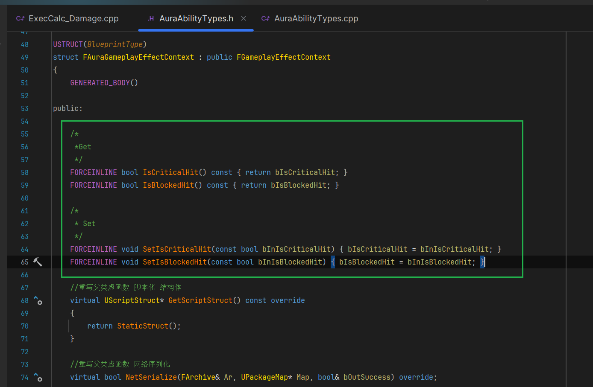

___________________________________________________________________________________________
###### [Go主菜单](../MainMenu.md)
___________________________________________________________________________________________

# GAS 153 FGameplayContext中携带结构体；在AS中读取Context中的参数，准备应用Debuff

___________________________________________________________________________________________

## 处理关键点

1. 网络序列化 结构体
    - 比如 `FHitResult` 这种需要使用 `TSharedPtr` 指针包裹使用！！
2. 网络序列化 `FVector`
    - 读取数据时直接调用 `NetSerialize` 函数赋值即可
3. 避免主函数中掺杂大量过程逻辑，比较多的过程逻辑，尽可能的抽象到函数中！

___________________________________________________________________________________________

# 目录


- [GAS 153 FGameplayContext中携带结构体；在AS中读取Context中的参数，准备应用Debuff](#gas-153-fgameplaycontext中携带结构体在as中读取context中的参数准备应用debuff)
  - [处理关键点](#处理关键点)
- [目录](#目录)
    - [Mermaid整体思路梳理](#mermaid整体思路梳理)
    - [小测试1](#小测试1)
    - [自己尝试下](#自己尝试下)
      - [先搞定 `bool` 和 `float` 变量](#先搞定-bool-和-float-变量)
      - [接下来 序列化 `FGameplayTag`](#接下来-序列化-fgameplaytag)
        - [先参考一下 `FHitResult`](#先参考一下-fhitresult)
        - [创建一个 `TSharedPtr` 包裹的 `FGameplayTag`](#创建一个-tsharedptr-包裹的-fgameplaytag)
        - [如果有效，则翻转第13位](#如果有效则翻转第13位)
        - [接下来需要从存档中加载 `TSharedPtr` 包裹的 `FGameplayTag` （参考 `FHitResult` ）](#接下来需要从存档中加载-tsharedptr-包裹的-fgameplaytag-参考-fhitresult-)
          - [需要 `new` 一个 `TSharedPtr` 指针包裹 `FGameplayTag`](#需要-new-一个-tsharedptr-指针包裹-fgameplaytag)
          - [最后加载数据](#最后加载数据)
      - [最后别忘了修改序列化传递的有效位数](#最后别忘了修改序列化传递的有效位数)
      - [以上就完成了对变量的序列化，接下来需要创建 `Get` 和 `Set` 函数](#以上就完成了对变量的序列化接下来需要创建-get-和-set-函数)
      - [我们之前在蓝图函数库中创建静态函数，可以方便的 `Get` 和 `Set` `FAuraGameplayEffectContext` 中的变量，现在也需要为新变量创建函数](#我们之前在蓝图函数库中创建静态函数可以方便的-get-和-set-fauragameplayeffectcontext-中的变量现在也需要为新变量创建函数)
        - [函数体中也需要使用类型强制转换（转换成自建的Context）](#函数体中也需要使用类型强制转换转换成自建的context)
        - [`FGameplayTag` 的处理情况略有不同，因为是操作智能指针 `TSharedPtr`](#fgameplaytag-的处理情况略有不同因为是操作智能指针-tsharedptr)
          - [蓝图函数库 `Get` 函数中，如果获取智能指针指向的 `裸指针` 需要先给智能指针判空，然后因为返回值不是指针，需要解引用](#蓝图函数库-get-函数中如果获取智能指针指向的-裸指针-需要先给智能指针判空然后因为返回值不是指针需要解引用)
          - [蓝图函数库 `Set` 函数中，因为需要传入一个 `TSharedPtr` 智能指针，所以需要创建一个](#蓝图函数库-set-函数中因为需要传入一个-tsharedptr-智能指针所以需要创建一个)
    - [下一节](#下一节)
    - [在 `ExecCalc_Damage` 中，写一下触发Debuff之后的逻辑（需要使用蓝图函数库中的函数，设置Context中的参数）](#在-execcalc_damage-中写一下触发debuff之后的逻辑需要使用蓝图函数库中的函数设置context中的参数)
    - [在AS的后处理函数中，当 `InCommingXP` 被触发时，也会在这里获取 `Context` 的数据，看是否 `触发了Debuff` ，然后 `创建GE` 应用该次 `Debuff`](#在as的后处理函数中当-incommingxp-被触发时也会在这里获取-context-的数据看是否-触发了debuff-然后-创建ge-应用该次-debuff)
    - [现在AS的后处理函数中逻辑有些臃肿，需要根据被触发的属性，抽象功能函数然后调用。](#现在as的后处理函数中逻辑有些臃肿需要根据被触发的属性抽象功能函数然后调用)
      - [创建 处理Debuff的函数，触发时调用](#创建-处理debuff的函数触发时调用)
    - [下一节，我们来处理为Debuff在C++中创建GE 配置，然后应用](#下一节我们来处理为debuff在c中创建ge-配置然后应用)


___________________________________________________________________________________________

<details>
<summary>视频链接</summary>

[6. Debuff Info in the Effect Context_哔哩哔哩_bilibili](https://www.bilibili.com/video/BV1TH4y1L7NP/?p=106&spm_id_from=pageDriver&vd_source=9e1e64122d802b4f7ab37bd325a89e6c)

[7. Debuff in the Attribute Set_哔哩哔哩_bilibili](https://www.bilibili.com/video/BV1TH4y1L7NP/?p=107&spm_id_from=pageDriver&vd_source=9e1e64122d802b4f7ab37bd325a89e6c)

------

</details>

___________________________________________________________________________________________

### Mermaid整体思路梳理

Mermaid

___________________________________________________________________________________________

### 小测试1

- 需要在 `AuraAbilityTypes` 的 `FAuraGameplayEffectContext` 中添加这几个要传递的 Debuff 相关的变量：和 `Set` `Get` 函数

    - bIsSuccessfulDebuff
      - bool 是否触发Debuff？

    - DebuffDamage
      - 伤害

    - DebuffDuration
      - 持续时间

    - DebuffFrequency
      - 多久生效一次

- 如果可以的话，可以参考 `FHitResult` ，看一下如何携带这种结构体类的数据，然后携带
  - DamageType
    - 伤害类型
>

------

### 自己尝试下


------

#### 先搞定 `bool` 和 `float` 变量
>
>
>

------

#### 接下来 序列化 `FGameplayTag`


------

##### 先参考一下 `FHitResult`
>
>

- 其实是序列化 `TSharedPtr`


------

##### 创建一个 `TSharedPtr` 包裹的 `FGameplayTag` 

  - 别忘了不用加 `UPROPERTY` !!!!!!

  - 因为 `TSharedPtr` 智能指针会自动帮助管理内存和GC
>

------

##### 如果有效，则翻转第13位
>

------

##### 接下来需要从存档中加载 `TSharedPtr` 包裹的 `FGameplayTag` （参考 `FHitResult` ）


------

###### 需要 `new` 一个 `TSharedPtr` 指针包裹 `FGameplayTag`
>

------

###### 最后加载数据
>
>
>```cpp
>if (RepBits & (1 << 13))
>{
>    if (Ar.IsLoading())
>    {
>       if (!DamageType.IsValid())
>       {
>          DamageType = TSharedPtr<FGameplayTag>(new FGameplayTag());
>       }
>    }
>    DamageType->NetSerialize(Ar, Map, bOutSuccess);
>}
>```

------

#### 最后别忘了修改序列化传递的有效位数
>

------

#### 以上就完成了对变量的序列化，接下来需要创建 `Get` 和 `Set` 函数
>- **参考这个**
>
>
>
>
>
>```cpp
>public:
>    /*
>     *Get
>     */
>    FORCEINLINE bool IsSuccessfulDebuff() const { return bIsSuccessfulDebuff; }
>    FORCEINLINE float GetDebuffDamage() const { return DebuffDamage; }
>    FORCEINLINE float GetDebuffDuration() const { return DebuffDuration; }
>    FORCEINLINE float GetDebuffFrequency() const { return DebuffFrequency; }
>    FORCEINLINE TSharedPtr<FGameplayTag> GetDamageType() const { return DamageType; }
>
>    /*
>     * Set
>     */
>    FORCEINLINE void SetIsSuccessfulDebuff(const bool bInIsDebuff) { bIsSuccessfulDebuff = bInIsDebuff; }
>    FORCEINLINE void SetDebuffDamage(const float InDebuffDamage) { DebuffDamage = InDebuffDamage; }
>    FORCEINLINE void SetDebuffDuration(const float InDebuffDuration) { DebuffDuration = InDebuffDuration; }
>    FORCEINLINE void SetDebuffFrequency(const float InDebuffFrequency) { DebuffFrequency = InDebuffFrequency; }
>    FORCEINLINE void SetDamageType(const TSharedPtr<FGameplayTag>& InDamageType) { DamageType = InDamageType; }
>```

------

#### 我们之前在蓝图函数库中创建静态函数，可以方便的 `Get` 和 `Set` `FAuraGameplayEffectContext` 中的变量，现在也需要为新变量创建函数
>

- 为新变量创建函数
>
>
>```cpp
>public:
>       /*
>		 * 获取上下文中的数据 Get
>		 */
>		UFUNCTION(BlueprintPure, Category = "AuraAbilitySystemLibrary|GameplayEffects")
>		static bool IsSuccessfulDebuff(const FGameplayEffectContextHandle& GE_ContextHandle);
>		UFUNCTION(BlueprintPure, Category = "AuraAbilitySystemLibrary|GameplayEffects")
>		static float GetDebuffDamage(const FGameplayEffectContextHandle& GE_ContextHandle);
>		UFUNCTION(BlueprintPure, Category = "AuraAbilitySystemLibrary|GameplayEffects")
>		static float GetDebuffDuration(const FGameplayEffectContextHandle& GE_ContextHandle);
>		UFUNCTION(BlueprintPure, Category = "AuraAbilitySystemLibrary|GameplayEffects")
>		static float GetDebuffFrequency(const FGameplayEffectContextHandle& GE_ContextHandle);
>		UFUNCTION(BlueprintPure, Category = "AuraAbilitySystemLibrary|GameplayEffects")
>		static FGameplayTag GetDamageType(const FGameplayEffectContextHandle& GE_ContextHandle);
>
>		/*
>		 * 设置上下文中的数据 Set
>		 */
>		UFUNCTION(BlueprintCallable, Category = "AuraAbilitySystemLibrary|GameplayEffects")
>		static void SetIsSuccessfulDebuff(UPARAM(ref) FGameplayEffectContextHandle& GE_ContextHandle, bool bInIsDebuff);
>		UFUNCTION(BlueprintCallable, Category = "AuraAbilitySystemLibrary|GameplayEffects")
>		static void SetDebuffDamage(UPARAM(ref) FGameplayEffectContextHandle& GE_ContextHandle, float InDebuffDamage);
>		UFUNCTION(BlueprintCallable, Category = "AuraAbilitySystemLibrary|GameplayEffects")
>		static void SetDebuffDuration(UPARAM(ref) FGameplayEffectContextHandle& GE_ContextHandle, float InDebuffDuration);
>		UFUNCTION(BlueprintCallable, Category = "AuraAbilitySystemLibrary|GameplayEffects")
>		static void SetDebuffFrequency(UPARAM(ref) FGameplayEffectContextHandle& GE_ContextHandle, float InDebuffFrequency);
>		UFUNCTION(BlueprintCallable, Category = "AuraAbilitySystemLibrary|GameplayEffects")
>		static void SetDamageType(UPARAM(ref) FGameplayEffectContextHandle& GE_ContextHandle, const TSharedPtr<FGameplayTag>& InDamageType);
>```

------

##### 函数体中也需要使用类型强制转换（转换成自建的Context）
>
>
>
>
>```CPP
>bool UAuraAbilitySystemLibrary::IsSuccessfulDebuff(const FGameplayEffectContextHandle& GE_ContextHandle)
>{
>    if (const FAuraGameplayEffectContext* AuraGameplayEffectContext = static_cast<const FAuraGameplayEffectContext*>(GE_ContextHandle.Get()))
>    {
>       return AuraGameplayEffectContext->IsSuccessfulDebuff();
>    }
>    return false;
>}
>
>float UAuraAbilitySystemLibrary::GetDebuffDamage(const FGameplayEffectContextHandle& GE_ContextHandle)
>{
>    if (const FAuraGameplayEffectContext* AuraGameplayEffectContext = static_cast<const FAuraGameplayEffectContext*>(GE_ContextHandle.Get()))
>    {
>       return AuraGameplayEffectContext->GetDebuffDamage();
>    }
>    return 0.f;
>}
>
>float UAuraAbilitySystemLibrary::GetDebuffDuration(const FGameplayEffectContextHandle& GE_ContextHandle)
>{
>    if (const FAuraGameplayEffectContext* AuraGameplayEffectContext = static_cast<const FAuraGameplayEffectContext*>(GE_ContextHandle.Get()))
>    {
>       return AuraGameplayEffectContext->GetDebuffDuration();
>    }
>    return 0.f;
>}
>
>float UAuraAbilitySystemLibrary::GetDebuffFrequency(const FGameplayEffectContextHandle& GE_ContextHandle)
>{
>    if (const FAuraGameplayEffectContext* AuraGameplayEffectContext = static_cast<const FAuraGameplayEffectContext*>(GE_ContextHandle.Get()))
>    {
>       return AuraGameplayEffectContext->GetDebuffFrequency();
>    }
>    return 0.f;
>}
>
>void UAuraAbilitySystemLibrary::SetIsSuccessfulDebuff(FGameplayEffectContextHandle& GE_ContextHandle, bool bInIsDebuff)
>{
>	if (FAuraGameplayEffectContext* AuraGameplayEffectContext = static_cast<FAuraGameplayEffectContext*>(GE_ContextHandle.Get()))
>	{
>		AuraGameplayEffectContext->SetIsSuccessfulDebuff(bInIsDebuff);
>	}
>}
>
>void UAuraAbilitySystemLibrary::SetDebuffDamage(FGameplayEffectContextHandle& GE_ContextHandle, float InDebuffDamage)
>{
>	if (FAuraGameplayEffectContext* AuraGameplayEffectContext = static_cast<FAuraGameplayEffectContext*>(GE_ContextHandle.Get()))
>	{
>		AuraGameplayEffectContext->SetDebuffDamage(InDebuffDamage);
>	}
>}
>
>void UAuraAbilitySystemLibrary::SetDebuffDuration(FGameplayEffectContextHandle& GE_ContextHandle, float InDebuffDuration)
>{
>	if (FAuraGameplayEffectContext* AuraGameplayEffectContext = static_cast<FAuraGameplayEffectContext*>(GE_ContextHandle.Get()))
>	{
>		AuraGameplayEffectContext->SetDebuffDamage(InDebuffDuration);
>	}
>}
>
>void UAuraAbilitySystemLibrary::SetDebuffFrequency(FGameplayEffectContextHandle& GE_ContextHandle, float InDebuffFrequency)
>{
>	if (FAuraGameplayEffectContext* AuraGameplayEffectContext = static_cast<FAuraGameplayEffectContext*>(GE_ContextHandle.Get()))
>	{
>		AuraGameplayEffectContext->SetDebuffDamage(InDebuffFrequency);
>	}
>}
>```

------

##### `FGameplayTag` 的处理情况略有不同，因为是操作智能指针 `TSharedPtr` 


------

###### 蓝图函数库 `Get` 函数中，如果获取智能指针指向的 `裸指针` 需要先给智能指针判空，然后因为返回值不是指针，需要解引用
>```CPP
>FGameplayTag UAuraAbilitySystemLibrary::GetDamageType(const FGameplayEffectContextHandle& GE_ContextHandle)
>{
>    if (const FAuraGameplayEffectContext* AuraGameplayEffectContext = static_cast<const FAuraGameplayEffectContext*>(GE_ContextHandle.Get()))
>    {
>       if (AuraGameplayEffectContext->GetDamageType().IsValid())
>       {
>          return *AuraGameplayEffectContext->GetDamageType().Get();
>       }
>    }
>    return FGameplayTag();
>}
>```
>
>

------

###### 蓝图函数库 `Set` 函数中，因为需要传入一个 `TSharedPtr` 智能指针，所以需要创建一个
>```CPP
>void UAuraAbilitySystemLibrary::SetDamageType(FGameplayEffectContextHandle& GE_ContextHandle, const TSharedPtr<FGameplayTag>& InDamageType)
>{
>    	if (FAuraGameplayEffectContext* AuraGameplayEffectContext = static_cast<FAuraGameplayEffectContext*>(GE_ContextHandle.Get()))
>    	{
>     		AuraGameplayEffectContext->SetDamageType(InDamageType);
>     	}
>    }
>```
>
>

------

### 下一节


------

### 在 `ExecCalc_Damage` 中，写一下触发Debuff之后的逻辑（需要使用蓝图函数库中的函数，设置Context中的参数）
>

------

### 在AS的后处理函数中，当 `InCommingXP` 被触发时，也会在这里获取 `Context` 的数据，看是否 `触发了Debuff` ，然后 `创建GE` 应用该次 `Debuff` 
>

------

### 现在AS的后处理函数中逻辑有些臃肿，需要根据被触发的属性，抽象功能函数然后调用。

  - 命名为:

    - `HandleIncomingDamage`

    - `HandleIncomingXP`

  - 调用
>
>
>
>
>
>
>

------

#### 创建 处理Debuff的函数，触发时调用

  - 命名为，`Debuff`
>
>

------

### 下一节，我们来处理为Debuff在C++中创建GE 配置，然后应用
___________________________________________________________________________________________

[返回最上面](#Go主菜单)

___________________________________________________________________________________________