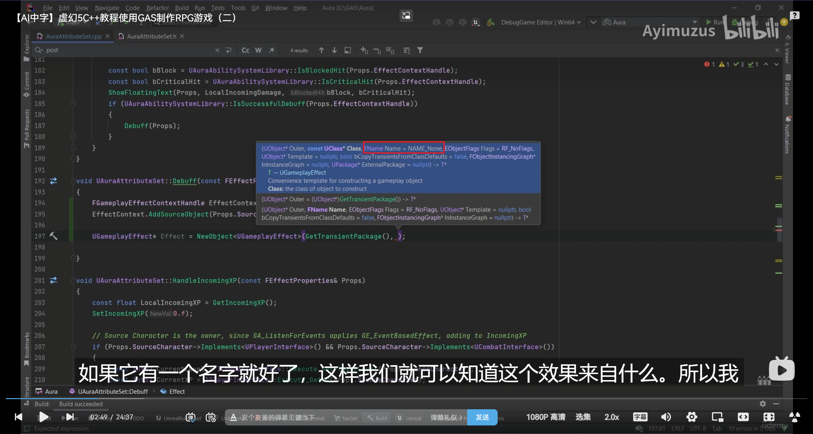
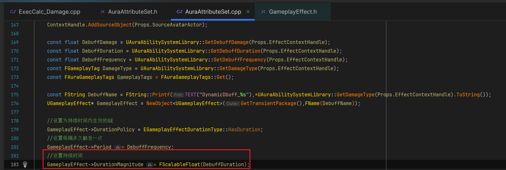

___________________________________________________________________________________________
###### [Go主菜单](../MainMenu.md)
___________________________________________________________________________________________

# GAS 154 在C++中创建并应用Debuff的GE流程（期间读取Context中的配置设置GE参数）；处理敌人死亡时不应用Debuff

___________________________________________________________________________________________

## 处理关键点

1. 在C++中创建GE 配置的步骤流程！！！
2. `TSharedPtr` 中 `MakeShared` 和 `MakeSharedAble` 的区别？

___________________________________________________________________________________________

# 目录


- [GAS 154 在C++中创建并应用Debuff的GE流程（期间读取Context中的配置设置GE参数）；处理敌人死亡时不应用Debuff](#gas-154-在c中创建并应用debuff的ge流程期间读取context中的配置设置ge参数处理敌人死亡时不应用debuff)
  - [处理关键点](#处理关键点)
- [目录](#目录)
    - [Mermaid整体思路梳理](#mermaid整体思路梳理)
    - [这一节，我们来处理为Debuff在C++中创建GE 配置，然后应用](#这一节我们来处理为debuff在c中创建ge-配置然后应用)
    - [首先，如果动态生成GE然后应用，这样是不支持复制的！！所以只能在服务器上处理！！！](#首先如果动态生成ge然后应用这样是不支持复制的所以只能在服务器上处理)
    - [下面是在C++中创建GE 配置，然后应用的顺序](#下面是在c中创建ge-配置然后应用的顺序)
      - [第1步：创建 `ContextHandle`](#第1步创建-contexthandle)
      - [第2步：添加 `SourceObject`](#第2步添加-sourceobject)
      - [第3步：`new` 一个新的 `GE`](#第3步new-一个新的-ge)
        - [Outer可以使用UObject底层的API获取瞬态包](#outer可以使用uobject底层的api获取瞬态包)
        - [可以使用 `FString::Printf` 使用该次Debuff的FGameplayTag名，格式化创建一个](#可以使用-fstringprintf-使用该次debuff的fgameplaytag名格式化创建一个)
      - [通过蓝图函数库获取该 `Context` 中携带的 `Debuff` 的参数](#通过蓝图函数库获取该-context-中携带的-debuff-的参数)
      - [第4步：设置 `DebuffGE` 持续时间类型](#第4步设置-debuffge-持续时间类型)
      - [第5步：设置 每隔多久触发一次 `DebuffGE` 伤害](#第5步设置-每隔多久触发一次-debuffge-伤害)
      - [第6步：设置 `DebuffGE` 持续时间](#第6步设置-debuffge-持续时间)
      - [第7步：( `关键步骤!` )让 `DebuffGE` 携带 `Debuff` 的 `FGameplayTag` (这里UE5.3之后有变动！！！)](#第7步-关键步骤-让-debuffge-携带-debuff-的-fgameplaytag-这里ue53之后有变动)
      - [第8步：设置 `DebuffGE` 的Stack堆叠 策略和堆叠上限](#第8步设置-debuffge-的stack堆叠-策略和堆叠上限)
      - [第9步：设置 `DebuffGE` 的触发伤害](#第9步设置-debuffge-的触发伤害)
        - [可以看到 `Modifiers` 中元素的类型为 `FGameplayModifierInfo`](#可以看到-modifiers-中元素的类型为-fgameplaymodifierinfo)
        - [`Modifiers` 中这里只使用了一个元素（也支持添加多个元素）](#modifiers-中这里只使用了一个元素也支持添加多个元素)
        - [接下来，需要设置 `DebuffGE` 要修改的属性是哪个](#接下来需要设置-debuffge-要修改的属性是哪个)
      - [这样就完成了在服务器上配置GE，接下来该准备应用和传递参数了](#这样就完成了在服务器上配置ge接下来该准备应用和传递参数了)
      - [第10步：应用 `DebuffGE`](#第10步应用-debuffge)
        - [`new` 一个新的 `Spec`](#new-一个新的-spec)
      - [第11步：需要将 `Context` 强制类型转换成自建的类型（因为要在这里通过 `Context` 传递 `DamageType` 参数）](#第11步需要将-context-强制类型转换成自建的类型因为要在这里通过-context-传递-damagetype-参数)
        - [设置 `DamageType` ，并应用GE](#设置-damagetype-并应用ge)
      - [以上，这样就完成了](#以上这样就完成了)
    - [需要注意的是，Debuff会多次触发，所以不要在这里将 `FAuraGameplayEffectContext` 中的是否成功触发设置为true，因为这是首次触发后创建GE的条件（不然就无限循环了！需要注意下！）](#需要注意的是debuff会多次触发所以不要在这里将-fauragameplayeffectcontext-中的是否成功触发设置为true因为这是首次触发后创建ge的条件不然就无限循环了需要注意下)
    - [我之前搞错了Debuff函数的调用位置应该在 `HandleIncomingDamage` 函数中，且收到有效伤害时调用](#我之前搞错了debuff函数的调用位置应该在-handleincomingdamage-函数中且收到有效伤害时调用)
    - [运行测试gif](#运行测试gif)
    - [可以在AS的后处理函数中，先判断目标是否死亡](#可以在as的后处理函数中先判断目标是否死亡)
    - [临时修改触发概率为100%](#临时修改触发概率为100)
    - [运行测试gif](#运行测试gif-1)


___________________________________________________________________________________________

<details>
<summary>视频链接</summary>
[8. Dynamic Gameplay Effects_哔哩哔哩_bilibili](https://www.bilibili.com/video/BV1TH4y1L7NP/?p=108&spm_id_from=pageDriver&vd_source=9e1e64122d802b4f7ab37bd325a89e6c)

------

</details>

___________________________________________________________________________________________

### Mermaid整体思路梳理

Mermaid

___________________________________________________________________________________________

### 这一节，我们来处理为Debuff在C++中创建GE 配置，然后应用

  - `Stack` 需要设置，同时间只能生效一个 `Debuff` 伤害（这里就是这样设计的，不是可叠加的Debuff）


------

### 首先，如果动态生成GE然后应用，这样是不支持复制的！！所以只能在服务器上处理！！！


------

### 下面是在C++中创建GE 配置，然后应用的顺序


------

#### 第1步：创建 `ContextHandle`


------

#### 第2步：添加 `SourceObject`


------

#### 第3步：`new` 一个新的 `GE`

  - 需要一个名字FName
>

------

##### Outer可以使用UObject底层的API获取瞬态包

> ```CPP
> GetTransientPackage();
> ```
>
> 通常用于开发时需要短暂存储数据，且不希望这些数据被长期保存的场合。
>
> 下面是源码截图
>
> 
>
> 

------

##### 可以使用 `FString::Printf` 使用该次Debuff的FGameplayTag名，格式化创建一个

>```cpp
>const FString DebuffName = FString::Printf(TEXT("DynamicDbuff_%s"),*UAuraAbilitySystemLibrary::GetDamageType(Props.EffectContextHandle).ToString());
>UGameplayEffect* GameplayEffect = NewObject<UGameplayEffect>(GetTransientPackage(),FName(DebuffName));
>```
>
>

------

#### 通过蓝图函数库获取该 `Context` 中携带的 `Debuff` 的参数
>

------

#### 第4步：设置 `DebuffGE` 持续时间类型
>```cpp
>GameplayEffect->DurationPolicy = EGameplayEffectDurationType::HasDuration;
>```
>
>

------

#### 第5步：设置 每隔多久触发一次 `DebuffGE` 伤害
>

------

#### 第6步：设置 `DebuffGE` 持续时间
>

------

#### 第7步：( `关键步骤!` )让 `DebuffGE` 携带 `Debuff` 的 `FGameplayTag` (这里UE5.3之后有变动！！！)

  - （UE5.3之前）使用API：`Effect->Inheritable0wnedTagsContainer.AddTag` 为GE添加Tag
>```cpp
>//为GE添加Tag
>GameplayEffect->InheritableOwnedTagsContainer.AddTag(GameplayTags.DamageTypesToDebuffs[DamageType]);
>```
>

- （UE5.3之后）使用API：

```CPP
UTargetTagsGameplayEffectComponent& AssetTagsComponent = GameplayEffect->FindOrAddComponent<UTargetTagsGameplayEffectComponent>();
	FInheritedTagContainer InheritedTagContainer;
	InheritedTagContainer.Added.AddTag(GameplayTags.DamageTypesToDebuffs[DamageType]);
```

>

------

#### 第8步：设置 `DebuffGE` 的Stack堆叠 策略和堆叠上限
>

------

#### 第9步：设置 `DebuffGE` 的触发伤害

  - 要设置伤害，也就是需要往 `Modifiers` 中添加元素


------

##### 可以看到 `Modifiers` 中元素的类型为 `FGameplayModifierInfo`
>

------

#####  `Modifiers` 中这里只使用了一个元素（也支持添加多个元素）

  - 记录当前数组添加元素 `FGameplayModifierInfo` 后的Index，然后设置该元素 `FGameplayModifierInfo` 的伤害


------

##### 接下来，需要设置 `DebuffGE` 要修改的属性是哪个

  - 因为是伤害，所以直接修改元属性 `InCommingDamage`


------

#### 这样就完成了在服务器上配置GE，接下来该准备应用和传递参数了
>

------

#### 第10步：应用 `DebuffGE`


------

##### `new` 一个新的 `Spec`
>
>
>```cpp
>FGameplayEffectSpec* Spec = new FGameplayEffectSpec(GameplayEffect,ContextHandle,1.f);
>```

------

#### 第11步：需要将 `Context` 强制类型转换成自建的类型（因为要在这里通过 `Context` 传递 `DamageType` 参数）

##### 设置 `DamageType` ，并应用GE

>设置 `DamageType` 需要 使用 `MakeShareable` 创建一个智能指针
>
>```cpp
>const TSharedPtr<FGameplayTag> DebuffDamageType = MakeShareable(new FGameplayTag(DamageType));
>```
>
>
>
>```CPP
>if (const FGameplayEffectSpec* Spec = new FGameplayEffectSpec(GameplayEffect,ContextHandle,1.f))
>{
>    FAuraGameplayEffectContext* AuraContext = static_cast<FAuraGameplayEffectContext*>(Spec->GetContext().Get());
>    const TSharedPtr<FGameplayTag> DebuffDamageType = MakeShareable(new FGameplayTag(DamageType));
>    AuraContext->SetDamageType(DebuffDamageType);
>    Props.TargetASC->ApplyGameplayEffectSpecToSelf(*Spec);
>}
>```

------

#### 以上，这样就完成了


------

### 需要注意的是，Debuff会多次触发，所以不要在这里将 `FAuraGameplayEffectContext` 中的是否成功触发设置为true，因为这是首次触发后创建GE的条件（不然就无限循环了！需要注意下！）
>
>

------

### 我之前搞错了Debuff函数的调用位置应该在 `HandleIncomingDamage` 函数中，且收到有效伤害时调用

> 

------

### 运行测试gif

>

- **但是有一个问题是，敌人死后 Debuff 还依然存在，可以看到伤害数字ui**


------

### 可以在AS的后处理函数中，先判断目标是否死亡
>

------

### 临时修改触发概率为100%
>

------

### 运行测试gif
>

- 这回敌人死了就不会再继续触发了
___________________________________________________________________________________________

[返回最上面](#Go主菜单)

___________________________________________________________________________________________